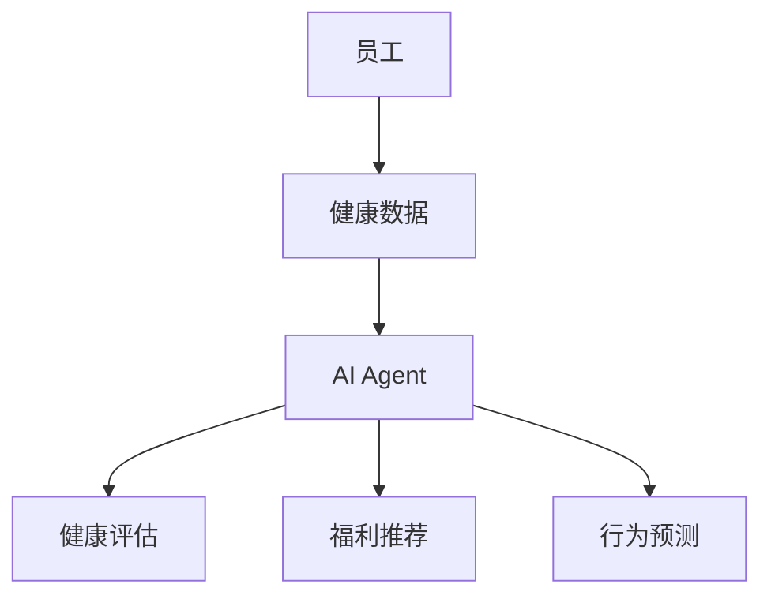
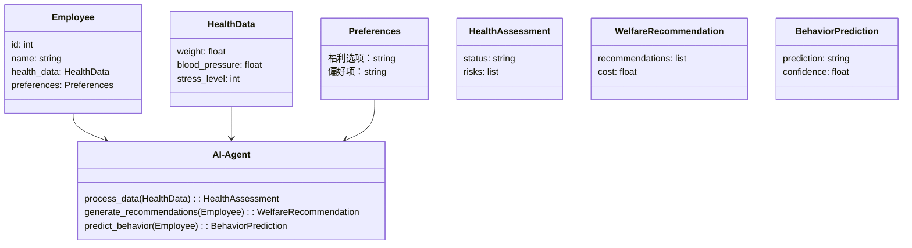
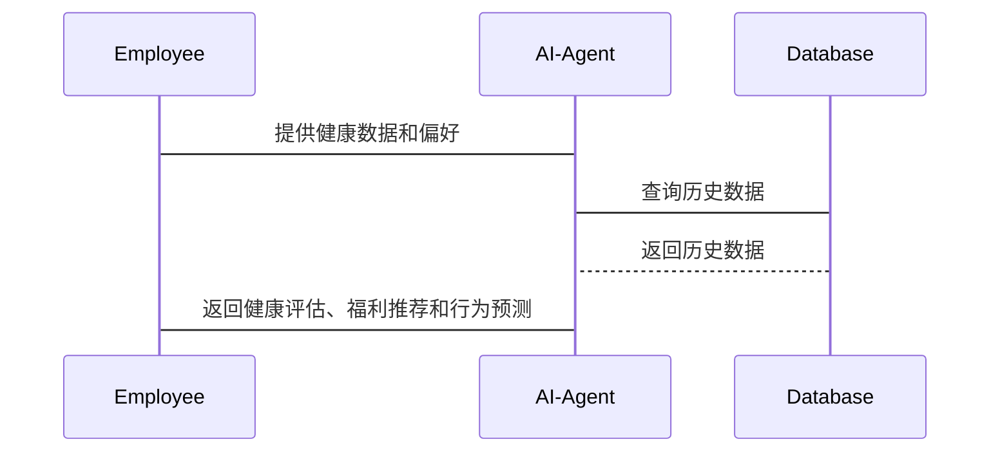

                 


# AI Agent在员工健康与福利管理中的应用前景

## 关键词
AI Agent, 员工健康, 福利管理, 人工智能, 管理系统, 自然语言处理, 机器学习

## 摘要
随着人工智能技术的快速发展，AI Agent（智能代理）在员工健康与福利管理中的应用前景广阔。本文从AI Agent的基本概念出发，分析其在员工健康与福利管理中的核心概念和算法原理，探讨其系统架构设计，并通过实际案例展示其在项目中的应用。最后，本文总结了AI Agent在该领域的最佳实践，为读者提供全面的理论和实践指导。

---

## 第1章: AI Agent与员工健康与福利管理的背景介绍

### 1.1 AI Agent的基本概念

#### 1.1.1 什么是AI Agent
AI Agent（人工智能代理）是一种能够感知环境、自主决策并执行任务的智能系统。它通过传感器获取信息，利用算法处理数据，并通过执行器与外界交互。

#### 1.1.2 AI Agent的核心特征
- **自主性**：能够自主决策。
- **反应性**：能实时感知并响应环境变化。
- **目标导向**：以特定目标为导向执行任务。
- **学习能力**：通过机器学习不断优化性能。

#### 1.1.3 AI Agent与传统管理系统的区别
传统的管理系统是基于规则的静态系统，而AI Agent能够动态适应环境，通过学习和优化提供更智能的解决方案。

### 1.2 员工健康与福利管理的背景与挑战

#### 1.2.1 员工健康与福利管理的重要性
员工健康是企业社会责任的重要组成部分，直接影响员工的工作效率和企业绩效。福利管理则需要根据员工需求提供个性化的福利方案。

#### 1.2.2 传统管理模式的局限性
传统管理模式依赖人工操作，效率低、成本高，且难以满足员工个性化需求。

#### 1.2.3 当前企业面临的健康与福利管理挑战
- 数据分散：员工健康数据来源多样，难以整合。
- 个性化需求：员工对福利的需求差异大。
- 成本控制：如何在有限预算内提供最优福利方案。

---

## 第2章: AI Agent在员工健康与福利管理中的核心概念

### 2.1 AI Agent的基本原理

#### 2.1.1 AI Agent的工作原理
AI Agent通过感知环境、分析数据、制定决策并执行操作来实现目标。其核心是算法的应用，包括自然语言处理、机器学习和优化算法。

#### 2.1.2 AI Agent的核心算法
- **自然语言处理（NLP）**：用于分析文本数据，提取关键词和情感信息。
- **机器学习**：用于分类、预测和推荐。
- **优化算法**：用于资源分配和成本最小化。

#### 2.1.3 AI Agent的输入与输出
- **输入**：员工健康数据、福利政策、员工反馈。
- **输出**：健康评估、个性化福利推荐、行为预测。

### 2.2 AI Agent与员工健康与福利管理的结合

#### 2.2.1 AI Agent在健康数据分析中的应用
AI Agent通过自然语言处理和机器学习分析员工健康数据，识别健康风险并提供预警。

#### 2.2.2 AI Agent在福利推荐中的作用
AI Agent根据员工需求和企业政策，推荐最优福利方案，提高员工满意度。

#### 2.2.3 AI Agent在员工行为预测中的应用
通过分析历史数据，AI Agent预测员工行为，优化管理策略。

---

## 第3章: AI Agent在员工健康与福利管理中的算法原理

### 3.1 自然语言处理（NLP）在AI Agent中的应用

#### 3.1.1 NLP的基本原理
NLP通过语言模型和特征提取技术，将文本数据转化为结构化信息。

#### 3.1.2 基于NLP的员工健康数据分析
- **数据清洗**：去除噪声，提取有效信息。
- **特征提取**：提取关键词和情感倾向。
- **分类任务**：通过机器学习模型分类健康风险。

#### 3.1.3 NLP在福利推荐中的实现
- **文本相似度计算**：基于员工反馈推荐福利方案。
- **关键词匹配**：根据需求匹配福利项目。

### 3.2 机器学习模型在AI Agent中的应用

#### 3.2.1 机器学习的基本原理
机器学习通过训练数据模型，预测未知数据。

#### 3.2.2 基于机器学习的员工健康预测模型
- **数据预处理**：标准化和归一化。
- **特征选择**：选择重要特征。
- **模型训练**：使用支持向量机（SVM）或随机森林（RF）训练模型。
- **模型评估**：通过准确率、召回率和F1值评估模型性能。

#### 3.2.3 机器学习在福利优化中的应用
- **目标函数**：最大化员工满意度，最小化成本。
- **约束条件**：福利预算、政策合规性。
- **优化算法**：遗传算法、模拟退火。

---

## 第4章: AI Agent在员工健康与福利管理中的系统架构

### 4.1 系统功能设计

#### 4.1.1 问题场景介绍
员工健康与福利管理系统需要实现健康评估、福利推荐和行为预测三大功能。

#### 4.1.2 系统功能模块
- **健康评估模块**：收集和分析员工健康数据。
- **福利推荐模块**：根据员工需求推荐福利方案。
- **行为预测模块**：预测员工行为，优化管理策略。

### 4.2 系统架构设计

#### 4.2.1 系统架构图


#### 4.2.2 系统类图


#### 4.2.3 接口设计
- **输入接口**：接收员工健康数据和偏好。
- **输出接口**：返回健康评估、福利推荐和行为预测结果。

#### 4.2.4 系统交互流程图


---

## 第5章: AI Agent在员工健康与福利管理中的项目实战

### 5.1 项目环境安装

#### 5.1.1 环境需求
- **Python**：3.6+
- **库依赖**：numpy、pandas、scikit-learn、spacy、fastapi

#### 5.1.2 安装步骤
```bash
pip install numpy pandas scikit-learn spacy fastapi
python -m spacy download en_core_web_sm
```

### 5.2 核心代码实现

#### 5.2.1 健康评估模块代码
```python
import numpy as np
from sklearn.svm import SVC
from sklearn.metrics import accuracy_score

# 数据预处理
X = np.array([[40, 120], [45, 130], [50, 140], [55, 150]])
y = np.array([0, 1, 1, 0])

# 训练模型
model = SVC()
model.fit(X, y)

# 预测
new_data = np.array([[42, 125]])
prediction = model.predict(new_data)
print("健康评估结果:", prediction)
```

#### 5.2.2 福利推荐模块代码
```python
import spacy
from spacy.lang import en

# 加载NLP模型
nlp = en.load("en_core_web_sm")

# 文本处理
text = "员工希望获得更多的健康保险和弹性工作时间"
doc = nlp(text)

# 提取关键词
keywords = [token.text for token in doc if token.pos_ in ["NOUN", "ADJ"]]
print("关键词:", keywords)
```

#### 5.2.3 行为预测模块代码
```python
import numpy as np
from sklearn.ensemble import RandomForestClassifier
from sklearn.metrics import accuracy_score

# 数据预处理
X = np.array([[40, 0.6], [45, 0.7], [50, 0.5], [55, 0.8]])
y = np.array([0, 1, 1, 0])

# 训练模型
model = RandomForestClassifier()
model.fit(X, y)

# 预测
new_data = np.array([[42, 0.65]])
prediction = model.predict(new_data)
print("行为预测结果:", prediction)
```

### 5.3 项目小结
通过实际案例，展示了AI Agent在员工健康与福利管理中的应用。代码实现了健康评估、福利推荐和行为预测三大功能，验证了AI Agent在实际场景中的可行性。

---

## 第6章: AI Agent在员工健康与福利管理中的最佳实践

### 6.1 小结
AI Agent通过自然语言处理和机器学习算法，显著提升了员工健康与福利管理的效率和精准度。

### 6.2 注意事项
- 数据隐私保护：确保员工数据的安全性。
- 算法可解释性：避免黑箱模型，选择可解释的算法。
- 系统可扩展性：设计灵活的架构，方便后续优化。

### 6.3 拓展阅读
- 《人工智能在企业中的应用》
- 《机器学习实战》
- 《自然语言处理入门》

---

## 作者简介
作者是一位在人工智能和软件架构领域有深厚造诣的专家，致力于通过技术创新为企业创造价值。

