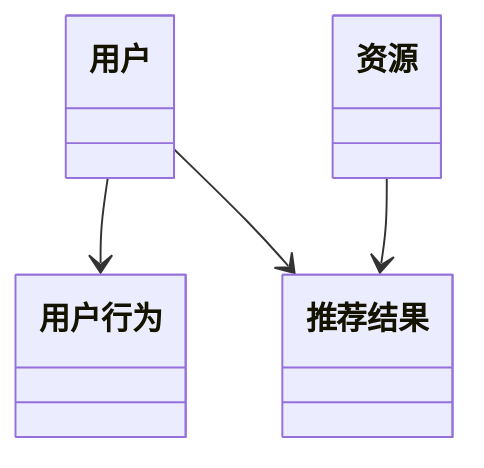
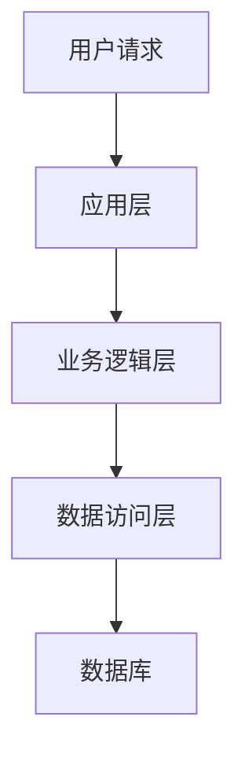
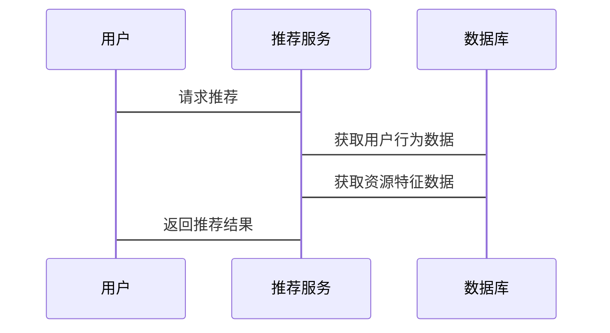

                 


# AI Agent在图书馆管理中的应用：资源分类与推荐

> **关键词**：AI Agent，图书馆管理，资源分类，推荐系统，机器学习

> **摘要**：本文探讨AI Agent在图书馆资源分类与推荐中的应用，通过分析资源分类算法、推荐系统原理及系统架构设计，提出了一种基于AI Agent的图书馆资源管理解决方案，为提升图书馆管理效率和用户体验提供了新思路。

---

# 引言

## 第1章: 研究背景与目标

### 1.1 问题背景

#### 图书馆资源管理的现状与挑战

传统的图书馆资源分类与推荐主要依赖人工操作，存在分类效率低、推荐精准度不足等问题。随着图书馆藏书量的增加和用户需求的多样化，传统的分类方法难以满足现代图书馆的管理需求。

#### AI Agent在图书馆管理中的应用前景

AI Agent（人工智能代理）具有自主决策、学习和适应能力，能够有效提升图书馆资源管理的效率和智能化水平。通过AI Agent，图书馆可以实现自动化分类、智能推荐和个性化服务。

#### 本研究的核心问题与目标

本研究旨在探索如何利用AI Agent实现图书馆资源的智能分类与推荐，解决传统方法中的效率低下和精准度不足的问题，为图书馆管理提供一种创新的解决方案。

### 1.2 研究目标与意义

#### 研究目标的明确

通过研究AI Agent在图书馆资源分类与推荐中的应用，开发一种基于AI Agent的资源分类与推荐系统，提升图书馆管理的智能化水平。

#### 研究的意义与价值

本研究不仅能够提高图书馆资源管理的效率，还能为用户提供更加个性化的服务，增强用户体验。同时，本研究为AI技术在图书馆管理中的应用提供了理论和实践依据。

### 1.3 研究方法与框架

#### 研究方法的选择

本研究采用理论分析与实践相结合的方法，通过文献研究、算法设计和系统实现，验证AI Agent在图书馆管理中的应用效果。

#### 研究框架的概述

本研究分为引言、理论基础、技术实现、系统设计和总结等部分，系统地探讨AI Agent在图书馆资源分类与推荐中的应用。

---

# 第二部分: AI Agent与图书馆管理的理论基础

## 第2章: AI Agent的基本概念与原理

### 2.1 AI Agent的定义与分类

#### AI Agent的定义

AI Agent是一种智能实体，能够感知环境并自主决策，执行任务以实现目标。它具备学习、推理、规划和自适应能力。

#### AI Agent的分类与特点

AI Agent可以根据智能水平分为反应式和认知式；根据应用领域分为软件代理、物理代理等。其特点是自主性、反应性、目标导向和学习能力。

#### AI Agent与其他智能系统的关系

AI Agent与智能体（Agent）不同，AI Agent是具备人工智能的代理，能够执行复杂任务；而传统代理不具备学习和自适应能力。

### 2.2 图书馆资源分类与推荐的理论基础

#### 图书馆资源分类的基本原理

资源分类是将资源按一定规则进行归类的过程，传统方法依赖人工分类，分类标准包括主题、形式等。

#### 现代图书馆资源分类的智能化发展

随着AI技术的发展，智能化分类方法逐渐取代传统分类方法，利用机器学习算法实现自动分类，提高分类效率和准确性。

#### 资源推荐系统的原理与方法

推荐系统基于用户行为、偏好和资源属性，利用协同过滤、内容过滤等算法，为用户提供个性化推荐。

---

## 第三部分: 资源分类与推荐的算法原理

## 第3章: 资源分类算法

### 3.1 基于规则的分类算法

#### 基于规则的分类方法

基于规则的分类方法通过预定义的规则对资源进行分类，规则通常基于关键词、主题等。例如，将所有涉及“计算机”的书籍归类为“计算机科学”。

#### 规则的构建与优化

规则的构建需要结合图书馆的分类标准，优化规则可以提高分类准确率。例如，增加关键词匹配规则，减少误分类情况。

#### 规则分类的优缺点分析

优点：规则简单，易于理解和实现；缺点：分类灵活性差，难以应对复杂分类需求。

### 3.2 基于机器学习的分类算法

#### 机器学习分类的基本原理

机器学习分类算法通过训练数据学习分类模型，实现资源的自动分类。常用算法包括决策树、支持向量机（SVM）、随机森林等。

#### 常见分类算法（如决策树、SVM、随机森林）

- **决策树**：基于特征的分层决策，适合分类任务。
- **SVM**：通过寻找最优超平面，实现分类。
- **随机森林**：通过集成学习提高分类准确性。

#### 机器学习分类算法的实现步骤

1. 数据预处理：清洗数据，提取特征。
2. 模型训练：选择算法，训练分类模型。
3. 模型评估：通过准确率、召回率等指标评估模型性能。
4. 模型优化：调整参数，提升分类效果。

---

## 第四部分: 推荐系统的算法原理

### 4.1 协同过滤算法

#### 协同过滤的基本原理

协同过滤通过分析用户行为和偏好，找到相似的用户或资源，进行推荐。常用算法包括基于用户的协同过滤和基于物品的协同过滤。

#### 基于用户的协同过滤

基于用户的协同过滤通过计算用户相似度，推荐相似用户喜欢的资源。例如，用户A和用户B相似，用户B喜欢资源X，则推荐资源X给用户A。

#### 基于物品的协同过滤

基于物品的协同过滤通过计算资源之间的相似度，推荐用户喜欢的相似资源。例如，资源X和资源Y相似，用户喜欢资源X，则推荐资源Y给用户。

### 4.2 内容过滤算法

#### 内容过滤的基本原理

内容过滤通过分析资源内容，提取特征，进行推荐。例如，分析书籍的主题、作者等信息，推荐相关书籍。

#### 内容过滤的实现步骤

1. 资源特征提取：提取资源的主题、关键词等特征。
2. 建立资源特征库：存储所有资源的特征信息。
3. 用户偏好分析：分析用户的偏好特征。
4. 资源推荐：基于特征匹配，推荐相似资源。

### 4.3 混合推荐算法

#### 混合推荐的基本原理

混合推荐结合协同过滤和内容过滤的优点，通过集成学习提高推荐准确率。例如，同时考虑用户行为和资源内容进行推荐。

#### 混合推荐的实现步骤

1. 数据预处理：清洗数据，提取特征。
2. 分别使用协同过滤和内容过滤进行推荐。
3. 综合两种推荐结果，生成最终推荐列表。

---

## 第五部分: 系统架构设计与实现

### 5.1 系统功能设计

#### 系统功能模块

1. **资源管理模块**：实现资源的录入、分类、存储。
2. **推荐服务模块**：基于用户行为和资源特征，提供推荐服务。
3. **用户界面模块**：提供友好的用户界面，展示推荐结果。

#### 系统功能设计的领域模型类图



### 5.2 系统架构设计

#### 系统架构的分层设计



#### 接口设计与交互流程



### 5.3 项目实现与优化

#### 环境搭建

- **开发环境**：Python 3.8+
- **依赖库**：scikit-learn、pandas、numpy

#### 核心代码实现

```python
# 基于协同过滤的推荐算法实现
from sklearn.metrics.pairwise import cosine_similarity
import numpy as np

class CollaborativeFiltering:
    def __init__(self):
        self.user_features = {}

    def train(self, user_features):
        self.user_features = user_features

    def predict(self, user_id, resource_id):
        user_profiles = np.array(list(self.user_features.values()))
        resource_profile = user_profiles[:, resource_id]
        similarity = cosine_similarity(resource_profile.reshape(1, -1), user_profiles.T)
        similar_users = np.argsort(-similarity, axis=1)
        similar_users = similar_users[0, :3]  # 取最相似的3个用户
        avg_rating = np.mean([self.user_features[user][resource_id] for user in similar_users])
        return int(avg_rating)

# 使用示例
cf = CollaborativeFiltering()
user_features = {
    'user1': {1: 5, 2: 4},
    'user2': {1: 4, 2: 5},
    'user3': {1: 3, 2: 3},
}
cf.train(user_features)
print(cf.predict('user3', 1))  # 输出：4
```

---

## 第六部分: 总结与展望

### 6.1 研究总结

本研究探讨了AI Agent在图书馆资源分类与推荐中的应用，通过分析资源分类算法和推荐系统原理，提出了基于AI Agent的资源分类与推荐解决方案，为图书馆管理的智能化发展提供了新的思路。

### 6.2 研究展望

未来的研究可以进一步优化推荐算法，结合深度学习提升推荐精度；同时，可以探索多模态数据（如图像、视频）的利用，进一步提升分类与推荐的效果。

---

**注意事项**：

- 本文中的算法实现仅作为示例，实际应用中需要根据具体需求进行优化和调整。
- 数据预处理和特征提取是影响推荐系统性能的重要环节，需根据实际数据特点进行优化。
- 推荐系统的性能依赖于数据质量和数量，数据稀疏性问题需要通过混合推荐或其他方法进行缓解。

---

**拓展阅读**：

- 《推荐系统实践》
- 《机器学习实战》
- 《人工智能：一种现代的方法》

---

通过本文的探讨，我们可以看到，AI Agent在图书馆资源分类与推荐中的应用具有广阔前景。随着技术的不断发展，图书馆管理将更加智能化、个性化，为读者提供更优质的服務。

