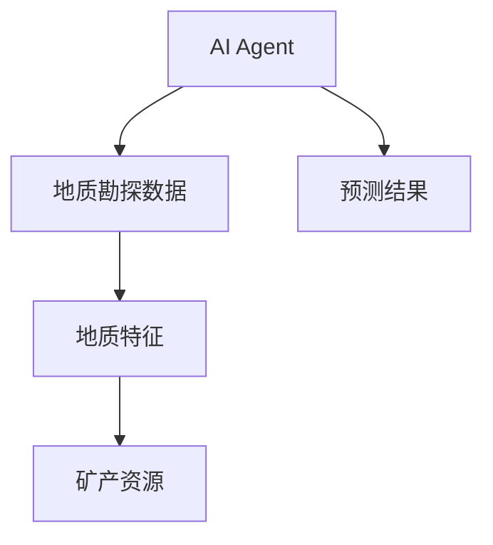

                 


# AI Agent在地质勘探中的应用：矿产资源识别

> 关键词：AI Agent, 地质勘探, 矿产资源识别, 深度学习, 地震数据, 地质数据分析, 矿产预测模型

> 摘要：随着人工智能技术的飞速发展，AI Agent在地质勘探中的应用越来越广泛。本文详细探讨了AI Agent在矿产资源识别中的应用，从核心概念到算法原理，再到系统设计与实战案例，深入剖析了AI Agent如何助力地质勘探工作，为矿产资源的高效识别提供了新的思路和解决方案。

---

## 第一部分：AI Agent与地质勘探的背景与核心概念

### 第1章：地质勘探与AI Agent的背景介绍

#### 1.1 地质勘探的基本概念
- 1.1.1 地质勘探的定义与目的  
  地质勘探是指通过对地壳中的岩石、土壤、地下水等地质体的调查和分析，寻找和评估矿产资源、能源资源等的过程。其目的是为矿产开发提供科学依据，降低勘探成本，提高勘探效率。

- 1.1.2 矿产资源识别的重要性  
  矿产资源是国家经济发展的重要基础，其勘探和识别直接关系到资源开发的经济效益和社会效益。传统地质勘探方法效率低、成本高，且容易受到主观因素的影响。

- 1.1.3 地质勘探的传统方法与挑战  
  传统地质勘探主要依赖地质调查、地球物理勘探（如地震勘探、磁法勘探）和地球化学勘探等方法。这些方法存在数据采集复杂、分析耗时、成本高等问题，难以应对大规模、高精度的矿产资源识别需求。

#### 1.2 AI Agent的基本概念
- 1.2.1 AI Agent的定义与特点  
  AI Agent（人工智能代理）是指能够感知环境、自主决策并执行任务的智能实体。它具有自主性、反应性、目标导向性和学习能力等特点，能够在复杂环境中完成复杂的任务。

- 1.2.2 AI Agent在地质勘探中的应用潜力  
  AI Agent可以通过对海量地质数据的分析和处理，快速识别矿产资源的分布规律，优化勘探方案，提高勘探效率。其强大的数据处理能力和自主学习能力使其成为地质勘探领域的重要工具。

- 1.2.3 AI Agent与传统地质勘探方法的对比  
  通过对比传统方法与AI Agent的应用，可以看出AI Agent在数据处理速度、精度和适应性方面具有显著优势，尤其是在复杂地质环境下的应用更具竞争力。

#### 1.3 AI Agent在矿产资源识别中的背景与需求
- 1.3.1 矿产资源识别的复杂性与挑战  
  矿产资源的分布往往受到多种地质因素的影响，如岩石类型、构造特征、地球化学指标等，导致矿产资源识别的复杂性和不确定性较高。

- 1.3.2 AI Agent在提高勘探效率中的作用  
  AI Agent能够通过对多源异构数据的整合与分析，快速识别潜在的矿产资源分布区域，为地质勘探工作提供科学指导。

- 1.3.3 现有技术的局限性与AI Agent的解决方案  
  传统地质勘探方法在数据处理和分析方面存在效率低、精度不足等问题，而AI Agent通过深度学习和大数据分析技术，能够有效克服这些局限性。

---

## 第二部分：AI Agent与地质勘探的核心概念与联系

### 第2章：AI Agent与地质勘探的核心概念与联系

#### 2.1 核心概念原理
- 2.1.1 AI Agent的核心算法原理  
  AI Agent在地质勘探中的应用主要基于深度学习算法，如卷积神经网络（CNN）、循环神经网络（RNN）等。这些算法能够从大量地质数据中提取特征，识别潜在的矿产资源分布规律。

- 2.1.2 地质勘探数据的特征与处理  
  地质勘探数据主要包括地震数据、岩石样本数据、地球化学数据等。这些数据具有多模态、高维数、复杂性等特点，需要通过数据预处理、特征提取和数据增强等技术进行处理。

- 2.1.3 AI Agent与地质勘探数据的结合方式  
  AI Agent通过将地质勘探数据输入深度学习模型，进行数据的特征提取、模式识别和预测分析，从而实现矿产资源的智能识别。

#### 2.2 核心概念属性特征对比表
| 特征 | AI Agent | 地质勘探数据 |
|------|----------|--------------|
| 输入 | 多模态数据 | 地震数据、岩石样本数据、地球化学数据 |
| 输出 | 矿产分布概率预测 | 地质特征描述、矿产分布区域预测 |
| 处理方式 | 深度学习模型 | 数据分析与建模 |

#### 2.3 实体关系图


---

## 第三部分：AI Agent在矿产资源识别中的算法原理

### 第3章：AI Agent在矿产资源识别中的算法原理

#### 3.1 算法原理概述
- 3.1.1 基于深度学习的AI Agent算法  
  深度学习模型，尤其是卷积神经网络（CNN），在地质勘探中的应用广泛。CNN能够从地震数据中提取空间特征，识别潜在的矿产分布区域。

- 3.1.2 算法流程图  
  下图展示了AI Agent在矿产资源识别中的算法流程：
  ```mermaid
  graph TD
      Start --> InputData[输入地质数据]
      InputData --> Preprocess[数据预处理]
      Preprocess --> Model[模型训练]
      Model --> Output[输出预测结果]
      Output --> End
  ```

#### 3.2 算法实现代码
```python
import numpy as np
import tensorflow as tf

# 数据预处理
def preprocess_data(data):
    # 数据归一化处理
    return data / 255.0

# 模型定义
model = tf.keras.Sequential([
    tf.keras.layers.Conv2D(32, (3,3), activation='relu', input_shape=(64,64,3)),
    tf.keras.layers.MaxPooling2D((2,2)),
    tf.keras.layers.Flatten(),
    tf.keras.layers.Dense(128, activation='relu'),
    tf.keras.layers.Dense(10, activation='softmax')
])

# 模型编译
model.compile(optimizer='adam', loss='sparse_categorical_crossentropy', metrics=['accuracy'])
```

#### 3.3 数学模型与公式
- 深度学习模型的损失函数通常采用交叉熵损失函数：
  $$ L = -\sum_{i=1}^{n} y_i \log(p_i) $$
  其中，\( y_i \) 是真实标签，\( p_i \) 是预测概率。

- 模型的优化过程通常采用随机梯度下降（SGD）算法：
  $$ \theta_{t+1} = \theta_t - \eta \cdot \frac{\partial L}{\partial \theta_t} $$
  其中，\( \eta \) 是学习率，\( \theta \) 是模型参数。

---

## 第四部分：AI Agent在地质勘探中的系统设计与实现

### 第4章：系统设计与实现

#### 4.1 系统分析与架构设计
- 4.1.1 项目介绍  
  本项目旨在开发一个基于AI Agent的矿产资源识别系统，利用深度学习技术对地质勘探数据进行分析和预测。

- 4.1.2 系统功能设计  
  系统主要包括数据采集、数据预处理、模型训练、结果分析和可视化展示等功能。

- 4.1.3 系统架构设计  
  下图展示了系统的整体架构：
  ```mermaid
  graph TD
      Client --> Server
      Server --> Database
      Server --> Model
      Model --> Result
  ```

#### 4.2 系统实现细节
- 数据采集与预处理  
  需要对地震数据、岩石样本数据等进行采集和预处理，确保数据的完整性和一致性。

- 模型训练与优化  
  通过深度学习模型对预处理后的数据进行训练，优化模型参数，提高预测精度。

- 结果分析与可视化  
  对模型的预测结果进行分析和可视化展示，帮助地质勘探人员更好地理解矿产资源的分布情况。

---

## 第五部分：AI Agent在地质勘探中的应用案例分析

### 第5章：应用案例分析

#### 5.1 案例介绍
- 案例背景  
  某地区地质复杂，传统勘探方法效率低下，难以准确识别矿产资源分布。

- 数据来源  
  数据包括地震数据、岩石样本数据、地球化学数据等。

#### 5.2 系统实现
- 数据预处理  
  对输入数据进行归一化处理，确保模型输入的格式一致。

- 模型训练  
  使用卷积神经网络对数据进行训练，提取地质特征，识别矿产分布区域。

- 结果分析  
  对模型的预测结果进行分析，评估模型的准确率和召回率。

#### 5.3 案例结果与分析
- 模型预测结果与实际地质情况的对比分析，评估模型的性能和效果。

---

## 第六部分：优化与扩展

### 第6章：优化与扩展

#### 6.1 模型优化
- 参数调整  
  调整学习率、批量大小等参数，优化模型的训练效果。

- 模型改进  
  引入更复杂的深度学习模型，如残差网络（ResNet），进一步提高模型的预测精度。

#### 6.2 应用扩展
- 多模态数据处理  
  将地震数据、地球化学数据等多种数据源进行融合，进一步提高矿产资源识别的准确性。

- 边缘计算部署  
  将模型部署到边缘设备，实现现场实时预测，提高勘探效率。

---

## 第七部分：总结与展望

### 第7章：总结与展望

#### 7.1 总结
- 本文详细介绍了AI Agent在地质勘探中的应用，从核心概念到算法实现，再到系统设计和应用案例，全面探讨了AI Agent在矿产资源识别中的潜力和价值。

#### 7.2 展望
- 随着深度学习技术的不断发展，AI Agent在地质勘探中的应用前景广阔。未来可以通过引入更多数据源、优化模型结构等方式，进一步提高矿产资源识别的效率和精度。

---

## 参考文献
（此处列出相关文献和资源）

