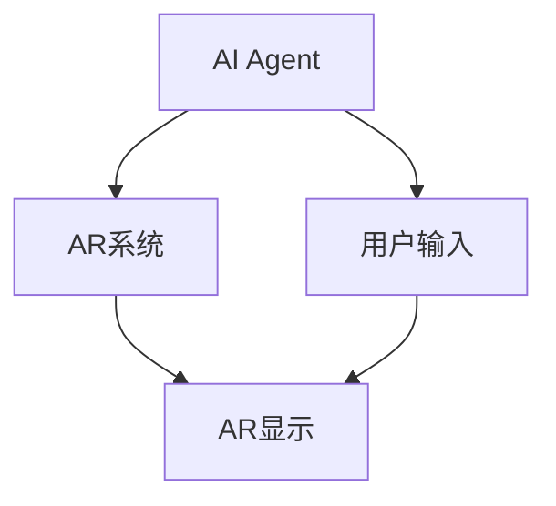
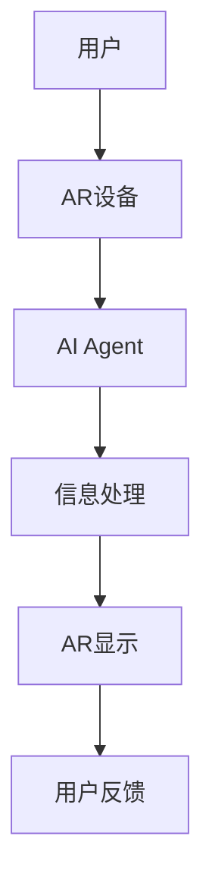
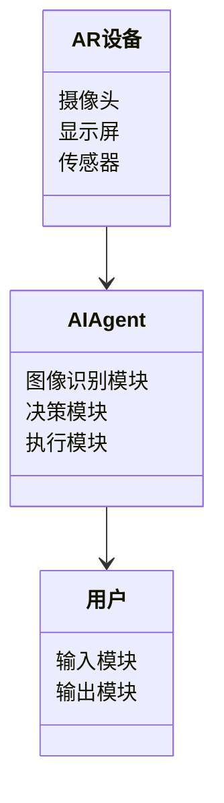
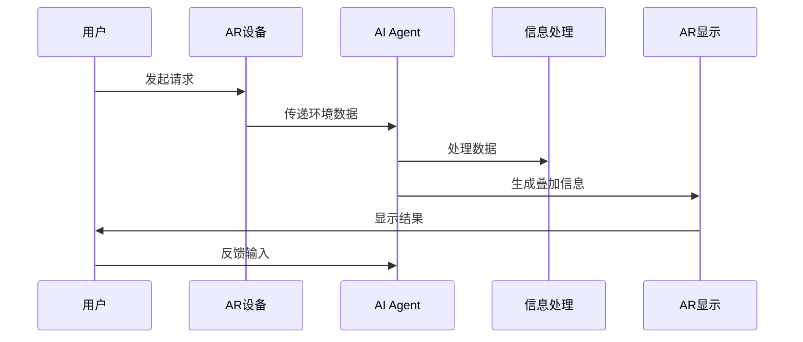

                 


# AI Agent在增强现实中的应用：实时信息叠加与交互

> 关键词：AI Agent, 增强现实, 实时信息叠加, 交互设计, 智能信息处理

> 摘要：本文深入探讨了AI Agent在增强现实（AR）中的应用，重点分析了实时信息叠加与交互的核心技术。通过结合AI Agent的智能信息处理能力与AR的实时视觉呈现优势，本文详细阐述了AI Agent在AR中的算法原理、系统架构设计、项目实战案例以及最佳实践方法。

---

# {{此处是文章标题}}

> 关键词：{{此处列出文章的5-7个核心关键词}}

> 摘要：{{此处给出文章的核心内容和主题思想}}

---

# 第一部分: AI Agent与增强现实的背景介绍

## 第1章: AI Agent与增强现实概述

### 1.1 AI Agent的基本概念
#### 1.1.1 AI Agent的定义与特点
- AI Agent（人工智能代理）是一种能够感知环境、自主决策并执行任务的智能实体。
- 其特点包括自主性、反应性、目标导向性和学习能力。

#### 1.1.2 AI Agent的核心要素与功能
- **自主性**：能够在没有外部干预的情况下独立运行。
- **反应性**：能够实时感知环境变化并做出响应。
- **目标导向性**：通过设定目标来指导行为和决策。
- **学习能力**：通过数据学习和优化自身性能。

#### 1.1.3 AI Agent与传统软件的区别
- 传统软件依赖于明确的编程指令，而AI Agent能够自主决策和学习。
- AI Agent具备更强的适应性和灵活性，能够处理复杂和动态的环境。

### 1.2 增强现实（AR）的基本概念
#### 1.2.1 AR的定义与特点
- 增强现实（Augmented Reality）是一种通过计算机技术将虚拟信息叠加到真实环境中的技术。
- 其特点包括实时性、交互性和沉浸性。

#### 1.2.2 AR的核心技术与实现方式
- **图像识别**：通过摄像头捕捉环境信息并进行图像分析。
- **三维重建**：构建真实环境的三维模型以实现虚拟信息的准确叠加。
- **实时渲染**：在真实环境中实时叠加虚拟信息并呈现给用户。

#### 1.2.3 AR的应用场景与发展趋势
- **应用场景**：广泛应用于游戏、教育、医疗、工业等领域。
- **发展趋势**：随着技术进步，AR将更加智能化、实时化和沉浸化。

### 1.3 AI Agent在AR中的应用背景
#### 1.3.1 AR中的信息处理需求
- AR需要实时处理大量环境数据，包括图像、视频和三维模型等。
- 需要快速识别和理解环境中的物体、场景和用户意图。

#### 1.3.2 AI Agent在AR中的作用与价值
- AI Agent能够实时处理和分析环境数据，提供智能化的信息叠加和交互体验。
- 通过AI Agent的智能决策能力，AR系统能够实现更复杂和动态的交互。

#### 1.3.3 当前AR技术的局限性与AI Agent的解决方案
- **局限性**：传统AR系统依赖于预定义的规则，难以处理复杂和动态的环境。
- **解决方案**：通过引入AI Agent，AR系统能够实现更智能的信息处理和动态交互。

---

# 第二部分: AI Agent与AR的核心概念与联系

## 第2章: AI Agent与AR的核心概念与联系

### 2.1 AI Agent与AR的核心概念对比
#### 2.1.1 AI Agent与AR的属性特征对比
| 属性 | AI Agent | AR |
|------|----------|----|
| 目标 | 智能决策和任务执行 | 实时信息叠加与交互 |
| 输入 | 多模态数据（图像、文本、语音等） | 图像、视频流 |
| 输出 | 行动指令 | 虚拟信息叠加 |
| 交互 | 主动与环境交互 | 被动接收用户输入 |

#### 2.1.2 AI Agent与AR的功能对比
- **AI Agent**：具备信息处理、目标识别、决策规划和执行能力。
- **AR**：具备环境感知、信息叠加和用户交互能力。

#### 2.1.3 AI Agent与AR的交互方式对比
- **AI Agent**：通过传感器和环境数据进行主动交互。
- **AR**：通过用户输入和环境数据进行被动交互。

### 2.2 AI Agent与AR的实体关系图


### 2.3 AI Agent与AR的协作流程


---

# 第三部分: AI Agent在AR中的算法原理

## 第3章: AI Agent的信息处理流程

### 3.1 AI Agent的目标检测与识别
#### 3.1.1 目标检测算法原理
- **YOLO算法**：通过卷积神经网络直接预测目标的边界框和类别。
- **Faster R-CNN算法**：通过区域建议网络生成候选框，再进行目标检测和识别。

#### 3.1.2 目标识别的数学模型
- YOLO目标检测模型的数学表达：
  $$ P(y|x) = \frac{1}{Z} \exp(\theta^T x) $$
  其中，$x$ 是输入数据，$\theta$ 是模型参数，$Z$ 是归一化常数。

#### 3.1.3 案例分析：使用YOLO进行实时目标检测
- **代码示例**：
  ```python
  def yolo_detect(image):
      # 输入图像
      inputs = tf.keras.Input(shape=(416, 416, 3))
      # 模型预测
      outputs = yolo_model(inputs)
      # 解析结果
      boxes = decode(outputs)
      return boxes
  ```

### 3.2 AI Agent的信息融合与决策
#### 3.2.1 信息融合算法原理
- **Fusion流程**：将多源数据（图像、深度信息、用户输入）进行融合，生成最终的叠加信息。
- **数学模型**：
  $$ y = w_1 x_1 + w_2 x_2 + \dots + w_n x_n $$
  其中，$w_i$ 是融合权重，$x_i$ 是输入数据。

#### 3.2.2 案例分析：基于深度学习的信息融合
- **代码示例**：
  ```python
  def fuse_info(inputs):
      # 输入数据
      input1, input2 = inputs
      # 深度融合
      x = tf.keras.layers.concatenate([input1, input2])
      # 分类输出
      output = Dense(10, activation='softmax')(x)
      return output
  ```

---

# 第四部分: AI Agent与AR的系统分析与架构设计

## 第4章: 系统架构设计

### 4.1 问题场景介绍
- **场景描述**：用户通过AR设备查看增强现实信息，AI Agent实时处理环境数据并生成叠加信息。

### 4.2 系统功能设计
#### 4.2.1 领域模型设计


#### 4.2.2 系统架构设计


### 4.3 接口设计与交互流程
#### 4.3.1 系统接口设计
- **输入接口**：摄像头、传感器。
- **输出接口**：显示屏、扬声器。
- **交互接口**：用户输入（手势、语音）。

#### 4.3.2 交互流程图


---

# 第五部分: 项目实战

## 第5章: 项目实战

### 5.1 环境安装与配置
- **工具安装**：安装Python、TensorFlow、OpenCV等开发工具。
- **依赖库安装**：
  ```bash
  pip install tensorflow==2.5.0
  pip install opencv-python
  pip install py-yolo
  ```

### 5.2 系统核心实现
#### 5.2.1 AI Agent的核心代码
- **目标检测代码**：
  ```python
  def yolo_detect(image):
      # 输入图像
      inputs = tf.keras.Input(shape=(416, 416, 3))
      # 模型预测
      outputs = yolo_model(inputs)
      # 解析结果
      boxes = decode(outputs)
      return boxes
  ```

#### 5.2.2 AR显示的代码实现
- **AR显示代码**：
  ```python
  def ar_display(image, boxes):
      # 在图像上绘制边界框
      for box in boxes:
          cv2.rectangle(image, (box.x1, box.y1), (box.x2, box.y2), (0, 255, 0), 2)
      return image
  ```

### 5.3 代码解读与分析
- **目标检测模块**：负责识别图像中的目标并生成边界框。
- **信息处理模块**：将目标检测结果与用户输入进行融合，生成最终的叠加信息。
- **AR显示模块**：将叠加信息实时显示在用户的AR设备上。

### 5.4 案例分析与总结
- **案例分析**：通过实际案例展示AI Agent在AR中的应用效果。
- **总结**：总结项目实现的关键点和经验教训。

---

# 第六部分: 最佳实践与总结

## 第6章: 最佳实践

### 6.1 小结与总结
- **小结**：AI Agent在AR中的应用能够显著提升信息处理的实时性和智能化水平。
- **总结**：通过结合AI Agent的智能决策能力和AR的实时视觉呈现技术，能够实现更复杂和动态的交互体验。

### 6.2 注意事项与建议
- **性能优化**：在实际应用中，需要注意模型的计算效率和资源消耗。
- **用户体验**：设计友好的用户界面和交互方式，提升用户体验。

### 6.3 拓展阅读与学习资源
- **推荐书籍**：
  - 《Deep Learning》
  - 《Augmented Reality: Principles and Practice》
- **在线资源**：
  - TensorFlow官方文档
  - OpenCV官方文档

---

# 结语

通过本文的深入探讨，我们了解了AI Agent在增强现实中的重要应用，掌握了其实时信息叠加与交互的核心技术。未来，随着AI和AR技术的不断发展，AI Agent将在AR中发挥更大的作用，为用户带来更智能和沉浸的交互体验。

