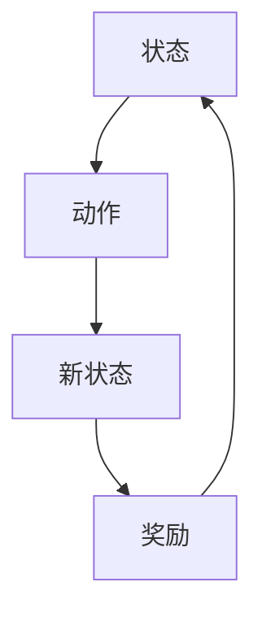
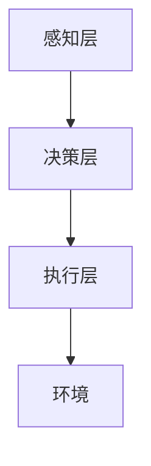
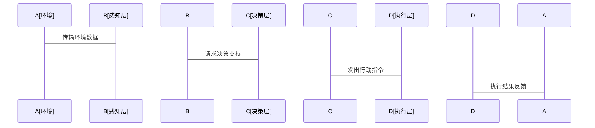

                 


# AI Agent在太空探索中的自主决策系统

## 关键词：AI Agent, 自主决策系统, 太空探索, 强化学习, 决策树, 系统架构, 太空任务

## 摘要：  
本文探讨了AI Agent在太空探索中的自主决策系统的原理、算法和应用。通过分析AI Agent的核心概念、算法原理和系统架构，结合实际案例，深入阐述了AI Agent在太空任务中的应用价值和未来发展方向。

---

# 第一部分: AI Agent在太空探索中的自主决策系统概述

## 第1章: AI Agent与自主决策系统概述

### 1.1 AI Agent的基本概念  
#### 1.1.1 什么是AI Agent  
AI Agent（人工智能代理）是指能够在环境中感知、推理、规划并采取行动以实现目标的智能体。它具备自主性、反应性、目标导向性和社会性四大核心特征。  

#### 1.1.2 AI Agent的核心特征  
- **自主性**：AI Agent能够独立决策，无需外部干预。  
- **反应性**：能够实时感知环境并做出反应。  
- **目标导向性**：基于目标驱动行动。  
- **社会性**：能够与其他Agent或人类进行交互协作。  

#### 1.1.3 自主决策系统的定义与特点  
自主决策系统是指能够在复杂动态环境中，无需外部干预，自主完成任务的系统。其特点包括：  
- **自主性**：无需外部控制，自主完成决策。  
- **适应性**：能够根据环境变化调整决策策略。  
- **高效性**：能够在有限时间内完成决策任务。  
- **安全性**：确保决策过程的安全性和可靠性。  

---

## 第2章: 太空探索中的决策挑战

### 2.1 太空任务的复杂性  
太空环境具有高度的不确定性、不可预测性和极端条件。例如：  
- **复杂性**：太空任务涉及多学科知识，如轨道力学、天文学、机械工程等。  
- **动态性**：太空环境不断变化，如小行星、太阳风、宇宙射线等。  
- **资源限制**：任务资源有限，如能源、通信带宽等。  

### 2.2 环境不确定性与风险  
- **环境不确定性**：太空环境的动态性和不可预测性增加了决策的难度。  
- **任务风险**：太空任务失败可能导致巨大的经济损失或人员伤亡。  
- **通信延迟**：地球与太空任务之间的通信延迟可能影响实时决策。  

### 2.3 自主决策的必要性  
- **减少依赖性**：通过自主决策减少对地面控制的依赖。  
- **提高效率**：自主决策能够在有限时间内快速响应环境变化。  
- **降低成本**：通过自动化决策减少人力和时间成本。  

---

## 第3章: AI Agent在太空探索中的应用前景

### 3.1 太空任务中的AI Agent案例  
- **火星探测任务**：AI Agent用于火星车的路径规划和岩石样本分析。  
- **卫星自主导航**：AI Agent用于卫星的姿态控制和轨道调整。  
- **深空探测**：AI Agent用于探索小行星和太阳系边际的自主决策。  

### 3.2 技术发展趋势  
- **强化学习的应用**：强化学习在机器人导航、路径规划中的应用日益广泛。  
- **多Agent协作**：通过多Agent协作实现复杂任务的分布式决策。  
- **边缘计算**：通过边缘计算技术实现低延迟的实时决策。  

### 3.3 未来应用潜力  
- **月球基地建设**：AI Agent用于月球基地的资源勘探和建设规划。  
- **火星移民**：AI Agent用于火星移民的资源管理和环境监测。  
- **深空探索**：AI Agent用于探索更遥远的天体和宇宙环境。  

---

# 第二部分: AI Agent的核心概念与原理

## 第4章: AI Agent的核心概念与联系

### 4.1 AI Agent的核心概念  
#### 4.1.1 感知与理解  
AI Agent通过传感器和数据采集设备感知环境状态。例如，火星车通过摄像头、温度传感器等感知周围环境。  

#### 4.1.2 推理与决策  
AI Agent通过推理引擎和决策算法对感知信息进行分析，生成决策方案。例如，基于强化学习的Q-learning算法用于路径规划。  

#### 4.1.3 行动与反馈  
AI Agent根据决策结果采取行动，并通过反馈机制调整决策策略。例如，卫星通过调整姿态实现对地观测。  

### 4.2 AI Agent与相关概念的对比  
#### 4.2.1 AI Agent与传统自动控制系统的区别  
- **自主性**：AI Agent具备自主性，而传统控制系统依赖外部指令。  
- **学习能力**：AI Agent能够学习和适应环境，而传统控制系统无法自主学习。  

#### 4.2.2 AI Agent与机器人技术的联系  
AI Agent为机器人提供决策支持，机器人则为AI Agent提供执行能力。  

#### 4.2.3 AI Agent与数据挖掘的区别  
AI Agent注重实时决策，而数据挖掘注重从历史数据中提取模式。  

---

## 第5章: AI Agent的ER实体关系图

### 5.1 实体关系图
```mermaid
er
actor(AI Agent) --> action(决策行为)
actor(AI Agent) --> environment(太空环境)
action(决策行为) --> outcome(结果)
```

### 5.2 说明
- **AI Agent**：主体，负责感知、推理、决策和行动。  
- **环境**：外部环境，包括太空中的各种天体、空间环境等。  
- **决策行为**：AI Agent采取的行动，如路径规划、资源分配等。  
- **结果**：决策行为对环境产生的影响或反馈。  

---

# 第三部分: AI Agent的算法原理与数学模型

## 第6章: AI Agent的算法原理

### 6.1 基于强化学习的决策算法  
#### 6.1.1 强化学习的基本原理  
强化学习通过试错机制，学习最优策略以最大化累积奖励。  

#### 6.1.2 Q-learning算法  
Q-learning是一种经典的强化学习算法，适用于离散状态和动作空间。  

#### 6.1.3 算法流程图  


### 6.2 基于决策树的决策算法  
#### 6.2.1 决策树的构建原理  
决策树通过特征选择和分裂策略，构建一棵树状结构，用于分类或回归。  

#### 6.2.2 ID3算法  
ID3算法基于信息增益度构建决策树。  

#### 6.2.3 决策树的优缺点  
- **优点**：易于理解，适合处理离散数据。  
- **缺点**：对噪声数据敏感，容易过拟合。  

---

## 第7章: AI Agent的数学模型与公式

### 7.1 Q-learning公式  
$$ Q(s, a) = Q(s, a) + \alpha (r + \gamma \max Q(s', a') - Q(s, a)) $$  
其中：  
- \( Q(s, a) \)：当前状态-动作对的Q值。  
- \( \alpha \)：学习率。  
- \( r \)：奖励值。  
- \( \gamma \)：折扣因子。  
- \( Q(s', a') \)：下一个状态-动作对的Q值。  

### 7.2 决策树的熵公式  
$$ H = -\sum p_i \log p_i $$  
其中，\( p_i \) 是某个特征分裂后的概率分布。  

---

# 第四部分: 系统架构与设计

## 第8章: AI Agent在太空探索中的系统架构

### 8.1 系统功能设计  
#### 8.1.1 太空环境感知模块  
负责收集和处理环境数据，如温度、压力、光照等。  

#### 8.1.2 任务规划模块  
基于环境数据和任务目标，生成最优行动方案。  

#### 8.1.3 决策执行模块  
根据规划结果，执行具体行动并反馈结果。  

### 8.2 系统架构设计  
#### 8.2.1 分层架构  
- **感知层**：负责数据采集和初步处理。  
- **决策层**：负责推理和决策。  
- **执行层**：负责具体行动的执行。  

### 8.3 系统架构图  


---

## 第9章: 系统接口与交互设计

### 9.1 系统接口设计  
- **输入接口**：接收环境数据和任务指令。  
- **输出接口**：输出决策结果和行动指令。  

### 9.2 系统交互流程图  


---

# 第五部分: 项目实战

## 第10章: 项目实战——AI Agent在火星探测任务中的应用

### 10.1 项目介绍  
本项目旨在设计一个AI Agent，用于火星探测任务中的路径规划和资源分配。  

### 10.2 核心代码实现  
#### 10.2.1 环境感知模块  
```python
class Environment:
    def __init__(self):
        self.temperature = 0
        self.pressure = 0
```

#### 10.2.2 决策算法实现  
```python
def q_learning(state, action):
    return new_state, reward
```

#### 10.2.3 任务规划模块  
```python
def path_planning(start, end):
    return path
```

### 10.3 项目小结  
通过本项目，我们验证了AI Agent在太空探索中的应用潜力，同时为后续研究提供了参考。  

---

## 第11章: 总结与展望

### 11.1 本章小结  
本文系统地探讨了AI Agent在太空探索中的自主决策系统的原理、算法和应用。通过理论分析和实际案例，验证了AI Agent在太空任务中的重要性。  

### 11.2 未来展望  
未来，随着AI技术的不断发展，AI Agent在太空探索中的应用将更加广泛和深入。例如，AI Agent将用于深空探测、月球基地建设和星际移民等任务。  

---

## 第12章: 最佳实践与注意事项

### 12.1 最佳实践  
- **数据质量**：确保环境数据的准确性和完整性。  
- **算法优化**：根据任务需求优化算法性能。  
- **系统测试**：进行全面的系统测试，确保决策系统的稳定性和可靠性。  

### 12.2 注意事项  
- **安全性**：确保AI Agent的决策过程安全可靠。  
- **可解释性**：确保决策过程可解释，便于调试和优化。  
- **可扩展性**：确保系统具备良好的扩展性，适应未来任务需求。  

---

## 第13章: 附录

### 13.1 术语表  
- **AI Agent**：人工智能代理  
- **强化学习**：Reinforcement Learning  
- **决策树**：Decision Tree  

### 13.2 参考文献  
- Russell, S., & Norvig, P. (2010). *Artificial Intelligence: A Modern Approach*.  
- Sutton, R. S., & Barto, A. G. (2018). *Reinforcement Learning: An Introduction*.  

---

**总结：** 本文全面探讨了AI Agent在太空探索中的自主决策系统的原理、算法和应用。通过理论分析和实际案例，验证了AI Agent在太空任务中的重要性。未来，随着AI技术的不断发展，AI Agent在太空探索中的应用将更加广泛和深入。

