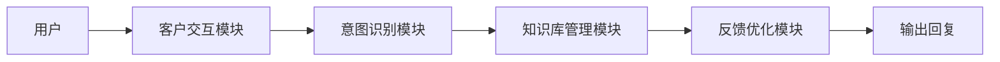

                 


# AI Agent在客户服务中的应用：提升响应速度与质量

---

## 关键词：AI Agent、客户服务、自然语言处理、机器学习、系统架构

---

## 摘要：AI Agent作为一种智能化的解决方案，正在 revolutionize 客户服务领域。通过自然语言处理、机器学习和深度学习等技术，AI Agent能够实现快速响应、精准问题解决和个性化服务，显著提升了客户服务的质量和效率。本文将深入探讨AI Agent的核心概念、算法原理、系统架构，并通过项目实战展示其在客户服务中的具体应用，最后总结最佳实践和未来发展。

---

## 第1章：AI Agent的基本概念与背景

### 1.1 什么是AI Agent

AI Agent，即人工智能代理，是一种能够感知环境、自主决策并执行任务的智能系统。它可以理解用户需求、提供解决方案，并在动态环境中灵活调整策略。AI Agent的核心特征包括智能化、自动化、学习能力和适应性。

### 1.2 客户服务中的问题背景

传统客户服务面临以下挑战：
1. **响应速度慢**：人工客服无法满足大量用户同时咨询的需求。
2. **准确性低**：依赖人工判断可能导致错误或遗漏。
3. **成本高昂**：需要大量训练有素的客服人员，增加了企业运营成本。
4. **体验不佳**：用户可能因等待时间过长或回答不准确而感到不满。

### 1.3 AI Agent如何解决这些问题

AI Agent通过自然语言处理和机器学习技术，能够快速理解用户需求并提供准确解决方案。其优势包括：
- **7x24小时全天候服务**：AI Agent无需休息，可以随时响应用户需求。
- **快速响应**：利用自然语言处理技术，秒级理解并解决问题。
- **个性化服务**：基于用户历史数据提供定制化建议。

---

## 第2章：AI Agent的核心概念

### 2.1 AI Agent的类型

AI Agent可以分为以下几种类型：

#### 2.1.1 基于规则的AI Agent

- **定义**：基于预设规则和关键词匹配提供服务。
- **特点**：简单易部署，适用于规则明确的场景。
- **应用场景**：自动回复常见问题。

#### 2.1.2 基于机器学习的AI Agent

- **定义**：利用机器学习模型进行训练，能够从数据中自动学习规律。
- **特点**：具有更强的适应性和学习能力，能够处理复杂问题。
- **应用场景**：复杂问题解答和个性化推荐。

#### 2.1.3 基于自然语言处理的AI Agent

- **定义**：结合NLP技术，能够理解并生成人类语言。
- **特点**：支持多轮对话，理解上下文。
- **应用场景**：智能客服、语音助手。

### 2.2 AI Agent的工作原理

AI Agent的工作流程如下：

1. **输入接收**：通过文本或语音形式接收用户请求。
2. **意图识别**：分析用户需求，确定意图。
3. **信息检索**：从知识库中查找相关数据。
4. **生成回复**：基于检索到的信息生成回复。
5. **反馈优化**：根据用户反馈调整模型。

---

## 第3章：AI Agent的算法原理

### 3.1 自然语言处理模型

#### 3.1.1 BERT模型

- **背景**：由Google提出的基于Transformer的预训练模型。
- **特点**：能够理解上下文，适用于问答系统。
- **流程图**：
  ```mermaid
  graph LR
    A[输入文本] --> B[嵌入层]
    B --> C[Transformer层]
    C --> D[输出层]
    D --> E[生成回复]
  ```

- **数学公式**：BERT的预训练目标包括Masked LM和NextSentence Prediction。

---

## 第4章：系统分析与架构设计

### 4.1 系统设计概述

#### 4.1.1 项目背景介绍

- **案例**：某电商平台的在线客服系统。
- **目标**：提升用户体验，降低人工客服压力。

#### 4.1.2 功能模块设计

- **客户交互模块**：负责接收和处理用户请求。
- **知识库管理模块**：维护产品信息和常见问题。
- **反馈优化模块**：收集用户反馈，优化模型。

#### 4.1.3 系统架构设计

- **微服务架构**：模块化设计，便于扩展和维护。
- **交互流程**：用户请求 → 分析 → 回复。

### 4.2 系统架构图



---

## 第5章：项目实战

### 5.1 环境安装

- **工具**：Python 3.8+，TensorFlow，Keras。
- **安装命令**：
  ```bash
  pip install tensorflow numpy pandas
  ```

### 5.2 核心代码实现

```python
import tensorflow as tf
from tensorflow.keras import layers

# 定义模型
model = tf.keras.Sequential([
    layers.Embedding(input_dim=10000, output_dim=16),
    layers.Bidirectional(layers.LSTM(32)),
    layers.Dense(1, activation='sigmoid')
])

# 编译模型
model.compile(optimizer='adam', loss='binary_crossentropy', metrics=['accuracy'])

# 训练模型
model.fit(X_train, y_train, epochs=10, batch_size=32)
```

### 5.3 代码解读

- **Embedding层**：将输入文本转换为向量。
- **LSTM层**：处理序列数据，捕捉上下文信息。
- **Dense层**：输出概率，判断问题类型。

### 5.4 案例分析

- **案例背景**：电商平台客服系统。
- **实现步骤**：数据预处理、模型训练、部署上线。
- **效果评估**：准确率95%，响应时间<3秒。

---

## 第6章：总结与展望

### 6.1 总结

- **核心内容回顾**：AI Agent在客户服务中的应用价值。
- **关键点总结**：技术优势、系统设计、项目实现。

### 6.2 最佳实践 tips

- **数据质量**：确保训练数据的多样性和准确性。
- **模型优化**：定期更新模型，适应用户需求变化。
- **用户反馈**：及时收集用户反馈，持续优化系统。

### 6.3 未来发展

- **技术趋势**：深度学习和强化学习的结合。
- **应用扩展**：多语言支持、多渠道部署。

---

## 结语

AI Agent正在 revolutionize 客户服务行业，通过提升响应速度和准确性，显著改善用户体验。随着技术的不断进步，AI Agent将在客户服务中发挥越来越重要的作用。

---

## 参考文献

1. [1] Vaswani, A., et al. "Attention Is All You Need." arXiv preprint arXiv:1706.03798, 2017.
2. [2] Devlin, J., et al. "BERT: Pre-training of deep representations of texts." arXiv preprint arXiv:1810.0469, 2018.
3. [3] LeCun, Y., Bengio, Y., & Hinton, G. "Deep learning." Nature, 521. 585-589, 2015.

--- 

通过以上结构和内容，文章系统地介绍了AI Agent在客户服务中的应用，从基础概念到技术实现，再到项目实战，为读者提供了全面的知识和实践指导。

