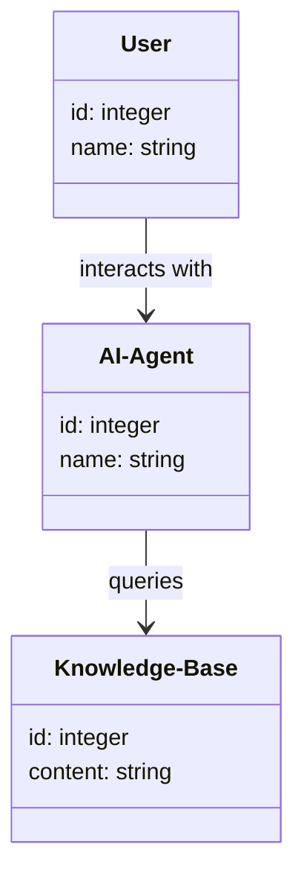

                 


# AI Agent在客户服务中的革新作用

## 关键词：AI Agent, 人工智能, 客户服务, 自然语言处理, 机器学习, 对话系统

## 摘要：本文深入探讨了AI Agent在客户服务中的革新作用，分析了其核心技术和应用场景，结合实际案例和系统设计，展示了AI Agent如何通过自然语言处理、机器学习等技术提升客户服务效率和客户体验。文章从基础概念到系统架构，再到项目实战，全面解析了AI Agent在客户服务中的潜力和未来发展方向。

---

## 第1章 AI Agent的基本概念与背景

### 1.1 AI Agent的定义与特点

AI Agent（人工智能代理）是指能够感知环境、自主决策并执行任务的智能实体。它通过与用户的交互，利用多种技术手段解决问题或提供服务。AI Agent的核心特点包括：

1. **智能性**：能够理解和处理自然语言，具备学习和推理能力。
2. **自主性**：能够在没有人工干预的情况下独立完成任务。
3. **适应性**：能够根据反馈和环境变化调整行为。
4. **交互性**：通过多种渠道与用户进行实时互动。

AI Agent与传统客服系统的主要区别在于，前者具备自主决策和学习能力，能够处理复杂场景，而后者通常依赖于预设的规则和脚本。

### 1.2 客户服务中的AI Agent应用背景

#### 1.2.1 客户服务的传统模式

传统客户服务主要依赖人工坐席，处理客户咨询、投诉等事务。这种方式存在以下问题：
- **效率低下**：人工坐席需要处理大量重复性问题，效率有限。
- **成本高昂**：需要大量人力投入，运营成本高。
- **体验不一致**：人工坐席的能力和情绪可能影响服务质量。

#### 1.2.2 传统客户服务的痛点与挑战

- **服务响应速度**：客户等待时间长，影响体验。
- **服务质量不一致**：人工坐席能力参差不齐。
- **数据孤岛**：不同部门之间数据难以共享，影响问题解决效率。

#### 1.2.3 AI Agent在客户服务中的革新作用

AI Agent通过自然语言处理、机器学习等技术，能够快速理解客户需求，提供准确解决方案，显著提升服务效率和客户满意度。

---

## 第2章 AI Agent的核心技术原理

### 2.1 自然语言处理（NLP）技术

#### 2.1.1 NLP的基本概念

自然语言处理是让计算机理解和生成人类语言的技术。AI Agent的核心能力之一就是通过NLP技术实现与用户的自然对话。

#### 2.1.2 常见的NLP技术与工具

- **分词**：将文本分割成词语或短语，如jieba。
- **实体识别**：识别文本中的关键实体，如人名、地点、组织。
- **情感分析**：判断文本的情感倾向，如正面、负面或中性。

#### 2.1.3 NLP在AI Agent中的应用

- **意图识别**：通过NLP技术识别用户的意图，如“查询订单状态”。
- **对话生成**：根据用户输入生成自然的回复。

#### 2.1.4 实例分析

假设用户输入：“我的订单还没有到，怎么办？”

AI Agent通过NLP技术识别用户的意图是“查询物流信息”，并生成回复：“您好，您的订单物流信息显示已发货，请您耐心等待，如有更新我们会第一时间通知您。”

### 2.2 机器学习与深度学习

#### 2.2.1 机器学习的基本原理

机器学习是通过数据训练模型，使其能够从数据中学习规律并进行预测或分类。

#### 2.2.2 深度学习在AI Agent中的应用

深度学习通过神经网络模型处理复杂任务，如语音识别、图像识别和自然语言处理。

#### 2.2.3 常见的机器学习算法与模型

- **决策树**：用于分类任务。
- **随机森林**：用于分类和回归任务。
- **神经网络**：用于复杂模式识别。

#### 2.2.4 实例分析

假设我们使用决策树算法训练一个客户情绪分类模型，输入客户文本，输出情绪类别（正面、负面、中性）。

### 2.3 对话系统与知识图谱

#### 2.3.1 对话系统的构建与优化

对话系统需要设计对话流程、训练对话模型，并不断优化用户体验。

#### 2.3.2 知识图谱的构建与应用

知识图谱是一个图结构，用于表示实体及其关系，帮助AI Agent更好地理解上下文。

#### 2.3.3 对话系统与知识图谱的结合

通过知识图谱，AI Agent可以提供更准确的信息，并根据上下文调整对话内容。

#### 2.3.4 实例分析

假设用户询问：“你们的产品有哪些功能？”

AI Agent通过知识图谱检索产品功能信息，并生成回复。

---

## 第3章 AI Agent在客户服务中的应用场景

### 3.1 智能客服助手

#### 3.1.1 智能客服助手的基本功能

- **自动响应**：通过NLP技术快速理解用户需求并生成回复。
- **问题分类**：将用户问题分类到相应的知识领域。
- **知识库检索**：从知识库中提取相关信息。

#### 3.1.2 智能客服助手的实现流程

1. **用户输入**：用户通过文本或语音输入问题。
2. **意图识别**：AI Agent识别用户意图。
3. **知识检索**：从知识库中检索相关信息。
4. **生成回复**：根据检索结果生成回复。
5. **反馈优化**：根据用户反馈优化回复内容。

#### 3.1.3 智能客服助手的实际案例

某电商平台使用AI Agent处理客户咨询，显著提高了响应速度和准确性。

---

## 第4章 AI Agent的系统架构与设计

### 4.1 系统架构设计

AI Agent的系统架构通常包括以下组件：

- **前端交互层**：用户与AI Agent的交互界面。
- **后端逻辑层**：处理用户请求和生成回复。
- **数据存储层**：存储用户数据和知识库。

### 4.2 系统功能设计

#### 4.2.1 领域模型设计

使用Mermaid类图描述系统中的实体及其关系。



#### 4.2.2 系统架构设计

使用Mermaid架构图描述系统整体架构。


---

## 第5章 项目实战：构建一个简单的AI Agent系统

### 5.1 环境搭建

需要安装以下工具：

- Python
- NLTK库
- Scikit-learn库

### 5.2 系统核心实现

#### 5.2.1 代码实现

```python
import nltk
from sklearn.tree import DecisionTreeClassifier
from sklearn.feature_extraction.text import TfidfVectorizer

# 数据准备
corpus = [
    "我需要帮助查询订单状态",
    "如何取消订单",
    "我想投诉产品问题",
    "请告诉我如何联系技术支持"
]

# 特征提取
vectorizer = TfidfVectorizer()
X = vectorizer.fit_transform(corpus)

# 标签
y = ["订单查询", "订单取消", "投诉", "技术支持"]

# 模型训练
model = DecisionTreeClassifier()
model.fit(X, y)

# 预测
new_query = "我需要取消我的订单"
new_query_vector = vectorizer.transform([new_query])
predicted_label = model.predict(new_query_vector)
print(predicted_label[0])  # 输出：订单取消
```

#### 5.2.2 代码解读与分析

- 使用TF-IDF向量化文本数据。
- 使用决策树分类器进行训练和预测。
- 根据预测结果生成回复。

### 5.3 实际案例分析

通过实际案例分析，验证系统的有效性和改进空间。

### 5.4 项目小结

总结项目实现的关键点和经验教训。

---

## 第6章 总结与展望

### 6.1 总结

AI Agent在客户服务中的应用前景广阔，能够显著提升服务效率和客户满意度。

### 6.2 未来展望

随着技术的不断发展，AI Agent将更加智能化和个性化，能够处理更多复杂场景。

---

## 参考文献

- 自然语言处理相关文献
- 机器学习相关文献
- 对话系统相关文献

---

## 致谢

感谢读者的耐心阅读，感谢技术社区的支持。

