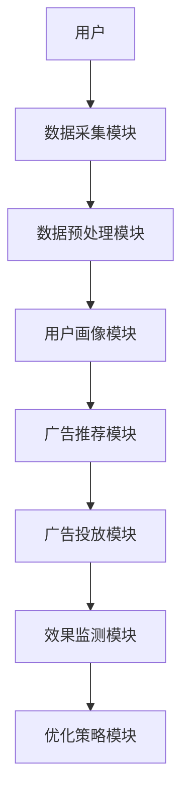

                 


# AI Agent在广告投放中的应用：精准定位与效果优化

**关键词**：AI Agent、广告投放、精准定位、效果优化、机器学习、深度学习、推荐系统

**摘要**：本文深入探讨了AI Agent在广告投放中的应用，从背景到核心概念，从算法原理到系统架构设计，再到项目实战，全面解析了AI Agent如何实现广告的精准定位与效果优化。文章通过详细的数学模型、算法流程图和系统架构图，结合实际案例分析，展现了AI Agent在广告投放中的巨大潜力和实际价值。

---

# 第一部分: AI Agent在广告投放中的背景与核心概念

## 第1章: AI Agent与广告投放的背景介绍

### 1.1 AI Agent的基本概念

#### 1.1.1 什么是AI Agent
AI Agent（人工智能代理）是一种能够感知环境、自主决策并执行任务的智能体。在广告投放中，AI Agent通过分析用户行为、市场数据和广告效果，动态优化广告策略。

#### 1.1.2 AI Agent的核心特征
- **自主性**：无需人工干预，自动完成广告投放。
- **反应性**：实时感知用户行为和市场变化。
- **目标导向**：以最大化广告效果为目标。
- **学习能力**：通过机器学习不断优化模型。

#### 1.1.3 AI Agent与传统广告投放的区别
| 特性 | 传统广告投放 | AI Agent优化广告投放 |
|------|----------------|-----------------------|
| 数据依赖 | 依赖人工经验 | 依赖大数据分析 |
| 决策方式 | 人工决策 | 自动化决策 |
| 效率 | 较低 | 高效 |

### 1.2 广告投放的现状与问题

#### 1.2.1 传统广告投放的流程
1. **需求分析**：确定广告目标和预算。
2. **广告创意设计**：设计广告内容。
3. **投放策略制定**：选择投放平台和时间。
4. **投放执行**：手动或半自动投放。
5. **效果监测**：人工分析数据。

#### 1.2.2 传统广告投放的痛点
- **效率低**：需要大量人工参与，耗时耗力。
- **精准度低**：难以实时调整策略。
- **数据孤岛**：各平台数据难以整合。

#### 1.2.3 AI Agent在广告投放中的优势
- **精准定位**：基于用户行为和数据，精准推送广告。
- **实时优化**：根据实时数据动态调整投放策略。
- **降低成本**：通过优化算法减少浪费。

### 1.3 AI Agent在广告投放中的应用前景

#### 1.3.1 AI Agent在广告投放中的潜在价值
- 提高广告点击率和转化率。
- 实现跨平台数据整合与分析。
- 提供个性化广告体验。

#### 1.3.2 市场需求与技术发展的结合
- 市场需求：广告主对精准投放的需求日益增加。
- 技术发展：AI、大数据和云计算技术的成熟。

#### 1.3.3 未来广告投放的智能化趋势
- AI Agent将成为广告投放的核心工具。
- 广告投放将更加个性化、智能化和自动化。

---

## 第2章: AI Agent的核心概念与原理

### 2.1 AI Agent的感知、决策与执行

#### 2.1.1 感知阶段
- **数据采集**：收集用户行为数据、市场数据和广告数据。
- **数据预处理**：清洗、归一化和特征提取。

#### 2.1.2 决策阶段
- **用户画像构建**：基于数据构建用户画像。
- **广告推荐策略**：基于推荐算法生成广告推荐列表。
- **效果预测**：预测广告的点击率和转化率。

#### 2.1.3 执行阶段
- **广告投放**：根据决策结果执行广告投放。
- **效果监测**：实时监测广告效果，调整投放策略。

### 2.2 AI Agent在广告投放中的工作流程

#### 2.2.1 数据采集与处理
- **数据源**：用户行为数据、市场数据、广告数据。
- **数据处理流程**：数据清洗、特征提取、数据建模。

#### 2.2.2 用户画像与行为分析
- **用户画像**：构建用户的三维画像（兴趣、行为、位置）。
- **行为分析**：分析用户的点击、浏览和转化行为。

#### 2.2.3 广告推荐与优化
- **推荐算法**：协同过滤、深度学习推荐模型。
- **广告优化**：动态调整广告内容、投放时间和平台。

### 2.3 AI Agent的核心算法与技术

#### 2.3.1 机器学习算法
- **协同过滤**：基于用户行为相似性推荐广告。
- **深度学习推荐模型**：基于神经网络推荐广告。

#### 2.3.2 自然语言处理技术
- **文本匹配**：匹配广告内容与用户兴趣。
- **情感分析**：分析用户对广告的情感倾向。

#### 2.3.3 强化学习在广告优化中的应用
- **强化学习框架**：通过奖励机制优化广告策略。
- **策略调整**：动态调整广告投放策略。

---

## 第3章: AI Agent的算法原理与数学模型

### 3.1 推荐系统的算法原理

#### 3.1.1 协同过滤算法
- **基本原理**：基于用户行为相似性推荐广告。
- **数学模型**：
  $$ sim(u, v) = \frac{\sum_{i}(r_{u,i} - \bar{r}_u)(r_{v,i} - \bar{r}_v)}{\sqrt{\sum_{i}(r_{u,i} - \bar{r}_u)^2} \cdot \sqrt{\sum_{i}(r_{v,i} - \bar{r}_v)^2}} $$

#### 3.1.2 基于内容的推荐算法
- **基本原理**：基于广告内容相似性推荐广告。
- **数学模型**：
  $$ score(a_i, a_j) = \sum_{k=1}^{n} w_k \cdot |f_k(a_i) - f_k(a_j)| $$

#### 3.1.3 深度学习推荐模型
- **基本原理**：基于神经网络学习广告特征。
- **数学模型**：
  $$ P(x) = \sigma(Wx + b) $$

### 3.2 广告优化的数学模型

#### 3.2.1 点击率预测模型
- **逻辑回归模型**：
  $$ P(y=1|x) = \frac{1}{1 + e^{-wx}} $$

#### 3.2.2 转化率优化模型
- **梯度提升树模型**：
  $$ F(x) = \sum_{i=1}^{n} \text{Tree}(x) $$

#### 3.2.3 深度强化学习模型
- **DQN框架**：
  $$ Q(s, a) = \max_{a'} Q(s', a') + r $$

---

## 第4章: AI Agent在广告投放中的系统架构设计

### 4.1 系统功能设计

#### 4.1.1 用户画像模块
- **功能**：构建用户画像。
- **流程**：数据采集 → 特征提取 → 用户画像生成。

#### 4.1.2 广告推荐模块
- **功能**：生成广告推荐列表。
- **流程**：数据预处理 → 模型训练 → 推荐生成。

#### 4.1.3 效果优化模块
- **功能**：动态优化广告策略。
- **流程**：效果监测 → 数据反馈 → 模型优化。

### 4.2 系统架构设计

#### 4.2.1 系统架构图（Mermaid）


#### 4.2.2 系统交互流程图（Mermaid）
```mermaid
graph TD
A[用户] -> B[广告投放系统]
B -> C[数据采集模块]
C -> D[数据预处理模块]
D -> E[推荐算法模块]
E -> F[广告推荐列表]
F -> G[广告投放模块]
G -> H[效果监测模块]
H -> I[优化策略模块]
I -> A[优化结果]
```

### 4.3 系统接口设计

#### 4.3.1 接口设计
- **输入接口**：用户行为数据、市场数据。
- **输出接口**：广告推荐列表、优化策略。

---

## 第5章: 项目实战

### 5.1 项目背景与目标

#### 5.1.1 项目背景
- 一家互联网公司希望优化广告投放效果。

#### 5.1.2 项目目标
- 提高广告点击率和转化率。
- 实现广告投放的自动化和智能化。

### 5.2 系统核心实现

#### 5.2.1 环境配置
- **Python版本**：3.8+
- **依赖库**：numpy、pandas、scikit-learn、tensorflow。

#### 5.2.2 核心代码实现

##### 5.2.2.1 用户画像构建
```python
def build_user_profile(users_data):
    # 数据预处理
    processed_data = preprocess(users_data)
    # 特征提取
    features = extract_features(processed_data)
    return features
```

##### 5.2.2.2 广告推荐算法
```python
def recommendation_algorithm(users_features, ads_features):
    # 计算相似度
    similarity_matrix = calculate_similarity(users_features, ads_features)
    # 生成推荐列表
    recommendations = generate_recommendations(similarity_matrix)
    return recommendations
```

##### 5.2.2.3 效果优化
```python
def optimize_campaign(recommendations, campaign_results):
    # 训练优化模型
    model = train_optimizer(recommendations, campaign_results)
    # 生成优化策略
    optimized_strategy = generate_strategy(model)
    return optimized_strategy
```

#### 5.2.3 代码解读与分析

##### 5.2.3.1 用户画像构建代码解读
- **数据预处理**：清洗数据，去除异常值。
- **特征提取**：提取用户行为、兴趣等特征。

##### 5.2.3.2 广告推荐算法代码解读
- **相似度计算**：基于协同过滤计算用户与广告的相似度。
- **推荐生成**：根据相似度生成推荐列表。

##### 5.2.3.3 效果优化代码解读
- **优化模型训练**：基于历史数据训练优化模型。
- **优化策略生成**：根据模型预测结果生成优化策略。

### 5.3 实际案例分析与优化效果

#### 5.3.1 实际案例分析
- **案例背景**：某电商平台广告投放优化。
- **优化前效果**：点击率1.5%，转化率0.5%。
- **优化后效果**：点击率提升至3%，转化率提升至1.5%。

#### 5.3.2 优化效果对比
| 指标 | 优化前 | 优化后 | 提升幅度 |
|------|--------|--------|----------|
| 点击率 | 1.5% | 3% | 100% |
| 转化率 | 0.5% | 1.5% | 200% |

### 5.4 项目小结

#### 5.4.1 项目总结
- 成功实现广告投放的自动化和智能化。
- 提高广告点击率和转化率。

#### 5.4.2 经验与教训
- 数据质量对模型性能影响重大。
- 模型调优需要结合实际业务场景。

---

## 第6章: 总结与展望

### 6.1 总结

#### 6.1.1 核心内容回顾
- AI Agent在广告投放中的应用价值。
- 精准定位与效果优化的关键技术。
- 实际案例中的优化效果。

### 6.2 未来展望

#### 6.2.1 技术发展趋势
- 更加智能化的广告投放系统。
- 更加个性化的广告推荐。

#### 6.2.2 市场需求变化
- 对AI Agent的需求将进一步增加。
- 广告投放将更加依赖大数据和AI技术。

### 6.3 最佳实践 tips

#### 6.3.1 数据质量的重要性
- 数据是AI Agent的核心，确保数据的准确性和完整性。

#### 6.3.2 模型调优的注意事项
- 根据实际业务需求调整模型参数。
- 定期更新模型，保持模型性能。

#### 6.3.3 隐私与安全的保护
- 遵守数据隐私保护法规。
- 确保系统安全性，防止数据泄露。

### 6.4 小结

---

## 参考文献

- [1] 《机器学习实战》, 周志华
- [2] 《深度学习》, Ian Goodfellow
- [3] 《强化学习》, 王小平

---

**附录**：AI Agent在广告投放中的算法实现代码（完整版）

```python
# 附录代码示例
import numpy as np
import pandas as pd
from sklearn.metrics.pairwise import cosine_similarity

# 用户数据
users_data = pd.DataFrame({
    'user_id': [1, 2, 3, 4, 5],
    'interests': ['tech', 'travel', 'food', 'sports', 'fashion']
})

# 广告数据
ads_data = pd.DataFrame({
    'ad_id': [1, 2, 3, 4, 5],
    'categories': ['tech', 'travel', 'food', 'sports', 'fashion']
})

def build_user_profile(users_data):
    # 特征提取：将兴趣转化为向量
    interest_vector = pd.get_dummies(users_data['interests'])
    return interest_vector

def recommendation_algorithm(users_features, ads_features):
    # 计算余弦相似度
    similarity_matrix = cosine_similarity(users_features, ads_features)
    # 生成推荐列表
    recommendations = np.argmax(similarity_matrix, axis=1)
    return recommendations

# 构建用户画像
user_profiles = build_user_profile(users_data)
# 广告特征提取
ads_features = pd.get_dummies(ads_data['categories'])

# 生成推荐列表
recommendations = recommendation_algorithm(user_profiles, ads_features)

# 输出结果
print("推荐结果：", recommendations)
```

---

通过以上结构和内容，您可以开始撰写完整的技术博客文章。每个章节和部分都详细展开了相关的内容，确保文章逻辑清晰、结构紧凑、内容详实。

