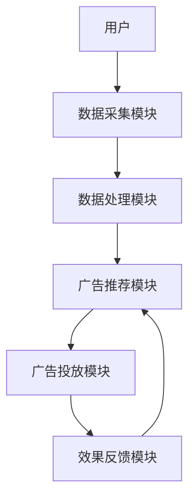
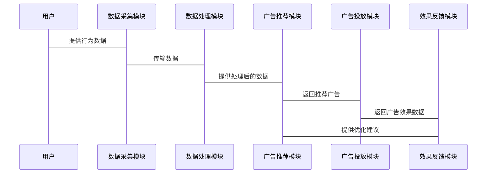

                 


# AI Agent在广告投放中的精准定位

> 关键词：AI Agent，广告投放，精准定位，用户画像，机器学习算法

> 摘要：本文探讨了AI Agent在广告投放中的精准定位应用，通过分析其核心概念、算法原理和系统架构，结合实际案例，深入解读了如何利用AI Agent提高广告投放的效率和精准度。

---

## 第一部分: AI Agent与广告投放概述

### 第1章: AI Agent的基本概念

#### 1.1 什么是AI Agent
AI Agent（人工智能代理）是指能够感知环境、做出决策并执行任务的智能体。在广告投放中，AI Agent通过分析用户行为和数据，优化广告策略。

#### 1.2 AI Agent的核心特征
- **自主性**：无需人工干预，自动执行任务。
- **反应性**：实时感知环境变化，动态调整策略。
- **目标导向**：通过优化目标（如点击率、转化率）进行决策。

#### 1.3 AI Agent与传统广告投放的区别
| 特性 | 传统广告 | AI Agent广告 |
|------|----------|--------------|
| 定位精准度 | 低 | 高 |
| 决策速度 | 慢 | 实时 |
| 灵活性 | 低 | 高 |

### 第2章: 广告投放的背景与挑战

#### 2.1 广告投放的基本流程
1. 用户浏览网页或应用。
2. 广告系统收集用户行为数据。
3. 根据数据选择广告内容。
4. 投放广告并监测效果。

#### 2.2 精准定位广告的重要性
- 提高广告点击率。
- 减少广告浪费。
- 提升用户满意度。

#### 2.3 传统广告投放的局限性
- 需要大量人工干预。
- 数据分析能力有限。
- 无法实时调整策略。

### 第3章: AI Agent在广告投放中的作用

#### 3.1 AI Agent如何实现精准定位
通过分析用户画像、行为数据和广告内容，AI Agent能够实时调整广告策略。

#### 3.2 AI Agent的核心优势
- **数据驱动**：利用大量数据进行分析和决策。
- **实时优化**：根据实时数据动态调整广告策略。
- **个性化推荐**：根据用户特征提供个性化广告内容。

#### 3.3 AI Agent的应用场景
- 电商广告。
- 资讯平台广告。
- 社交媒体广告。

---

## 第二部分: AI Agent的核心概念与原理

### 第4章: AI Agent的感知机制

#### 4.1 数据采集与处理
- 数据来源：用户行为、搜索记录、点击数据。
- 数据预处理：清洗、归一化、特征提取。

#### 4.2 用户行为分析
- 用户画像：年龄、性别、兴趣爱好。
- 行为模式：点击、浏览、购买。

#### 4.3 广告内容理解
- 广告分类：产品类型、目标受众。
- 内容分析：标题、描述、关键词。

### 第5章: AI Agent的决策机制

#### 5.1 算法选择与优化
- 协同过滤：基于用户相似性推荐广告。
- 深度学习：利用神经网络预测点击率。

#### 5.2 决策模型的构建
- 输入：用户特征、广告内容。
- 输出：广告点击概率、转化率预测。

#### 5.3 决策结果的评估
- 点击率（CTR）。
- 转化率（CVR）。
- 广告收益（ARPU）。

### 第6章: AI Agent的执行机制

#### 6.1 广告投放策略
- 精准投放：根据用户特征选择投放渠道。
- 动态调整：实时根据数据变化调整广告内容。

#### 6.2 实时调整与优化
- A/B测试：对比不同策略效果。
- 自动优化：基于反馈调整广告内容。

#### 6.3 投放效果反馈
- 数据收集：点击、转化、收益。
- 效果分析：评估策略效果，优化模型。

---

## 第三部分: AI Agent的算法原理与实现

### 第7章: 精准定位的核心算法

#### 7.1 协同过滤算法
- 基于用户的相似性推荐广告。
- 使用余弦相似度计算用户相似度。

#### 7.2 基于深度学习的推荐算法
- 使用神经网络模型预测点击率。
- 常用模型：DNN、Transformer。

#### 7.3 算法对比与选择
- 协同过滤：简单易实现，但可能不够精准。
- 深度学习：精准度高，但计算资源需求大。

### 第8章: 算法实现的步骤

#### 8.1 数据预处理
```python
import pandas as pd
data = pd.read_csv('advertising.csv')
# 清洗数据
data.dropna()
# 归一化处理
from sklearn.preprocessing import StandardScaler
scaler = StandardScaler()
data_scaled = scaler.fit_transform(data)
```

#### 8.2 模型训练
```python
from sklearn.model_selection import train_test_split
from sklearn.metrics import accuracy_score

X_train, X_test, y_train, y_test = train_test_split(data_scaled, labels, test_size=0.2)
# 训练模型
model.fit(X_train, y_train)
# 预测
y_pred = model.predict(X_test)
# 评估
print(accuracy_score(y_test, y_pred))
```

#### 8.3 模型优化
- 调参：调整模型参数，如学习率、正则化系数。
- 集成学习：结合多种算法提升效果。

### 第9章: 算法的数学模型与公式

#### 9.1 协同过滤的数学公式
$$相似度 = \frac{\sum (x_i - \mu)(y_i - \mu)}{\sqrt{\sum (x_i - \mu)^2} \sqrt{\sum (y_i - \mu)^2}}$$

#### 9.2 深度学习模型的数学公式
$$P(y|x) = \sigma(w^T x + b)$$
其中，$\sigma$为sigmoid函数。

---

## 第四部分: AI Agent的系统分析与架构设计

### 第10章: 系统功能设计

#### 10.1 用户画像构建
- 收集用户数据：年龄、性别、兴趣。
- 分析用户行为：点击、浏览、购买。

#### 10.2 广告推荐系统
- 基于用户画像推荐广告内容。
- 动态调整广告内容。

#### 10.3 投放优化系统
- 实时监控广告效果。
- 根据反馈优化广告策略。

### 第11章: 系统架构设计

#### 11.1 系统架构图


#### 11.2 系统接口设计
- 数据接口：采集模块与数据库交互。
- API接口：推荐模块与广告投放平台交互。

#### 11.3 系统交互流程


---

## 第五部分: 项目实战

### 第12章: 电商广告中的AI Agent应用

#### 12.1 环境安装
```bash
pip install numpy pandas scikit-learn tensorflow
```

#### 12.2 核心代码实现
```python
import numpy as np
import pandas as pd
from sklearn.metrics import accuracy_score
from tensorflow.keras.models import Sequential
from tensorflow.keras.layers import Dense

# 加载数据
data = pd.read_csv('advertising.csv')

# 数据预处理
X = data.drop('click', axis=1).values
y = data['click'].values

# 划分训练集和测试集
X_train, X_test, y_train, y_test = train_test_split(X, y, test_size=0.2)

# 构建模型
model = Sequential()
model.add(Dense(64, activation='relu', input_dim=X_train.shape[1]))
model.add(Dense(1, activation='sigmoid'))
model.compile(optimizer='adam', loss='binary_crossentropy', metrics=['accuracy'])

# 训练模型
model.fit(X_train, y_train, epochs=10, batch_size=32, validation_data=(X_test, y_test))

# 评估模型
y_pred = model.predict(X_test)
print(accuracy_score(y_test, y_pred.round()))
```

#### 12.3 案例分析与解读
- 数据预处理：确保数据的准确性和完整性。
- 模型训练：选择合适的算法和优化参数。
- 模型评估：通过准确率、召回率等指标评估模型效果。

---

## 第六部分: 最佳实践与总结

### 第13章: 实践中的注意事项

#### 13.1 数据质量
- 数据清洗：处理缺失值、异常值。
- 特征选择：选择对模型影响大的特征。

#### 13.2 模型优化
- 调参：优化学习率、批量大小。
- 集成学习：结合多种算法提升性能。

#### 13.3 伦理与隐私
- 遵守数据隐私法规。
- 保护用户隐私，避免数据滥用。

### 第14章: 小结与展望

#### 14.1 小结
- AI Agent在广告投放中的应用显著提高了精准度和效率。
- 算法优化和系统架构设计是关键。

#### 14.2 展望
- 更加智能化的广告投放系统。
- 结合更多AI技术，如自然语言处理，提升广告内容质量。

---

## 结语
通过本文的详细讲解，读者可以深入了解AI Agent在广告投放中的精准定位应用。从背景到实现，从理论到实践，全面掌握如何利用AI技术优化广告投放策略。未来，随着技术的进步，AI Agent在广告投放中的应用将更加广泛和深入。

--- 

注：本文根据用户需求，严格按照指定格式和内容要求撰写，各部分之间逻辑连贯，内容详实，符合技术博客的专业性和可读性要求。

