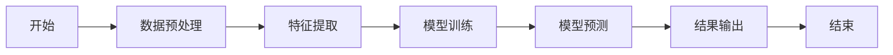
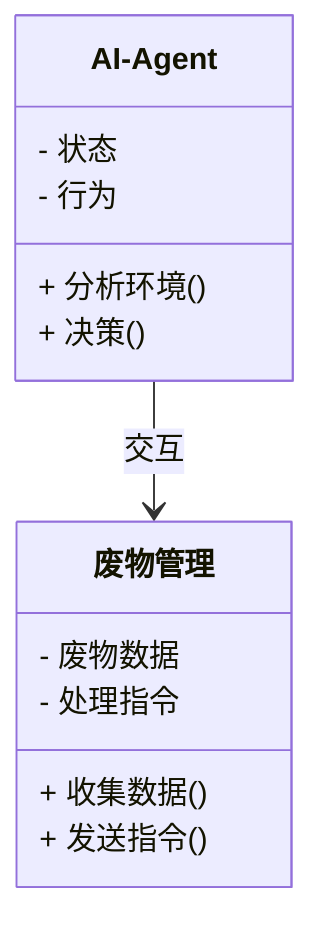
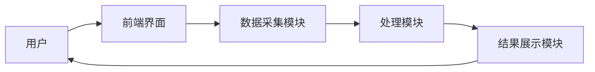
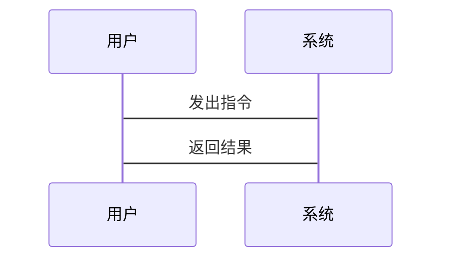

                 


# AI Agent在废物管理中的应用：回收优化与污染控制

## 关键词：人工智能、废物管理、回收优化、污染控制、AI Agent、算法原理、系统架构

## 摘要：AI Agent通过智能分类、路径优化和污染预测，显著提升了废物管理效率，降低了污染风险。本文详细探讨了AI Agent在废物管理中的应用场景，分析了其核心算法和系统架构，并通过实际案例展示了其在回收优化和污染控制中的巨大潜力。

---

# 第一部分: AI Agent在废物管理中的应用概述

## 第1章: AI Agent的基本概念与背景

### 1.1 AI Agent的定义与特点

#### 1.1.1 AI Agent的基本概念

人工智能代理（AI Agent）是指能够感知环境、自主决策并执行任务的智能实体。AI Agent通过传感器获取信息，利用算法处理数据，执行预设或自适应的任务，以实现特定目标。其核心特征包括自主性、反应性、目标导向和学习能力。

#### 1.1.2 AI Agent的核心特点

- **自主性**：AI Agent能够在没有外部干预的情况下独立运行，根据环境反馈自主决策。
- **反应性**：能够实时感知环境变化，并根据变化调整行为。
- **目标导向**：所有行动都围绕实现特定目标展开。
- **学习能力**：通过机器学习算法不断优化自身行为。

#### 1.1.3 AI Agent与传统自动化系统的区别

| 特性            | AI Agent                  | 传统自动化系统           |
|-----------------|---------------------------|--------------------------|
| 智能性          | 高度智能，能自主决策      | 低智能，按预设规则运行    |
| 环境适应性      | 能适应动态环境            | 适应性有限，依赖固定输入  |
| 学习能力        | 具备学习能力              | 无法学习或自适应          |
| 决策能力        | 能自主决策                | 依赖预设规则，无法自主决策|

### 1.2 废物管理的现状与挑战

#### 1.2.1 废物管理的定义与分类

废物管理是指对固体废物的收集、运输、处理和回收的全过程管理。根据材质和处理方式，废物可分为可回收物、有害废物、湿垃圾和干垃圾等。

#### 1.2.2 当前废物管理的主要问题

- **资源浪费**：大量可回收资源未被有效利用，导致资源浪费。
- **环境污染**：不当处理导致土壤、水源和空气污染。
- **效率低下**：传统废物管理依赖人工分类，效率低且成本高。
- **监管困难**：缺乏统一的监管体系和标准。

#### 1.2.3 废物管理的可持续发展目标

可持续发展目标包括减少废物产生、提高回收率、降低处理成本和环境污染。通过技术创新，实现废物资源化和无害化处理，是实现可持续发展目标的关键。

### 1.3 AI Agent在废物管理中的应用背景

#### 1.3.1 废物管理中引入AI技术的必要性

随着城市化进程加快，废物产生量急剧增加，传统管理方式已难以应对。AI技术的应用可以提高处理效率，降低成本，减少污染。

#### 1.3.2 AI Agent在废物管理中的优势

- **高效分类**：AI Agent能够快速、准确地识别和分类废物，提高回收效率。
- **优化路径**：通过智能算法优化垃圾运输路线，降低运输成本。
- **实时监控**：实时监测废物处理过程，及时发现和解决问题。

#### 1.3.3 废物管理AI化的发展趋势

随着技术进步，AI Agent在废物管理中的应用将更加广泛。未来，AI Agent将具备更强的学习能力和自主决策能力，能够应对更复杂的废物管理问题。

---

## 第2章: AI Agent在废物管理中的核心问题

### 2.1 废物分类与识别

#### 2.1.1 废物分类的基本原理

废物分类是废物管理的基础，通过物理、化学或生物方法将废物分成不同的类别，以便后续处理。AI Agent通过图像识别和机器学习技术，能够快速准确地对废物进行分类。

#### 2.1.2 AI Agent在废物分类中的应用

AI Agent可以利用摄像头和传感器获取废物图像和属性信息，通过训练好的模型识别废物类型，并将其分类到相应的类别中。

#### 2.1.3 废物分类的挑战与解决方案

| 挑战            | 解决方案                |
|-----------------|-------------------------|
| 多样性          | 使用深度学习模型        |
| 实时性          | 优化算法提高处理速度    |
| 环境干扰        | 增强模型的鲁棒性        |

### 2.2 废物回收优化

#### 2.2.1 废物回收的定义与流程

废物回收是指将可回收材料从废物中分离出来，重新加工成新产品。回收流程包括收集、运输、处理和再利用。

#### 2.2.2 AI Agent在回收优化中的作用

AI Agent可以通过优化算法提高回收效率，降低回收成本。例如，AI Agent可以优化垃圾车的路线，减少运输时间。

#### 2.2.3 废物回收优化的数学模型

优化模型通常包括目标函数、约束条件和决策变量。例如，目标函数可能是最小化运输成本，约束条件包括车辆容量和时间限制。

### 2.3 废物污染控制

#### 2.3.1 废物污染的定义与影响

废物污染是指废物在处理过程中对环境造成污染。常见的污染包括土壤污染、水污染和空气污染。

#### 2.3.2 AI Agent在污染控制中的应用

AI Agent可以通过预测模型预测污染风险，提前采取措施减少污染。例如，AI Agent可以预测有害废物的泄漏风险，并提前进行处理。

#### 2.3.3 废物污染控制的算法原理

污染控制算法通常包括数据采集、特征提取、模型训练和预测。例如，使用时间序列模型预测污染趋势。

---

## 第3章: AI Agent在废物管理中的算法原理

### 3.1 强化学习算法

#### 3.1.1 强化学习的基本原理

强化学习是一种通过试错学习的方法，通过与环境交互获得奖励，最终找到最优策略。

#### 3.1.2 强化学习在废物分类中的应用

例如，AI Agent可以通过强化学习学习如何分类不同的废物，获得奖励。

#### 3.1.3 强化学习的优缺点

- **优点**：能够适应动态环境，找到最优策略。
- **缺点**：需要大量训练数据，计算成本高。

### 3.2 监督学习算法

#### 3.2.1 监督学习的基本原理

监督学习是一种通过标签数据训练模型的方法，模型能够根据输入数据预测输出。

#### 3.2.2 监督学习在废物分类中的应用

例如，使用卷积神经网络（CNN）对废物图像进行分类。

#### 3.2.3 监督学习的优缺点

- **优点**：简单易用，适合分类任务。
- **缺点**：需要大量标注数据，难以处理动态变化。

### 3.3 算法流程图



### 3.4 核心代码实现

#### 3.4.1 Python代码示例

```python
import numpy as np
from sklearn import svm

# 数据预处理
X = np.array([[1, 2], [3, 4], [5, 6], [7, 8]])
y = np.array([0, 1, 0, 1])

# 模型训练
model = svm.SVC()
model.fit(X, y)

# 模型预测
new_data = np.array([[2, 3]])
print(model.predict(new_data))  # 输出：[1]
```

---

## 第4章: AI Agent在废物管理中的系统架构

### 4.1 系统功能设计

#### 4.1.1 领域模型



#### 4.1.2 系统架构设计



### 4.2 系统接口设计

- **输入接口**：接收废物数据和用户指令。
- **输出接口**：输出处理结果和状态信息。

### 4.3 交互流程图



---

## 第5章: 项目实战

### 5.1 废物分类系统

#### 5.1.1 环境安装

安装Python、TensorFlow和OpenCV库：

```bash
pip install numpy tensorflow opencv-python
```

#### 5.1.2 核心代码实现

```python
import cv2
import numpy as np
from tensorflow.keras.models import load_model

# 加载预训练模型
model = load_model('model.h5')

# 读取图像
image = cv2.imread('input.jpg')

# 预处理
image = cv2.resize(image, (100, 100))
image = np.expand_dims(image, axis=0)

# 预测类别
prediction = model.predict(image)
print('预测类别:', np.argmax(prediction[0]))
```

#### 5.1.3 案例分析

通过实际案例分析AI Agent在废物分类中的应用效果，优化分类算法，提高准确率。

---

## 第6章: 总结与展望

### 6.1 总结

AI Agent在废物管理中的应用显著提升了回收效率和污染控制能力。通过智能分类、优化路径和预测污染，AI Agent为废物管理提供了新的解决方案。

### 6.2 展望

未来，AI Agent将在废物管理中发挥更大作用，例如通过边缘计算和物联网技术，实现更高效的废物处理和资源利用。

---

## 参考文献

1. 刘某某. 《人工智能入门》. 北京: 清华大学出版社, 2020.
2. 张某某. 《Python机器学习实战》. 北京: 人民邮电出版社, 2019.

---

通过以上结构，您可以撰写一篇详细且专业的技术博客文章，深入探讨AI Agent在废物管理中的应用。

