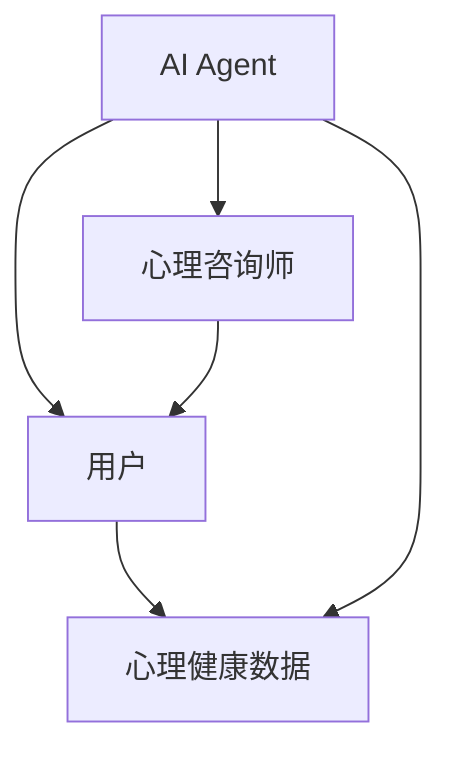
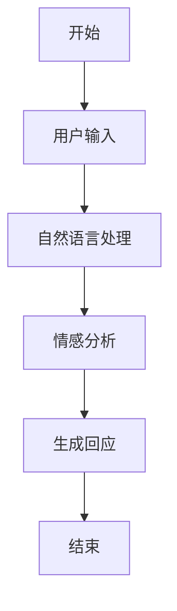

                 


# AI Agent在心理健康咨询中的应用

## 关键词：
AI Agent, 心理健康咨询, 自然语言处理, 机器学习, 情感分析, 系统架构, 项目实战

## 摘要：
本文系统地探讨了AI Agent在心理健康咨询中的应用，从理论背景、核心概念到算法原理、系统架构，再到项目实战，全面解析了AI Agent如何在心理健康咨询领域发挥其独特的优势。通过详细的技术分析和实际案例，本文展示了AI Agent在心理健康咨询中的潜力和实际应用价值，同时探讨了其面临的挑战和未来的发展方向。

---

## 目录

### 第一部分: AI Agent在心理健康咨询中的背景与核心概念

#### 第1章: AI Agent与心理健康咨询的背景介绍

##### 1.1 AI Agent的定义与核心概念
- 1.1.1 AI Agent的定义
- 1.1.2 心理健康咨询的基本概念
- 1.1.3 AI Agent在心理健康咨询中的结合与应用

##### 1.2 问题背景与问题描述
- 1.2.1 心理健康问题的普遍性与现状
- 1.2.2 传统心理咨询的局限性
- 1.2.3 AI Agent在心理健康咨询中的问题解决思路

##### 1.3 AI Agent在心理健康咨询中的边界与外延
- 1.3.1 AI Agent的应用范围
- 1.3.2 心理健康咨询的边界
- 1.3.3 AI Agent在心理健康咨询中的外延与扩展

##### 1.4 核心概念结构与组成要素
- 1.4.1 AI Agent的核心要素
- 1.4.2 心理健康咨询的核心要素
- 1.4.3 两者的结合与协同作用

#### 第2章: AI Agent的核心概念与联系

##### 2.1 AI Agent的核心原理
- 2.1.1 AI Agent的基本原理
- 2.1.2 AI Agent在心理健康咨询中的工作原理
- 2.1.3 AI Agent与人类心理咨询师的协同工作模式

##### 2.2 核心概念的属性特征对比
- 2.2.1 AI Agent的属性特征
- 2.2.2 心理咨询师的属性特征
- 2.2.3 两者的对比与联系

##### 2.3 ER实体关系图架构


### 第二部分: AI Agent在心理健康咨询中的算法原理

#### 第3章: AI Agent的算法原理

##### 3.1 算法原理概述
- 3.1.1 自然语言处理（NLP）的基本原理
- 3.1.2 机器学习在心理健康咨询中的应用
- 3.1.3 情感分析算法的基本原理

##### 3.2 算法流程图


##### 3.3 算法实现代码
```python
import numpy as np
from sklearn.feature_extraction.text import TfidfVectorizer
from sklearn.svm import SVC

# 示例代码：基于TF-IDF和SVM的情感分类
def preprocess(text):
    # 文本预处理
    return text.lower()

def train_classifier(X_train, y_train):
    # 特征提取
    vectorizer = TfidfVectorizer(preprocessor=preprocess)
    X_train_features = vectorizer.fit_transform(X_train)
    # 训练模型
    clf = SVC()
    clf.fit(X_train_features, y_train)
    return clf, vectorizer

# 示例数据
X_train = ["I feel really down today", "I'm excited about the future"]
y_train = ["negative", "positive"]

model, vectorizer = train_classifier(X_train, y_train)

# 预测
test_input = ["I can't stop worrying"]
test_features = vectorizer.transform([preprocess(test_input[0])])
prediction = model.predict(test_features)
print(f"预测结果: {prediction[0]}")
```

### 第三部分: AI Agent在心理健康咨询中的系统分析与架构设计

#### 第4章: 系统分析与架构设计方案

##### 4.1 问题场景介绍
- 4.1.1 用户需求分析
- 4.1.2 系统目标与范围
- 4.1.3 系统边界与接口

##### 4.2 系统功能设计
- 4.2.1 领域模型设计
  ```mermaid
  classDiagram
      class 用户 {
          id: int
          name: string
         咨询记录: list
      }
      class 心理健康数据 {
          id: int
          内容: string
          时间: datetime
      }
      class AI Agent {
          analyze_emotion(内容: string): 情绪状态
          generate_response(情绪状态: 情绪类型): string
      }
      用户 --> AI Agent
      用户 --> 心理健康数据
      AI Agent --> 心理健康数据
  ```

##### 4.3 系统架构设计
- 4.3.1 系统架构图
  ```mermaid
  graph LR
      A[用户] --> B[前端界面]
      B --> C[后端服务]
      C --> D[AI Agent模块]
      C --> E[心理健康数据库]
      D --> F[自然语言处理模块]
      D --> G[情感分析模块]
      G --> H[分类模型]
      D --> I[生成回应模块]
      I --> B
  ```

##### 4.4 系统接口设计
- 4.4.1 API接口定义
- 4.4.2 接口调用流程

##### 4.5 系统交互流程图


### 第四部分: AI Agent在心理健康咨询中的项目实战

#### 第5章: 项目实战

##### 5.1 环境安装
- 5.1.1 安装Python
- 5.1.2 安装NLP库（如spaCy、NLTK）
- 5.1.3 安装机器学习库（如scikit-learn、XGBoost）

##### 5.2 核心代码实现
- 5.2.1 心理咨询对话数据集的准备
- 5.2.2 情感分析模型的训练
- 5.2.3 自然语言生成模块的实现

##### 5.3 代码实现示例
```python
import spacy

# 示例代码：情感分析模型的训练
nlp = spacy.load("en_core_web_sm")
doc = nlp("I feel really down today")
for token in doc:
    print(token.text, token.pos_, token.dep_)
```

##### 5.4 实际案例分析
- 5.4.1 案例背景
- 5.4.2 数据预处理与分析
- 5.4.3 模型训练与优化
- 5.4.4 实际对话模拟

##### 5.5 案例分析结果解读
- 5.5.1 情感分析结果
- 5.5.2 自然语言生成的效果评估
- 5.5.3 案例总结与优化建议

### 第五部分: 总结与展望

#### 第6章: 总结与展望

##### 6.1 核心内容总结
- 6.1.1 AI Agent在心理健康咨询中的应用价值
- 6.1.2 关键技术与实现方法
- 6.1.3 系统设计与实现要点

##### 6.2 问题与挑战
- 6.2.1 数据隐私与伦理问题
- 6.2.2 情感分析的准确性问题
- 6.2.3 自然语言生成的可解释性问题

##### 6.3 未来发展方向
- 6.3.1 更先进的NLP技术应用
- 6.3.2 结合可穿戴设备的实时监测
- 6.3.3 多模态数据的融合分析

#### 第7章: 最佳实践 tips

##### 7.1 开发与使用中的注意事项
- 7.1.1 数据隐私保护
- 7.1.2 系统可扩展性设计
- 7.1.3 用户体验优化

##### 7.2 小结
- 7.2.1 本文的核心观点
- 7.2.2 对未来研究与实践的建议

##### 7.3 注意事项
- 7.3.1 技术局限性
- 7.3.2 实际应用中的伦理问题

##### 7.4 拓展阅读
- 7.4.1 推荐的学术论文
- 7.4.2 相关技术书籍

---

## 本文通过以上目录结构，详细阐述了AI Agent在心理健康咨询中的应用，从理论到实践，从算法到系统，层层深入，为读者提供了全面的知识体系和实践指南。

