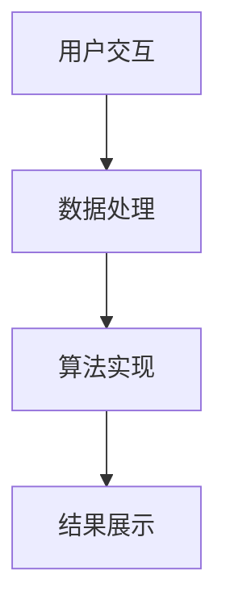

                 


# AI Agent在教育领域的创新应用

## 关键词：
AI Agent, 教育领域, 智能教育系统, 自适应学习, 教育智能化

## 摘要：
本文探讨了AI Agent在教育领域的创新应用，从背景、核心概念到算法原理、系统架构，再到项目实战，全面分析了AI Agent如何通过智能技术实现个性化学习、资源优化和教学效果提升。文章结合实际案例，详细讲解了AI Agent在教育中的具体应用场景和技术实现，为教育智能化提供了理论支持和实践指导。

---

# 第一部分: AI Agent在教育领域的背景与核心概念

## 第1章: AI Agent与教育的结合

### 1.1 AI Agent的基本概念
#### 1.1.1 AI Agent的定义
AI Agent（人工智能代理）是指能够感知环境并采取行动以实现目标的智能体。在教育领域，AI Agent通常表现为智能辅导系统、自适应学习平台等，能够根据学习者的行为和反馈动态调整教学策略。

#### 1.1.2 AI Agent的核心特征
- **自主性**：能够独立决策和行动。
- **反应性**：能够实时感知环境并做出反应。
- **目标导向**：所有行动都以实现特定目标为导向。
- **学习能力**：能够通过经验不断优化自身行为。

#### 1.1.3 AI Agent与传统教育工具的对比
| 特性          | AI Agent                      | 传统教育工具                  |
|---------------|-------------------------------|------------------------------|
| 个性化        | 高                          | 低                          |
| 互动性        | 高                          | 低                          |
| 自适应能力    | 高                          | 低                          |
| 数据处理能力  | 强大                        | 有限                        |

### 1.2 教育领域的AI Agent应用场景
#### 1.2.1 智能辅导系统
AI Agent可以实时分析学习者的错误并提供个性化的反馈和建议，帮助学习者更好地理解和掌握知识。

#### 1.2.2 自适应学习平台
通过AI Agent的推荐算法，学习者可以根据自己的学习进度和兴趣获得个性化的学习内容和路径。

#### 1.2.3 教学管理与评估系统
AI Agent可以帮助教师分析学生的学习数据，生成评估报告，并提供教学改进建议。

### 1.3 AI Agent在教育中的价值
#### 1.3.1 提高学习效率
通过个性化推荐和实时反馈，AI Agent能够帮助学习者更高效地掌握知识。

#### 1.3.2 个性化学习体验
AI Agent能够根据学习者的特点和需求，提供个性化的学习方案，满足不同学习者的需求。

#### 1.3.3 教学资源优化
AI Agent可以帮助教师更好地管理教学资源，优化教学流程，提高教学效果。

---

## 第2章: 教育领域的AI Agent技术基础

### 2.1 知识图谱构建
#### 2.1.1 知识图谱的定义与作用
知识图谱是一种用于表示知识的结构化数据，能够帮助AI Agent更好地理解和组织知识。

#### 2.1.2 知识图谱在教育中的应用
- **智能问答**：通过知识图谱实现准确的知识检索和回答。
- **学习路径推荐**：根据知识图谱推荐合适的学习内容和路径。

#### 2.1.3 知识图谱的构建流程
1. 数据收集：从多种来源收集教育相关数据。
2. 数据清洗：去除噪声数据，确保数据质量。
3. 知识抽取：从文本中提取关键信息。
4. 知识融合：将不同来源的知识整合到一个统一的知识图谱中。
5. 知识存储：将知识图谱存储到数据库中，便于后续使用。

### 2.2 自然语言处理技术
#### 2.2.1 NLP在教育中的应用
- **智能问答**：通过NLP技术实现自然语言理解，帮助学习者快速获取所需知识。
- **情感分析**：分析学习者的反馈，优化教学策略。

#### 2.2.2 常用NLP模型
- **BERT**：一种基于Transformer的预训练语言模型，适用于问答系统和文本分类。
- **GPT**：生成式预训练模型，可以用于自动生成学习内容和提供反馈。

#### 2.2.3 NLP技术在智能问答中的实现
通过NLP技术，AI Agent可以理解学习者的问题，并根据知识图谱提供准确的回答。例如，学习者问“什么是量子计算？”AI Agent可以解析问题，提取关键词，匹配知识图谱中的相关信息，并生成回答。

### 2.3 机器学习与深度学习
#### 2.3.1 机器学习在教育中的应用
- **学习者分群**：通过机器学习算法将学习者分为不同的群体，制定个性化的学习计划。
- **成绩预测**：通过机器学习模型预测学习者的学习成绩，帮助教师提前采取干预措施。

#### 2.3.2 深度学习模型在教育中的优势
- **非线性特征提取**：深度学习模型能够自动提取数据的非线性特征，无需手动特征工程。
- **高精度预测**：深度学习模型在处理复杂任务时表现更为优异。

#### 2.3.3 常见机器学习算法
- **决策树**：通过构建决策树模型，帮助教师分析学习者的学习路径。
- **随机森林**：通过集成多个决策树模型，提高预测的准确性和稳定性。

---

## 第3章: AI Agent的核心算法与数学模型

### 3.1 推荐系统算法
#### 3.1.1 基于协同过滤的推荐算法
协同过滤是一种常见的推荐算法，通过分析用户的行为和偏好，推荐相似的用户喜欢的内容。其数学模型如下：

$$
\hat{r}_{u,i} = \bar{r} + \sum_{j \in N(u)} w_{u,j}(r_{j,i} - \bar{r})
$$

其中，$\hat{r}_{u,i}$是用户u对物品i的预测评分，$\bar{r}$是全局平均评分，$N(u)$是用户u的邻居集合，$w_{u,j}$是用户u和用户j之间的相似度。

#### 3.1.2 基于内容的推荐算法
基于内容的推荐算法通过分析物品本身的特征，推荐与当前物品相似的内容。其数学模型如下：

$$
sim(i, j) = \frac{\sum_{k} w_k (f_{i,k} - f_{j,k})^2}{\sqrt{\sum_{k} w_k^2 (f_{i,k} - \mu_k)^2} \cdot \sqrt{\sum_{k} w_k^2 (f_{j,k} - \mu_k)^2}}}
$$

其中，$sim(i, j)$是物品i和物品j之间的相似度，$f_{i,k}$是物品i的第k个特征值，$\mu_k$是第k个特征的均值，$w_k$是特征k的权重。

#### 3.1.3 混合推荐算法
混合推荐算法结合了协同过滤和基于内容的推荐算法，通过集成多个推荐算法的结果，提高推荐的准确性和多样性。

### 3.2 强化学习算法
#### 3.2.1 Q-learning算法
Q-learning是一种经典的强化学习算法，通过学习状态-动作价值函数，实现最优决策。其数学模型如下：

$$
Q(s, a) = Q(s, a) + \alpha \left( r + \gamma \max_{a'} Q(s', a') - Q(s, a) \right)
$$

其中，$Q(s, a)$是当前状态s和动作a的Q值，$\alpha$是学习率，$r$是奖励，$\gamma$是折扣因子，$s'$是下一个状态。

#### 3.2.2 Deep Q-Networks（DQN）算法
DQN算法通过使用深度神经网络近似Q值函数，扩展了Q-learning算法的应用范围。其核心思想是将Q值函数表示为深度神经网络，并通过经验回放和目标网络来优化模型。

#### 3.2.3 强化学习在教育中的应用案例
例如，在自适应学习平台中，AI Agent可以通过强化学习算法，根据学习者的行为和反馈，动态调整推荐的学习内容和路径。

### 3.3 聚类算法
#### 3.3.1 K-means算法
K-means算法是一种经典的聚类算法，通过将数据划分为K个簇，实现数据的无监督学习。其数学模型如下：

$$
\text{目标函数} = \sum_{i=1}^{K} \sum_{j \in C_i} (x_j - \mu_i)^2
$$

其中，$C_i$是第i个簇，$\mu_i$是簇的中心，$x_j$是簇中的数据点。

#### 3.3.2 层次聚类算法
层次聚类是一种通过构建层次化的簇结构，实现数据聚类的算法。其主要步骤包括：计算数据点之间的距离，根据距离进行聚类，最终形成树状结构。

#### 3.3.3 聚类算法在学习者分群中的应用
通过聚类算法，AI Agent可以将学习者划分为不同的群体，制定个性化的学习计划。

---

## 第4章: 系统架构与设计

### 4.1 教育AI Agent系统的总体架构
教育AI Agent系统的总体架构包括以下几个模块：
- **用户交互模块**：负责与学习者和教师进行交互。
- **数据处理模块**：负责处理和存储学习者数据。
- **算法实现模块**：负责执行推荐、聚类等算法。
- **结果展示模块**：负责将算法结果以用户友好的方式展示。

### 4.2 系统功能设计
教育AI Agent系统的功能设计包括以下几个方面：
- **智能问答**：支持学习者通过自然语言提问，并提供准确的回答。
- **学习路径推荐**：根据学习者的学习目标和兴趣，推荐合适的学习内容。
- **教学评估**：分析学习者的学习数据，生成评估报告。

### 4.3 系统架构设计
教育AI Agent系统的架构设计如下：



### 4.4 系统接口设计
系统接口设计包括：
- **API接口**：用于与其他系统进行数据交互。
- **用户界面**：用于与用户进行交互。

### 4.5 系统交互设计
系统交互设计包括：
- **用户登录与注册**：用户需要登录或注册后才能使用系统。
- **学习计划制定**：学习者根据系统推荐的学习内容制定学习计划。
- **学习进度跟踪**：系统实时跟踪学习者的学习进度，并提供反馈和建议。

---

## 第5章: 项目实战与案例分析

### 5.1 环境安装
项目实战需要安装以下工具和库：
- **Python**：用于编写代码。
- **TensorFlow**：用于深度学习模型的实现。
- **NLTK**：用于自然语言处理。
- **Networkx**：用于知识图谱的构建。

### 5.2 核心代码实现
#### 5.2.1 推荐系统实现
以下是一个基于协同过滤的推荐系统实现示例：

```python
import numpy as np

def collaborative_filtering(train_data, test_data):
    # 计算用户相似度
    user_similarity = np.dot(train_data.T, train_data)
    # 根据相似度推荐
    recommendations = np.dot(user_similarity, test_data)
    return recommendations

# 示例数据
train_data = np.array([[4, 3, 0], [2, 0, 4], [1, 5, 2]])
test_data = np.array([[0, 4, 0], [3, 0, 5], [0, 2, 3]])

# 调用函数
recommendations = collaborative_filtering(train_data, test_data)
print(recommendations)
```

#### 5.2.2 知识图谱构建
以下是一个简单的知识图谱构建示例：

```python
import networkx as nx

# 创建知识图谱
G = nx.Graph()
G.add_node("量子计算")
G.add_node("量子位")
G.add_node("量子叠加")
G.add_edge("量子计算", "量子位")
G.add_edge("量子计算", "量子叠加")

# 可视化
nx.draw(G, labels={node: node for node in G.nodes()})
plt.show()
```

### 5.3 案例分析
以自适应学习平台为例，详细分析其设计和实现过程。通过实际案例，展示AI Agent在教育中的具体应用和效果。

### 5.4 项目小结
总结项目实现的关键点和经验教训，分析项目的优缺点，并展望未来的发展方向。

---

## 第6章: 总结与展望

### 6.1 总结
本文详细探讨了AI Agent在教育领域的创新应用，从理论到实践，全面分析了AI Agent在教育中的价值和实现方式。

### 6.2 展望
未来，随着AI技术的不断发展，AI Agent在教育中的应用将更加广泛和深入。例如，通过多模态交互技术，AI Agent可以更好地理解学习者的情感和需求，提供更加个性化的学习体验。

---

以上是《AI Agent在教育领域的创新应用》的文章结构和内容概要。通过系统的分析和详细的讲解，本文旨在为教育智能化提供理论支持和实践指导。

