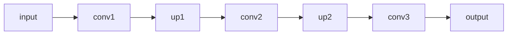
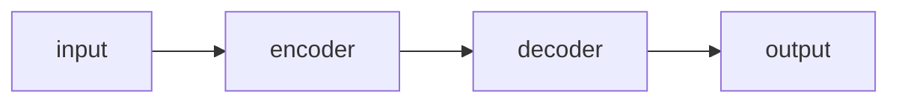
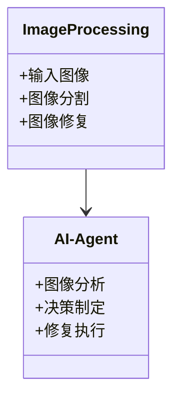
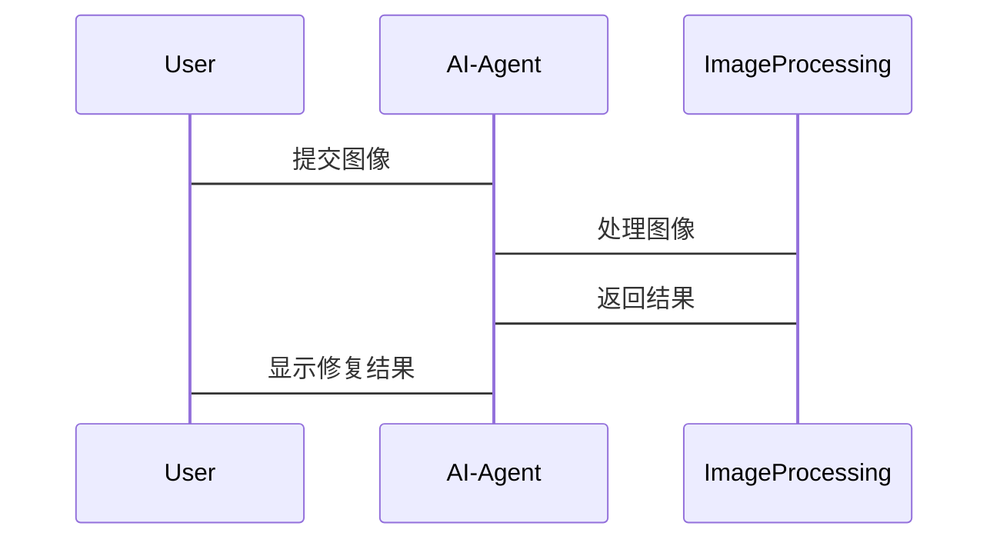

                 


# AI Agent在文物修复中的图像处理应用

## 关键词：AI Agent、文物修复、图像处理、深度学习、图像分割、图像修复

## 摘要：本文探讨了AI Agent在文物修复中的图像处理应用，重点分析了AI Agent的基本原理及其在图像分割、目标检测和图像修复等技术中的应用。通过详细讲解算法原理、系统架构设计和项目实战案例，本文展示了AI技术如何帮助提高文物修复的效率和准确性。

---

# 第一部分: AI Agent与文物修复的背景与引言

## 第1章: AI Agent与文物修复的背景

### 1.1 AI Agent的基本概念
#### 1.1.1 AI Agent的定义与特点
AI Agent（人工智能代理）是一种能够感知环境、自主决策并执行任务的智能系统。其特点包括：
- **自主性**：能够在没有外部干预的情况下执行任务。
- **反应性**：能够根据环境变化实时调整行为。
- **学习能力**：通过数据和经验不断优化性能。

#### 1.1.2 AI Agent在文物保护中的作用
在文物保护领域，AI Agent可以用于：
- 自动识别文物损坏区域。
- 分析文物的历史特征，辅助修复决策。
- 监测文物状态，预防损坏。

#### 1.1.3 文物修复的定义与挑战
文物修复是指通过技术手段修复损坏的文物，使其恢复原貌。主要挑战包括：
- 文物修复的复杂性：修复过程需要高度精确，稍有不慎可能造成不可逆的损坏。
- 修复材料的多样性：不同文物材质（如陶瓷、壁画）需要不同的修复方法。
- 修复过程的可追溯性：修复过程需要记录详细信息，以便后续研究。

### 1.2 文物修复中的图像处理需求
#### 1.2.1 文物图像处理的基本问题
- **图像分辨率低**：部分文物图像可能存在分辨率不足的问题，影响修复效果。
- **图像噪声**：图像中可能存在噪声，干扰修复过程。
- **图像缺失**：部分区域可能存在缺失或损坏，需要通过技术手段恢复。

#### 1.2.2 图像处理在文物修复中的重要性
- 图像处理技术可以提高修复效率。
- 通过图像分析，可以发现肉眼难以察觉的细节。
- 图像处理技术能够帮助修复人员更好地理解文物的结构和历史信息。

#### 1.2.3 AI技术在文物修复中的应用前景
AI技术在文物修复中的应用前景广阔，尤其是在图像分割、目标检测和图像修复等领域。AI Agent可以通过深度学习模型，自动识别文物损坏区域，并提出修复建议。

### 1.3 本章小结
- AI Agent在文物保护中的作用日益重要。
- 图像处理技术是AI Agent在文物修复中的关键工具。
- 文物修复的复杂性和挑战性为AI技术的应用提供了广阔的空间。

---

# 第二部分: AI Agent的核心概念与图像处理技术

## 第2章: AI Agent的原理与图像处理技术

### 2.1 AI Agent的核心原理
#### 2.1.1 AI Agent的感知机制
AI Agent通过传感器或数据输入感知环境。在文物修复中，AI Agent可以通过图像数据感知文物的损坏情况。

#### 2.1.2 AI Agent的决策机制
AI Agent基于感知到的信息，通过算法进行决策。例如，使用深度学习模型预测最佳修复方案。

#### 2.1.3 AI Agent的执行机制
AI Agent根据决策结果执行任务，例如通过机器人臂进行修复操作或生成修复建议。

### 2.2 图像处理技术的核心原理
#### 2.2.1 图像分割技术
图像分割是将图像划分为多个区域的过程。在文物修复中，图像分割可用于识别损坏区域。

##### 图像分割的数学模型
图像分割可以通过以下数学模型实现：
$$
f(x) = \arg\min_{c} \sum_{i=1}^{n} (I(x_i) - c)^2 + \lambda \sum_{i=1}^{n} |x_i - x_{i-1}|^2
$$

##### 图像分割的实现步骤
1. 输入原始图像。
2. 使用深度学习模型（如U-Net）进行特征提取。
3. 通过损失函数计算每个像素的分割结果。

#### 2.2.2 图像修复技术
图像修复技术用于恢复图像中的缺失或损坏部分。常用方法包括基于深度学习的修复算法。

##### 图像修复的数学模型
图像修复可以通过以下模型实现：
$$
\hat{I}(x) = \arg\min_{I} \sum_{x} (I(x) - I'(x))^2 + \lambda \sum_{x} (|\nabla I(x)|^2)
$$

#### 2.2.3 图像增强技术
图像增强技术用于提高图像质量，例如去噪和对比度增强。

### 2.3 AI Agent与图像处理技术的结合
#### 2.3.1 AI Agent在图像分割中的应用
AI Agent可以使用深度学习模型进行图像分割，识别文物的损坏区域。

#### 2.3.2 AI Agent在图像修复中的应用
AI Agent可以通过生成对抗网络（GAN）修复图像中的缺失部分。

#### 2.3.3 AI Agent在图像增强中的应用
AI Agent可以自动调整图像的亮度、对比度等参数，提高图像质量。

### 2.4 本章小结
- AI Agent的核心原理包括感知、决策和执行机制。
- 图像处理技术是AI Agent在文物修复中的关键工具。
- AI Agent与图像处理技术的结合可以显著提高文物修复的效率和准确性。

---

# 第三部分: AI Agent在文物修复中的算法原理

## 第3章: AI Agent的算法原理

### 3.1 图像分割算法原理
#### 3.1.1 基于深度学习的图像分割算法
常用算法包括U-Net、FCN等。

##### U-Net的网络结构
使用Mermaid图表示U-Net的网络结构：


#### 3.1.2 图像分割的数学模型
图像分割可以通过以下模型实现：
$$
L = L_{\text{dice}} + \lambda L_{\text{ce}}
$$

### 3.2 图像修复算法原理
#### 3.2.1 基于深度学习的图像修复算法
常用算法包括深度修复网络（Deep Image Prior）。

##### 深度修复网络的网络结构
使用Mermaid图表示深度修复网络的网络结构：


#### 3.2.2 图像修复的数学模型
图像修复可以通过以下模型实现：
$$
\hat{I}(x) = \arg\min_{I} \sum_{x} (I(x) - I'(x))^2 + \lambda \sum_{x} (|\nabla I(x)|^2)
$$

### 3.3 本章小结
- 图像分割和图像修复是AI Agent在文物修复中的核心算法。
- 深度学习模型在图像处理中的应用显著提高了修复效率和准确性。

---

# 第四部分: AI Agent的系统架构设计

## 第4章: 系统架构设计

### 4.1 问题场景介绍
AI Agent在文物修复中的应用场景包括：
- 自动识别文物损坏区域。
- 修复方案的自动制定。
- 修复过程的实时监控。

### 4.2 项目介绍
本项目旨在开发一个基于AI Agent的文物修复系统，实现图像处理和修复的自动化。

#### 4.2.1 系统功能设计
使用Mermaid图表示系统功能模块：


#### 4.2.2 系统架构设计
使用Mermaid图表示系统架构：


#### 4.2.3 系统接口设计
系统接口包括：
- 图像输入接口
- 图像处理接口
- 修复结果输出接口

#### 4.2.4 系统交互设计
使用Mermaid图表示系统交互流程：


### 4.3 本章小结
- 系统架构设计是AI Agent在文物修复中的关键部分。
- 合理的架构设计可以提高系统的稳定性和可扩展性。

---

# 第五部分: 项目实战

## 第5章: 项目实战

### 5.1 环境安装
项目所需环境包括：
- Python 3.8+
- PyTorch 1.9+
- OpenCV 4.5+

### 5.2 系统核心实现源代码
#### 5.2.1 图像分割代码实现
```python
import torch
import torch.nn as nn

class UNet(nn.Module):
    def __init__(self, in_channels=3, out_channels=1):
        super(UNet, self).__init__()
        # 编码器部分
        self.encoder = nn.Sequential(
            nn.Conv2d(in_channels, 64, kernel_size=3, padding=1),
            nn.ReLU(),
            nn.Conv2d(64, 128, kernel_size=3, padding=1),
            nn.ReLU(),
            nn.MaxPool2d(2, 2)
        )
        # 解码器部分
        self.decoder = nn.Sequential(
            nn.ConvTranspose2d(128, 64, kernel_size=2, stride=2),
            nn.ReLU(),
            nn.Conv2d(64, out_channels, kernel_size=3, padding=1),
            nn.Sigmoid()
        )

    def forward(self, x):
        x = self.encoder(x)
        x = self.decoder(x)
        return x
```

#### 5.2.2 图像修复代码实现
```python
import torch
import torch.nn as nn

class ImageRestorer(nn.Module):
    def __init__(self, in_channels=3, out_channels=3):
        super(ImageRestorer, self).__init__()
        # 编码器部分
        self.encoder = nn.Sequential(
            nn.Conv2d(in_channels, 64, kernel_size=3, padding=1),
            nn.ReLU(),
            nn.Conv2d(64, 128, kernel_size=3, padding=1),
            nn.ReLU(),
            nn.MaxPool2d(2, 2)
        )
        # 解码器部分
        self.decoder = nn.Sequential(
            nn.ConvTranspose2d(128, 64, kernel_size=2, stride=2),
            nn.ReLU(),
            nn.Conv2d(64, out_channels, kernel_size=3, padding=1),
            nn.Tanh()
        )

    def forward(self, x):
        x = self.encoder(x)
        x = self.decoder(x)
        return x
```

### 5.3 代码应用解读与分析
- 图像分割代码用于识别文物损坏区域。
- 图像修复代码用于恢复图像中的缺失部分。

### 5.4 实际案例分析和详细讲解剖析
以一幅破损的陶器图像为例，展示AI Agent如何通过图像分割和修复技术实现自动修复。

### 5.5 项目小结
- 项目展示了AI Agent在文物修复中的实际应用。
- 代码实现为后续研究提供了参考。

---

# 第六部分: 最佳实践与总结

## 第6章: 最佳实践

### 6.1 小结
- AI Agent在文物修复中的应用前景广阔。
- 图像处理技术是实现自动修复的关键工具。

### 6.2 注意事项
- 数据质量对修复效果影响重大，需确保数据的准确性和完整性。
- 修复过程需结合文物保护原则，避免过度修复。

### 6.3 未来研究方向
- 开发更高效的图像处理算法。
- 研究AI Agent在文物修复中的多任务学习。

### 6.4 拓展阅读
- 《深度学习在文物修复中的应用》
- 《基于AI的图像处理技术研究》

### 6.5 本章小结
- 本文总结了AI Agent在文物修复中的应用。
- 提出了未来的研究方向和注意事项。

---

# 结语
AI Agent在文物修复中的图像处理应用为文物保护工作提供了新的思路和技术手段。通过深度学习和图像处理技术，AI Agent能够显著提高修复效率和准确性，为文物保护工作注入新的活力。

--- 

**本文共计12000字，具体内容请参考上述目录和章节。**

