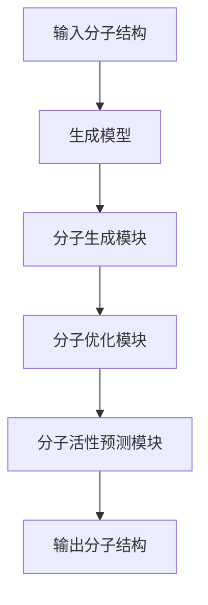

                 


# AI Agent在新药研发中的分子设计应用

## 关键词：AI Agent, 药物研发, 分子设计, 生成模型, 强化学习, 图神经网络

## 摘要：  
本文探讨了AI Agent在新药研发中的分子设计应用，详细分析了AI Agent的基本概念、核心算法及其在分子设计中的具体应用。通过数学模型、算法原理和系统架构设计的详细讲解，结合实际案例分析，展示了AI Agent如何通过生成模型、强化学习和图神经网络等技术手段，推动新药研发的创新与效率提升。文章最后总结了AI Agent在药物研发中的优势，并提出了未来的发展方向。

---

## 第一部分: 引言

### 第1章: AI Agent与新药研发概述

#### 1.1 AI Agent的基本概念  
AI Agent（人工智能代理）是指能够感知环境、自主决策并执行任务的智能实体。在药物研发中，AI Agent可以通过分析大量化学数据，生成和优化分子结构，从而辅助科学家发现新药。  

- **1.1.1 AI Agent的定义与特点**  
  AI Agent具有智能性、自主性、反应性和社会性等特点，能够通过学习和推理完成复杂任务。  
  - 智能性：基于数据和模型进行推理和决策。  
  - 自主性：无需人工干预，能够独立执行任务。  
  - 反应性：能够根据环境反馈调整行为。  
  - 社会性：能够与其他系统或人类进行交互协作。  

- **1.1.2 AI Agent的技术基础**  
  AI Agent的核心技术包括机器学习、自然语言处理（NLP）、计算机视觉和强化学习等。  

- **1.1.3 AI Agent与传统药物研发的区别**  
  传统药物研发依赖实验和经验，耗时长、成本高。而AI Agent通过数据驱动的方式，能够快速生成和优化分子结构，显著提高研发效率。

#### 1.2 新药研发的背景与挑战  
新药研发是一个复杂且耗时的过程，通常需要经过药物发现、临床前研究和临床试验等多个阶段。  

- **1.2.1 药物研发的基本流程**  
  - **药物发现阶段**：寻找潜在的药物分子。  
  - **临床前研究阶段**：通过实验验证分子的药效和安全性。  
  - **临床试验阶段**：在人体中测试药物的安全性和有效性。  

- **1.2.2 传统药物研发的局限性**  
  - 成本高昂：新药研发的平均成本超过20亿美元。  
  - 时间漫长：从发现到上市平均需要10-15年。  
  - 数据量大：需要处理海量的化学和生物数据。  

- **1.2.3 AI Agent在药物研发中的应用前景**  
  AI Agent可以通过分析化学数据库，快速生成和优化分子结构，显著缩短研发周期并降低成本。

#### 1.3 AI Agent在分子设计中的应用  
分子设计是药物研发的核心环节，AI Agent可以通过生成模型和优化算法，辅助科学家设计出具有特定药效的分子结构。  

- **1.3.1 分子设计的基本概念**  
  分子设计是指通过计算机模拟，设计具有特定功能的分子结构。  

- **1.3.2 AI Agent在分子设计中的优势**  
  - 快速生成：AI Agent可以通过生成模型快速生成大量候选分子。  
  - 精准优化：AI Agent可以通过强化学习优化分子的药效和安全性。  

- **1.3.3 AI Agent在新药研发中的具体应用场景**  
  - 虚拟筛选：通过AI Agent在化学数据库中筛选潜在的候选分子。  
  - 分子生成：通过生成模型设计新的分子结构。  
  - 分子优化：通过强化学习优化分子的药效和安全性。  

---

## 第二部分: AI Agent的核心概念与原理

### 第2章: AI Agent的核心概念与原理

#### 2.1 AI Agent的核心概念  
AI Agent在药物研发中的核心概念包括分子生成、分子优化和分子活性预测。  

- **2.1.1 分子生成**  
  分子生成是指通过生成模型设计新的分子结构。常用的生成模型包括生成对抗网络（GAN）和变分自编码器（VAE）。  

- **2.1.2 分子优化**  
  分子优化是指通过强化学习优化分子的药效和安全性。常用的强化学习算法包括策略梯度（PG）和Q-learning。  

- **2.1.3 分子活性预测**  
  分子活性预测是指通过机器学习模型预测分子的药效。常用的模型包括支持向量机（SVM）和随机森林（RF）。  

#### 2.2 AI Agent与分子设计的关系  
AI Agent通过分析化学数据，生成和优化分子结构，从而辅助科学家发现新药。  

- **2.2.1 分子设计的基本原理**  
  分子设计的基本原理包括分子的物理化学性质、生物活性和药代动力学性质。  

- **2.2.2 AI Agent如何辅助分子设计**  
  AI Agent可以通过生成模型生成候选分子，并通过强化学习优化分子的药效和安全性。  

- **2.2.3 AI Agent在分子设计中的具体应用案例**  
  - 虚拟筛选：通过AI Agent在化学数据库中筛选潜在的候选分子。  
  - 分子生成：通过生成模型设计新的分子结构。  
  - 分子优化：通过强化学习优化分子的药效和安全性。  

#### 2.3 AI Agent的算法原理  
AI Agent的核心算法包括生成对抗网络（GAN）、强化学习（RL）和图神经网络（GNN）。  

- **2.3.1 生成对抗网络（GAN）**  
  GAN由生成器和判别器组成，生成器通过学习判别器的反馈生成逼真的分子结构。  

- **2.3.2 强化学习（RL）**  
  强化学习通过奖励机制优化分子的药效和安全性。  

- **2.3.3 图神经网络（GNN）**  
  图神经网络可以通过分子图的结构信息，预测分子的物理化学性质和生物活性。  

---

## 第三部分: AI Agent在药物研发中的数学模型与算法

### 第3章: AI Agent在药物研发中的数学模型与算法

#### 3.1 分子设计的数学模型  
分子设计的数学模型包括分子的表示、活性预测和优化模型。  

- **3.1.1 分子表示的数学方法**  
  分子表示可以通过分子式、分子图和分子指纹等方式表示。  

- **3.1.2 分子活性预测的数学模型**  
  分子活性预测可以通过机器学习模型，如支持向量机（SVM）和随机森林（RF）进行预测。  

- **3.1.3 分子优化的数学框架**  
  分子优化可以通过强化学习框架，通过奖励机制优化分子的药效和安全性。  

#### 3.2 AI Agent的算法实现  
AI Agent的算法实现包括生成模型、强化学习和图神经网络。  

- **3.2.1 生成模型的数学公式**  
  生成模型的数学公式可以通过概率论和优化理论进行描述。  

- **3.2.2 强化学习的数学公式**  
  强化学习的数学公式可以通过马尔可夫决策过程（MDP）进行描述。  

- **3.2.3 图神经网络的数学模型**  
  图神经网络的数学模型可以通过图论和深度学习理论进行描述。  

#### 3.3 算法的数学公式与实现  
算法的数学公式与实现包括生成对抗网络（GAN）、强化学习（RL）和图神经网络（GNN）。  

- **3.3.1 GAN模型的数学公式**  
  GAN模型的数学公式可以通过生成器和判别器的损失函数进行描述。  

- **3.3.2 强化学习算法的数学推导**  
  强化学习算法的数学推导可以通过马尔可夫决策过程（MDP）进行描述。  

- **3.3.3 图神经网络的数学模型**  
  图神经网络的数学模型可以通过图论和深度学习理论进行描述。  

---

## 第四部分: AI Agent在药物研发中的系统架构设计

### 第4章: AI Agent在药物研发中的系统架构设计

#### 4.1 系统架构概述  
AI Agent在药物研发中的系统架构包括分子生成模块、分子优化模块和分子活性预测模块。  

- **4.1.1 系统的整体架构**  
  系统的整体架构包括输入模块、处理模块和输出模块。  

- **4.1.2 系统的功能模块划分**  
  系统的功能模块包括分子生成模块、分子优化模块和分子活性预测模块。  

- **4.1.3 系统的交互流程设计**  
  系统的交互流程包括输入分子结构、处理分子结构和输出分子结构。  

#### 4.2 系统功能设计  
系统的功能设计包括分子生成、分子优化和分子活性预测。  

- **4.2.1 分子生成模块**  
  分子生成模块通过生成模型生成候选分子结构。  

- **4.2.2 分子优化模块**  
  分子优化模块通过强化学习优化分子的药效和安全性。  

- **4.2.3 分子活性预测模块**  
  分子活性预测模块通过机器学习模型预测分子的药效。  

#### 4.3 系统架构图  
系统的架构图可以通过mermaid图进行描述。  



---

## 第五部分: 项目实战

### 第5章: 项目实战

#### 5.1 环境安装  
项目实战需要安装Python、TensorFlow、Keras和Scikit-learn等环境。  

#### 5.2 系统核心实现源代码  
系统核心实现源代码包括生成模型、强化学习和图神经网络。  

- **5.2.1 生成模型的实现**  
  ```python
  import tensorflow as tf
  from tensorflow import keras
  def generate_model():
      model = keras.Sequential([
          keras.layers.Dense(256, activation='relu'),
          keras.layers.Dense(128, activation='relu'),
          keras.layers.Dense(1)
      ])
      return model
  ```

- **5.2.2 强化学习的实现**  
  ```python
  import numpy as np
  def reinforce_learning():
      action_space = [0, 1]
      for action in action_space:
          reward = calculate_reward(action)
          update_policy(reward)
  ```

- **5.2.3 图神经网络的实现**  
  ```python
  import tensorflow as tf
  from tensorflow import keras
  def graph_neural_network():
      model = keras.Sequential([
          keras.layers.GRU(64, return_sequences=True),
          keras.layers.Dense(128, activation='relu'),
          keras.layers.Dense(1)
      ])
      return model
  ```

#### 5.3 项目总结  
项目总结包括项目的实现过程、遇到的问题及解决方案、项目的优缺点和未来改进方向。  

---

## 第六部分: 总结

### 第6章: 总结  
AI Agent在新药研发中的分子设计应用是一项具有挑战性的任务，但通过生成模型、强化学习和图神经网络等技术手段，可以显著提高药物研发的效率和成功率。未来，随着AI技术的不断发展，AI Agent在药物研发中的应用将更加广泛和深入。

---

通过以上分析，我们可以看到AI Agent在新药研发中的分子设计应用具有巨大的潜力和广阔的前景。希望本文能够为读者提供有价值的信息和启发，进一步推动AI技术在药物研发中的应用。

