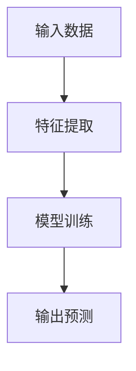
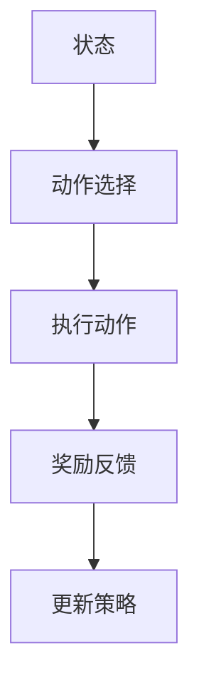
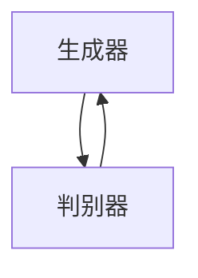

                 


# AI Agent在新药研发中的应用实践

> 关键词：AI Agent, 新药研发, 药物发现, 强化学习, 生成对抗网络, 药物分子设计

> 摘要：本文深入探讨了AI Agent在新药研发中的应用，从理论到实践，结合具体案例和算法原理，详细分析了AI Agent在药物发现、疾病机制研究和临床试验优化中的作用，展示了其在提高研发效率和精准度方面的巨大潜力。

---

# 第1章 AI Agent与新药研发概述

## 1.1 AI Agent的基本概念

### 1.1.1 什么是AI Agent
AI Agent（人工智能代理）是指能够感知环境、自主决策并采取行动以实现特定目标的智能系统。与传统AI不同，AI Agent具备更强的适应性和主动性，能够根据反馈不断优化行为。

### 1.1.2 AI Agent的核心特征
- **自主性**：能够在没有外部干预的情况下独立运作。
- **反应性**：能够实时感知环境变化并做出响应。
- **目标导向性**：所有行为都围绕实现特定目标展开。
- **学习能力**：通过经验或数据不断优化性能。

### 1.1.3 AI Agent与传统计算的区别
| 特性             | 传统计算         | AI Agent       |
|------------------|------------------|----------------|
| 行为驱动         | 任务驱动         | 目标驱动         |
| 适应性           | 固定逻辑         | 自适应学习       |
| 决策方式         | 确定性规则       | 概率性决策       |

## 1.2 新药研发的挑战与需求

### 1.2.1 新药研发的复杂性
- **高成本**：从发现到上市平均成本超过20亿美元。
- **长周期**：通常需要10-15年时间。
- **低成功率**：临床试验失败率高达95%。

### 1.2.2 传统药物研发的痛点
- **数据爆炸**：每天产生的数据量巨大，难以处理。
- **效率低下**：人工筛选化合物效率低，周期长。
- **精准性不足**：传统方法难以预测药物的复杂作用机制。

### 1.2.3 AI技术在药物研发中的潜力
- **加速化合物筛选**：通过机器学习快速预测潜在药物分子。
- **优化临床试验设计**：利用AI分析患者数据，优化试验方案。
- **降低研发成本**：通过虚拟实验减少实际实验次数。

---

# 第2章 AI Agent在新药研发中的应用背景

## 2.1 药物研发的流程

### 2.1.1 药物发现阶段
- **目标识别**：识别疾病相关靶点。
- **化合物筛选**：从大量化合物中筛选潜在药物。

### 2.1.2 临床前研究阶段
- **毒性测试**：评估药物的安全性。
- **药代动力学研究**：研究药物在体内的代谢过程。

### 2.1.3 临床试验阶段
- **患者招募**：筛选合适的患者群体。
- **疗效评估**：监测药物效果和副作用。

## 2.2 AI技术在药物研发中的应用领域

### 2.2.1 药物分子设计
- 利用生成模型设计新型化合物结构。
- 示例：使用生成对抗网络（GAN）生成具有特定活性的分子。

### 2.2.2 疾病机制研究
- 通过深度学习分析基因表达数据，识别疾病 biomarker。

### 2.2.3 临床试验优化
- 利用自然语言处理分析医学文献，辅助试验设计。

## 2.3 AI Agent在药物研发中的独特优势

### 2.3.1 高效的数据处理能力
- 能够快速处理和分析海量数据，提取有价值的信息。

### 2.3.2 自适应的学习能力
- 根据实时反馈调整策略，提高决策精准度。

### 2.3.3 多任务协同能力
- 可以同时处理多个任务，如数据收集、分析和决策。

---

# 第3章 AI Agent的核心概念与原理

## 3.1 AI Agent的结构与功能

### 3.1.1 感知层
- **功能**：接收和解析环境数据。
- **示例**：从电子健康记录中提取患者信息。

### 3.1.2 计划层
- **功能**：制定行动方案。
- **示例**：根据目标生成多个可能的药物分子结构。

### 3.1.3 执行层
- **功能**：执行具体任务。
- **示例**：通过模拟评估药物分子的药代动力学特性。

## 3.2 AI Agent的工作流程

### 3.2.1 数据输入与解析
- 接收原始数据，进行预处理和特征提取。

### 3.2.2 状态识别与目标设定
- 分析当前状态，设定具体目标。

### 3.2.3 行动决策与执行
- 根据当前状态和目标，生成行动计划并执行。

### 3.2.4 反馈机制与优化
- 收集反馈信息，优化模型和策略。

## 3.3 AI Agent与传统AI的区别

### 3.3.1 传统AI的特点
- **示例**：专家系统，基于规则进行决策。

### 3.3.2 AI Agent的独特性
- **目标导向性**：所有行为围绕实现目标展开。
- **自主性**：能够独立运作，无需人工干预。

---

# 第4章 AI Agent的算法原理

## 4.1 常见AI Agent算法

### 4.1.1 基于监督学习的AI Agent
- **应用**：分类任务，如疾病诊断。
- **示例**：使用随机森林算法进行疾病预测。

### 4.1.2 基于强化学习的AI Agent
- **应用**：策略优化，如游戏AI。
- **示例**：使用Deep Q-Network进行药物分子优化。

### 4.1.3 基于生成对抗网络的AI Agent
- **应用**：生成新药分子结构。
- **示例**：使用GAN生成具有特定活性的化合物。

---

## 4.2 监督学习算法原理

### 4.2.1 概念介绍
- 监督学习：通过标记数据训练模型，使其能够预测新数据的标签。

### 4.2.2 算法流程图


### 4.2.3 代码实现
```python
import tensorflow as tf
from tensorflow.keras import layers

# 数据预处理
X_train, y_train = ...

# 模型定义
model = tf.keras.Sequential([
    layers.Dense(64, activation='relu'),
    layers.Dense(1, activation='sigmoid')
])

# 模型训练
model.compile(optimizer='adam', loss='binary_crossentropy')
model.fit(X_train, y_train, epochs=10, batch_size=32)
```

---

## 4.3 强化学习算法原理

### 4.3.1 概念介绍
- 强化学习：通过试错机制，学习最优策略。

### 4.3.2 算法流程图


### 4.3.3 代码实现
```python
import numpy as np

# 初始化参数
theta = np.random.randn(1)

def policy(theta, state):
    return np.tanh(np.dot(theta, state))

def value_function(theta, state):
    return np.dot(theta, state)

# 训练过程
for _ in range(1000):
    state = get_state()
    action = policy(theta, state)
    reward = get_reward(action)
    theta = theta + learning_rate * (reward - expected_reward) * gradient(value_function(theta, state))
```

---

## 4.4 生成对抗网络原理

### 4.4.1 概念介绍
- GAN：由生成器和判别器组成，通过对抗训练生成逼真数据。

### 4.4.2 算法流程图


### 4.4.3 代码实现
```python
import tensorflow as tf
from tensorflow.keras import layers

# 定义生成器和判别器
generator = tf.keras.Sequential([
    layers.Dense(256, activation='relu'),
    layers.Dense(128, activation='relu'),
    layers.Dense(1, activation='sigmoid')
])

discriminator = tf.keras.Sequential([
    layers.Dense(128, activation='relu'),
    layers.Dense(1, activation='sigmoid')
])

# 损失函数
cross_entropy = tf.keras.losses.BinaryCrossentropy()

# 训练过程
for epoch in range(100):
    for _ in range(100):
        noise = tf.random.normal([batch_size, 100])
        generated = generator(noise, training=True)
        real = real_data
        loss = cross_entropy(discriminator(real), tf.ones_like(discriminator(real))) + cross_entropy(discriminator(generated), tf.zeros_like(discriminator(generated)))
        discriminator_loss = loss
        discriminator.optimizer.minimize(discriminator_loss, discriminator.trainable_weights)
        noise = tf.random.normal([batch_size, 100])
        generated = generator(noise, training=True)
        loss = cross_entropy(discriminator(generated), tf.ones_like(discriminator(generated)))
        generator_loss = loss
        generator.optimizer.minimize(generator_loss, generator.trainable_weights)
```

---

# 第5章 AI Agent的系统分析与架构设计

## 5.1 问题场景介绍

## 5.2 系统功能设计

## 5.3 系统架构设计

## 5.4 系统接口设计

## 5.5 系统交互流程

---

# 第6章 AI Agent的项目实战

## 6.1 环境安装

## 6.2 系统核心实现

## 6.3 代码应用解读与分析

## 6.4 实际案例分析

## 6.5 项目小结

---

# 第7章 总结与展望

## 7.1 总结

## 7.2 未来展望

## 7.3 最佳实践tips

## 7.4 小结

---

通过以上结构，我们可以全面了解AI Agent在新药研发中的应用，从理论到实践，结合具体案例和算法原理，深入分析其在提高研发效率和精准度方面的巨大潜力。

