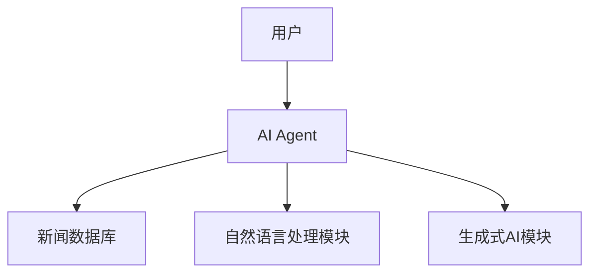
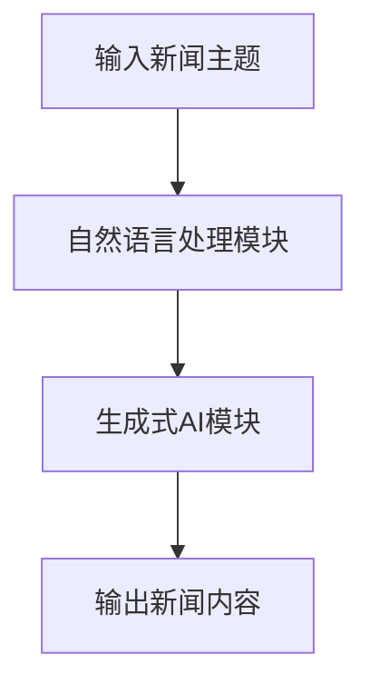
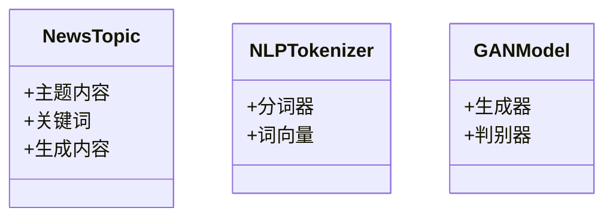
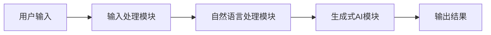
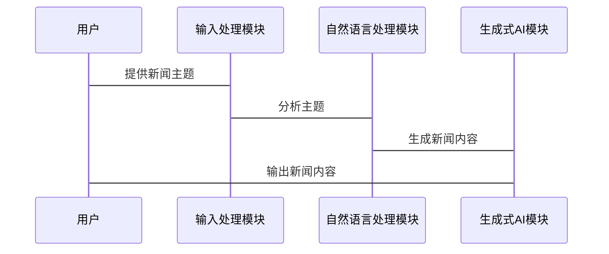

                 


# AI Agent在新闻媒体中的内容生成应用

> 关键词：AI Agent、新闻生成、生成式AI、自然语言处理、内容生成

> 摘要：本文详细探讨了AI Agent在新闻媒体内容生成中的应用，分析了生成式AI和自然语言处理的核心原理，结合实际案例，展示了如何通过AI Agent实现新闻内容的自动生成、智能分析和个性化推荐，最后总结了AI Agent在新闻媒体中的优势与挑战。

---

# 第1章: AI Agent与新闻媒体的背景介绍

## 1.1 AI Agent的基本概念
### 1.1.1 AI Agent的定义
AI Agent（人工智能代理）是一种能够感知环境、执行任务并做出决策的智能系统。它通过接收输入信息，利用算法进行处理，输出相应的结果或执行操作。

### 1.1.2 AI Agent的核心特点
- **自主性**：能够独立完成任务，无需人工干预。
- **反应性**：能够实时感知环境并做出响应。
- **学习能力**：通过数据和经验不断优化性能。
- **智能性**：具备理解和处理复杂信息的能力。

### 1.1.3 AI Agent与传统自动化工具的区别
AI Agent不仅仅是简单的自动化工具，它具备学习和推理能力，能够处理非结构化数据并做出决策。

---

## 1.2 新闻媒体的内容生成需求
### 1.2.1 新闻内容生成的痛点
- **效率低**：传统新闻生成需要大量人工参与。
- **成本高**：专业记者的薪资和时间成本较高。
- **一致性不足**：人工生成的内容可能存在风格不统一的问题。

### 1.2.2 AI在新闻媒体中的应用现状
- **新闻推荐系统**：利用AI技术推荐用户感兴趣的内容。
- **新闻摘要生成**：通过自然语言处理技术生成新闻摘要。
- **新闻分类**：利用机器学习算法对新闻进行分类。

### 1.2.3 AI Agent在新闻内容生成中的潜力
AI Agent可以通过自动化生成新闻内容、分析数据并推荐个性化内容，显著提升新闻媒体的效率和用户体验。

---

## 1.3 AI Agent在新闻媒体中的应用场景
### 1.3.1 新闻内容的自动生成
AI Agent可以根据输入的关键词或主题，自动生成新闻稿件。

### 1.3.2 新闻数据的智能分析
AI Agent可以对大量新闻数据进行分析，提取关键信息并生成报告。

### 1.3.3 新闻内容的个性化推荐
AI Agent可以根据用户的阅读习惯和偏好，推荐个性化新闻内容。

---

## 1.4 本章小结
本章介绍了AI Agent的基本概念和新闻媒体内容生成的需求，分析了AI Agent在新闻媒体中的应用场景及其潜力。

---

# 第2章: AI Agent的核心概念与原理

## 2.1 AI Agent的组成与工作原理
### 2.1.1 AI Agent的组成模块
- **感知模块**：接收输入数据，如关键词、主题等。
- **处理模块**：利用算法对数据进行处理和分析。
- **生成模块**：根据处理结果生成输出内容。
- **反馈模块**：根据用户反馈优化生成内容。

### 2.1.2 AI Agent的核心算法
- **自然语言处理（NLP）**：用于理解和生成人类语言。
- **生成式AI**：用于生成高质量的内容。
- **决策算法**：用于优化生成内容的质量。

### 2.1.3 AI Agent的决策机制
AI Agent通过分析输入数据和历史数据，利用算法生成最优的输出内容。

---

## 2.2 生成式AI与自然语言处理
### 2.2.1 生成式AI的基本原理
生成式AI通过训练大规模的语料库，学习语言的规律，从而生成新的文本内容。

### 2.2.2 自然语言处理在AI Agent中的应用
- **文本生成**：生成新闻稿件。
- **文本摘要**：生成新闻摘要。
- **文本分类**：对新闻进行分类。

### 2.2.3 生成式AI与新闻内容生成的关系
生成式AI是新闻内容生成的核心技术，通过自然语言处理技术，AI Agent能够生成高质量的新闻内容。

---

## 2.3 AI Agent的实体关系图


---

## 2.4 AI Agent的算法流程图


---

## 2.5 本章小结
本章详细介绍了AI Agent的核心概念和工作原理，分析了生成式AI和自然语言处理在AI Agent中的应用。

---

# 第3章: 生成式AI的数学模型与算法原理

## 3.1 生成式AI的数学模型
### 3.1.1 Transformer架构
Transformer是一种基于注意力机制的深度学习模型，广泛应用于自然语言处理任务。

### 3.1.2 编码器-解码器结构
编码器将输入序列编码为一个固定长度的向量，解码器根据编码结果生成输出序列。

### 3.1.3 注意力机制的数学公式
$$\text{Attention}(Q, K, V) = \text{softmax}\left(\frac{QK^T}{\sqrt{d_k}}\right)V$$

---

## 3.2 概率生成模型
### 3.2.1 最大似然估计
通过最大化训练数据的条件概率来训练模型。

### 3.2.2 贝叶斯推断
利用贝叶斯定理进行概率推理。

### 3.2.3 交叉熵损失函数
$$\text{Loss} = -\sum_{i=1}^{n} \text{log}p(y_i|x_i)$$

---

## 3.3 算法实现的伪代码
```python
def generate_content(topic):
    input = encode(topic)
    output = decode(input)
    return decode(output)
```

---

## 3.4 本章小结
本章详细讲解了生成式AI的数学模型和算法原理，分析了其在新闻内容生成中的应用。

---

# 第4章: 系统分析与架构设计方案

## 4.1 系统功能设计
- **领域模型**：定义系统的核心功能模块。
- **系统架构**：设计系统的整体架构。
- **系统接口**：定义系统与其他模块的交互接口。

### 4.1.1 领域模型


### 4.1.2 系统架构


---

## 4.2 系统交互设计
### 4.2.1 系统交互序列图


---

## 4.3 本章小结
本章分析了新闻内容生成系统的功能设计、架构设计和交互设计。

---

# 第5章: 项目实战——AI Agent新闻生成系统

## 5.1 环境配置
- **Python 3.8以上**
- **TensorFlow或PyTorch框架**
- **自然语言处理库（如spaCy、NLTK）**

```python
# 环境配置示例
pip install tensorflow==2.5.0
pip install transformers==4.10.0
pip install numpy==1.21.0
```

---

## 5.2 核心代码实现
### 5.2.1 数据预处理
```python
import numpy as np
import tensorflow as tf
from transformers import TFGPT2LMHeadModel, GPT2Tokenizer

# 加载预训练模型
tokenizer = GPT2Tokenizer.from_pretrained('gpt2-medium')
model = TFGPT2LMHeadModel.from_pretrained('gpt2-medium', pad_token_id=tokenizer.eos_token_id)
```

### 5.2.2 模型训练
```python
def train_model(train_dataset, epochs=3):
    optimizer = tf.keras.optimizers.Adam(learning_rate=5e-5)
    loss = tf.keras.losses.sparse_categorical_crossentropy
    model.compile(optimizer=optimizer, loss=loss, metrics=['accuracy'])
    model.fit(train_dataset, epochs=epochs)
```

### 5.2.3 模型生成
```python
def generate_news(topic, max_length=500):
    input_ids = tokenizer.encode(topic, return_tensors='tf')
    input_ids = tf.expand_dims(input_ids[0], 0)
    output = model.generate(input_ids, max_length=max_length)
    return tokenizer.decode(output[0].tolist())
```

---

## 5.3 实际案例分析
### 5.3.1 案例背景
假设我们希望生成一篇关于“气候变化”的新闻稿。

### 5.3.2 案例实现
```python
topic = "气候变化"
generated_news = generate_news(topic)
print(generated_news)
```

### 5.3.3 案例分析
通过上述代码，AI Agent能够根据输入的新闻主题，生成一篇高质量的新闻稿。

---

## 5.4 项目总结
本章通过实际案例展示了AI Agent在新闻内容生成中的应用，详细讲解了系统的实现过程。

---

# 第6章: 最佳实践与小结

## 6.1 最佳实践
- **数据质量**：确保训练数据的多样性和高质量。
- **模型优化**：通过超参数调优和模型微调提升生成效果。
- **用户体验**：设计友好的用户界面，提升用户体验。

## 6.2 小结
AI Agent在新闻内容生成中的应用前景广阔，通过不断优化算法和提升模型性能，AI Agent将能够生成更加智能和个性化的新闻内容。

---

## 6.3 注意事项
- **内容准确性**：生成的内容需要经过人工审核，确保准确性。
- **版权问题**：生成的内容可能涉及版权问题，需谨慎处理。
- **用户隐私**：确保用户数据的安全性和隐私性。

---

## 6.4 拓展阅读
- **《生成式AI：原理与应用》**
- **《自然语言处理实战：基于Python和TensorFlow》**
- **《AI Agent：智能系统的构建与优化》**

---

# 附录: 参考文献

1. Vaswani, A., et al. "Attention Is All You Need." arXiv Preprint, 2017.
2. Radford, A., et al. "Language Models are Few-Shot Learners." arXiv Preprint, 2020.
3. Brown, T., et al. "A Walk Through the GPT-3 Paper." Hugging Face Blog, 2020.

--- 

通过以上目录，我们可以看到，AI Agent在新闻媒体中的内容生成应用涉及从基础概念到实际应用的各个方面，通过详细的技术分析和实际案例，我们可以更好地理解AI Agent在新闻生成中的潜力和挑战。

