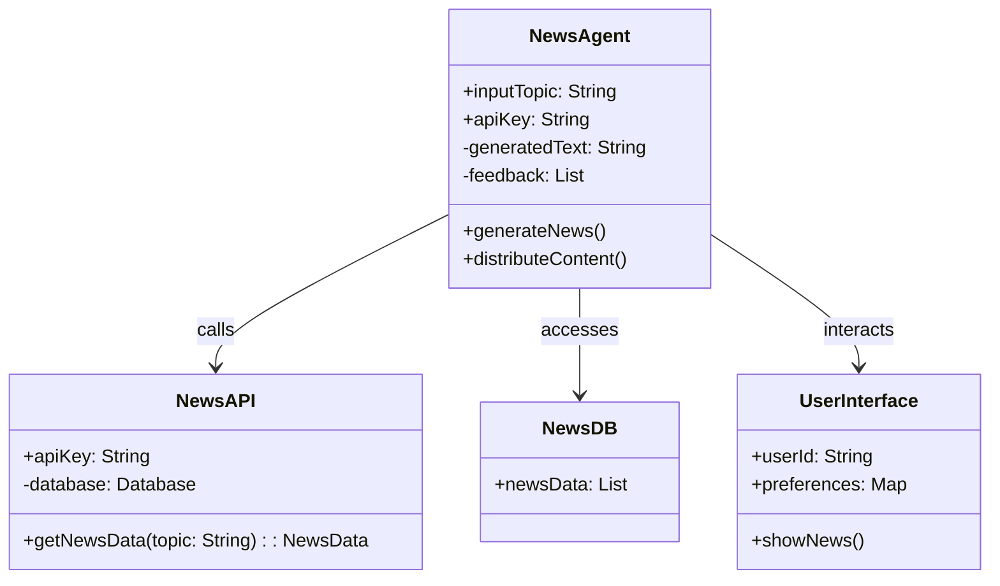
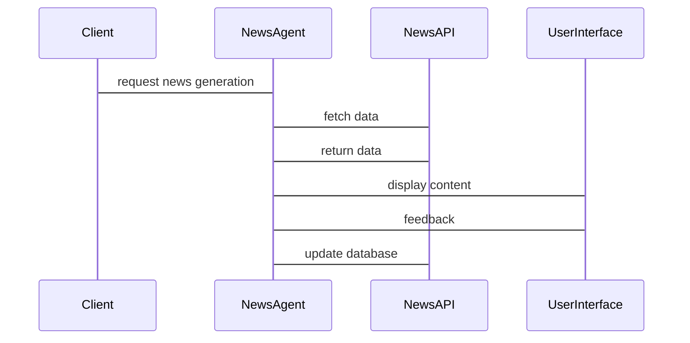

                 


# AI Agent在新闻媒体中的应用：自动写作与内容分发

## 关键词：AI Agent，新闻媒体，自动写作，内容分发，生成式AI，自然语言处理，推荐算法

## 摘要：  
本文探讨AI Agent在新闻媒体中的应用，重点分析自动写作与内容分发的技术实现。通过介绍AI Agent的核心技术、系统架构设计以及实际案例，深入剖析生成式AI与自然语言处理在新闻写作中的应用，内容分发算法的优化策略，以及系统实现的具体步骤。文章最后总结了AI Agent在新闻媒体中的优势与挑战，并展望了未来的发展方向。

---

# 第一部分：AI Agent在新闻媒体中的应用概述

## 第1章：AI Agent与新闻媒体的结合

### 1.1 AI Agent的基本概念  
AI Agent（人工智能代理）是指能够感知环境、做出决策并执行任务的智能实体。在新闻媒体中，AI Agent可以用于新闻生成、内容推荐和自动化分发。  

#### 1.1.1 AI Agent的定义  
AI Agent是一种能够自主执行任务的智能系统，通过感知环境信息，利用算法做出决策，并通过执行器完成任务。  

#### 1.1.2 AI Agent的核心特征  
- **自主性**：能够在没有人工干预的情况下独立运行。  
- **反应性**：能够根据环境变化实时调整行为。  
- **学习能力**：通过数据和经验不断优化性能。  

#### 1.1.3 AI Agent在新闻媒体中的应用背景  
随着人工智能技术的快速发展，新闻媒体行业逐渐引入AI Agent来提高效率、降低成本，并提供更个性化的新闻内容。  

### 1.2 新闻媒体中的自动写作  
自动写作是指通过AI技术自动生成新闻稿的过程，常见的实现方式包括基于生成式AI和自然语言处理技术。  

#### 1.2.1 自动写作的定义与特点  
自动写作是指利用AI算法生成新闻内容的过程，其特点包括高效性、可扩展性和智能化。  

#### 1.2.2 自动写作的实现流程  
1. **数据输入**：接收新闻主题和相关数据。  
2. **内容生成**：通过生成式AI生成新闻稿件。  
3. **内容优化**：利用自然语言处理技术对生成内容进行优化。  

#### 1.2.3 自动写作的优缺点  
- **优点**：提高效率，降低成本，支持大规模内容生成。  
- **缺点**：内容质量可能不稳定，缺乏人类记者的深度分析能力。  

### 1.3 内容分发的现状与挑战  
内容分发是将新闻内容推送给目标读者的过程，AI Agent在内容分发中起到关键作用。  

#### 1.3.1 内容分发的基本概念  
内容分发是指将新闻内容通过各种渠道推送给目标读者的过程。  

#### 1.3.2 当前内容分发的主要方式  
1. **基于协同过滤的推荐**：根据用户行为推荐内容。  
2. **基于深度学习的推荐**：利用神经网络模型进行推荐。  
3. **基于内容的推荐**：根据内容相似性进行推荐。  

#### 1.3.3 AI Agent在内容分发中的作用  
AI Agent能够根据用户偏好和行为数据，实时调整内容分发策略，提高推荐的准确性和用户满意度。  

### 1.4 本章小结  
本章介绍了AI Agent的基本概念及其在新闻媒体中的应用背景，详细探讨了自动写作和内容分发的实现方式及其优缺点。

---

# 第二部分：AI Agent的核心技术与原理

## 第2章：AI Agent的核心技术  

### 2.1 生成式AI的基本原理  
生成式AI是一种能够生成新内容的AI技术，广泛应用于新闻写作、图像生成等领域。  

#### 2.1.1 生成式AI的定义  
生成式AI是指通过算法生成新内容的技术，通常基于深度学习模型。  

#### 2.1.2 基于Transformer的生成模型  
Transformer模型是一种基于自注意力机制的深度学习模型，广泛应用于自然语言处理任务。  

#### 2.1.3 GAN与VAE在生成式AI中的应用  
- **GAN**：生成对抗网络，通过生成器和判别器的对抗训练生成高质量内容。  
- **VAE**：变分自编码器，通过概率建模生成多样化的内容。  

### 2.2 自然语言处理技术  
自然语言处理（NLP）是AI Agent实现新闻写作的核心技术之一。  

#### 2.2.1 NLP的基本概念  
NLP是研究人类语言规律的计算机科学领域，旨在实现人机交互中的语言理解与生成。  

#### 2.2.2 基于预训练模型的文本生成  
预训练模型如BERT、GPT等通过大规模数据训练，具备强大的文本生成能力。  

#### 2.2.3 NLP在新闻写作中的应用  
通过NLP技术，AI Agent能够生成语法正确、语义通顺的新闻稿件。  

### 2.3 内容分发算法  
内容分发算法是AI Agent实现个性化推荐的核心技术。  

#### 2.3.1 基于协同过滤的推荐算法  
协同过滤是一种基于用户行为相似性的推荐算法，常用于内容分发。  

#### 2.3.2 基于深度学习的推荐模型  
深度学习模型如神经协同过滤（Neural Collaborative Filtering）能够处理高维数据，提高推荐准确性。  

#### 2.3.3 内容分发算法的优缺点  
- **优点**：提高推荐准确性和用户满意度。  
- **缺点**：需要大量数据支持，计算复杂度较高。  

### 2.4 本章小结  
本章详细介绍了生成式AI和自然语言处理技术的基本原理及其在新闻媒体中的应用，分析了内容分发算法的优缺点。

---

# 第三部分：AI Agent在新闻媒体中的应用实现

## 第3章：新闻自动写作系统的实现  

### 3.1 系统架构设计  
新闻自动写作系统通常包括文本生成模块、内容优化模块和内容分发模块。  

#### 3.1.1 系统功能模块划分  
- **文本生成模块**：负责生成新闻稿件。  
- **内容优化模块**：对生成内容进行润色和优化。  
- **内容分发模块**：根据用户偏好分发内容。  

#### 3.1.2 系统架构的实现方式  
系统采用模块化设计，各模块之间通过API进行交互。  

#### 3.1.3 系统架构的优缺点  
- **优点**：模块化设计便于维护和扩展。  
- **缺点**：模块之间可能存在接口不兼容的问题。  

### 3.2 系统功能设计  
新闻自动写作系统需要实现文本生成、内容优化和用户反馈等功能。  

#### 3.2.1 文本生成模块  
文本生成模块基于生成式AI生成新闻稿件，支持多种新闻主题和风格。  

#### 3.2.2 内容优化模块  
内容优化模块利用自然语言处理技术对生成内容进行润色，提升稿件质量。  

#### 3.2.3 用户反馈模块  
用户反馈模块收集用户对生成内容的反馈，用于优化系统性能。  

### 3.3 系统实现的代码示例  
以下是一个简单的新闻生成系统的Python代码示例：

```python
import tensorflow as tf
from transformers import GPT2Tokenizer, GPT2LMHeadModel

# 初始化tokenizer和模型
tokenizer = GPT2Tokenizer.from_pretrained('gpt2')
model = GPT2LMHeadModel.from_pretrained('gpt2')

# 输入新闻主题
input_text = "The recent breakthrough in AI research has revolutionized the field of natural language processing."

# 生成新闻稿件
input_ids = tokenizer.encode(input_text, return_tensors='pt')
output = model.generate(input_ids, max_length=500, temperature=0.7)

# 解码生成的文本
generated_text = tokenizer.decode(output[0], skip_special_tokens=True)
print(generated_text)
```

#### 3.3.1 环境安装与配置  
需要安装TensorFlow和Transformers库，并下载预训练模型。  

#### 3.3.2 文本生成模块的实现  
使用GPT-2模型生成新闻稿件，通过调整温度参数控制生成内容的 creativity。  

#### 3.3.3 内容分发模块的实现  
基于协同过滤算法，根据用户偏好推荐新闻内容。  

### 3.4 本章小结  
本章详细介绍了新闻自动写作系统的实现过程，包括系统架构设计、功能模块实现和代码示例。

---

# 第四部分：系统分析与架构设计

## 第4章：系统分析与架构设计  

### 4.1 问题场景介绍  
新闻媒体行业需要高效的内容生成和个性化分发系统。  

#### 4.1.1 问题背景  
新闻媒体行业面临内容生产成本高、分发效率低的挑战。  

#### 4.1.2 项目介绍  
本项目旨在开发一个基于AI Agent的新闻自动写作与内容分发系统。  

### 4.2 项目介绍  
项目目标是实现一个能够自动生成新闻稿件并智能分发的系统。  

#### 4.2.1 项目目标  
- 实现新闻稿件自动生成功能。  
- 提供个性化内容分发服务。  

### 4.3 系统功能设计  

#### 4.3.1 领域模型（Mermaid 类图）  


### 4.4 系统架构设计  

#### 4.4.1 系统架构（Mermaid 架构图）  


### 4.5 系统接口设计  

#### 4.5.1 系统接口（Mermaid 序列图）  


### 4.6 本章小结  
本章通过系统分析与架构设计，展示了新闻自动写作与内容分发系统的整体结构和各模块之间的交互关系。

---

# 第五部分：总结与展望

## 第5章：总结与展望  

### 5.1 本章总结  
本文详细探讨了AI Agent在新闻媒体中的应用，包括自动写作和内容分发的实现方式。  

### 5.2 未来展望  
随着AI技术的不断进步，新闻媒体中的AI Agent将更加智能化和个性化。  

### 5.3 最佳实践 Tips  
- 在生成内容时，注意平衡 creativity 和 coherence。  
- 定期更新模型和数据，保持系统性能。  

### 5.4 注意事项  
- 确保生成内容的准确性和合规性。  
- 保护用户隐私，避免数据泄露。  

### 5.5 拓展阅读  
推荐阅读《生成式AI：原理与应用》和《自然语言处理实战》等书籍。

---

# 附录：代码实现细节  

## 附录A：生成式AI模型的实现  

```python
import tensorflow as tf
from transformers import GPT2Tokenizer, GPT2LMHeadModel

# 初始化tokenizer和模型
tokenizer = GPT2Tokenizer.from_pretrained('gpt2')
model = GPT2LMHeadModel.from_pretrained('gpt2')

# 输入新闻主题
input_text = "The recent breakthrough in AI research has revolutionized the field of natural language processing."

# 生成新闻稿件
input_ids = tokenizer.encode(input_text, return_tensors='pt')
output = model.generate(input_ids, max_length=500, temperature=0.7)

# 解码生成的文本
generated_text = tokenizer.decode(output[0], skip_special_tokens=True)
print(generated_text)
```

## 附录B：内容分发算法的实现  

```python
import numpy as np
from sklearn.metrics.pairwise import cosine_similarity

# 定义用户偏好矩阵
user_preferences = np.array([[0.8, 0.2, 0.5],
                             [0.4, 0.9, 0.3],
                             [0.6, 0.1, 0.8]])

# 计算相似度
similarity = cosine_similarity(user_preferences)

# 找出最相似的用户
max_similarity = np.max(similarity)
most_similar_user_index = np.where(similarity == max_similarity)[1][0]

print(f"Most similar user index: {most_similar_user_index}")
```

---

# 结语  
通过本文的详细讲解，读者可以全面了解AI Agent在新闻媒体中的应用，包括核心技术、系统架构和实际案例。希望本文能为相关领域的研究和实践提供有价值的参考。

---

# 致谢  
感谢读者的耐心阅读，感谢同行的无私分享，感谢所有为本文提供灵感和技术支持的人士。

