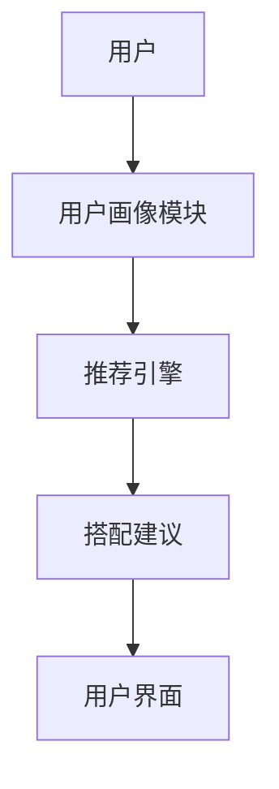

                 


# AI Agent在时尚产业中的应用：趋势预测与个性化搭配

> **关键词**：AI Agent，时尚产业，趋势预测，个性化搭配，数据驱动，智能推荐，时尚科技  
> 
> **摘要**：随着人工智能技术的快速发展，AI Agent（人工智能代理）在时尚产业中的应用日益广泛。本文探讨了AI Agent在时尚产业中的核心应用，特别是趋势预测与个性化搭配。通过结合自然语言处理、计算机视觉和推荐系统等技术，AI Agent能够高效地分析时尚数据，预测流行趋势，并为消费者提供个性化的搭配建议。本文详细分析了AI Agent在时尚产业中的技术原理、系统设计和实际应用案例，并展望了未来的发展趋势。

---

## 引言

在数字化转型的浪潮下，时尚产业正在经历前所未有的变革。消费者需求的多样化、市场竞争的加剧以及快时尚模式的兴起，使得传统依靠经验和直觉的时尚行业逐渐向数据驱动、智能化方向转变。AI Agent（人工智能代理）作为一种能够自主感知环境、执行任务并优化决策的智能系统，正在成为时尚产业的重要工具。

---

## 第1章 AI Agent的核心概念与技术实现

### 1.1 AI Agent的基本概念

AI Agent是一种能够感知环境、执行任务并优化决策的智能系统。它能够通过数据输入、模型训练和任务执行，帮助用户完成特定目标。在时尚产业中，AI Agent主要用于趋势预测、个性化推荐和库存优化。

#### 1.1.1 AI Agent的核心特点

- **自主性**：AI Agent能够自主决策，无需人工干预。
- **反应性**：能够实时感知环境变化并做出响应。
- **学习能力**：通过机器学习技术不断优化模型。
- **可扩展性**：能够处理不同类型和规模的数据。

#### 1.1.2 AI Agent与传统算法的区别

AI Agent不仅是一个算法模型，更是一个完整的系统，能够自主执行任务并适应环境变化。与传统算法相比，AI Agent具有更强的自主性和适应性。

---

### 1.2 自然语言处理（NLP）在AI Agent中的应用

自然语言处理技术在AI Agent中主要用于分析文本数据，例如消费者评论、社交媒体上的时尚内容等。通过NLP，AI Agent能够提取关键词、情感倾向和流行趋势。

#### 1.2.1 NLP技术的基本原理

NLP技术通过词袋模型、TF-IDF和主题模型等方法，将文本数据转化为结构化的信息。例如，使用词袋模型分析消费者评论，提取流行关键词。

#### 1.2.2 在时尚产业中的具体应用

- **趋势预测**：通过分析社交媒体上的流行关键词，预测下一季度的流行趋势。
- **品牌声誉管理**：通过情感分析，监测品牌在社交媒体上的声誉。

---

### 1.3 计算机视觉在AI Agent中的应用

计算机视觉技术在AI Agent中主要用于图像和视频分析，例如分析服装款式、颜色和风格。

#### 1.3.1 图像识别技术

图像识别技术能够识别服装的款式、颜色和材质。例如，通过卷积神经网络（CNN）识别服装的类别。

#### 1.3.2 时尚风格识别的实现

通过深度学习模型，AI Agent能够识别不同风格的服装，例如休闲风、商务风、街头风等。

---

## 第2章 趋势预测

### 2.1 时尚趋势预测的挑战与解决方案

时尚趋势预测是一个复杂的过程，受到消费者偏好、经济状况和社会文化的影响。AI Agent通过数据驱动的方法，能够更准确地预测趋势。

#### 2.1.1 数据收集与处理

数据来源包括社交媒体、电商平台、品牌销售数据和消费者调查。通过数据清洗和特征提取，将数据转化为适合模型训练的形式。

#### 2.1.2 趋势预测模型的构建

基于时间序列分析和聚类分析，构建趋势预测模型。例如，使用LSTM（长短期记忆网络）预测下一季度的颜色流行趋势。

---

### 2.2 基于AI Agent的时尚趋势预测算法

#### 2.2.1 时间序列分析

时间序列分析用于预测时尚产品的销售趋势。例如，通过ARIMA模型预测某服装品牌的销售量。

#### 2.2.2 聚类分析

聚类分析用于识别相似的产品或趋势。例如，通过K-means算法将服装款式分为不同的类别。

---

## 第3章 个性化搭配

### 3.1 用户画像与风格识别

#### 3.1.1 用户画像的构建

通过分析消费者的购买记录、浏览行为和偏好，构建用户画像。例如，通过协同过滤算法推荐相似风格的产品。

#### 3.1.2 个性化风格识别

通过机器学习模型识别用户的穿衣风格。例如，通过深度学习模型识别用户的穿衣偏好。

---

### 3.2 基于AI Agent的搭配推荐系统

#### 3.2.1 推荐算法的选择

推荐系统通过协同过滤和深度学习模型为用户提供个性化搭配建议。例如，使用协同过滤算法推荐搭配方案。

#### 3.2.2 搭配推荐的实现

通过规则引擎和生成模型，生成个性化的搭配方案。例如，根据用户的身高、体型和风格偏好推荐合适的服装款式。

---

## 第4章 系统设计与项目实战

### 4.1 系统架构设计

#### 4.1.1 系统功能模块

系统功能模块包括数据采集、模型训练、推荐引擎和用户界面。例如，数据采集模块从社交媒体和电商平台获取数据。

#### 4.1.2 系统架构图



---

### 4.2 系统实现

#### 4.2.1 环境安装

需要安装Python、TensorFlow、Keras和Scikit-learn等工具。

#### 4.2.2 核心代码实现

```python
import numpy as np
from tensorflow.keras import layers

# 数据预处理
data = np.array([...])  # 数据集
x_train = data[:-100]
y_train = data[100:]

# 模型构建
model = tf.keras.Sequential()
model.add(layers.LSTM(50, input_shape=(None, 1)))
model.add(layers.Dense(1))
model.compile(optimizer='adam', loss='mse')

# 模型训练
model.fit(x_train, y_train, epochs=10, batch_size=32)
```

---

## 总结

AI Agent在时尚产业中的应用前景广阔。通过自然语言处理、计算机视觉和推荐系统等技术，AI Agent能够高效地预测趋势和提供个性化搭配建议。未来，随着技术的不断进步，AI Agent将在时尚产业中发挥更大的作用。

---

### 附录

- **参考文献**：列出相关文献和资料。
- **代码仓库**：提供系统实现的代码仓库链接。
- **工具推荐**：推荐相关的工具和技术栈。

---

通过以上思考和规划，我可以开始撰写一篇内容丰富、结构清晰的博客文章，详细探讨AI Agent在时尚产业中的应用，特别是趋势预测和个性化搭配方面。

