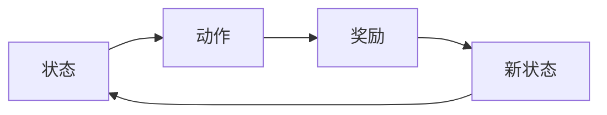
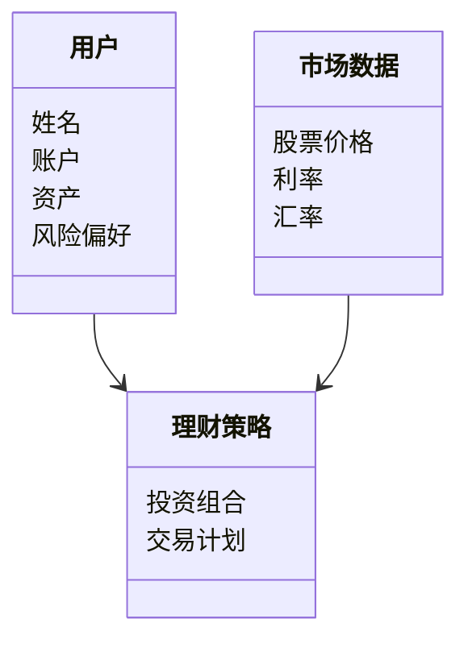
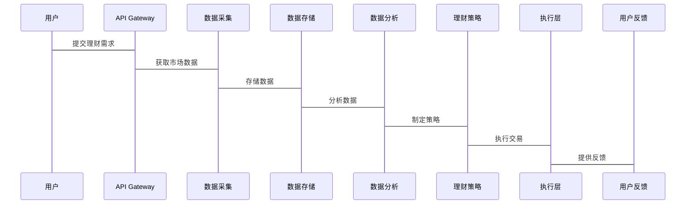

                 


# AI Agent在智能个人理财中的角色

> 关键词：AI Agent, 智能理财, 强化学习, 理财策略, 系统架构

> 摘要：AI Agent作为人工智能的核心技术之一，在智能个人理财领域发挥着越来越重要的作用。本文将从AI Agent的基本概念、核心原理、算法模型、系统架构、实际应用等多个方面，全面分析AI Agent在智能个人理财中的角色和作用。通过本文的阐述，读者可以深入了解AI Agent如何通过感知、决策、执行三个层面，帮助用户实现个性化的理财目标，优化投资策略，降低风险，并在未来的发展中推动智能理财进入新的高度。

---

# 第一部分: AI Agent与智能个人理财的背景介绍

# 第1章: AI Agent与智能个人理财概述

## 1.1 AI Agent的基本概念

### 1.1.1 AI Agent的定义

AI Agent（人工智能代理）是一种能够感知环境、自主决策并执行任务的智能实体。它能够通过传感器获取外部信息，利用算法进行分析和推理，并通过执行器对外界产生影响。AI Agent的核心目标是帮助用户完成特定任务或优化目标的实现。

### 1.1.2 AI Agent的核心特征

| 特征 | 描述 |
|------|------|
| 感知能力 | 能够通过传感器或数据接口获取外部信息 |
| 决策能力 | 具备自主决策能力，能够根据信息做出最优选择 |
| 执行能力 | 能够通过执行器或接口对外界产生影响 |
| 学习能力 | 具备自我优化和学习能力，能够适应新的环境和任务 |

### 1.1.3 AI Agent与传统软件代理的区别

| 方面 | AI Agent | 传统软件代理 |
|------|----------|---------------|
| 智能性 | 具备学习和推理能力 | 通常基于规则和逻辑推理 |
| 自主性 | 可以自主决策 | 需要人工干预或触发 |
| 适应性 | 能够适应动态环境 | 适应性有限，通常需要人工调整 |

## 1.2 智能个人理财的背景与现状

### 1.2.1 个人理财的基本概念

个人理财是指个人对其财务资源（如储蓄、投资、支出等）进行规划和管理，以实现财务目标的过程。传统个人理财依赖于人工分析和经验判断，效率较低且容易受到主观因素的影响。

### 1.2.2 智能理财的发展历程

智能理财的概念起源于20世纪90年代，随着大数据、人工智能和机器学习技术的快速发展，智能理财逐渐从理论走向实践。目前，智能理财已经广泛应用于金融投资、风险管理、资产配置等领域。

### 1.2.3 当前智能理财的主要技术手段

- **数据采集与分析**：通过收集用户的财务数据、市场数据等，利用大数据技术进行分析。
- **机器学习算法**：利用监督学习、无监督学习和强化学习等算法，预测市场趋势和优化投资组合。
- **自然语言处理**：通过NLP技术，帮助用户从海量信息中提取有价值的内容。
- **自动化交易**：基于算法的自动化交易系统，能够在毫秒级别完成交易决策。

## 1.3 AI Agent在智能理财中的角色定位

### 1.3.1 AI Agent在理财中的应用场景

- **资产配置**：根据用户的财务状况和风险偏好，优化资产配置。
- **风险评估**：通过数据分析和模型预测，评估投资组合的风险。
- **投资决策**：基于市场数据和用户需求，制定投资策略。
- **自动化交易**：执行交易指令，优化交易成本。

### 1.3.2 AI Agent的核心优势

- **高效性**：能够快速处理大量数据，提供实时反馈。
- **准确性**：通过算法优化，提高决策的准确性。
- **个性化**：能够根据用户需求定制个性化的理财方案。
- **适应性**：能够根据市场变化和用户需求进行自我优化。

### 1.3.3 AI Agent的局限性与挑战

- **数据依赖性**：AI Agent的性能高度依赖于数据的质量和数量。
- **模型偏差**：算法的偏差可能导致错误的决策。
- **伦理问题**：AI Agent的决策可能引发道德和法律问题。

## 1.4 本章小结

本章从AI Agent的基本概念出发，介绍了智能理财的背景与发展现状，并重点分析了AI Agent在智能理财中的角色定位及其优势与挑战。通过本章的阐述，读者可以初步了解AI Agent在智能理财中的重要性。

---

# 第二部分: AI Agent的核心概念与原理

# 第2章: AI Agent的核心概念与联系

## 2.1 AI Agent的核心概念

### 2.1.1 感知层：数据采集与分析

AI Agent的感知层主要负责数据的采集和分析，包括用户数据、市场数据等。通过感知层，AI Agent能够获取外部环境的信息，为后续的决策提供依据。

### 2.1.2 决策层：策略制定与优化

决策层是AI Agent的核心部分，负责根据感知层获取的信息，制定和优化理财策略。决策层通常采用强化学习、遗传算法等技术，通过不断的试错和优化，找到最优的理财方案。

### 2.1.3 执行层：操作执行与反馈

执行层负责将决策层制定的策略转化为具体的操作，例如买卖股票、调整资产配置等。同时，执行层还负责将操作结果反馈给感知层，形成闭环。

## 2.2 AI Agent与智能理财的核心要素

### 2.2.1 用户画像与需求分析

通过分析用户的财务状况、风险偏好、投资目标等信息，构建用户的画像。例如，一个高风险偏好的用户可能适合投资股票或高风险的理财产品。

### 2.2.2 市场数据与风险评估

AI Agent需要实时获取市场数据，如股票价格、汇率、利率等，并结合用户的需求，评估投资组合的风险。

### 2.2.3 理财策略与执行计划

根据用户的需求和市场数据，AI Agent制定理财策略，并生成具体的执行计划。例如，建议用户在某个时间点买入或卖出某种资产。

## 2.3 AI Agent与智能理财的ER实体关系图

```mermaid
er
actor: 用户
agent: AI理财代理
goal: 理财目标
action: 理财操作
feedback: 反馈数据
```

## 2.4 本章小结

本章详细介绍了AI Agent的核心概念，包括感知层、决策层和执行层，并通过ER实体关系图展示了AI Agent与智能理财的核心要素之间的关系。通过本章的阐述，读者可以更好地理解AI Agent在智能理财中的工作原理。

---

# 第三部分: AI Agent的算法原理与数学模型

# 第3章: AI Agent的算法原理

## 3.1 强化学习在AI Agent中的应用

### 3.1.1 强化学习的基本原理

强化学习是一种机器学习技术，通过智能体与环境的交互，学习最优策略。强化学习的核心是通过试错和反馈，逐步优化决策模型。

### 3.1.2 Q-learning算法在AI Agent中的应用

Q-learning是一种经典的强化学习算法，适用于离散动作空间和状态空间的情况。Q-learning的核心思想是通过更新Q值表，找到最优策略。

### 3.1.3 算法流程图



### 3.1.4 算法实现

```python
import numpy as np

class QLearningAgent:
    def __init__(self, state_space_size, action_space_size, learning_rate=0.1, gamma=0.99):
        self.state_space_size = state_space_size
        self.action_space_size = action_space_size
        self.learning_rate = learning_rate
        self.gamma = gamma
        self.q_table = np.zeros((state_space_size, action_space_size))

    def get_action(self, state):
        return np.argmax(self.q_table[state])

    def update_q_table(self, state, action, reward, next_state):
        current_q = self.q_table[state][action]
        next_max_q = np.max(self.q_table[next_state])
        self.q_table[state][action] = current_q + self.learning_rate * (reward + self.gamma * next_max_q - current_q)
```

### 3.1.5 数学模型与公式

Q值的更新公式如下：

$$ Q(s, a) = Q(s, a) + \alpha (r + \gamma \max Q(s', a') - Q(s, a)) $$

其中：
- \( Q(s, a) \) 表示当前状态下采取动作 \( a \) 的Q值。
- \( \alpha \) 表示学习率。
- \( r \) 表示奖励。
- \( \gamma \) 表示折扣因子。
- \( Q(s', a') \) 表示下一个状态下的最大Q值。

---

## 3.2 基于强化学习的理财策略优化

### 3.2.1 理财策略的数学模型

理财策略可以表示为一个状态-动作空间，其中状态包括市场数据、用户需求等，动作包括买入、卖出、持有等。

### 3.2.2 状态空间与动作空间的定义

| 状态 | 动作 |
|------|------|
| 股票价格 | 买入、卖出、持有 |
| 利率 | 调整债券持仓 |
| 汇率 | 调整外汇持仓 |

### 3.2.3 算法实现

```python
def update_strategy(agent, state, action, reward, next_state):
    agent.update_q_table(state, action, reward, next_state)
```

---

## 3.3 其他算法的应用

### 3.3.1 贝叶斯网络在风险评估中的应用

贝叶斯网络是一种概率图模型，能够有效地处理不确定性问题。在智能理财中，贝叶斯网络可以用于风险评估和投资组合优化。

### 3.3.2 支持向量机在资产配置中的应用

支持向量机是一种监督学习算法，适用于分类和回归问题。在智能理财中，支持向量机可以用于资产分类和风险预测。

---

## 3.4 本章小结

本章重点介绍了强化学习在AI Agent中的应用，特别是Q-learning算法的实现和数学模型。同时，还讨论了其他算法如贝叶斯网络和支持向量机在智能理财中的应用。通过本章的阐述，读者可以了解AI Agent在智能理财中的算法原理和数学模型。

---

# 第四部分: AI Agent的系统分析与架构设计

# 第4章: AI Agent的系统分析与架构设计

## 4.1 理财场景介绍

在智能理财场景中，用户需要通过AI Agent实现个性化的理财目标。例如，用户可能希望在风险可控的前提下，实现资产的保值和增值。

## 4.2 项目介绍

本项目旨在设计一个基于AI Agent的智能理财系统，帮助用户实现个性化的理财目标。

## 4.3 系统功能设计

### 4.3.1 领域模型



### 4.3.2 系统架构设计

```mermaid
graph LR
用户 --> API Gateway
API Gateway --> 状态管理
API Gateway --> 数据采集
数据采集 --> 数据存储
数据存储 --> 数据分析
数据分析 --> 理财策略
理财策略 --> 执行层
执行层 --> 用户反馈
```

### 4.3.3 系统接口设计

- **用户接口**：提供用户交互界面，如网页或移动应用。
- **API接口**：提供REST API，供第三方调用。
- **数据接口**：与金融市场数据源对接。

### 4.3.4 系统交互流程



## 4.4 本章小结

本章从系统设计的角度，详细分析了AI Agent在智能理财中的应用场景和系统架构。通过领域模型和系统架构图，展示了AI Agent在智能理财中的工作流程。

---

# 第五部分: AI Agent的项目实战

# 第5章: AI Agent的项目实战

## 5.1 环境配置

### 5.1.1 安装必要的库

```bash
pip install numpy pandas scikit-learn matplotlib
```

### 5.1.2 配置开发环境

建议使用Jupyter Notebook或PyCharm进行开发。

## 5.2 核心代码实现

### 5.2.1 理财策略实现

```python
def get_recommendation(agent, state):
    action = agent.get_action(state)
    return agent.q_table[state][action]
```

### 5.2.2 数据处理与分析

```python
import pandas as pd
import numpy as np

def process_data(data):
    return data.dropna().astype(float)
```

## 5.3 项目案例分析

### 5.3.1 案例背景

假设一个用户希望在股票市场中实现资产增值，风险偏好为中等。

### 5.3.2 案例分析

通过AI Agent的分析，建议用户投资60%的股票、30%的债券和10%的现金。

### 5.3.3 案例实现

```python
state = [股票价格, 利率]
action = agent.get_action(state)
print(f"建议采取动作：{action}")
```

## 5.4 本章小结

本章通过具体的项目实战，展示了AI Agent在智能理财中的实际应用。通过案例分析和代码实现，帮助读者更好地理解AI Agent在智能理财中的工作原理。

---

# 第六部分: AI Agent的最佳实践

# 第6章: 最佳实践

## 6.1 小结

通过本文的阐述，读者可以全面了解AI Agent在智能个人理财中的角色和作用。从基本概念到算法原理，从系统设计到项目实战，本文为读者提供了一个完整的知识框架。

## 6.2 注意事项

- **数据隐私**：在实际应用中，需要特别注意用户数据的隐私保护。
- **模型优化**：需要不断优化模型，提高决策的准确性和稳定性。
- **用户体验**：在设计系统时，需要注重用户体验，提供友好的交互界面。

## 6.3 拓展阅读

- **强化学习**：深入学习强化学习的相关知识，特别是深度强化学习。
- **金融数学**：学习金融数学的相关知识，特别是资产定价和风险管理。
- **系统架构**：学习分布式系统架构设计，提高系统的可扩展性和稳定性。

---

# 结语

AI Agent作为人工智能的核心技术之一，在智能个人理财中的应用前景广阔。通过本文的阐述，读者可以全面了解AI Agent在智能理财中的角色和作用。未来，随着技术的不断发展，AI Agent在智能理财中的应用将会更加广泛和深入。

