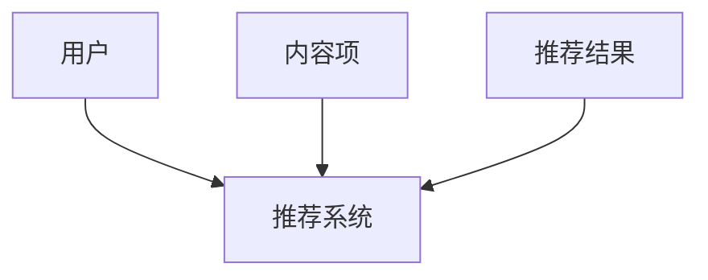
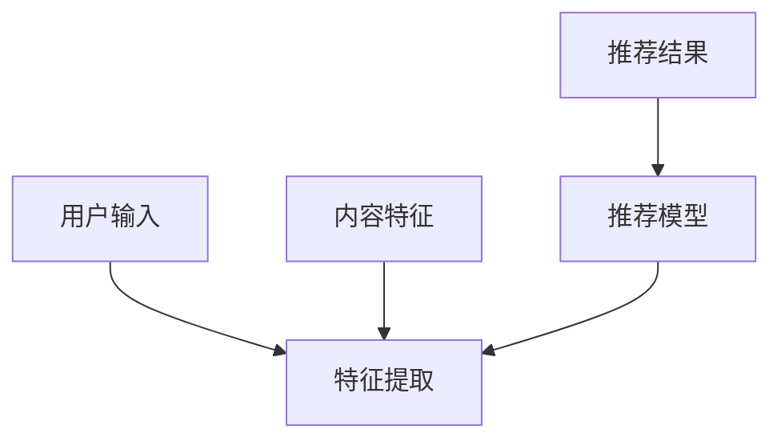
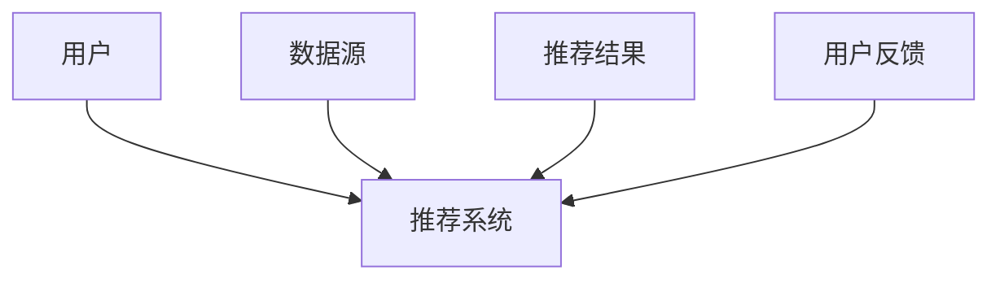
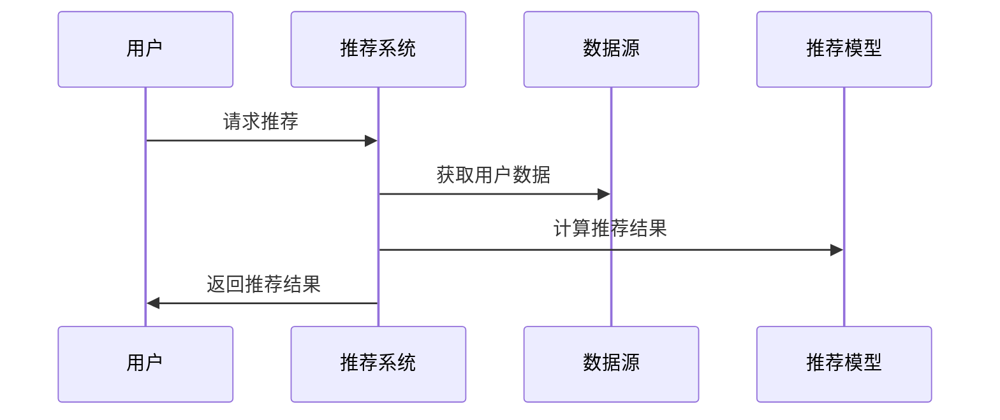

                 


# AI Agent在智能个性化内容推荐中的应用

## 关键词
AI Agent, 个性化推荐, 智能推荐系统, 机器学习, 深度学习

## 摘要
随着人工智能技术的快速发展，AI Agent在智能个性化内容推荐中的应用越来越广泛。本文将详细探讨AI Agent如何在个性化推荐系统中发挥作用，分析其核心概念、算法原理、系统架构设计及项目实战。通过结合理论与实践，本文旨在为读者提供一个全面了解AI Agent在智能推荐系统中的应用的框架，帮助读者掌握相关技术和实现方法。

---

## 第一部分: AI Agent与智能个性化内容推荐概述

### 第1章: AI Agent与智能个性化推荐的背景介绍

#### 1.1 AI Agent的基本概念
- **1.1.1 AI Agent的定义**
  - AI Agent是一种智能体，能够感知环境、执行任务并做出决策。
  - 具备自主性、反应性、社会性和目标性等核心特点。

- **1.1.2 AI Agent的核心特点**
  - 自主性：能够在没有外部干预的情况下独立运行。
  - 反应性：能够根据环境变化调整行为。
  - 社会性：能够与其他智能体或人类进行交互。
  - 目标性：具备明确的目标导向。

- **1.1.3 AI Agent与传统推荐系统的区别**
  - 传统推荐系统：基于规则或协同过滤进行推荐。
  - AI Agent推荐系统：具备自主学习和决策能力，能够动态调整推荐策略。

#### 1.2 智能个性化推荐的背景与问题背景
- **1.2.1 个性化推荐的需求背景**
  - 用户需求日益多样化，传统推荐系统难以满足个性化需求。
  - AI Agent能够通过学习用户行为和偏好，提供更精准的推荐。

- **1.2.2 当前推荐系统的痛点**
  - 数据稀疏性问题：用户行为数据不足导致推荐精度低。
  - �长尾物品问题：冷启动问题导致部分物品难以被推荐。
  - 用户偏好变化：推荐系统需要动态适应用户需求的变化。

- **1.2.3 AI Agent在推荐系统中的应用价值**
  - 提高推荐系统的智能化水平。
  - 动态调整推荐策略，适应用户行为变化。
  - 解决数据稀疏性和长尾问题，提升推荐精度。

#### 1.3 AI Agent在智能推荐中的问题描述
- **1.3.1 个性化推荐的核心问题**
  - 如何准确理解和预测用户偏好。
  - 如何处理高维稀疏数据和动态变化的用户需求。

- **1.3.2 AI Agent在推荐系统中的角色定位**
  - 作为推荐系统的核心模块，负责用户行为分析、特征提取和推荐策略生成。

- **1.3.3 问题解决的思路与方法**
  - 基于机器学习和深度学习的方法，构建用户和物品的特征表示。
  - 结合强化学习，动态优化推荐策略。

#### 1.4 AI Agent推荐系统的边界与外延
- **1.4.1 系统的边界定义**
  - 系统输入：用户行为数据、物品特征数据。
  - 系统输出：个性化推荐结果。
  - 系统边界：与数据源、用户交互界面和其他模块的接口。

- **1.4.2 系统的外延特征**
  - 系统具备自主学习和自适应能力。
  - 能够与其他系统（如支付系统、反馈系统）进行交互。

- **1.4.3 系统的核心要素组成**
  - 用户模型：用户偏好、行为特征。
  - 物品模型：物品属性、内容特征。
  - 推荐模型：基于机器学习的推荐算法。
  - 优化模块：动态调整推荐策略。

#### 1.5 本章小结
本章从AI Agent的基本概念出发，分析了智能个性化推荐的背景和问题背景，明确了AI Agent在推荐系统中的角色和应用价值。通过问题描述和系统边界分析，为后续章节奠定了基础。

---

### 第2章: AI Agent与个性化推荐的核心概念与联系

#### 2.1 核心概念原理
- **2.1.1 AI Agent的核心原理**
  - 基于感知和决策的推荐机制。
  - 通过学习用户行为和偏好，生成个性化推荐。

- **2.1.2 个性化推荐的算法原理**
  - 基于内容的推荐：分析物品特征，生成相似推荐。
  - 基于协同过滤的推荐：分析用户行为，生成相似推荐。
  - 基于深度学习的推荐：通过神经网络学习用户和物品的表示。

- **2.1.3 两者的联系与区别**
  - 联系：AI Agent能够增强推荐系统的智能化和自适应能力。
  - 区别：传统推荐系统基于固定规则，AI Agent具备自主学习能力。

#### 2.2 核心概念属性特征对比
- **2.2.1 AI Agent的属性特征**
  - 自主性：能够独立运行。
  - 反应性：能够感知环境变化。
  - 社会性：能够与其他系统或用户交互。
  - 目标性：具备明确的目标导向。

- **2.2.2 个性化推荐的属性特征**
  - 用户中心性：以用户需求为核心。
  - 动态适应性：能够适应用户行为的变化。
  - 高精度性：推荐结果准确度高。

- **2.2.3 对比分析与总结**
  - AI Agent具备更强的自主性和适应性。
  - 个性化推荐更加注重用户需求和推荐精度。
  - 两者结合能够实现更智能的推荐系统。

#### 2.3 ER实体关系图架构


#### 2.4 本章小结
本章通过对比分析AI Agent和个性化推荐的核心概念，明确了两者的联系和区别，构建了系统的实体关系图，为后续章节的算法实现奠定了基础。

---

### 第3章: AI Agent推荐系统的算法原理

#### 3.1 算法原理概述
- **3.1.1 基于内容的推荐算法**
  - 通过分析物品的内容特征，生成相似推荐。
  - 例如，基于文本相似度的推荐。

- **3.1.2 基于协同过滤的推荐算法**
  - 通过分析用户行为，找到相似用户或相似物品，生成推荐。
  - 例如，基于用户的协同过滤和基于物品的协同过滤。

- **3.1.3 基于深度学习的推荐算法**
  - 通过神经网络学习用户和物品的表示，生成推荐。
  - 例如，基于矩阵分解的深度学习推荐算法。

#### 3.2 算法流程图


#### 3.3 算法实现代码
```python
def recommendation_algorithm(user_input):
    # 特征提取
    features = extract_features(user_input)
    # 模型计算
    model = build_model(features)
    # 推荐结果
    recommendations = generate_recommendations(model)
    return recommendations
```

#### 3.4 数学模型与公式
- **3.4.1 协同过滤算法公式**
  $$相似度计算：similarity(i,j) = \frac{\sum_{k} (r_{ik} - \bar{r_i})(r_{jk} - \bar{r_j})}{\sqrt{\sum_{k} (r_{ik} - \bar{r_i})^2} \sqrt{\sum_{k} (r_{jk} - \bar{r_j})^2}}$$

- **3.4.2 深度学习模型公式**
  $$p(y|x) = \sigma(w x + b)$$

#### 3.5 本章小结
本章详细介绍了AI Agent推荐系统的算法原理，包括基于内容、协同过滤和深度学习的推荐算法，通过流程图和代码示例，帮助读者理解推荐系统的实现过程。

---

### 第4章: 系统分析与架构设计方案

#### 4.1 问题场景介绍
- 用户需求：个性化推荐系统需要根据用户行为和偏好，动态生成推荐结果。
- 系统目标：设计一个基于AI Agent的智能推荐系统，能够实时分析用户行为，生成个性化推荐。

#### 4.2 系统功能设计
- 用户行为分析：收集和分析用户的行为数据。
- 特征提取：提取用户和物品的特征。
- 推荐模型：基于机器学习或深度学习算法生成推荐结果。
- 推荐结果展示：将推荐结果展示给用户。

#### 4.3 系统架构设计


#### 4.4 系统接口设计
- 用户接口：接收用户输入，展示推荐结果。
- 数据接口：与数据源交互，获取用户行为和物品数据。
- 推荐接口：输出推荐结果，供前端展示。

#### 4.5 系统交互设计


#### 4.6 本章小结
本章通过系统分析和架构设计，明确了AI Agent推荐系统的功能和结构，为后续的项目实战奠定了基础。

---

### 第5章: 项目实战

#### 5.1 环境安装
- 安装Python和相关库（如TensorFlow、Scikit-learn）。
- 安装推荐系统开发框架（如Flask）。

#### 5.2 系统核心实现源代码
```python
import numpy as np
from sklearn.metrics.pairwise import cosine_similarity

def extract_features(user_input):
    # 提取用户输入的特征
    return user_input

def build_model(features):
    # 构建推荐模型
    model = cosine_similarity(features)
    return model

def generate_recommendations(model):
    # 生成推荐结果
    recommendations = np.argsort(model, axis=1)
    return recommendations
```

#### 5.3 案例分析与详细解读
- 案例背景：假设一个电影推荐系统，用户输入是用户的观看历史和偏好。
- 数据处理：提取用户的观看历史和电影特征。
- 模型计算：使用协同过滤算法计算相似电影。
- 推荐结果：生成推荐列表并展示。

#### 5.4 实际案例分析
- 数据准备：收集用户行为数据和电影特征数据。
- 数据清洗：处理缺失值和异常值。
- 模型训练：训练推荐模型。
- 模型评估：评估推荐系统的准确率和召回率。

#### 5.5 项目小结
通过项目实战，读者可以掌握AI Agent推荐系统的实现方法，从环境安装到代码实现，再到案例分析，全面理解推荐系统的开发流程。

---

### 第6章: 总结与展望

#### 6.1 本章小结
本文详细介绍了AI Agent在智能个性化内容推荐中的应用，从核心概念到算法实现，再到系统架构设计和项目实战，全面覆盖了推荐系统的开发过程。

#### 6.2 展望
- 推荐系统的未来发展趋势：基于强化学习的推荐系统。
- AI Agent在推荐系统中的潜力：更加智能化和自适应的推荐能力。

#### 6.3 最佳实践Tips
- 数据是推荐系统的基石，确保数据质量和完整性。
- 模型选择：根据实际需求选择合适的推荐算法。
- 系统优化：动态调整推荐策略，提升推荐精度。

#### 6.4 本章小结
本文通过理论与实践相结合的方式，为读者提供了AI Agent在智能推荐系统中的应用框架，希望对读者有所帮助。

---

## 结语
通过本文的学习，读者可以掌握AI Agent在智能个性化内容推荐中的应用，从核心概念到实现方法，再到系统设计和项目实战，全面理解推荐系统的开发过程。希望本文能够为读者提供有价值的参考和指导。

