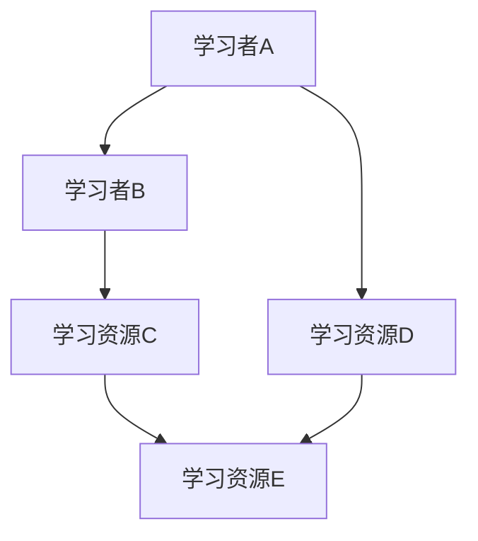
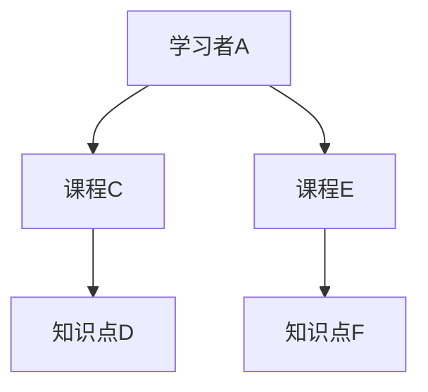
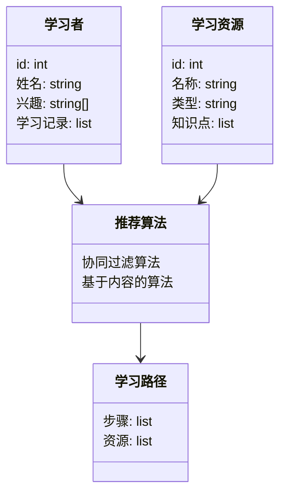

                 


# AI Agent在智能个性化学习路径规划中的应用

> 关键词：AI Agent，个性化学习，路径规划，推荐算法，系统架构

> 摘要：本文探讨了AI Agent在智能个性化学习路径规划中的应用，通过分析学习路径规划的核心问题，介绍了AI Agent的基本原理和算法实现。同时，本文详细讲解了基于协同过滤和基于内容的推荐算法，并结合实际案例，展示了如何利用这些算法为学习者提供个性化的学习路径规划。

---

## 第一部分：背景介绍

### 第1章：问题背景与问题描述

#### 1.1 问题背景
个性化学习路径规划是教育技术领域的重要课题，旨在根据学习者的特点和需求，为其量身定制最优的学习路径。然而，传统的学习路径规划方法往往依赖固定的知识体系和规则，难以适应不同学习者的个性化需求。AI Agent（人工智能代理）作为一种能够感知环境、自主决策的技术，为解决这一问题提供了新的可能性。

#### 1.2 问题描述
学习路径规划的核心问题包括：
- **学习者需求的多样性**：每个学习者的学习目标、兴趣和能力各不相同。
- **知识体系的复杂性**：知识体系庞大且动态变化，如何在其中选择最优路径是一个复杂的优化问题。
- **学习路径规划的动态性**：学习者的需求和知识体系可能会随时间发生变化，需要动态调整路径规划。

#### 1.3 问题解决思路
AI Agent在学习路径规划中的作用主要体现在以下几个方面：
- **数据驱动的个性化推荐**：通过分析学习者的历史行为数据和特征数据，AI Agent能够为每个学习者推荐最适合的学习资源和路径。
- **多目标优化**：AI Agent可以同时考虑多个目标（如学习效率、兴趣度、知识掌握程度等），实现全局最优的路径规划。
- **动态调整**：AI Agent能够实时感知学习者的反馈和知识体系的变化，动态调整学习路径。

#### 1.4 边界与外延
AI Agent在学习路径规划中的应用有以下边界和外延：
- **应用边界**：AI Agent主要用于个性化推荐和路径规划，不涉及具体的教学内容设计。
- **与其他教育技术的关联**：AI Agent可以与自然语言处理（NLP）、计算机视觉等技术结合，提升学习路径规划的智能化水平。
- **未来趋势**：随着AI技术的发展，学习路径规划将更加智能化和个性化，可能进一步融入虚拟现实（VR）和增强现实（AR）等技术。

---

## 第二部分：核心概念与联系

### 第2章：AI Agent的核心原理

#### 2.1 AI Agent的基本原理
AI Agent是一种能够感知环境、自主决策并执行任务的智能体。在学习路径规划中，AI Agent通过以下步骤实现个性化推荐：
1. **数据采集**：收集学习者的行为数据（如学习时间、完成任务情况、考试成绩等）和特征数据（如兴趣爱好、学习风格等）。
2. **数据处理**：对收集到的数据进行清洗、特征提取和预处理。
3. **模型训练**：利用机器学习算法（如协同过滤、基于内容的推荐等）训练推荐模型。
4. **路径规划**：根据模型输出的结果，生成个性化学习路径。
5. **反馈优化**：根据学习者的反馈，优化模型和路径规划。

#### 2.2 核心概念与对比分析
以下是AI Agent中几种核心推荐模型的对比：

| 模型类型       | 基于规则的推荐 | 基于协同过滤的推荐 | 基于内容的推荐 |
|----------------|----------------|--------------------|----------------|
| 基本原理       | 根据预设的规则（如课程顺序）进行推荐 | 根据用户行为的相似性进行推荐 | 根据课程内容的特征进行推荐 |
| 优点           | 实现简单，易于解释 | 能够发现用户的隐性需求 | 推荐结果具有较高的语义相关性 |
| 缺点           | 无法适应用户的个性化需求 | 需要大量的用户行为数据 | 内容特征的提取可能较为复杂 |

---

## 第三部分：算法原理

### 第3章：推荐算法的实现

#### 3.1 协同过滤算法
协同过滤是一种基于用户行为相似性的推荐算法。其基本思路是：如果两个用户在历史行为上相似，则他们对未尝试过的项目可能有相似的偏好。

##### 协同过滤的实现流程（mermaid图）



##### 协同过滤的数学模型
协同过滤的核心是计算用户之间的相似度，常用余弦相似度公式：

$$ \text{相似度}(u, v) = \frac{\sum_{i} u_i v_i}{\sqrt{\sum_{i} u_i^2} \cdot \sqrt{\sum_{i} v_i^2}} $$

---

#### 3.2 基于内容的推荐算法
基于内容的推荐算法通过分析学习资源的内容特征（如课程主题、知识点等），为学习者推荐相关性较高的资源。

##### 基于内容的推荐流程（mermaid图）



##### 基于内容的推荐模型
基于内容的推荐通常使用向量空间模型（Vector Space Model）。假设我们有$m$个知识点，每个知识点可以表示为一个$m$维的向量：

$$ \text{知识点向量} = [v_1, v_2, ..., v_m] $$

学习者的兴趣向量可以表示为：

$$ \text{兴趣向量} = [u_1, u_2, ..., u_m] $$

推荐结果可以通过计算兴趣向量与知识点向量的相似度来确定：

$$ \text{相似度} = \frac{\sum_{i=1}^{m} u_i v_i}{\sqrt{\sum_{i=1}^{m} u_i^2} \cdot \sqrt{\sum_{i=1}^{m} v_i^2}} $$

---

## 第四部分：系统分析与架构设计

### 第4章：系统分析与架构设计

#### 4.1 系统场景介绍
学习路径规划系统的主要场景包括：
- 学习者注册与登录
- 学习资源推荐
- 学习路径生成
- 学习反馈收集

#### 4.2 系统功能设计

##### 领域模型（mermaid类图）



---

## 第五部分：项目实战

### 第5章：项目实战

#### 5.1 环境安装
为了实现学习路径规划系统，我们需要安装以下工具和库：
- Python 3.8+
- NumPy
- scikit-learn
- pandas

#### 5.2 核心代码实现

##### 协同过滤算法的实现

```python
from sklearn.metrics.pairwise import cosine_similarity

def collaborative_filtering(user_data):
    # 计算用户相似度矩阵
    user_similarity = cosine_similarity(user_data)
    
    # 根据相似度进行推荐
    recommended_resources = []
    for i in range(len(user_data)):
        for j in range(len(user_data)):
            if i != j and user_similarity[i][j] > 0.7:
                recommended_resources.append(j)
    return recommended_resources
```

##### 基于内容的推荐算法的实现

```python
from sklearn.feature_extraction.text import TfidfVectorizer

def content_based_recommendation(course_descriptions):
    vectorizer = TfidfVectorizer()
    tfidf_matrix = vectorizer.fit_transform(course_descriptions)
    # 计算相似度
    similarity_matrix = cosine_similarity(tfidf_matrix)
    # 根据相似度进行推荐
    recommended_courses = []
    for i in range(len(similarity_matrix)):
        top_n = 3  # 推荐前3个相似的课程
        recommended_courses.append(similarity_matrix[i].argsort()[-top_n:])
    return recommended_courses
```

#### 5.3 案例分析
假设我们有以下学习资源和学习者数据：

```python
学习资源描述 = [
    "数学基础", 
    "编程入门", 
    "数据结构与算法", 
    "人工智能导论"
]
```

学习者兴趣：数学、编程

运行上述代码，协同过滤算法和基于内容的推荐算法分别生成推荐结果。协同过滤算法可能推荐“编程入门”和“数据结构与算法”，而基于内容的推荐算法可能推荐“数学基础”和“人工智能导论”。

---

## 第六部分：总结与展望

### 第6章：总结与展望

#### 6.1 最佳实践
- 在实际应用中，可以结合协同过滤和基于内容的推荐算法，提升推荐的准确性和多样性。
- 定期更新学习资源库，确保推荐结果的时效性。

#### 6.2 小结
本文详细介绍了AI Agent在智能个性化学习路径规划中的应用，从核心概念、算法原理到系统设计和项目实战，全面阐述了如何利用AI技术实现个性化的学习路径规划。

#### 6.3 注意事项
- 学习路径规划系统需要考虑数据隐私和安全问题。
- 在实际应用中，需要根据具体需求选择合适的推荐算法。

#### 6.4 拓展阅读
- 《推荐系统实战》
- 《机器学习算法详解》
- 《教育技术与人工智能》

---

通过本文的介绍，读者可以深入了解AI Agent在学习路径规划中的应用，并能够根据实际需求，设计和实现个性化的学习路径规划系统。

