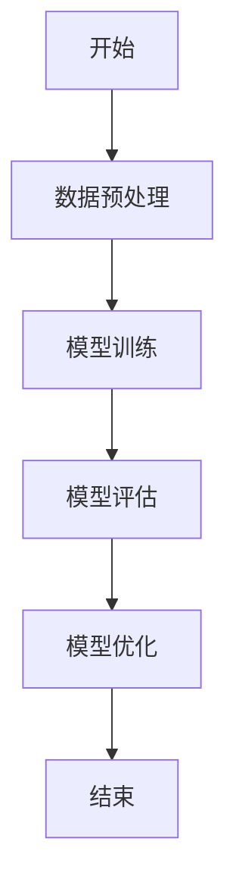
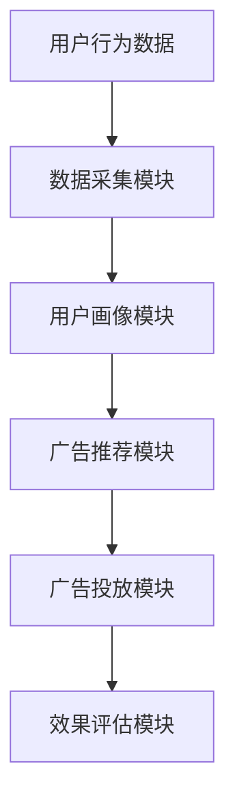
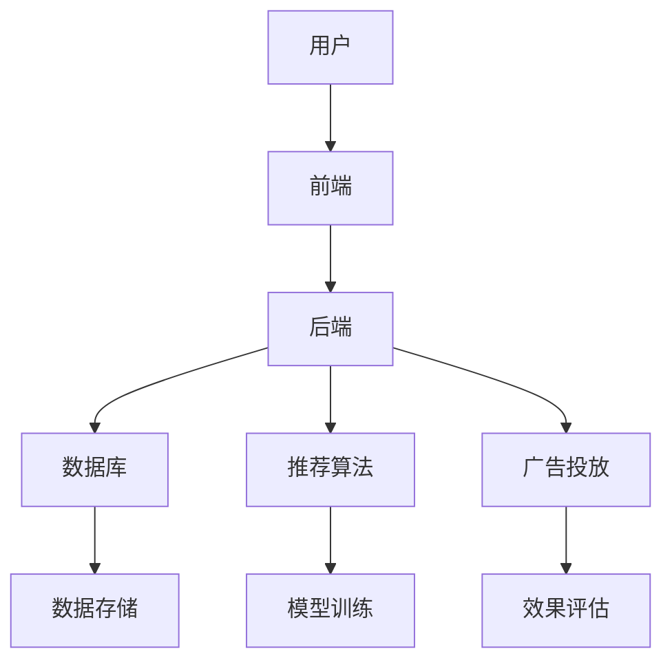
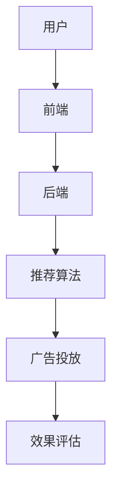

                 


# AI Agent在智能个性化广告投放中的应用

> 关键词：AI Agent, 智能广告, 个性化推荐, 机器学习, 广告投放

> 摘要：本文深入探讨AI Agent在智能个性化广告投放中的应用，从核心原理到系统架构，结合实际案例分析，详细讲解如何利用AI技术实现精准广告投放，提升广告效果和用户体验。

---

# 第一部分: AI Agent与智能广告概述

## 第1章: AI Agent与智能广告概述

### 1.1 AI Agent的基本概念

AI Agent（人工智能代理）是一种能够感知环境、执行任务并做出决策的智能实体。在广告领域，AI Agent能够根据用户行为和数据，自动优化广告投放策略。

#### 1.1.1 AI Agent的定义与特点

- **定义**：AI Agent是通过算法和数据驱动，能够自主学习和优化的智能系统。
- **特点**：
  - 自主性：能够独立决策和执行。
  - 反应性：实时感知环境变化并做出响应。
  - 学习能力：通过数据不断优化自身的算法模型。

### 1.2 智能个性化广告的背景与重要性

#### 1.2.1 广告投放的演变历程

从传统的粗放式广告投放，到基于用户数据的精准投放，AI Agent的应用标志着广告投放进入了智能化阶段。

#### 1.2.2 个性化广告的核心价值

个性化广告能够提高广告点击率和转化率，同时为用户提供更相关的内容，增强用户体验。

#### 1.2.3 AI Agent在广告投放中的优势

- 提高效率：AI Agent能够快速处理大量数据，优化广告投放策略。
- 实时响应：能够根据用户实时行为调整广告内容。
- 精准定位：通过深度学习模型，实现精准的用户画像和行为分析。

### 1.3 本章小结

本章介绍了AI Agent的基本概念和特点，并探讨了智能个性化广告的背景和重要性，以及AI Agent在广告投放中的优势。

---

# 第二部分: AI Agent的核心原理与广告投放逻辑

## 第2章: AI Agent的核心原理

### 2.1 AI Agent的核心算法与模型

#### 2.1.1 监督学习与无监督学习在AI Agent中的应用

- **监督学习**：用于分类任务，如用户点击广告的概率预测。
- **无监督学习**：用于聚类任务，如用户行为模式的识别。

#### 2.1.2 强化学习在广告投放中的应用

强化学习通过奖励机制，优化广告投放策略，例如动态调整广告预算分配。

#### 2.1.3 深度学习模型在AI Agent中的作用

深度学习模型（如神经网络）用于复杂模式识别，如用户意图预测。

### 2.2 AI Agent的广告投放逻辑

#### 2.2.1 广告投放的基本流程

1. 数据采集：收集用户行为数据、广告点击数据等。
2. 用户画像构建：基于数据生成用户画像。
3. 广告推荐：根据用户画像推荐广告内容。
4. 效果评估：分析广告效果，优化投放策略。

#### 2.2.2 AI Agent在广告投放中的决策机制

- 多目标优化：同时考虑广告点击率、转化率等多个目标。
- 动态调整：根据实时数据动态调整广告投放策略。

#### 2.2.3 广告效果的评估与优化

- A/B测试：比较不同广告策略的效果。
- 持续优化：基于反馈不断优化模型。

### 2.3 AI Agent与广告投放的结合

#### 2.3.1 AI Agent在广告投放中的应用场景

- 精准定位：基于用户画像进行广告投放。
- 动态优化：实时调整广告策略。
- 跨平台投放：在多个渠道上协调广告投放。

#### 2.3.2 AI Agent如何实现个性化广告推荐

通过分析用户的兴趣、行为和历史数据，推荐相关的广告内容。

#### 2.3.3 AI Agent在广告投放中的优势与挑战

优势：
- 提高广告效果：精准投放和个性化推荐。
- 降低成本：优化广告预算分配。
- 提高效率：自动化处理大量数据。

挑战：
- 数据隐私：如何保护用户数据隐私。
- 模型复杂性：复杂模型的开发和维护成本较高。

### 2.4 本章小结

本章详细讲解了AI Agent的核心算法与模型，分析了广告投放的基本流程和决策机制，探讨了AI Agent在广告投放中的优势与挑战。

---

# 第三部分: 智能个性化广告投放中的用户画像与行为分析

## 第3章: 用户画像与行为分析

### 3.1 用户画像的构建

#### 3.1.1 用户画像的基本概念与构建方法

- **用户画像**：基于用户数据构建的用户特征模型，用于描述用户的行为、兴趣和需求。
- **构建方法**：
  - 数据采集：收集用户的行为数据、点击数据等。
  - 特征提取：从数据中提取有用的特征，如年龄、性别、兴趣爱好等。
  - 数据建模：使用机器学习模型构建用户画像。

#### 3.1.2 数据采集与特征提取

- 数据采集：通过网站日志、用户调查等方式获取用户数据。
- 特征提取：从数据中提取关键特征，如用户的点击行为、浏览时间等。

#### 3.1.3 用户画像的分类与应用

- 分类：基于用户行为、兴趣等特征，将用户分为不同的群体。
- 应用：用于广告推荐、用户分群、精准营销等。

### 3.2 用户行为分析

#### 3.2.1 用户行为的基本分类

- **显式行为**：用户主动的行为，如点击、注册、购买等。
- **隐式行为**：用户间接的行为，如浏览、停留时间等。

#### 3.2.2 用户行为数据的采集与处理

- 数据采集：通过日志记录、传感器数据等方式获取用户行为数据。
- 数据处理：清洗、归一化、特征工程等。

#### 3.2.3 用户行为分析的常见方法

- **聚类分析**：将用户分为不同的群体，如高活跃用户、低活跃用户等。
- **序列分析**：分析用户行为的序列，发现行为模式。
- **因果分析**：分析用户行为背后的原因。

### 3.3 用户画像与行为分析在广告投放中的应用

#### 3.3.1 用户画像在广告定向中的作用

- 精准定位：基于用户画像进行广告定向，提高广告的相关性和转化率。

#### 3.3.2 用户行为分析在广告效果优化中的应用

- 优化广告内容：根据用户行为分析结果，优化广告内容和投放策略。

#### 3.3.3 用户画像与行为分析的结合

- 综合应用：将用户画像和行为分析结合起来，实现更加精准的广告投放。

### 3.4 本章小结

本章详细讲解了用户画像的构建方法和用户行为分析的常见方法，并探讨了它们在广告投放中的应用。

---

# 第四部分: AI Agent在广告推荐中的算法实现

## 第4章: AI Agent的推荐算法

### 4.1 协同过滤算法

#### 4.1.1 协同过滤的基本原理

- **协同过滤**：基于用户之间的相似性，推荐相似用户的喜好。

#### 4.1.2 基于用户的协同过滤算法

- **算法流程**：
  1. 收集用户数据。
  2. 计算用户之间的相似度。
  3. 根据相似用户的偏好推荐广告。

#### 4.1.3 基于物品的协同过滤算法

- **算法流程**：
  1. 收集物品数据。
  2. 计算物品之间的相似度。
  3. 根据用户的历史行为推荐相似物品。

### 4.2 深度学习模型

#### 4.2.1 神经网络模型在广告推荐中的应用

- **多层感知机（MLP）**：用于分类任务，如广告点击率预测。
- **卷积神经网络（CNN）**：用于处理图像类广告内容。
- **循环神经网络（RNN）**：用于处理序列数据，如用户行为序列分析。

#### 4.2.2 基于深度学习的广告推荐模型

- **模型结构**：
  - 输入层：接收用户和广告的特征。
  - 隐藏层：提取特征并进行非线性变换。
  - 输出层：预测广告的点击率或转化率。

#### 4.2.3 深度学习模型的优势

- **特征表达能力**：能够自动提取复杂的特征关系。
- **非线性关系**：能够处理复杂的非线性关系。

### 4.3 AI Agent推荐算法的实现

#### 4.3.1 算法实现步骤

1. 数据预处理：清洗数据、特征工程等。
2. 模型训练：基于训练数据训练推荐模型。
3. 模型评估：使用测试数据评估模型性能。
4. 模型优化：调整模型参数，优化性能。

#### 4.3.2 算法实现代码示例

```python
# 示例代码：基于协同过滤的推荐算法
def collaborative_filtering(train_data, test_data):
    # 计算用户相似度
    user_similarity = compute_user_similarity(train_data)
    # 推荐广告
    recommendations = []
    for user in test_data.users:
        similar_users = find_top_k_similar_users(user, user_similarity)
        recommended_ads = get_top_k_recommended_ads(similar_users, train_data)
        recommendations.append(recommended_ads)
    return recommendations
```

#### 4.3.3 算法流程图



### 4.4 本章小结

本章详细讲解了AI Agent在广告推荐中的算法实现，包括协同过滤算法和深度学习模型的应用。

---

# 第五部分: 系统架构设计与实现

## 第5章: 系统架构设计

### 5.1 系统功能设计

#### 5.1.1 系统功能模块

- 数据采集模块：负责收集用户行为数据、广告点击数据等。
- 用户画像模块：构建用户画像，分析用户行为。
- 广告推荐模块：基于用户画像和行为分析结果，推荐广告内容。
- 广告投放模块：根据推荐结果，进行广告投放。
- 效果评估模块：分析广告效果，优化投放策略。

#### 5.1.2 系统功能流程图



### 5.2 系统架构设计

#### 5.2.1 系统架构图



#### 5.2.2 接口设计

- 数据接口：与数据源对接，获取用户行为数据。
- 推荐接口：提供广告推荐服务，供前端调用。
- 投放接口：控制广告投放，记录广告点击数据。

#### 5.2.3 交互流程图



### 5.3 本章小结

本章详细讲解了系统的功能设计和架构设计，包括各个模块的职责和交互流程。

---

# 第六部分: 项目实战与优化

## 第6章: 项目实战

### 6.1 环境搭建

#### 6.1.1 环境要求

- 操作系统：Windows/Mac/Linux
- 开发工具：Python、Jupyter Notebook、IDE（如PyCharm）
- 依赖库：NumPy、Pandas、Scikit-learn、TensorFlow等。

#### 6.1.2 安装依赖

```bash
pip install numpy pandas scikit-learn tensorflow
```

### 6.2 系统核心实现

#### 6.2.1 数据预处理

```python
import pandas as pd
data = pd.read_csv('广告数据.csv')
data = data.dropna()
```

#### 6.2.2 用户画像构建

```python
from sklearn.cluster import KMeans
user_features = data[['年龄', '性别', '兴趣']]
kmeans = KMeans(n_clusters=3)
user_clusters = kmeans.fit_predict(user_features)
```

#### 6.2.3 广告推荐算法实现

```python
from sklearn.metrics.pairwise import cosine_similarity
user_similarity = cosine_similarity(user_features)
```

#### 6.2.4 广告投放与效果评估

```python
from sklearn.metrics import accuracy_score
y_true = data['点击']
y_pred = model.predict(data[['用户特征']])
accuracy = accuracy_score(y_true, y_pred)
print(f'准确率: {accuracy}')
```

### 6.3 案例分析与优化

#### 6.3.1 案例分析

- **案例背景**：某电商平台希望通过AI Agent优化广告投放策略。
- **数据来源**：用户点击数据、用户行为数据、产品数据。
- **目标**：提高广告点击率和转化率。

#### 6.3.2 优化建议

- **数据优化**：增加用户行为数据的收集维度，如停留时间、跳出率等。
- **模型优化**：尝试不同的机器学习模型，如随机森林、梯度提升树等。
- **实时优化**：建立实时反馈机制，根据用户实时行为调整广告推荐策略。

### 6.4 本章小结

本章通过实际项目案例，详细讲解了AI Agent在广告投放中的应用，包括环境搭建、数据预处理、模型训练和效果评估等步骤。

---

# 第七部分: 总结与展望

## 第7章: 总结与展望

### 7.1 总结

本文详细探讨了AI Agent在智能个性化广告投放中的应用，从核心原理到系统架构，结合实际案例分析，详细讲解了如何利用AI技术实现精准广告投放，提升广告效果和用户体验。

### 7.2 展望

未来，随着AI技术的不断发展，AI Agent在广告投放中的应用将更加广泛和深入。可以通过以下方式进一步优化：

- **多模态数据融合**：结合文本、图像、视频等多种数据源，提升广告推荐的精准度。
- **实时反馈机制**：建立实时反馈机制，根据用户实时行为动态调整广告推荐策略。
- **个性化广告生成**：利用生成式AI技术，生成个性化广告内容，如动态生成广告文案、图像等。

### 7.3 本章小结

本章总结了全文的主要内容，并展望了未来的研究方向和发展趋势。

---

# 关键词

AI Agent, 智能广告, 个性化推荐, 机器学习, 广告投放

---

# 摘要

本文深入探讨了AI Agent在智能个性化广告投放中的应用，从核心原理到系统架构，结合实际案例分析，详细讲解了如何利用AI技术实现精准广告投放，提升广告效果和用户体验。文章详细分析了AI Agent的核心算法与模型，包括监督学习、无监督学习、强化学习和深度学习在广告投放中的应用。同时，本文还介绍了用户画像与行为分析在广告投放中的应用，探讨了AI Agent在广告推荐中的算法实现，包括协同过滤算法和深度学习模型的应用。最后，本文通过实际项目案例，详细讲解了AI Agent在广告投放中的应用，包括环境搭建、数据预处理、模型训练和效果评估等步骤，并展望了未来的研究方向和发展趋势。

