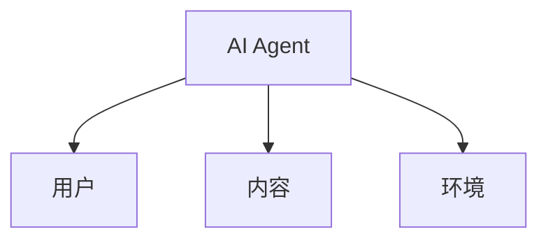

                 


# AI Agent在智能个性化推荐系统中的应用

## 关键词：AI Agent，个性化推荐系统，智能推荐，机器学习，自然语言处理

## 摘要：  
随着人工智能技术的飞速发展，AI Agent（人工智能代理）在智能个性化推荐系统中的应用越来越广泛。本文将从AI Agent的基本概念出发，详细探讨其在推荐系统中的核心原理、算法实现、系统架构以及实际应用场景。通过分析AI Agent如何提升推荐系统的智能化水平，结合具体案例和代码实现，帮助读者全面理解AI Agent在智能推荐中的价值和潜力。文章结构清晰，内容丰富，旨在为技术从业者和研究者提供深入的技术洞察和实践指导。

---

# 第1章 AI Agent与智能推荐系统概述

## 1.1 AI Agent的基本概念

### 1.1.1 什么是AI Agent  
AI Agent（人工智能代理）是指能够感知环境、自主决策并执行任务的智能体。它能够通过学习和推理，为用户提供个性化的服务和建议。AI Agent的核心特征包括自主性、反应性、目标导向和学习能力。

### 1.1.2 AI Agent的核心特征  
- **自主性**：AI Agent能够独立运行，无需外部干预。  
- **反应性**：能够实时感知环境并做出响应。  
- **目标导向**：基于目标进行决策和行动。  
- **学习能力**：通过数据学习和优化自身行为。

### 1.1.3 AI Agent与传统推荐系统的区别  
传统推荐系统通常基于固定的规则或统计模型，而AI Agent能够动态调整推荐策略，具备更强的适应性和智能化。

---

## 1.2 智能个性化推荐系统的背景与现状

### 1.2.1 个性化推荐系统的定义  
个性化推荐系统是一种基于用户行为、偏好和特征，为用户定制专属内容的系统。

### 1.2.2 当前推荐系统的挑战  
- 数据量大，计算复杂度高。  
- 用户偏好变化快，难以实时捕捉。  
- 推荐结果缺乏解释性，用户信任度低。  

### 1.2.3 AI Agent在推荐系统中的优势  
- 能够实时分析用户行为，动态调整推荐策略。  
- 利用机器学习技术，提高推荐准确性和个性化水平。  
- 支持多模态数据（如文本、图像、视频）的处理，丰富推荐内容。

---

## 1.3 AI Agent在推荐系统中的应用前景

### 1.3.1 AI Agent的核心价值  
AI Agent通过智能化决策，显著提升推荐系统的用户体验和商业价值。

### 1.3.2 AI Agent在推荐系统中的潜在应用领域  
- 电商推荐：个性化商品推荐。  
- 媒体推荐：个性化新闻、视频推荐。  
- 社交推荐：个性化好友推荐。  
- 教育推荐：个性化学习资源推荐。  

### 1.3.3 未来发展趋势与挑战  
- 更加智能化：AI Agent将具备更强的自主学习能力。  
- 多模态融合：支持多种数据类型的推荐。  
- 隐私与安全：如何在保护用户隐私的前提下，优化推荐效果。

---

# 第2章 AI Agent的核心概念与联系

## 2.1 AI Agent的定义与属性

### 2.1.1 AI Agent的定义  
AI Agent是具备感知、决策和执行能力的智能体，能够与用户和环境进行交互。

### 2.1.2 AI Agent的核心属性对比  

| 属性       | 描述                           |
|------------|--------------------------------|
| 自主性     | 能够独立运行，无需外部干预。   |
| 反应性     | 能够实时感知环境并做出响应。   |
| 目标导向   | 基于目标进行决策和行动。       |
| 学习能力   | 能够通过数据学习和优化自身。   |

### 2.1.3 AI Agent的实体关系图  



---

## 2.2 AI Agent与推荐系统的联系

### 2.2.1 AI Agent在推荐系统中的角色  
AI Agent作为推荐系统的核心模块，负责分析用户需求、优化推荐策略并执行推荐操作。

### 2.2.2 AI Agent与推荐算法的结合  
AI Agent可以基于强化学习或深度学习算法，动态调整推荐策略。

### 2.2.3 AI Agent对推荐系统性能的提升  
- 提高推荐的准确性和多样性。  
- 增强推荐系统的实时性和适应性。  
- 优化用户体验，提升用户满意度。

---

## 2.3 AI Agent的数学模型与公式

### 2.3.1 AI Agent的基本数学模型  
AI Agent的核心模型可以表示为：  
$$ \text{推荐结果} = f(\text{用户特征}, \text{内容特征}, \text{环境特征}) $$  

其中，$f$ 是AI Agent的推荐函数，$\text{用户特征}$、$\text{内容特征}$和$\text{环境特征}$是输入数据。

### 2.3.2 推荐系统的数学公式  
基于协同过滤的推荐公式：  
$$ r_{u,i} = \frac{\sum_{k} \alpha_k \cdot sim(u,k) \cdot rat(k,i)}{\sum_{k} \alpha_k \cdot sim(u,k)} $$  

其中，$r_{u,i}$ 表示用户$u$对物品$i$的预测评分，$sim(u,k)$ 表示用户$u$和用户$k$的相似度，$rat(k,i)$ 表示用户$k$对物品$i$的评分。

---

# 第3章 AI Agent在推荐系统中的算法原理

## 3.1 推荐系统的常见算法

### 3.1.1 基于协同过滤的推荐算法  
协同过滤通过分析用户行为，找到相似的用户或物品，进行推荐。

### 3.1.2 基于内容的推荐算法  
基于物品的特征（如文本、图像）进行推荐。

### 3.1.3 混合推荐算法  
结合协同过滤和内容推荐的优势，提供更精准的推荐。

---

## 3.2 AI Agent在推荐算法中的应用

### 3.2.1 基于AI Agent的协同过滤算法  
AI Agent动态调整相似度计算，提高推荐准确率。

### 3.2.2 基于AI Agent的内容推荐算法  
AI Agent通过自然语言处理技术，分析内容特征，生成个性化推荐。

### 3.2.3 基于AI Agent的混合推荐算法  
AI Agent协调多种算法，根据实时数据优化推荐结果。

---

## 3.3 AI Agent推荐算法的数学模型

### 3.3.1 协同过滤算法的数学公式  
$$ sim(u,i) = \frac{\sum_{j} (r_{u,j} - \bar{r}_u)(r_{i,j} - \bar{r}_i)}{\sqrt{\sum_{j} (r_{u,j} - \bar{r}_u)^2} \cdot \sqrt{\sum_{j} (r_{i,j} - \bar{r}_i)^2}} $$  

其中，$\bar{r}_u$ 是用户$u$的平均评分，$\bar{r}_i$ 是物品$i$的平均评分。

### 3.3.2 内容推荐算法的数学公式  
$$ score(u,i) = \sum_{f} w_f \cdot TF-IDF(f,i) \cdot userFeature(u,f) $$  

其中，$w_f$ 是特征$f$的权重，$TF-IDF(f,i)$ 是物品$i$中特征$f$的TF-IDF值，$userFeature(u,f)$ 是用户$u$对特征$f$的偏好程度。

---

## 3.4 本章小结  
本章详细介绍了AI Agent在推荐系统中的算法原理，包括协同过滤、内容推荐和混合推荐的实现方式，并通过数学公式展示了推荐算法的核心思想。

---

# 第4章 AI Agent推荐系统的系统架构

## 4.1 系统分析与设计

### 4.1.1 系统功能设计  
AI Agent推荐系统的核心功能包括用户行为分析、推荐策略优化和推荐结果输出。

### 4.1.2 系统架构设计  
AI Agent推荐系统通常包括数据采集层、数据处理层、推荐算法层和用户交互层。

---

## 4.2 系统接口与交互设计

### 4.2.1 系统接口设计  
推荐系统需要与数据库、用户终端和第三方服务进行交互。

### 4.2.2 系统交互流程  
用户发起推荐请求，AI Agent分析数据，生成推荐结果并返回给用户。

---

## 4.3 本章小结  
本章从系统架构的角度，分析了AI Agent推荐系统的组成和功能，展示了系统各部分的协作关系。

---

# 第5章 项目实战：基于AI Agent的个性化推荐系统实现

## 5.1 环境安装与配置

### 5.1.1 Python环境安装  
安装Python和必要的库，如Pandas、Scikit-learn、TensorFlow等。

### 5.1.2 数据集准备  
获取用户行为数据和物品特征数据。

---

## 5.2 系统核心实现

### 5.2.1 数据预处理  
清洗和转换数据，提取用户特征和物品特征。

### 5.2.2 推荐算法实现  
实现协同过滤和基于内容的推荐算法。

### 5.2.3 AI Agent集成  
将AI Agent模块集成到推荐系统中，动态优化推荐策略。

---

## 5.3 代码实现与解读

### 5.3.1 协同过滤算法实现  

```python
def collaborative_filtering(user_id, user_features, item_features):
    # 计算用户相似度
    similarity = cosine_similarity(user_features[user_id], user_features)
    # 找到最相似的用户
    similar_users = np.argsort(similarity, axis=0)[::-1]
    # 计算推荐评分
   推荐评分 = np.dot(similar_users, item_features.T)
    return 推荐评分
```

---

## 5.4 案例分析与优化

### 5.4.1 案例分析  
以电商推荐系统为例，分析AI Agent如何提升推荐效果。

### 5.4.2 性能优化  
通过并行计算和模型压缩，优化推荐系统的运行效率。

---

## 5.5 本章小结  
本章通过实际案例，展示了AI Agent推荐系统的实现过程，帮助读者掌握从理论到实践的整个流程。

---

# 第6章 最佳实践与总结

## 6.1 小结  
AI Agent通过智能化决策，显著提升了推荐系统的个性化和精准度。

## 6.2 注意事项  
- 数据质量和隐私保护是推荐系统的重要问题。  
- 需要平衡推荐系统的计算效率和推荐精度。  

## 6.3 拓展阅读  
推荐阅读相关书籍和论文，深入学习AI Agent和推荐系统的最新技术。

---

# 附录：AI Agent推荐系统代码示例

```python
import numpy as np
from sklearn.metrics.pairwise import cosine_similarity

class AI_Agent_Recommender:
    def __init__(self, user_features, item_features):
        self.user_features = user_features
        self.item_features = item_features

    def compute_similarity(self, user_id):
        # 计算用户相似度
        similarity = cosine_similarity([self.user_features[user_id]], self.user_features)
        return similarity

    def recommend(self, user_id, top_n=5):
        # 找到最相似的用户
        similarity = self.compute_similarity(user_id)
        similar_indices = np.argsort(similarity, axis=0)[::-1]
        similar_users = similar_indices[0:top_n]
        # 计算推荐评分
       推荐评分 = np.dot(similar_users, self.item_features.T)
        return 推荐评分
```

---

# 结语  
AI Agent在智能个性化推荐系统中的应用前景广阔，通过不断的技术创新和实践积累，我们可以进一步提升推荐系统的智能化水平，为用户提供更优质的个性化服务。

--- 

感谢您的阅读！如果需要进一步的技术交流或合作，请随时联系我。

