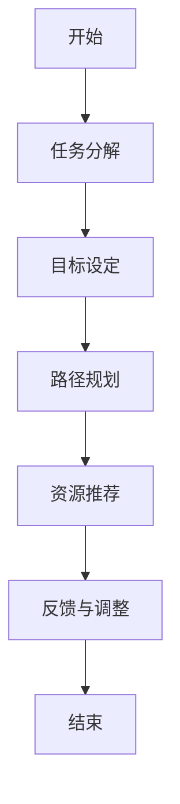
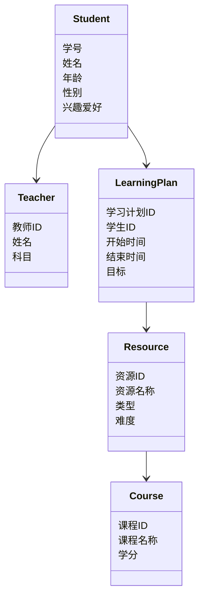

                 


# AI Agent在智能个性化教育规划中的应用

---

## 关键词  
AI Agent, 智能教育, 个性化学习, 教育规划, 机器学习, 多智能体协作  

---

## 摘要  
随着人工智能技术的快速发展，AI Agent（智能体）在教育领域的应用逐渐成为研究热点。本文聚焦于AI Agent在智能个性化教育规划中的应用，从问题背景、核心概念、算法原理、系统架构设计到项目实战，全面探讨如何利用AI Agent技术实现个性化教育规划。文章详细分析了AI Agent的原理、算法实现、系统架构，并通过具体案例展示了AI Agent在教育规划中的实际应用，最后总结了相关经验与未来研究方向。  

---

## 第一部分：背景与概述  

### 第1章：AI Agent的基本概念与背景  

#### 1.1 问题背景  
个性化教育的核心目标是为每个学生提供适合其学习风格、能力水平和兴趣的教育路径。然而，传统教育规划方法往往依赖教师的经验和主观判断，难以实现大规模个性化教学。随着人工智能技术的快速发展，AI Agent（智能体）作为一种能够感知环境、自主决策的智能系统，为个性化教育规划提供了新的可能性。  

#### 1.2 问题描述  
个性化教育规划的核心问题包括：  
1. 如何根据学生的学习数据（如成绩、兴趣、学习风格）生成个性化的学习计划。  
2. 如何动态调整学习计划以适应学生的学习进度和反馈。  
3. 如何利用多智能体协作优化教育资源的分配与利用。  

AI Agent通过感知学生的学习行为、分析数据、制定决策，能够有效地解决上述问题。  

#### 1.3 问题解决思路  
AI Agent在个性化教育规划中的应用思路包括：  
1. **数据采集**：通过传感器、学习管理系统等工具采集学生的学习数据。  
2. **数据分析**：利用机器学习算法分析数据，识别学生的学习模式和偏好。  
3. **任务分解**：将教育规划任务分解为多个子任务，如目标设定、路径规划、资源推荐等。  
4. **智能决策**：基于分析结果，AI Agent生成个性化的学习计划，并动态调整以适应学生的学习进度。  

#### 1.4 边界与外延  
AI Agent在教育规划中的应用边界包括：  
1. **数据隐私**：AI Agent需要处理学生的学习数据，必须确保数据隐私和安全。  
2. **适用范围**：AI Agent适用于大规模个性化教育场景，但对于小规模或特殊教育需求可能需要人工干预。  
3. **技术限制**：AI Agent的决策能力依赖于算法和数据质量，目前仍难以完全替代人类教师的创造力和情感支持。  

#### 1.5 核心概念  
AI Agent在教育规划中的核心概念包括：  
1. **智能体**：能够感知环境、自主决策的智能系统。  
2. **个性化学习路径**：根据学生特点定制的学习计划。  
3. **多智能体协作**：多个AI Agent协同工作以优化教育资源的分配与利用。  

---

## 第二部分：核心概念与联系  

### 第2章：AI Agent的原理与结构  

#### 2.1 核心原理  
AI Agent的核心原理包括：  
1. **感知与学习**：AI Agent通过感知环境数据（如学生的学习行为、成绩）进行学习，识别模式和规律。  
2. **推理与决策**：基于学习结果，AI Agent推理出最优决策，如推荐学习资源或调整学习计划。  
3. **执行与反馈**：AI Agent执行决策，并根据反馈不断优化自身的学习和决策过程。  

#### 2.2 属性特征对比  

| 特性           | 传统教育规划 | AI Agent驱动的教育规划 |
|----------------|--------------|--------------------------|
| **个性化程度** | 较低         | 高                      |
| **效率**       | 依赖人工     | 高效                   |
| **数据驱动**   | 有限         | 强大                   |
| **动态调整**   | 困难         | 灵活                   |

#### 2.3 ER实体关系图  
以下是个性化教育规划的ER实体关系图：  

```mermaid
erd
    student (学号, 姓名, 年龄, 性别, 兴趣爱好)
    teacher (教师ID, 姓名, 科目)
    course (课程ID, 课程名称, 学分)
    learning_plan (学习计划ID, 学生ID, 开始时间, 结束时间, 目标)
    resource (资源ID, 资源名称, 类型, 难度)
    interaction (互动记录ID, 学生ID, 教师ID, 时间, 内容)
    enrollment (学生ID, 课程ID, 入学时间)
```

---

## 第三部分：算法原理  

### 第3章：算法原理  

#### 3.1 任务分解算法  



代码实现：  
```python
def task_decomposition(students, courses):
    # 输入：学生列表、课程列表
    # 输出：每个学生的任务分解结果
    for student in students:
        for course in courses:
            # 分配任务
            pass
    return task_results
```

数学模型：  
$$ \text{任务分解} = \argmin_{x} \sum_{i=1}^{n} (d_i - x_i)^2 $$  

---

## 第四部分：系统架构设计  

### 第4章：系统架构设计  

#### 4.1 问题场景介绍  
系统需要支持大规模学生的学习规划，提供个性化的学习路径和资源推荐。  

#### 4.2 系统功能设计  



---

## 第五部分：项目实战  

### 第5章：项目实战  

#### 5.1 环境安装  
需要安装以下工具：  
1. Python 3.8+  
2. TensorFlow 2.0+  
3. Scikit-learn  
4. Mermaid工具  

#### 5.2 核心代码实现  

```python
import numpy as np
from sklearn.metrics import pairwise_distances

def personalized_learning_plan(students, courses):
    # 输入：学生特征矩阵，课程特征矩阵
    # 输出：每个学生的个性化学习计划
    plans = []
    for student in students:
        # 计算相似度
        similarity = pairwise_distances(student, courses)
        # 推荐课程
        recommended_courses = np.argsort(similarity)
        plans.append(recommended_courses)
    return plans
```

#### 5.3 案例分析  
以一名学生为例，假设其兴趣爱好为数学，学习风格为视觉型，生成个性化学习计划。  

---

## 第六部分：最佳实践  

### 第6章：最佳实践  

#### 6.1 小结  
AI Agent在个性化教育规划中的应用为教育领域带来了新的可能性，能够显著提升教育效率和质量。  

#### 6.2 注意事项  
1. 数据隐私保护必须放在首位。  
2. 算法的可解释性需要加强，以便教师和家长理解AI决策过程。  
3. 多智能体协作的复杂性较高，需要进行充分的系统测试。  

#### 6.3 未来研究方向  
1. 开发更高效的AI Agent算法，提升个性化教育的效果。  
2. 探索AI Agent与增强现实（AR）等新技术的结合。  
3. 研究如何在AI Agent中融入伦理和情感因素，提升教育的人文关怀。  

---

## 结语  
通过本文的详细探讨，我们可以看到AI Agent在个性化教育规划中的巨大潜力。随着技术的不断进步，AI Agent将为教育领域带来更多创新和突破。  

--- 

**全文完**

