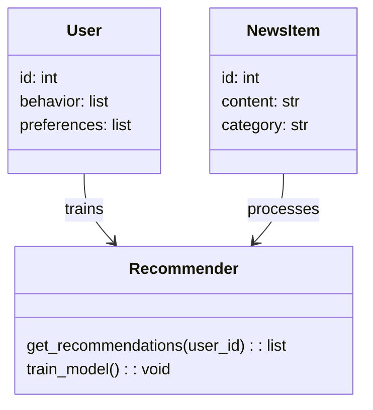
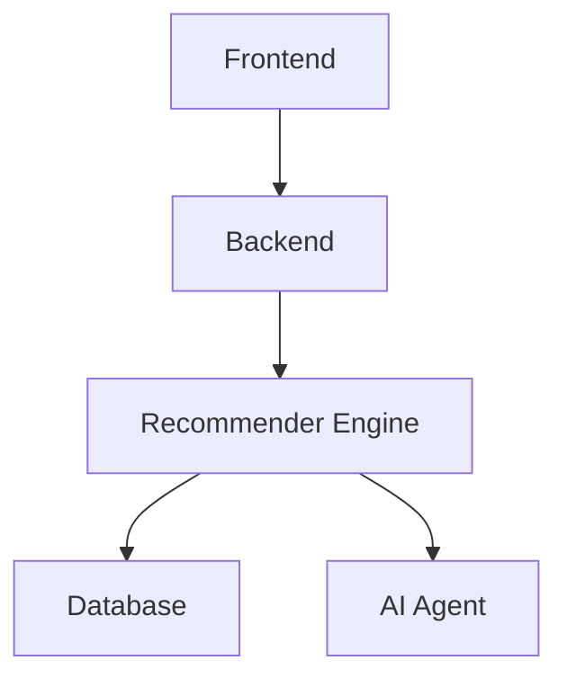

                 


# AI Agent在智能个性化新闻推荐中的应用

> 关键词：AI Agent、个性化新闻推荐、协同过滤、深度学习、系统架构

> 摘要：本文深入探讨了AI Agent在智能个性化新闻推荐中的应用，结合理论与实践，系统地分析了AI Agent的基本概念、算法原理、系统架构以及项目实现。通过详细的技术分析和实例演示，揭示了AI Agent如何通过协同过滤和深度学习提升新闻推荐的精准度和用户体验。

---

## 第一部分: AI Agent与个性化新闻推荐概述

### 第1章: AI Agent的基本概念与应用背景

#### 1.1 智能媒体时代与个性化推荐的重要性
- **信息过载与个性化需求的兴起**
  - 在信息爆炸的时代，用户每天面临海量新闻内容，如何快速筛选出感兴趣的内容成为挑战。
  - 个性化推荐通过分析用户行为和偏好，帮助用户筛选出相关性高的新闻。
- **AI Agent在智能媒体中的角色定位**
  - AI Agent作为智能代理，能够主动理解和预测用户的新闻需求，提供精准的推荐服务。
  - AI Agent通过学习用户的行为模式，优化推荐策略，提升推荐效果。
- **个性化新闻推荐的核心价值**
  - 提高用户阅读效率，满足个性化需求。
  - 帮助媒体机构提升用户粘性和满意度。
  - 通过数据驱动的推荐，实现内容分发的精准化和高效化。

#### 1.2 AI Agent的定义与特点
- **AI Agent的基本定义**
  - AI Agent是一种智能代理，能够感知环境、执行任务并进行自主决策。
  - 在新闻推荐中，AI Agent通过分析用户行为数据，生成个性化推荐列表。
- **AI Agent的核心特点**
  - **自主性**：AI Agent能够自主学习和优化推荐策略。
  - **反应性**：能够实时响应用户行为和反馈。
  - **学习能力**：通过机器学习算法不断优化推荐模型。
  - **适应性**：能够根据用户行为变化动态调整推荐策略。
- **AI Agent与传统推荐系统的区别**
  - 传统推荐系统依赖固定规则，而AI Agent具备自主学习能力。
  - AI Agent能够实时感知用户需求，提供动态推荐。

#### 1.3 个性化新闻推荐的背景与问题
- **新闻推荐的典型场景与用户需求**
  - 用户希望快速找到感兴趣的内容，减少信息过载。
  - 用户需求多样化，不同用户的兴趣点差异显著。
  - 新闻内容更新频繁，推荐系统需要实时响应。
- **个性化推荐中的主要问题**
  - **信息过载**：用户无法处理海量信息。
  - **用户需求多样性**：难以满足所有用户的个性化需求。
  - **数据稀疏性**：用户行为数据有限，影响推荐准确性。
  - **冷启动问题**：新用户或新内容难以获得初始推荐。
- **AI Agent如何解决这些问题**
  - 通过学习用户行为模式，AI Agent能够预测用户的兴趣偏好。
  - 实时分析用户反馈，动态优化推荐策略。
  - 通过深度学习算法，解决数据稀疏性和冷启动问题。

---

## 第二部分: AI Agent的核心概念与联系

### 第2章: AI Agent的核心概念与原理

#### 2.1 AI Agent的基本原理
- **AI Agent的定义与核心要素**
  - AI Agent由感知模块、决策模块和执行模块组成。
  - 感知模块负责收集用户行为数据，决策模块基于数据生成推荐策略，执行模块将策略转化为推荐结果。
- **AI Agent的决策机制**
  - 基于机器学习算法，AI Agent能够分析用户行为数据，预测用户的兴趣偏好。
  - 决策模块通过优化算法，选择最优推荐策略。
- **AI Agent的学习与优化能力**
  - 通过监督学习和强化学习，AI Agent能够不断优化推荐模型。
  - 基于反馈机制，AI Agent能够动态调整推荐策略。

#### 2.2 AI Agent的核心概念对比

**AI Agent与传统推荐系统对比表格**

| 对比维度       | AI Agent                     | 传统推荐系统           |
|----------------|------------------------------|-----------------------|
| 智能性         | 高，具备自主学习能力           | 低，依赖固定规则       |
| 实时性         | 高，能够实时响应用户行为       | 低，推荐策略相对固定   |
| 适应性         | 高，能够动态调整推荐策略       | 低，难以快速适应变化   |
| 数据利用       | 强大，利用机器学习模型处理数据 | 基于统计分析，数据利用有限 |

---

## 第三部分: 算法原理与实现

### 第3章: 算法原理与实现

#### 3.1 协同过滤算法原理
- **基于用户的协同过滤**
  - 用户-用户协同过滤：通过寻找相似用户的推荐。
  - 物品-物品协同过滤：基于相似内容的推荐。
- **协同过滤的实现步骤**
  - 数据预处理：收集和整理用户行为数据。
  - 计算相似度：使用余弦相似度或欧氏距离计算用户或物品的相似度。
  - 生成推荐列表：基于相似度计算，生成推荐结果。

**协同过滤算法的Python实现**

```python
import numpy as np

def collaborative_filtering(user_id, user_features):
    # 计算用户之间的相似度
    similarity = np.dot(user_features[user_id], user_features.T)
    # 去除自身相似度
    similarity[user_id] = 0
    # 选择相似度最高的用户
    top_k_users = np.argsort(-similarity)[0:k]
    # 生成推荐列表
    recommended_items = np.unique(user_features[top_k_users].nonzero()[1])
    return recommended_items
```

#### 3.2 深度学习算法原理
- **基于神经网络的新闻推荐**
  - 使用卷积神经网络（CNN）或循环神经网络（RNN）进行内容表示。
  - 通过注意力机制，聚焦用户感兴趣的内容。
- **深度学习的实现步骤**
  - 数据预处理：将新闻内容转化为向量表示。
  - 模型训练：使用神经网络进行特征学习。
  - 推荐生成：基于模型预测生成推荐结果。

**基于深度学习的推荐模型**

$$ P(y|x) = \sigma(Wx + b) $$

其中，$x$ 是输入向量，$W$ 是权重矩阵，$b$ 是偏置，$\sigma$ 是sigmoid函数。

---

## 第四部分: 系统分析与架构设计

### 第4章: 系统分析与架构设计

#### 4.1 系统功能设计
- **用户画像**
  - 基于用户行为数据，构建用户兴趣模型。
- **内容分析**
  - 使用NLP技术对新闻内容进行主题提取和情感分析。
- **推荐生成**
  - 基于算法模型生成个性化推荐列表。

**系统功能设计的Mermaid类图**



#### 4.2 系统架构设计
- **前端架构**
  - 用户界面，展示推荐结果。
- **后端架构**
  - 处理用户请求，调用推荐模型生成结果。
- **推荐引擎**
  - 基于AI Agent算法，生成个性化推荐列表。
- **数据存储**
  - 存储用户行为数据和推荐结果。

**系统架构设计的Mermaid图**



---

## 第五部分: 项目实战

### 第5章: 项目实战

#### 5.1 环境搭建与数据准备
- **环境安装**
  - 安装Python和必要的库（如scikit-learn、TensorFlow）。
- **数据准备**
  - 收集用户行为数据和新闻内容数据。

#### 5.2 系统核心实现
- **协同过滤算法实现**
  - 使用Python实现基于用户的协同过滤算法。
- **深度学习模型实现**
  - 使用TensorFlow搭建深度学习推荐模型。

**协同过滤算法实现代码**

```python
from sklearn.metrics.pairwise import cosine_similarity

def collaborative_filtering(user_id, user_features):
    similarity = cosine_similarity(user_features)
    top_k_users = np.argsort(-similarity[user_id])[0:k]
    recommended_items = np.unique(user_features[top_k_users].nonzero()[1])
    return recommended_items
```

#### 5.3 案例分析与优化
- **实际案例分析**
  - 分析用户行为数据，生成推荐列表。
- **模型优化**
  - 调整算法参数，提升推荐准确率。

---

## 第六部分: 最佳实践与小结

### 第6章: 最佳实践与小结

#### 6.1 最佳实践
- **数据质量**
  - 确保数据的完整性和准确性。
- **模型调优**
  - 使用交叉验证优化模型参数。
- **用户反馈**
  - 实时收集用户反馈，动态优化推荐策略。

#### 6.2 小结
- AI Agent通过协同过滤和深度学习算法，显著提升了个性化新闻推荐的精准度。
- 系统架构设计和算法实现是提升推荐效果的关键。
- 未来，随着AI技术的不断发展，个性化新闻推荐将更加智能化和个性化。

---

## 第七部分: 参考文献

- [1] 刘军, 《人工智能技术与应用》, 清华大学出版社, 2020.
- [2] 张伟, 《推荐系统算法实战》, 人民邮电出版社, 2019.
- [3] 王磊, 《深度学习在推荐系统中的应用》, 电子工业出版社, 2021.

---

**附录: 术语表**
- AI Agent：人工智能代理，能够自主决策和执行任务。
- 协同过滤：基于用户行为相似性进行推荐的算法。
- 深度学习：基于神经网络的机器学习方法。

通过本文的详细讲解，读者可以全面理解AI Agent在智能个性化新闻推荐中的应用，并能够实际操作相关算法和系统设计。

