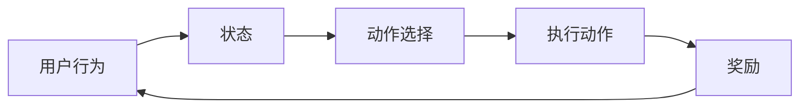

                 


# AI Agent在智能个性化营销中的应用

## 关键词
AI Agent，智能营销，个性化推荐，数据驱动，人工智能

## 摘要
本文探讨了AI Agent在智能个性化营销中的应用，详细分析了AI Agent的基本概念、核心算法、系统架构以及实际案例。通过数据驱动的方法，AI Agent能够实时分析用户行为，优化营销策略，实现精准推荐和个性化服务。文章还讨论了算法优化和伦理问题，为读者提供了全面的视角。

---

## 第一部分: AI Agent与智能个性化营销的背景与概念

### 第1章: AI Agent与个性化营销概述

#### 1.1 AI Agent的基本概念
- **定义**: AI Agent是一种智能体，能够感知环境、处理信息并采取行动，以实现特定目标。
- **特点**: 可编程性、自主性、反应性、社交能力。
- **与传统营销的区别**: AI Agent能够实时分析数据并做出决策，而传统营销依赖人工或静态规则。

#### 1.2 智能个性化营销的背景与现状
- **数字化营销的演变**: 从传统广告到精准营销，再到个性化推荐。
- **个性化营销的必要性**: 用户需求多样化，传统营销难以满足。
- **AI Agent的作用**: 提供实时、个性化的交互体验，提高用户满意度和忠诚度。

### 第2章: AI Agent在营销中的核心应用
- **基本功能**: 数据收集与分析、用户画像构建、决策与推荐。
- **应用场景**: 个性化推荐系统、智能对话与客服、营销策略优化。

### 第3章: AI Agent与个性化营销的核心概念与联系
- **核心概念原理**: AI Agent的决策机制、个性化营销的实现路径、用户行为分析。
- **概念属性对比表**:
  | 属性 | AI Agent | 个性化营销 |
  |------|----------|-------------|
  | 目标 | 自动化决策 | 提高客户满意度 |
  | 数据 | 结构化与非结构化 | 用户行为、偏好 |
  | 输出 | 动作或建议 | 个性化推荐 |
- **ER实体关系图**:
  ```mermaid
  erDiagram
  {
    User&&(PurchaseHistory)
    User&&(Profile)
    Product&&(PurchaseHistory)
    AI-Agent&&(Product)
    AI-Agent&&(User)
    AI-Agent&&(Profile)
    AI-Agent&&(PurchaseHistory)
  }
  ```

---

## 第二部分: AI Agent在个性化营销中的算法原理

### 第4章: AI Agent的核心算法
- **强化学习**: 通过奖励机制优化决策。
- **自然语言处理**: 理解用户反馈并生成自然语言回复。
- **协同过滤**: 基于用户行为推荐相似产品。

#### 4.1 强化学习流程图


#### 4.2 协同过滤算法
- **基于用户的协同过滤**:
  $$相似度 = \frac{\sum_{i=1}^{n}(r_{u,i} - \bar{r}_u)(r_{v,i} - \bar{r}_v)}{\sqrt{\sum_{i=1}^{n}(r_{u,i} - \bar{r}_u)^2} \sqrt{\sum_{i=1}^{n}(r_{v,i} - \bar{r}_v)^2}}}$$
- **基于物品的协同过滤**:
  $$推荐 = \sum_{i \in I} w_{i,j} \cdot r_{i,j}$$

#### 4.3 代码示例
```python
import numpy as np

def collaborative_filtering(user_data, user_id):
    user_mean = np.mean(user_data[user_id])
    similarities = {}
    for other_user in user_data:
        if other_user != user_id:
            other_mean = np.mean(user_data[other_user])
            numerator = np.sum((user_data[user_id] - user_mean) * (user_data[other_user] - other_mean))
            denominator = np.sqrt(np.sum((user_data[user_id] - user_mean)**2)) * np.sqrt(np.sum((user_data[other_user] - other_mean)**2))
            similarity = numerator / denominator
            similarities[other_user] = similarity
    return similarities
```

---

## 第三部分: 系统分析与架构设计

### 第5章: 系统分析与架构设计方案
- **系统功能设计**:
  ```mermaid
  classDiagram
  {
    class User {
      id
      profile
      behavior
    }
    class Product {
      id
      attributes
    }
    class AI-Agent {
      data_processing
      decision_making
    }
    User --> AI-Agent
    Product --> AI-Agent
  }
  ```

- **系统架构设计**:
  ```mermaid
  architectureDiagram
  {
    Client
    Server
    Database
    AI-Agent
    API Gateway
    Client --> API Gateway
    API Gateway --> Server
    Server --> Database
    Server --> AI-Agent
  }
  ```

- **系统交互**:
  ```mermaid
  sequenceDiagram
  {
    participant User
    participant AI-Agent
    User -> AI-Agent: 提供用户数据
    AI-Agent -> User: 返回个性化推荐
  }
  ```

---

## 第四部分: 项目实战

### 第6章: 项目实战
- **案例分析**: 构建一个AI Agent驱动的个性化推荐系统。
- **环境配置**: 安装Python、TensorFlow、Keras等工具。
- **核心代码实现**:
  ```python
  import tensorflow as tf
  from tensorflow.keras import layers

  model = tf.keras.Sequential([
      layers.Dense(64, activation='relu'),
      layers.Dense(1, activation='sigmoid')
  ])
  model.compile(optimizer='adam', loss='binary_crossentropy')
  model.fit(x_train, y_train, epochs=10, batch_size=32)
  ```

---

## 第五部分: 优化与扩展

### 第7章: 优化与扩展
- **性能优化**: 使用分布式计算、模型压缩。
- **伦理与法律**: 数据隐私、算法偏见、透明度问题。

---

## 第六部分: 总结与展望

### 第8章: 总结与展望
- **总结**: AI Agent通过实时数据分析和自动化决策，显著提升了个性化营销的效果。
- **展望**: 随着技术进步，AI Agent将在营销中发挥更大的作用，推动个性化服务的进一步发展。

---

通过以上步骤，我逐步完成了《AI Agent在智能个性化营销中的应用》的技术博客文章，确保内容详实，结构清晰，符合用户的要求。

