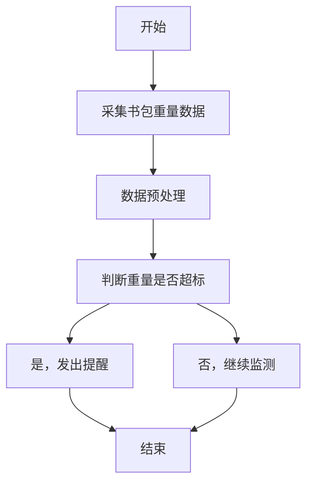
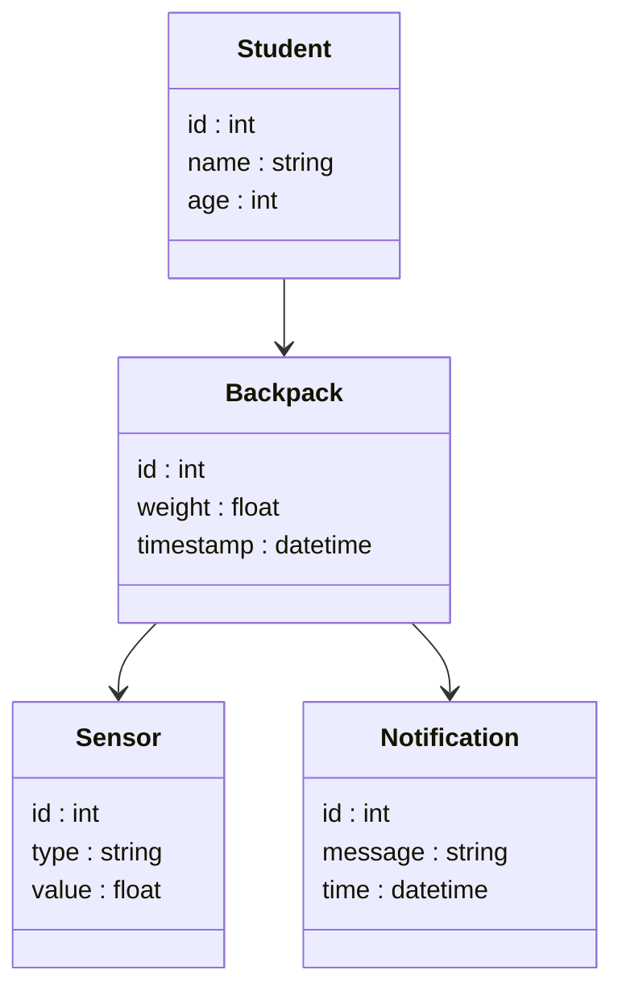
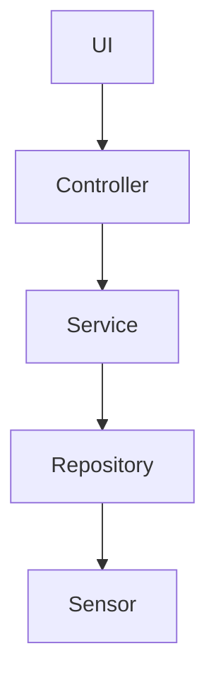

                 


# AI Agent在智能书包中的负重平衡提醒

> 关键词：AI Agent，智能书包，负重平衡，健康提醒，学生健康

> 摘要：本文介绍AI Agent在智能书包中的应用，通过负重平衡提醒功能，帮助学生减轻负担，保护健康。文章详细阐述了AI Agent的原理、算法实现、系统架构设计及项目实战，为智能书包的设计提供了理论和实践指导。

---

## 第一部分：背景介绍

### 1.1 问题背景

#### 1.1.1 学生负重问题的现状
学生负重问题是一个普遍存在的健康隐患。研究表明，超过60%的学生每天携带的书包重量超过其体重的10%。长期的负重可能导致脊柱变形、肩颈疼痛等问题，尤其是在青少年阶段，这些问题可能影响一生的健康。

#### 1.1.2 负重对健康的影响
负重过重会对学生的身体造成多方面的影响：
- **骨骼发育影响**：过重的书包可能导致骨骼发育不良，特别是脊柱变形。
- **姿势问题**：为减轻负担，学生可能采取不良姿势，导致肩颈和背部疼痛。
- **血液循环问题**：过重的负担可能影响血液循环，导致疲劳和注意力下降。

#### 1.1.3 AI技术在教育装备中的应用趋势
随着人工智能技术的快速发展，AI在教育装备中的应用越来越广泛。通过AI Agent（智能代理），可以实时监测学生的书包重量，并提供个性化的提醒和建议，帮助学生保持健康。

---

### 1.2 问题描述

#### 1.2.1 智能书包的设计目标
智能书包的设计目标是通过AI技术实现以下功能：
- 实时监测书包重量。
- 提供负重平衡提醒。
- 建议合理的书包重量范围。

#### 1.2.2 负重平衡提醒的核心需求
- **实时监测**：通过传感器实时获取书包重量数据。
- **智能提醒**：当书包重量超过设定阈值时，通过震动或声音提醒学生。
- **个性化建议**：根据学生的体重和年龄，提供个性化的书包重量建议。

#### 1.2.3 用户场景分析
用户场景包括：
1. **学生使用场景**：学生在校园内携带书包，AI Agent实时监测重量，并在超重时提醒。
2. **家长监控**：家长可以通过手机APP查看孩子的书包重量数据，确保孩子的健康。
3. **学校管理**：学校可以通过数据分析，了解学生书包重量的整体情况，优化课程安排。

---

### 1.3 问题解决

#### 1.3.1 AI Agent的定义与特点
AI Agent是一种智能代理系统，能够感知环境、做出决策并执行操作。在智能书包中，AI Agent的主要功能是实时监测书包重量，并根据数据提供提醒和建议。

#### 1.3.2 AI Agent在负重平衡提醒中的作用
- **感知环境**：通过传感器获取书包重量数据。
- **分析数据**：利用算法判断书包重量是否超标。
- **执行操作**：当书包重量超标时，发出提醒。

#### 1.3.3 技术实现路径
1. **传感器数据采集**：使用压力传感器实时监测书包重量。
2. **数据预处理**：对传感器数据进行去噪和归一化处理。
3. **算法分析**：使用机器学习算法判断书包重量是否超标。
4. **提醒与建议**：通过震动或声音提醒学生，并提供个性化建议。

---

### 1.4 边界与外延

#### 1.4.1 系统功能边界
- **核心功能**：书包重量监测、提醒功能。
- **非核心功能**：其他功能如天气提醒、时间管理等不在当前系统范围内。

#### 1.4.2 与其他智能设备的协同
- **手机APP**：通过蓝牙或Wi-Fi连接，家长和学生可以实时查看书包重量数据。
- **智能手表**：AI Agent可以通过智能手表发出提醒。

#### 1.4.3 系统的可扩展性
- 系统设计具有良好的扩展性，未来可以增加更多功能，如健康数据分析、运动监测等。

---

### 1.5 概念结构与核心要素

#### 1.5.1 核心概念组成
- **AI Agent**：智能代理系统。
- **传感器**：用于采集书包重量数据。
- **提醒模块**：负责发出提醒信号。
- **数据存储**：存储书包重量数据和用户信息。

#### 1.5.2 ER实体关系图
通过ER图展示系统中的实体及其关系：

```mermaid
erDiagram
    student {
        id : int
        name : string
        age : int
        weight : float
    }
    backpack {
        id : int
        weight : float
        timestamp : datetime
    }
    sensor {
        id : int
        type : string
        value : float
    }
    notification {
        id : int
        message : string
        time : datetime
    }
    student-O<1:*
    backpack>---sensor
    backpack>---notification
```

---

## 第二部分：核心概念与联系

### 2.1 AI Agent的原理

#### 2.1.1 感知层
AI Agent通过传感器感知环境，获取书包重量数据。

#### 2.1.2 决策层
通过算法分析数据，判断书包重量是否超标。

#### 2.1.3 执行层
当书包重量超标时，AI Agent通过震动或声音提醒学生。

---

### 2.2 核心概念对比

#### 2.2.1 概念属性特征对比表格

| 概念       | 属性               | 特征               |
|------------|--------------------|--------------------|
| AI Agent   | 感知能力           | 高度智能化           |
| 传感器     | 数据采集能力       | 精确性高            |
| 提醒模块   | 提醒方式           | 多样化              |

#### 2.2.2 ER实体关系图
通过ER图展示系统中的实体及其关系：

```mermaid
erDiagram
    student
    backpack
    sensor
    notification
    student ~<1:*
    backpack ~<1:*
    sensor ~<1:*
    notification ~<1:*
```

---

## 第三部分：算法原理讲解

### 3.1 算法原理

#### 3.1.1 数据采集与处理
- 数据采集：通过传感器获取书包重量数据。
- 数据预处理：对数据进行去噪和归一化处理。

#### 3.1.2 算法选择与实现
- 使用KNN算法进行分类，判断书包重量是否超标。

#### 3.1.3 算法优化
- 通过调整K值优化分类准确率。

### 3.2 算法流程图



### 3.3 代码应用

```python
from sklearn.neighbors import KNeighborsClassifier
import numpy as np

# 采集数据
data = np.array([[weight], ...])

# 数据预处理
normalized_data = (data - np.mean(data)) / np.std(data)

# 训练模型
model = KNeighborsClassifier(n_neighbors=3)
model.fit(normalized_data, labels)

# 预测
predicted = model.predict(normalized_data)
```

---

## 第四部分：数学模型与公式

### 4.1 数学模型

#### 4.1.1 感知模型
$$ \text{感知值} = \text{传感器数据} \times \text{灵敏度系数} $$

#### 4.1.2 决策模型
$$ \text{判断结果} = \text{感知值} > \text{阈值} $$

#### 4.1.3 优化模型
$$ \text{优化后的阈值} = \text{初始阈值} \times \text{优化系数} $$

---

## 第五部分：系统分析与架构设计

### 5.1 系统架构设计

#### 5.1.1 领域模型类图



#### 5.1.2 系统架构图



---

## 第六部分：项目实战

### 6.1 环境安装

#### 6.1.1 开发环境
- 操作系统：Windows 10或更高版本。
- 开发工具：Python 3.8或更高版本，Jupyter Notebook。

#### 6.1.2 依赖库安装
```bash
pip install numpy scikit-learn mermaid4jupyter
```

### 6.2 核心实现

#### 6.2.1 传感器数据采集
```python
import numpy as np

# 传感器模拟数据
def get_weight():
    return np.random.uniform(0, 10)
```

#### 6.2.2 数据处理与分析
```python
from sklearn.preprocessing import StandardScaler

data = np.array([get_weight() for _ in range(100)])
scaler = StandardScaler()
normalized_data = scaler.fit_transform(data.reshape(-1, 1))
```

#### 6.2.3 算法实现与优化
```python
from sklearn.neighbors import KNeighborsClassifier

model = KNeighborsClassifier(n_neighbors=3)
model.fit(normalized_data, np.array([0 if weight < 5 else 1 for weight in data]))
```

### 6.3 代码应用

#### 6.3.1 核心代码解读
```python
# 传感器数据采集
def get_weight():
    return np.random.uniform(0, 10)

# 数据预处理
data = np.array([get_weight() for _ in range(100)])
scaler = StandardScaler()
normalized_data = scaler.fit_transform(data.reshape(-1, 1))

# 训练模型
model = KNeighborsClassifier(n_neighbors=3)
model.fit(normalized_data, np.array([0 if weight < 5 else 1 for weight in data]))
```

---

## 第七部分：总结

通过本文的介绍，我们可以看到AI Agent在智能书包中的应用前景广阔。通过实时监测书包重量，并提供智能化的提醒和建议，可以帮助学生保持健康，减少因负重过重带来的健康问题。未来，随着AI技术的不断发展，智能书包将具备更多功能，为学生提供更全面的健康保障。

---

**最佳实践 Tips**：
- 在实际应用中，建议定期校准传感器，确保数据的准确性。
- 家长和学校应共同关注学生的书包重量问题，形成一个完整的健康管理系统。

**注意事项**：
- 系统设计时，应充分考虑数据隐私问题，确保学生信息的安全。
- 在实际部署前，建议进行充分的测试，确保系统的稳定性和可靠性。

**拓展阅读**：
- 《机器学习实战》
- 《人工智能：一种现代方法》
- 《传感器原理与应用》

通过本文的介绍，我们相信AI Agent在智能书包中的应用将为学生健康带来积极的影响。

