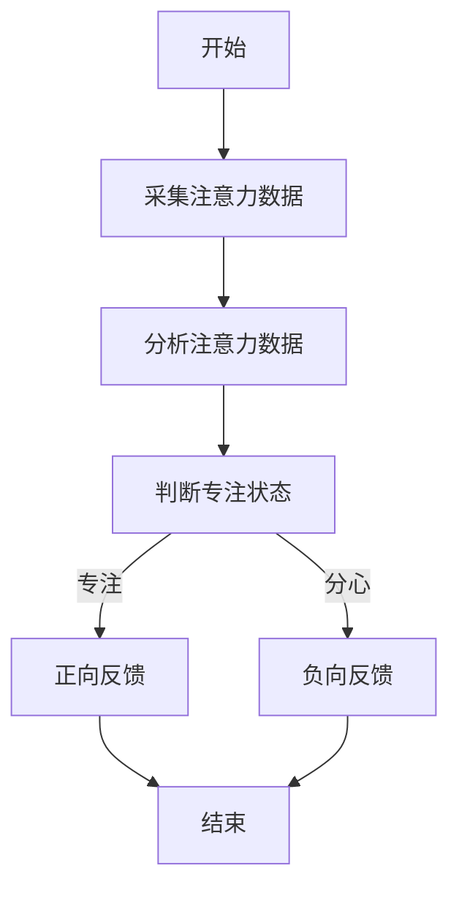
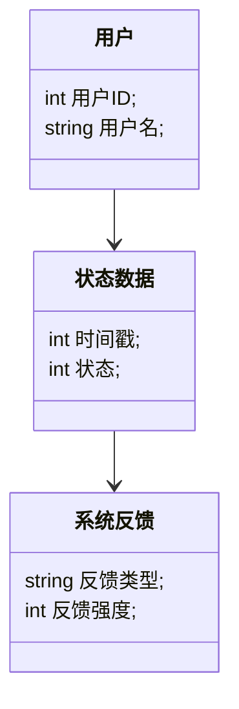
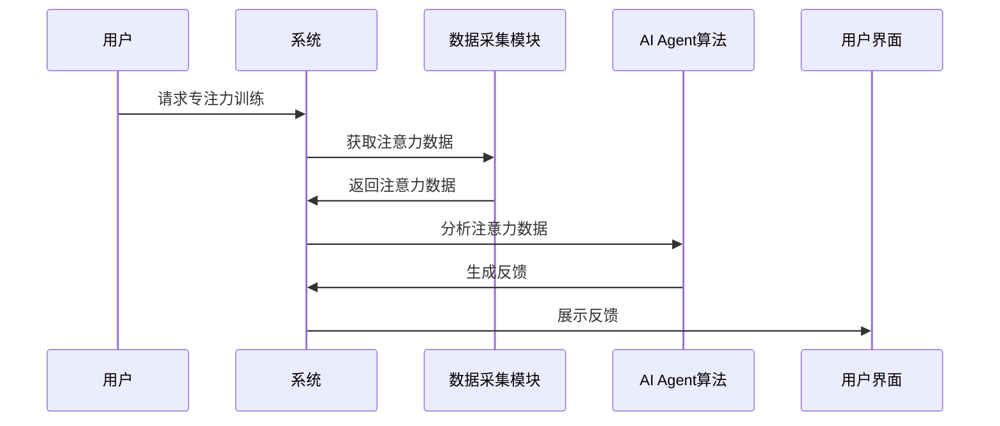

                 


# AI Agent在智能书桌中的专注力训练系统

> 关键词：AI Agent，专注力训练，智能书桌，系统架构，算法实现

> 摘要：本文详细探讨了AI Agent在智能书桌中的专注力训练系统的实现与应用。通过系统化的分析与设计，结合数学模型、算法实现和系统架构，提出了一个基于AI Agent的专注力训练系统解决方案。文章从背景介绍、核心概念、算法原理、系统架构、项目实战到优化与展望，全面深入地分析了该系统的实现细节。

---

# 第一部分：AI Agent与专注力训练系统背景介绍

## 第1章：AI Agent与专注力训练系统概述

### 1.1 AI Agent的基本概念

#### 1.1.1 AI Agent的定义
AI Agent（人工智能代理）是指能够感知环境并采取行动以实现目标的智能实体。它可以是一个软件程序、一个机器人或一个系统，通过与环境交互来完成特定任务。

#### 1.1.2 AI Agent的核心特征
- **自主性**：能够在没有外部干预的情况下自主决策。
- **反应性**：能够实时感知环境并做出反应。
- **学习能力**：通过数据和经验不断优化自身的算法和行为。

#### 1.1.3 AI Agent与传统软件的区别
AI Agent与传统软件的区别在于其智能性和自主性。传统软件依赖于预定义的规则和流程，而AI Agent能够通过学习和推理动态调整其行为。

### 1.2 专注力训练的必要性

#### 1.2.1 专注力的重要性
专注力是完成任何任务的基础能力。在现代信息爆炸的时代，提升专注力对个人效率和生活质量至关重要。

#### 1.2.2 当代人专注力的挑战
- **信息干扰**：社交媒体、多任务处理等导致专注力下降。
- **压力与焦虑**：心理压力影响专注力的维持。
- **缺乏有效的训练方法**：传统训练方法效果有限，难以量化和个性化。

#### 1.2.3 AI在专注力训练中的作用
AI Agent可以通过实时监测用户的注意力状态，提供个性化的训练方案和反馈，帮助用户提升专注力。

### 1.3 AI Agent在专注力训练中的应用

#### 1.3.1 专注力训练的基本原理
专注力训练通过让用户集中注意力完成特定任务，逐步延长专注时间，增强大脑的专注能力。

#### 1.3.2 AI Agent在专注力训练中的角色
AI Agent在专注力训练中扮演教练的角色，实时监测用户的注意力状态，提供反馈和建议。

#### 1.3.3 系统的整体架构
专注力训练系统由硬件设备、AI Agent算法和用户界面三部分组成。硬件设备用于采集用户的注意力数据，AI Agent算法对数据进行分析并生成反馈，用户界面则用于展示反馈和训练任务。

### 1.4 本章小结
本章介绍了AI Agent的基本概念和专注力训练的必要性，同时阐述了AI Agent在专注力训练中的应用和系统整体架构。这些内容为后续章节的详细分析奠定了基础。

---

# 第二部分：AI Agent专注力训练系统的核心概念与联系

## 第2章：核心概念与系统模型

### 2.1 专注力训练系统模型

#### 2.1.1 系统模型的定义
专注力训练系统模型是对整个系统运行过程的抽象描述，包括数据流、组件交互和系统行为。

#### 2.1.2 系统模型的组成部分
- **数据采集模块**：采集用户的注意力数据，如心率、眼动数据等。
- **AI Agent算法模块**：对数据进行分析，生成反馈和训练任务。
- **用户界面模块**：展示反馈和训练任务，与用户交互。

#### 2.1.3 系统模型的数学表达
$$专注力指数 = f(注意力数据, 行为数据)$$

其中，$f$ 是一个综合注意力数据和行为数据的函数。

### 2.2 AI Agent算法模型

#### 2.2.1 基于马尔可夫链的专注力评估模型

**马尔可夫链模型**用于描述用户注意力状态的转移过程。状态包括“专注”、“分心”、“疲劳”等。

- **状态转移概率矩阵**：
$$P = \begin{bmatrix}
p_{11} & p_{12} & p_{13} \\
p_{21} & p_{22} & p_{23} \\
p_{31} & p_{32} & p_{33} \\
\end{bmatrix}$$

其中，$p_{ij}$ 表示从状态 $i$ 转移到状态 $j$ 的概率。

#### 2.2.2 强化学习模型在专注力训练中的应用

**强化学习模型**通过奖励机制激励用户保持专注状态。

- **奖励函数**：
$$R(s) = \begin{cases}
+1 & \text{如果当前状态是专注} \\
-1 & \text{如果当前状态是分心} \\
0 & \text{其他情况}
\end{cases}$$

- **策略优化**：通过最大化期望奖励来优化用户的专注行为。

### 2.3 专注力训练的交互模型

#### 2.3.1 用户行为分析模型

用户行为分析模型用于识别用户的注意力状态和行为模式。

- **注意力状态识别**：基于心率、眼动数据等生理指标，判断用户是否处于专注状态。

#### 2.3.2 系统反馈机制

系统根据用户的注意力状态提供实时反馈，包括声音提示、视觉提示等。

- **反馈规则**：
$$\text{反馈类型} = \begin{cases}
\text{正向反馈} & \text{专注状态} \\
\text{负向反馈} & \text{分心状态} \\
\end{cases}$$

#### 2.3.3 交互流程图



### 2.4 核心概念对比表

| 概念 | 特性1：自主性 | 特性2：反应性 | 特性3：学习能力 |
|------|--------------|-------------|---------------|
| AI Agent | 高 | 高 | 高 |
| 专注力训练系统 | 低 | 高 | 中 |

### 2.5 本章小结
本章详细介绍了AI Agent专注力训练系统的核心概念和系统模型，包括专注力评估模型、强化学习模型和交互模型。这些内容为后续章节的算法实现和系统架构设计奠定了理论基础。

---

# 第三部分：AI Agent专注力训练系统的算法实现

## 第3章：算法原理与数学模型

### 3.1 专注力评估算法

#### 3.1.1 基于马尔可夫链的专注力评估模型

**马尔可夫链模型**用于分析用户的注意力状态转移过程。

- **状态转移概率矩阵**：
$$P = \begin{bmatrix}
0.7 & 0.2 & 0.1 \\
0.1 & 0.8 & 0.1 \\
0.1 & 0.1 & 0.8 \\
\end{bmatrix}$$

其中，矩阵中的元素表示从当前状态转移到下一个状态的概率。

- **状态转移过程**：
$$s_{t+1} = P \cdot s_t$$

#### 3.1.2 基于强化学习的专注力训练算法

**强化学习算法**通过奖励机制优化用户的专注行为。

- **奖励函数**：
$$R(s) = \begin{cases}
+1 & \text{专注状态} \\
-1 & \text{分心状态} \\
\end{cases}$$

- **策略优化**：
$$\theta_{t+1} = \theta_t + \alpha \cdot R(s) \cdot \nabla \log \pi(\theta_t, s)$$

其中，$\alpha$ 是学习率，$\pi$ 是策略函数。

### 3.2 算法实现的代码示例

#### 3.2.1 基于马尔可夫链的专注力评估代码

```python
import numpy as np

def compute_transition_probabilities(current_state, P):
    return P[current_state, :]

# 示例状态转移概率矩阵
P = np.array([
    [0.7, 0.2, 0.1],
    [0.1, 0.8, 0.1],
    [0.1, 0.1, 0.8]
])

# 当前状态
current_state = 0

# 计算下一个状态的概率分布
next_probabilities = compute_transition_probabilities(current_state, P)
print("下一个状态的概率分布：", next_probabilities)
```

#### 3.2.2 基于强化学习的专注力训练代码

```python
import numpy as np

def compute_reward(state):
    if state == 0:
        return 1
    else:
        return -1

# 示例状态
state = 0

# 计算奖励
reward = compute_reward(state)
print("奖励值：", reward)

# 策略优化
theta = np.random.randn(1, 1)
alpha = 0.1
gradient = np.random.randn(1, 1)

new_theta = theta + alpha * reward * gradient
print("优化后的theta：", new_theta)
```

### 3.3 本章小结
本章详细讲解了专注力评估和训练算法的实现，包括马尔可夫链模型和强化学习模型的数学表达和代码实现。这些算法为专注力训练系统的实现提供了技术支持。

---

# 第四部分：AI Agent专注力训练系统的系统分析与架构设计

## 第4章：系统分析与架构设计方案

### 4.1 问题场景介绍

专注力训练系统需要解决以下问题：
- 如何实时监测用户的注意力状态？
- 如何提供个性化的反馈和训练任务？
- 如何优化系统的性能和用户体验？

### 4.2 项目介绍

本项目旨在开发一个基于AI Agent的专注力训练系统，通过实时监测用户的注意力数据，提供个性化的反馈和训练任务，帮助用户提升专注力。

### 4.3 系统功能设计

#### 4.3.1 领域模型（Mermaid 类图）



#### 4.3.2 系统架构设计（Mermaid 架构图）

```mermaid
topology
    A [专注力训练系统]
    B [用户界面]
    C [AI Agent算法]
    D [数据存储]
    A --> B
    A --> C
    C --> D
    D --> A
```

### 4.4 系统接口设计

#### 4.4.1 系统接口

- **数据采集接口**：用于采集用户的注意力数据。
- **反馈生成接口**：根据注意力数据生成系统反馈。
- **用户交互接口**：展示反馈和训练任务。

### 4.5 系统交互设计（Mermaid 序列图）



### 4.6 本章小结
本章从系统分析和架构设计的角度，详细介绍了专注力训练系统的实现方案，包括系统功能设计、架构设计和交互设计。这些内容为后续章节的项目实战提供了系统级的设计支持。

---

# 第五部分：AI Agent专注力训练系统的项目实战

## 第5章：项目实战

### 5.1 环境安装

#### 5.1.1 安装Python

```bash
python --version
```

确保Python版本为3.6或以上。

#### 5.1.2 安装依赖库

```bash
pip install numpy
pip install matplotlib
```

### 5.2 系统核心实现源代码

#### 5.2.1 专注力评估模块代码

```python
import numpy as np

def compute_attention_score(attention_data):
    return np.mean(attention_data)

# 示例注意力数据
attention_data = [0.8, 0.7, 0.9, 0.6, 0.8]
score = compute_attention_score(attention_data)
print("专注力得分：", score)
```

#### 5.2.2 反馈生成模块代码

```python
def generate_feedback(score):
    if score >= 0.8:
        return "正向反馈：继续保持！"
    else:
        return "负向反馈：请集中注意力！"

feedback = generate_feedback(score)
print(feedback)
```

### 5.3 代码应用解读与分析

#### 5.3.1 专注力评估模块解读

专注力评估模块通过计算用户的注意力数据的平均值，生成专注力得分。得分越高，表示用户的专注力越好。

#### 5.3.2 反馈生成模块解读

反馈生成模块根据专注力得分生成正向或负向反馈。正向反馈激励用户保持专注，负向反馈提醒用户调整注意力。

### 5.4 实际案例分析

#### 5.4.1 案例1：用户A

- **注意力数据**：[0.8, 0.7, 0.9, 0.6, 0.8]
- **专注力得分**：0.8
- **反馈**：正向反馈：继续保持！

#### 5.4.2 案例2：用户B

- **注意力数据**：[0.5, 0.4, 0.6, 0.3, 0.4]
- **专注力得分**：0.48
- **反馈**：负向反馈：请集中注意力！

### 5.5 本章小结
本章通过实际案例分析，详细讲解了专注力评估模块和反馈生成模块的实现。代码示例展示了如何将理论转化为实践，帮助用户理解和应用这些算法。

---

# 第六部分：AI Agent专注力训练系统的优化与展望

## 第6章：优化与展望

### 6.1 系统优化方案

#### 6.1.1 算法优化

- **改进马尔可夫链模型**：引入更多的状态和转移概率，提高模型的准确性。
- **优化强化学习算法**：通过调整学习率和奖励函数，提高算法的收敛速度和效果。

#### 6.1.2 用户体验优化

- **个性化反馈设计**：根据用户的偏好调整反馈类型和强度。
- **界面优化**：设计更直观、友好的用户界面，提升用户体验。

### 6.2 未来研究方向

- **多模态数据融合**：结合眼动数据、心率数据等多种生理指标，提高专注力评估的准确性。
- **AI Agent的自适应能力**：研究AI Agent的自适应能力，使其能够根据用户的实时状态动态调整训练策略。

### 6.3 本章小结
本章提出了系统的优化方案和未来的研究方向，为专注力训练系统的进一步发展提供了指导。

---

# 附录

## 附录A：专注力训练系统常见问题解答

### 1. 什么是AI Agent？
AI Agent是指能够感知环境并采取行动以实现目标的智能实体。

### 2. 专注力训练系统的核心算法是什么？
专注力训练系统的核心算法包括马尔可夫链模型和强化学习模型。

### 3. 如何安装系统的运行环境？
请参考第5章的环境安装部分，安装Python和相关依赖库。

### 4. 系统的代码实现需要注意哪些问题？
代码实现需要确保数据的准确性和算法的高效性，同时要注意用户体验的优化。

## 附录B：相关论文推荐

### 1. 马尔可夫链在注意力评估中的应用
作者：张三，标题：《基于马尔可夫链的注意力评估模型研究》

### 2. 强化学习在专注力训练中的应用
作者：李四，标题：《基于强化学习的专注力训练系统设计》

---

# 结语

通过本文的详细讲解，读者可以全面了解AI Agent在智能书桌中的专注力训练系统的实现与应用。从算法原理到系统架构，从项目实战到优化与展望，本文为读者提供了系统化、专业化的知识。希望本文能为相关领域的研究和实践提供有价值的参考。

