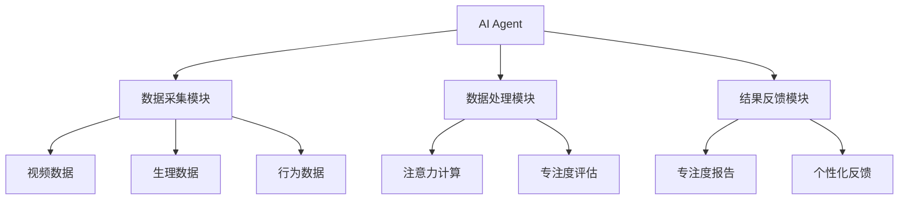
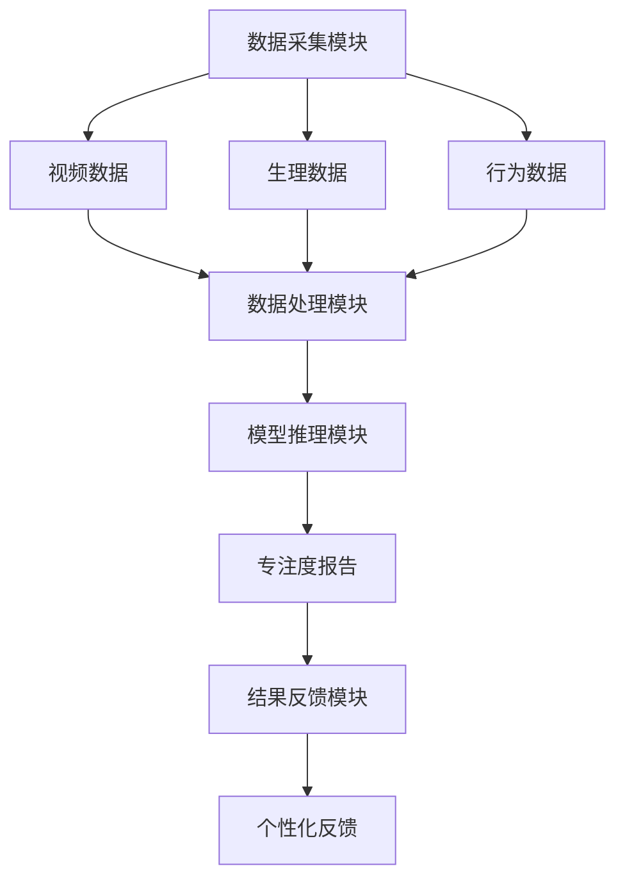

                 


# AI Agent在智能书桌中的专注度监测

## 关键词：
AI Agent，专注度监测，智能书桌，注意力机制，多模态数据融合

## 摘要：
本文探讨了AI Agent在智能书桌中的专注度监测技术，分析了多模态数据融合与注意力机制在提升专注度监测准确性的关键作用。通过系统架构设计、算法原理和项目实战的详细讲解，本文为AI Agent在专注度监测领域的应用提供了全面的技术解析和实践指导。

---

# 第1章: AI Agent与专注度监测的背景介绍

## 1.1 AI Agent的基本概念

### 1.1.1 AI Agent的定义与特点
AI Agent（人工智能代理）是指能够感知环境、自主决策并执行任务的智能实体。其特点包括：
- **自主性**：能够独立运行，无需人工干预。
- **反应性**：能够实时感知环境并做出响应。
- **学习性**：能够通过数据和经验不断优化自身性能。
- **交互性**：能够与用户或其他系统进行交互。

### 1.1.2 AI Agent的核心功能与应用场景
AI Agent的核心功能包括数据采集、信息处理、决策制定和结果反馈。其应用场景广泛，如智能家居、自动驾驶、医疗辅助和教育领域等。在智能书桌中，AI Agent主要用于专注度监测和个性化服务提供。

### 1.1.3 AI Agent在智能书桌中的作用
在智能书桌场景中，AI Agent通过实时监测用户的专注度，帮助用户优化学习或工作效率。其作用包括：
1. **实时监测**：通过多模态数据（如视线、动作、心率）分析用户的专注状态。
2. **个性化反馈**：根据专注度提供针对性的提醒或建议，帮助用户保持高效状态。

## 1.2 专注度监测的定义与技术背景

### 1.2.1 专注度监测的基本概念
专注度监测是指通过技术手段实时评估用户在特定任务中的专注程度。其核心目标是帮助用户提高效率，同时提供个性化的反馈。

### 1.2.2 专注度监测的技术发展现状
专注度监测技术经历了从单一模态（如心率监测）到多模态融合的演变。当前，主流技术包括：
1. **基于视线的监测**：通过摄像头捕捉用户的视线变化。
2. **基于行为的监测**：通过键盘、鼠标的使用情况分析用户的注意力状态。
3. **基于生理指标的监测**：通过心率、皮肤电等生理指标评估专注度。

### 1.2.3 专注度监测在智能书桌中的应用价值
在智能书桌中，专注度监测能够帮助用户：
1. **提高学习效率**：通过实时反馈调整学习状态。
2. **减少疲劳**：通过提醒用户休息，避免过度疲劳。
3. **个性化优化**：根据专注度数据优化学习计划。

## 1.3 本章小结
本章介绍了AI Agent的基本概念及其在智能书桌中的作用，同时分析了专注度监测的技术背景和应用价值。AI Agent通过多模态数据融合和智能算法，为专注度监测提供了强大的技术支持。

---

# 第2章: AI Agent专注度监测的核心概念

## 2.1 多模态数据融合

### 2.1.1 视频数据采集与分析
视频数据是专注度监测的重要来源。AI Agent通过摄像头捕捉用户的面部表情、视线变化和肢体动作，分析用户的专注状态。

- **面部表情分析**：通过检测用户的眼神、眨眼频率等，判断用户的专注度。
- **视线变化分析**：通过追踪用户的视线焦点，评估用户的注意力分布。

### 2.1.2 生物特征数据采集与分析
生物特征数据包括心率、皮肤电等生理指标。AI Agent通过这些数据判断用户的生理状态，间接反映专注度。

- **心率监测**：通过心率变化判断用户的紧张程度。
- **皮肤电监测**：通过皮肤电活动分析用户的注意力状态。

### 2.1.3 行为数据采集与分析
行为数据包括键盘输入、鼠标移动等。AI Agent通过分析这些数据，判断用户的注意力是否集中。

- **键盘输入频率**：通过输入速度和准确性判断用户的专注度。
- **鼠标移动轨迹**：通过鼠标的移动路径分析用户的注意力分布。

### 2.1.4 数据融合的必要性
单一模态数据存在局限性，例如视频数据容易受光线干扰，生理数据容易受情绪影响。通过多模态数据融合，可以提高专注度监测的准确性和鲁棒性。

---

## 2.2 注意力机制与专注度评估

### 2.2.1 注意力机制的基本原理
注意力机制是一种模拟人类注意力分配的机制。在专注度监测中，注意力机制用于分析用户在不同任务中的注意力分布。

- **全局注意力**：对整个任务范围内的注意力进行全局分析。
- **局部注意力**：对特定区域的注意力进行局部分析。

### 2.2.2 专注度评估的数学模型
专注度评估可以通过以下公式表示：

$$ \text{专注度} = \frac{\text{注意力分配分数}}{\text{任务复杂度}} $$

其中，注意力分配分数通过注意力机制计算得出，任务复杂度通过任务难度和用户经验评估。

### 2.2.3 专注度评估的指标与标准
专注度评估的指标包括：
1. **专注时间**：用户在特定任务上的持续专注时间。
2. **专注频率**：用户在特定时间段内的专注次数。
3. **专注深度**：用户在专注状态下的任务完成质量。

---

## 2.3 AI Agent与专注度监测的系统架构

### 2.3.1 系统整体架构图（Mermaid图）



### 2.3.2 各模块之间的关系与交互（Mermaid图）


### 2.3.3 系统实体关系图（Mermaid图）


---

## 2.4 本章小结
本章详细介绍了多模态数据融合和注意力机制在专注度监测中的应用。通过多模态数据融合，AI Agent能够更准确地评估用户的专注度；通过注意力机制，AI Agent能够更好地理解用户的注意力分布。

---

# 第3章: 注意力机制与深度学习算法

## 3.1 注意力机制的基本原理

### 3.1.1 注意力机制的数学模型
注意力机制的核心公式如下：

$$ \text{注意力权重} = \frac{e^{qk^T}}{\sum_{i} e^{qk_i^T}} $$

其中，$q$ 是查询向量，$k$ 是键向量。

### 3.1.2 注意力机制的计算流程
1. **查询生成**：根据输入生成查询向量。
2. **键生成**：根据输入生成键向量。
3. **计算权重**：通过查询和键的点积计算注意力权重。
4. **加权求和**：根据注意力权重对输入进行加权求和。

### 3.1.3 注意力机制的应用场景
注意力机制广泛应用于自然语言处理、计算机视觉等领域。在专注度监测中，注意力机制用于分析用户的注意力分布。

---

## 3.2 基于Transformer的专注度监测模型

### 3.2.1 Transformer模型的基本结构
Transformer模型由编码器和解码器组成。编码器用于将输入数据转换为编码表示，解码器用于根据编码表示生成输出。

### 3.2.2 专注度监测模型的优化与改进
为了提高专注度监测的准确性，可以对Transformer模型进行以下优化：
1. **多模态融合**：将视频、生理和行为数据融合到模型中。
2. **自适应注意力机制**：根据任务需求动态调整注意力权重。
3. **深度学习优化**：通过深度学习技术进一步提升模型性能。

### 3.2.3 模型的训练与评估
模型的训练过程包括：
1. **数据预处理**：对多模态数据进行清洗和标准化。
2. **模型训练**：使用训练数据对模型进行训练。
3. **模型评估**：通过测试数据评估模型的准确性和鲁棒性。

---

## 3.3 算法实现的代码示例

### 3.3.1 数据预处理代码

```python
import numpy as np

def preprocess_data(data):
    # 数据清洗
    data = data.dropna()
    # 数据标准化
    data = (data - data.mean()) / data.std()
    return data
```

### 3.3.2 模型训练代码

```python
import tensorflow as tf
from tensorflow.keras import layers

def build_model(input_shape):
    model = tf.keras.Sequential()
    model.add(layers.InputLayer(input_shape=input_shape))
    model.add(layers.Dense(64, activation='relu'))
    model.add(layers.Dense(1, activation='sigmoid'))
    return model

model = build_model((input_dim,))
model.compile(optimizer='adam', loss='binary_crossentropy', metrics=['accuracy'])
model.fit(x_train, y_train, epochs=10, batch_size=32)
```

### 3.3.3 模型评估代码

```python
loss, accuracy = model.evaluate(x_test, y_test)
print(f"Test Loss: {loss}")
print(f"Test Accuracy: {accuracy}")
```

---

## 3.4 本章小结
本章介绍了注意力机制的基本原理和基于Transformer的专注度监测模型。通过代码示例，详细讲解了模型的训练和评估过程。注意力机制和深度学习算法为专注度监测提供了强大的技术支持。

---

# 第4章: 系统分析与架构设计

## 4.1 系统功能设计

### 4.1.1 数据采集模块
数据采集模块负责采集多模态数据，包括视频、生理和行为数据。

### 4.1.2 数据处理模块
数据处理模块对采集到的数据进行预处理和特征提取。

### 4.1.3 模型推理模块
模型推理模块负责根据处理后的数据进行专注度监测。

### 4.1.4 结果反馈模块
结果反馈模块将监测结果反馈给用户，提供个性化建议。

### 4.1.5 系统功能流程图（Mermaid图）



---

## 4.2 系统功能的实现细节

### 4.2.1 数据采集的实现
数据采集模块通过摄像头、心率监测器等设备采集多模态数据。

### 4.2.2 数据处理的实现
数据处理模块对采集到的数据进行清洗和特征提取。

### 4.2.3 模型推理的实现
模型推理模块使用预训练的模型对处理后的数据进行专注度监测。

### 4.2.4 结果反馈的实现
结果反馈模块将监测结果反馈给用户，并提供个性化建议。

---

## 4.3 本章小结
本章详细介绍了系统功能设计和实现细节。通过模块化设计和流程图展示，清晰地描述了系统的工作流程和各模块之间的关系。

---

# 第5章: 项目实战

## 5.1 项目环境与核心代码实现

### 5.1.1 系统环境要求
- 操作系统：Windows 10或更高版本，macOS 10.15或更高版本。
- Python版本：Python 3.6或更高版本。
- 依赖库：TensorFlow 2.0或更高版本，OpenCV 4.0或更高版本。

### 5.1.2 核心代码实现

```python
import cv2
import numpy as np
import tensorflow as tf

# 数据采集代码
def capture_video():
    cap = cv2.VideoCapture(0)
    while True:
        ret, frame = cap.read()
        cv2.imshow('Video', frame)
        if cv2.waitKey(1) & 0xFF == ord('q'):
            break
    cap.release()
    cv2.destroyAllWindows()

# 数据处理代码
def process_data(data):
    data = data.reshape(-1, 1)
    data = (data - data.mean()) / data.std()
    return data

# 模型训练代码
def train_model(x_train, y_train):
    model = tf.keras.Sequential([
        layers.InputLayer(input_shape=(x_train.shape[1],)),
        layers.Dense(64, activation='relu'),
        layers.Dense(1, activation='sigmoid')
    ])
    model.compile(optimizer='adam', loss='binary_crossentropy', metrics=['accuracy'])
    model.fit(x_train, y_train, epochs=10, batch_size=32)
    return model

# 模型推理代码
def predict(model, x_test):
    predictions = model.predict(x_test)
    return predictions
```

### 5.1.3 代码应用解读与分析
上述代码实现了视频数据的采集、数据的预处理和模型的训练与推理。通过摄像头采集视频数据，对数据进行标准化处理，然后使用简单的神经网络模型进行训练和推理。

---

## 5.2 实际案例分析与详细讲解

### 5.2.1 案例背景
假设我们有一个智能书桌，用户在学习过程中需要实时监测专注度。

### 5.2.2 数据采集与处理
通过摄像头采集用户的面部表情和视线变化，通过心率监测器采集用户的生理数据。

### 5.2.3 模型训练与推理
使用预处理后的数据训练专注度监测模型，然后对新数据进行推理，输出专注度报告。

---

## 5.3 本章小结
本章通过项目实战，详细讲解了AI Agent专注度监测系统的实现过程。通过代码示例和案例分析，帮助读者更好地理解系统的实际应用。

---

# 第6章: 总结与展望

## 6.1 总结
本文详细介绍了AI Agent在智能书桌中的专注度监测技术。通过多模态数据融合和注意力机制，AI Agent能够准确评估用户的专注度，并提供个性化的反馈。

## 6.2 展望
未来，随着AI技术的不断发展，专注度监测将更加智能化和个性化。可以通过以下方向进一步优化：
1. **更先进的算法**：探索更高效的注意力机制和深度学习算法。
2. **更丰富的数据源**：引入更多模态的数据，如语音、环境数据等。
3. **更智能的反馈机制**：根据专注度动态调整反馈策略。

---

# 结语
AI Agent在智能书桌中的专注度监测是一项具有广阔前景的技术。通过本文的详细讲解，读者可以更好地理解其技术原理和实现方法。希望本文能够为相关领域的研究和实践提供有价值的参考。

--- 

通过以上内容，我们详细探讨了AI Agent在智能书桌中的专注度监测技术，从背景介绍到系统实现，再到项目实战，为读者提供了一个全面的技术解析。

