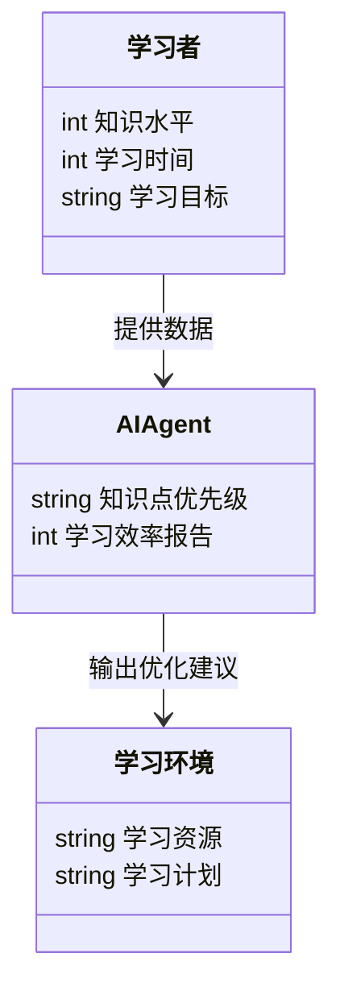
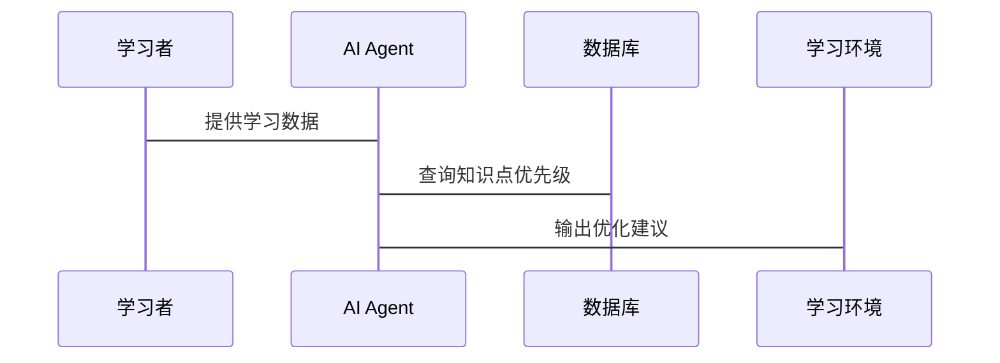

                 


# AI Agent在智能书桌中的学习效率分析

## 关键词：
- AI Agent
- 智能书桌
- 学习效率
- 强化学习
- 监督学习
- 系统架构设计

## 摘要：
本文深入探讨AI Agent在智能书桌中的应用，分析其对学习效率的提升。通过背景介绍、核心概念、算法原理、系统架构设计、项目实战等多方面，详细阐述AI Agent的工作机制及其在智能书桌中的具体实现。文章结合理论与实践，提供丰富的案例和代码示例，帮助读者全面理解AI Agent在学习效率优化中的作用。

---

## 第一部分：AI Agent与智能书桌的背景与概述

### 第1章：AI Agent的基本概念

#### 1.1 AI Agent的定义
AI Agent（人工智能代理）是一种能够感知环境并采取行动以实现目标的智能体。它通过传感器接收输入，利用计算模型处理信息，并通过执行器输出行动。

#### 1.2 AI Agent的核心特征
- **自主性**：能够在没有外部干预的情况下运行。
- **反应性**：能够实时感知环境并做出反应。
- **学习能力**：能够通过数据和经验改进自身的算法。

#### 1.3 AI Agent与传统软件的区别
| 特性       | AI Agent                      | 传统软件                  |
|------------|-------------------------------|---------------------------|
| 智能性     | 高                           | 低                       |
| 自适应性   | 强                           | 弱                       |
| 学习能力   | 强                           | 无                       |

### 第2章：智能书桌的概念与应用场景

#### 2.1 智能书桌的定义
智能书桌是一种集成AI技术的桌面系统，能够通过AI Agent实时调整学习环境，优化学习效率。

#### 2.2 智能书桌的主要功能
- **个性化学习计划**：根据学习者的习惯和能力，定制学习计划。
- **实时反馈与调整**：根据学习者的表现，实时调整学习内容和节奏。
- **资源优化分配**：智能分配学习资源，避免时间浪费。

#### 2.3 智能书桌的学习效率提升场景
- **个性化学习路径**：根据学习者的知识水平，动态调整学习内容的难度和顺序。
- **知识点优先级排序**：根据考试重点和学习者掌握情况，优先推荐重要知识点。
- **时间管理优化**：通过AI Agent分析学习者的学习时间，制定高效的学习计划。

---

## 第二部分：AI Agent在学习效率中的核心作用

### 第3章：AI Agent的学习效率分析模型

#### 3.1 学习效率分析模型的构建
学习效率分析模型由输入层、处理层和输出层组成。输入层包括学习者的知识水平、学习时间、学习目标等数据；处理层利用强化学习和监督学习算法进行分析；输出层生成学习效率报告和优化建议。

#### 3.2 AI Agent在模型中的角色
AI Agent作为模型的核心，负责接收输入数据，执行算法处理，并输出优化建议。以下是AI Agent在模型中的具体角色：

- **数据采集**：通过传感器采集学习者的实时数据，如注意力水平、学习速度等。
- **数据分析**：利用算法对数据进行处理，识别学习者的学习瓶颈。
- **决策制定**：根据分析结果，制定优化策略，如调整学习内容或改变学习节奏。

#### 3.3 模型的输入与输出
- **输入**：学习者的知识水平、学习时间、学习目标等。
- **输出**：学习效率报告、学习优化建议、个性化学习计划。

### 第4章：AI Agent的学习效率优化策略

#### 4.1 基于AI Agent的个性化学习
个性化学习是通过AI Agent分析学习者的特点，制定个性化的学习计划。例如，如果学习者擅长数学但不擅长英语，AI Agent会优先推荐英语学习内容。

#### 4.2 AI Agent的学习路径规划
学习路径规划是AI Agent根据学习者的知识水平和学习目标，制定最优的学习路径。例如，学习者需要在一个月内掌握编程基础，AI Agent会制定每日学习计划，优先推荐核心知识点。

#### 4.3 AI Agent的知识点优先级排序
知识点优先级排序是AI Agent根据考试重点和学习者掌握情况，推荐优先学习的知识点。例如，AI Agent分析发现数学中的概率论是考试重点，且学习者尚未掌握，因此将概率论列为优先学习内容。

---

## 第三部分：AI Agent学习效率分析的算法原理

### 第5章：强化学习算法在AI Agent中的应用

#### 5.1 强化学习的基本原理
强化学习是一种通过试错机制优化决策的算法。AI Agent通过与环境交互，不断调整策略，以最大化累积奖励。

#### 5.2 Q-learning算法的实现
Q-learning是一种经典的强化学习算法，适用于离线环境。以下是Q-learning算法的伪代码实现：

```python
初始化Q表为全0
设置学习率α和折扣因子γ
进入循环：
    选择当前状态s的动作a（ε-greedy策略）
    执行动作a，获得奖励r和下一个状态s'
    更新Q表：Q(s, a) = Q(s, a) + α*(r + γ*max(Q(s', a')) - Q(s, a))
返回Q表
```

#### 5.3 算法在学习效率中的应用
例如，AI Agent可以通过Q-learning算法，学习如何优化学习时间表，以最大化学习效率。

### 第6章：监督学习算法的实现

#### 6.1 监督学习的基本原理
监督学习是一种通过标注数据训练模型的算法。AI Agent可以通过监督学习识别学习者的学习模式。

#### 6.2 分类算法的实现
分类算法用于将学习者分为不同的学习类型，例如视觉型、听觉型等。以下是常用的分类算法：

- **K近邻算法（KNN）**：通过计算样本之间的距离进行分类。
- **支持向量机（SVM）**：通过构建超平面进行分类。
- **决策树（Decision Tree）**：通过构建树状结构进行分类。

#### 6.3 回归算法的实现
回归算法用于预测学习者的未来表现。例如，AI Agent可以通过回归算法预测学习者在一个月后的知识掌握情况。

---

## 第四部分：AI Agent学习效率分析的系统架构设计

### 第7章：系统功能设计

#### 7.1 领域模型
以下是领域模型的Mermaid类图：



#### 7.2 系统架构
以下是系统架构的Mermaid图：

```mermaid
container 系统架构 {
    学习者
    AI Agent
    学习环境
    数据库
}
    学习者 --> AI Agent
    AI Agent --> 学习环境
    学习环境 --> 数据库
```

### 第8章：系统接口设计

#### 8.1 接口设计
以下是系统接口设计的Mermaid序列图：



---

## 第五部分：项目实战

### 第9章：环境安装与核心代码实现

#### 9.1 环境安装
需要安装Python、NumPy、Scikit-learn等库。

#### 9.2 核心代码实现
以下是AI Agent的核心代码实现：

```python
import numpy as np
from sklearn.tree import DecisionTreeClassifier

# 数据预处理
X = np.array([[...], [...]])  # 特征
y = np.array([...])  # 标签

# 模型训练
model = DecisionTreeClassifier()
model.fit(X, y)

# 预测
预测结果 = model.predict(X_new)
```

#### 9.3 代码应用解读
通过代码实现AI Agent的学习效率分析，例如，通过决策树分类算法，预测学习者的最佳学习时间。

### 第10章：案例分析与项目小结

#### 10.1 案例分析
通过具体案例，展示AI Agent在智能书桌中的实际应用，例如，如何优化学习计划。

#### 10.2 项目小结
总结项目成果，分析AI Agent在智能书桌中的优势和不足。

---

## 第六部分：总结与展望

### 第11章：最佳实践与小结

#### 11.1 最佳实践
- 定期更新模型，以适应学习者的变化。
- 结合多种算法，提高模型的准确性。

#### 11.2 小结
本文详细探讨了AI Agent在智能书桌中的应用，分析了其对学习效率的提升作用。

### 第12章：注意事项与拓展阅读

#### 12.1 注意事项
- 数据隐私问题：AI Agent需要处理大量的学习者数据，需要注意数据隐私。
- 模型可解释性：AI Agent的决策需要可解释，以便学习者理解和信任。

#### 12.2 拓展阅读
建议读者阅读相关领域的最新研究，例如，结合自然语言处理技术，进一步优化AI Agent的学习效率分析。

---

# 结语

通过本文的分析，我们可以看到AI Agent在智能书桌中的巨大潜力。未来，随着技术的不断发展，AI Agent将更加智能化，为学习者提供更加高效的学习体验。

