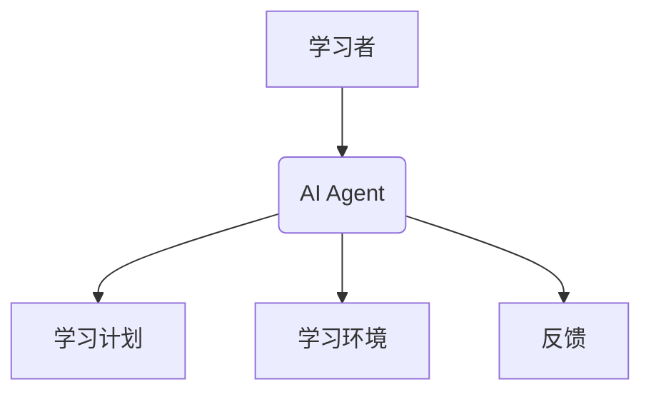
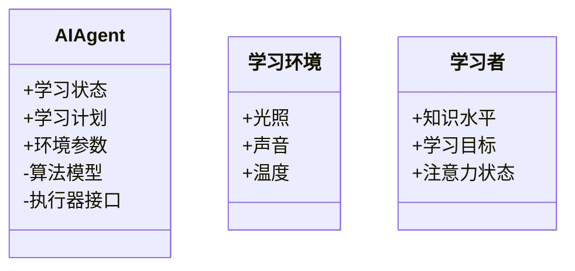
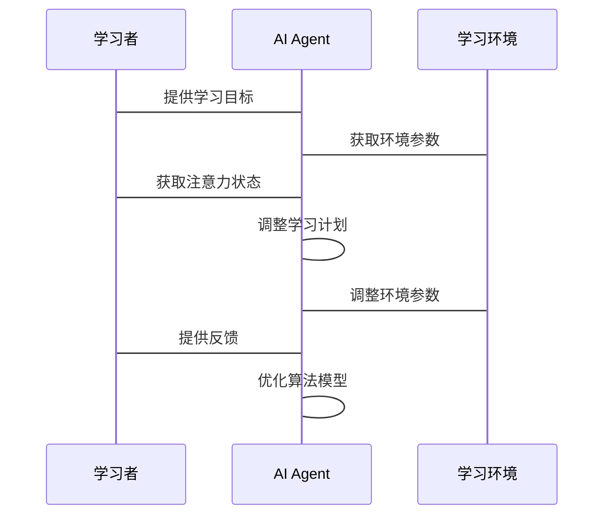

                 


# AI Agent在智能书桌中的学习环境优化

> **关键词**：AI Agent, 智能书桌, 学习环境优化, 算法设计, 系统架构  
> **摘要**：本文探讨AI Agent在智能书桌中的应用，分析其如何通过优化学习环境提升学习效率。文章从AI Agent的核心原理、算法设计、系统架构到实际项目实现，全面阐述了AI Agent在学习环境优化中的重要作用，同时结合具体案例进行详细解读。

---

## 第一部分: AI Agent与智能书桌的背景介绍

### 第1章: AI Agent的定义与核心概念

#### 1.1 AI Agent的基本概念

**1.1.1 AI Agent的定义**  
AI Agent（人工智能代理）是指能够感知环境并采取行动以实现目标的智能实体。它能够通过传感器获取信息，利用算法进行决策，并通过执行器与环境交互。AI Agent的核心目标是通过自主学习和优化，提高决策的效率和准确性。

**1.1.2 AI Agent的核心属性**  
AI Agent具有以下核心属性：  
1. **自主性**：能够自主决策，无需人工干预。  
2. **反应性**：能够实时感知环境并做出反应。  
3. **目标导向**：所有行动均以实现特定目标为导向。  
4. **学习能力**：能够通过经验不断优化自身行为。  

**1.1.3 AI Agent与传统算法的区别**  
AI Agent与传统算法的主要区别在于其具备自主决策和学习能力。传统算法通常依赖于固定的规则和输入，而AI Agent能够根据环境动态调整策略，并通过学习不断优化性能。

#### 1.2 智能书桌的概念与特点

**1.2.1 智能书桌的定义**  
智能书桌是一种结合了AI技术的智能化学习工具，能够通过传感器和AI算法感知学习者的状态，并提供个性化的学习环境优化建议。

**1.2.2 智能书桌的核心功能**  
1. **个性化学习推荐**：根据学习者的知识水平和学习风格，推荐合适的学习资料和方法。  
2. **注意力管理**：通过监测学习者的注意力状态，优化学习节奏和内容难度。  
3. **环境优化**：调整学习环境中的光照、声音、温度等参数，以提高学习效率。  

**1.2.3 智能书桌的用户群体与应用场景**  
智能书桌主要面向学生、教师和自学者，应用场景包括在线学习、考试准备、知识复习等。

### 第2章: 学习环境优化的背景与问题描述

#### 2.1 学习环境优化的重要性

**2.1.1 当前学习环境的痛点**  
传统学习环境中，学习者通常面临以下问题：  
1. **信息过载**：学习资料繁多，难以筛选。  
2. **缺乏个性化**：学习计划和方法千篇一律，难以满足个体需求。  
3. **效率低下**：学习时间长，效果不佳。  

**2.1.2 AI技术在学习环境优化中的作用**  
AI技术能够通过数据分析和智能推荐，帮助学习者优化学习计划、提高学习效率，并提供个性化的学习支持。

#### 2.2 AI Agent在学习环境优化中的应用前景

**2.2.1 AI Agent在学习环境优化中的优势**  
1. **个性化推荐**：AI Agent能够根据学习者的特点推荐合适的学习资料和方法。  
2. **实时反馈**：能够实时监测学习者的学习状态，并提供即时反馈。  
3. **动态调整**：能够根据学习者的反馈动态调整学习计划和环境参数。  

**2.2.2 AI Agent在学习环境优化中的挑战**  
1. **数据隐私**：需要处理大量学习者数据，数据隐私问题需严格保护。  
2. **算法复杂性**：AI Agent的算法设计需要兼顾效率和准确性。  
3. **用户体验**：复杂的算法需要以简单易用的方式呈现给用户。  

---

## 第二部分: AI Agent的核心原理与算法设计

### 第3章: AI Agent的核心原理

#### 3.1 AI Agent的基本原理

**3.1.1 AI Agent的感知与决策机制**  
AI Agent通过传感器感知环境信息，利用算法进行分析和决策，并通过执行器与环境交互。其决策过程包括状态识别、动作选择和结果评估三个阶段。

**3.1.2 AI Agent的状态空间与动作空间**  
- **状态空间**：所有可能的环境状态集合。  
- **动作空间**：所有可能的行动集合。  

**3.1.3 AI Agent的学习与优化算法**  
AI Agent通过强化学习（Reinforcement Learning）或监督学习（Supervised Learning）等算法不断优化自身的行为策略。

#### 3.2 AI Agent的核心算法

**3.2.1 强化学习算法**  
强化学习是一种基于奖励机制的算法，通过不断试错来优化决策策略。其核心公式包括状态值函数和动作值函数：

**状态值函数**  
$$ V(s) = \max_{a} \left( r(s,a) + \gamma V(s') \right) $$  

**动作值函数**  
$$ Q(s,a) = r(s,a) + \gamma \max_{a'} Q(s',a') $$  

**3.2.2 监督学习算法**  
监督学习是一种基于样本数据的算法，通过训练数据预测目标输出。其核心公式包括线性回归和逻辑回归等。

**线性回归公式**  
$$ y = \theta x + b $$  

**逻辑回归公式**  
$$ P(y=1|x) = \frac{e^{\theta x}}{1 + e^{\theta x}} $$  

**3.2.3 混合学习算法**  
混合学习算法结合了强化学习和监督学习的优点，适用于复杂环境下的决策问题。

---

## 第三部分: 系统设计与实现

### 第4章: 系统设计与实现

#### 4.1 系统架构设计

**系统架构图**  


#### 4.2 功能模块设计

**功能模块图**  


#### 4.3 接口设计与交互流程

**交互流程图**  


---

## 第四部分: 项目实战

### 第5章: 项目实战

#### 5.1 环境搭建与代码实现

**环境搭建**  
1. 安装Python和相关库（如TensorFlow、Keras）。  
2. 安装智能书桌硬件（如环境传感器）。  

**代码实现**  
```python
import numpy as np
import tensorflow as tf

# 定义强化学习网络
class AIAgent:
    def __init__(self, state_dim, action_dim):
        self.state_dim = state_dim
        self.action_dim = action_dim
        self.model = self.build_model()

    def build_model(self):
        model = tf.keras.Sequential([
            tf.keras.layers.Dense(64, activation='relu', input_dim=self.state_dim),
            tf.keras.layers.Dense(self.action_dim, activation='linear')
        ])
        model.compile(optimizer='adam', loss='mse')
        return model

    def act(self, state):
        state = np.array(state).reshape(1, -1)
        prediction = self.model.predict(state)[0]
        return np.argmax(prediction)

    def train(self, state, action, reward, next_state):
        state = np.array(state).reshape(1, -1)
        next_state = np.array(next_state).reshape(1, -1)
        target = reward + 0.99 * np.max(self.model.predict(next_state)[0])
        target = target.reshape(1, -1)
        self.model.fit(state, target, epochs=1, verbose=0)
```

---

## 第五部分: 总结与展望

### 第6章: 总结与展望

#### 6.1 总结

本文详细探讨了AI Agent在智能书桌中的应用，从核心原理到系统设计，再到实际实现，全面阐述了AI Agent在学习环境优化中的重要作用。通过强化学习和监督学习等算法，AI Agent能够实时感知学习者状态并动态调整学习计划和环境参数，从而显著提高学习效率。

#### 6.2 未来展望

未来，随着AI技术的不断发展，AI Agent在学习环境优化中的应用将更加广泛和深入。一方面，AI Agent的算法将更加复杂和高效，能够更好地适应多样化的学习场景；另一方面，AI Agent将与其他智能设备协同工作，构建更加智能化和个性化的学习生态系统。

---

通过本文的详细解读，读者可以全面了解AI Agent在智能书桌中的应用潜力，并为未来的研究和实践提供有益的参考。

