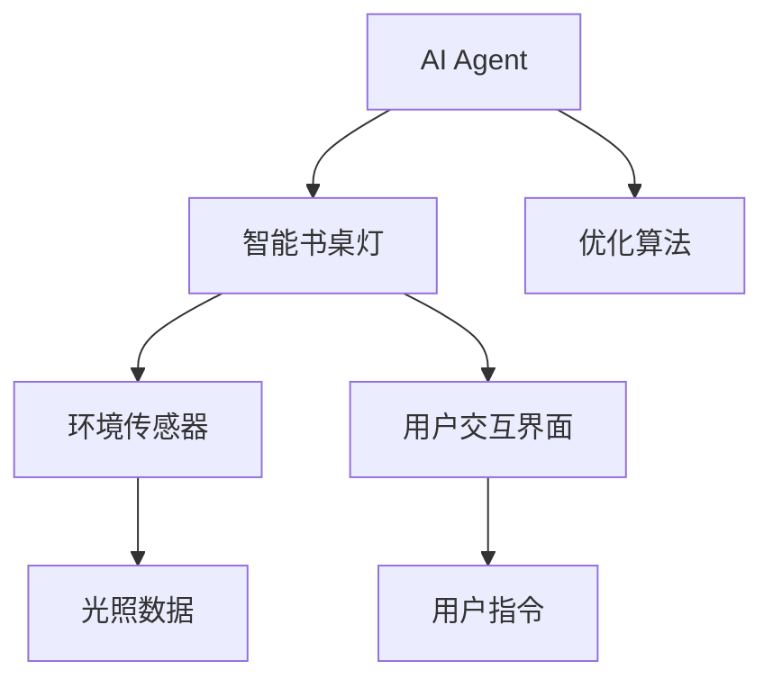
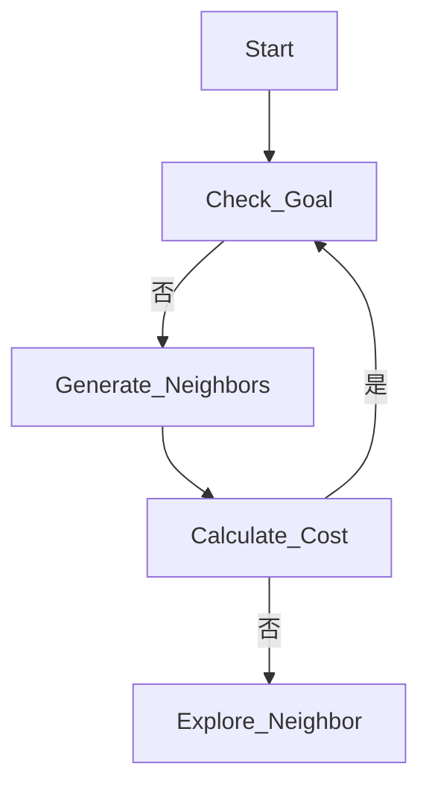
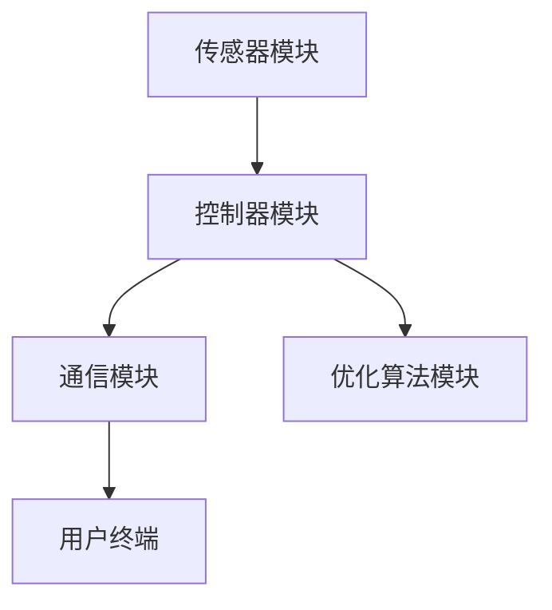

                 


# AI Agent在智能书桌灯中的照明优化

> 关键词：AI Agent, 智能书桌灯, 照明优化, 算法原理, 系统架构, 项目实战

> 摘要：本文探讨AI Agent在智能书桌灯中的应用，分析其在照明优化中的核心作用。通过详细讲解AI Agent的基本概念、算法原理、系统架构设计和项目实战，本文旨在为读者提供一个全面的技术视角，帮助其理解AI Agent如何通过智能算法优化书桌灯的照明效果，提升用户体验。

---

# 第1章: AI Agent与智能书桌灯的背景介绍

## 1.1 AI Agent的基本概念

### 1.1.1 什么是AI Agent
AI Agent（人工智能代理）是一种能够感知环境、自主决策并执行任务的智能实体。它可以理解为一种软件或硬件系统，通过传感器获取信息，利用算法进行分析和推理，然后通过执行器或输出模块完成目标。

$$AI Agent = 知识表示 + 感知 + 决策 + 执行$$

### 1.1.2 AI Agent的核心特征
AI Agent的核心特征包括：
1. **自主性**：无需外部干预，自主完成任务。
2. **反应性**：能够实时感知环境变化并做出反应。
3. **学习能力**：通过数据和经验不断优化自身行为。
4. **社交能力**：能够与其他AI Agent或人类进行交互。

### 1.1.3 AI Agent的分类与应用场景
AI Agent可以根据功能和应用场景分为以下几类：
1. **简单反射型Agent**：基于规则的简单响应，适用于环境简单、任务单一的场景。
2. **基于模型的反射型Agent**：利用内部模型进行推理和决策，适用于复杂环境。
3. **目标驱动型Agent**：以明确的目标为导向，优化行为以达到目标。
4. **效用驱动型Agent**：基于效用函数进行决策，适用于多目标优化场景。

---

## 1.2 智能书桌灯的定义与特点

### 1.2.1 传统书桌灯的功能与局限性
传统书桌灯主要功能是提供基础照明，通常只能通过手动开关或简单的调光功能进行控制。其局限性包括：
1. **缺乏智能化**：无法根据环境或用户需求自动调节。
2. **功能单一**：无法与其他设备联动或提供额外服务。
3. **能耗较高**：无法实现智能节能。

### 1.2.2 智能书桌灯的定义
智能书桌灯是一种结合了物联网（IoT）和人工智能技术的智能照明设备。它能够通过传感器感知环境信息，利用AI算法优化光照效果，并通过无线通信技术与其他设备联动。

### 1.2.3 智能书桌灯的核心技术与优势
智能书桌灯的核心技术包括：
1. **环境感知技术**：通过光照、温度、湿度等传感器获取环境信息。
2. **AI算法优化**：利用机器学习算法优化光照强度、色温等参数。
3. **无线通信技术**：通过Wi-Fi、蓝牙等技术实现与其他设备的联动。

其优势包括：
1. **智能调节**：根据环境和用户需求自动调节光照参数。
2. **节能高效**：通过智能算法实现能源优化。
3. **用户体验优化**：提供更舒适、更个性化的照明体验。

---

## 1.3 AI Agent在智能书桌灯中的应用背景

### 1.3.1 照明优化的必要性
随着人们对舒适性和健康性的关注不断增加，传统照明设备的局限性日益显现。智能书桌灯通过AI技术可以实现动态调节，满足用户在不同场景下的需求。

### 1.3.2 AI技术在照明控制中的优势
AI技术在照明控制中的优势包括：
1. **动态优化**：能够实时感知环境变化，动态调整光照参数。
2. **个性化服务**：通过学习用户的习惯和偏好，提供个性化照明方案。
3. **能源优化**：通过智能算法实现节能。

### 1.3.3 智能书桌灯与AI Agent的结合
AI Agent与智能书桌灯的结合可以实现以下功能：
1. **环境感知与动态调节**：AI Agent通过传感器获取环境信息，动态调整光照参数。
2. **个性化服务**：通过学习用户的习惯和偏好，提供个性化的照明方案。
3. **智能联动**：与其他智能设备联动，实现全屋智能照明控制。

---

## 1.4 本章小结

本章主要介绍了AI Agent的基本概念、智能书桌灯的定义与特点，以及AI Agent在智能书桌灯中的应用背景。通过这些内容，读者可以理解AI Agent在智能书桌灯中的核心作用，以及其在照明优化中的重要性。

---

# 第2章: AI Agent的核心概念与联系

## 2.1 AI Agent的原理分析

### 2.1.1 知识表示与推理
知识表示是AI Agent的核心基础，常用的表示方法包括：
1. **谓词逻辑**：通过谓词和事实表示知识。
2. **语义网络**：通过节点和关系表示知识。
3. **规则表示法**：通过规则描述知识。

推理是基于知识表示进行逻辑推理，常用的推理方法包括：
1. **演绎推理**：从一般到特殊的推理。
2. **归纳推理**：从特殊到一般的推理。

### 2.1.2 感知与决策
感知是AI Agent获取环境信息的关键步骤，常用的感知方法包括：
1. **传感器感知**：通过传感器获取物理环境信息。
2. **数据解析**：对传感器数据进行解析和处理。

决策是基于感知信息进行判断和选择，常用的决策方法包括：
1. **基于规则的决策**：根据预定义规则进行决策。
2. **基于模型的决策**：通过模型进行预测和优化。

### 2.1.3 行为执行与反馈
行为执行是AI Agent根据决策结果采取行动，常用的执行方法包括：
1. **直接执行**：通过执行器直接执行命令。
2. **间接执行**：通过通信模块发送指令。

反馈是AI Agent根据执行结果进行调整的重要环节，常用的反馈方法包括：
1. **实时反馈**：实时获取执行结果并进行调整。
2. **延迟反馈**：在一定时间间隔内获取执行结果。

---

## 2.2 AI Agent与智能书桌灯的关系

### 2.2.1 AI Agent在智能书桌灯中的角色
AI Agent在智能书桌灯中扮演着“智能大脑”的角色，负责感知环境、分析数据、制定决策并执行操作。

### 2.2.2 系统中的实体关系
通过Mermaid图可以清晰地展示系统中的实体关系：



---

## 2.3 本章小结

本章主要分析了AI Agent的核心概念与原理，并通过Mermaid图展示了AI Agent与智能书桌灯的关系。通过这些内容，读者可以理解AI Agent在智能书桌灯中的具体作用及其与系统其他部分的交互关系。

---

# 第3章: AI Agent的算法原理

## 3.1 路径规划算法

### 3.1.1 A*算法原理
A*算法是一种常用的路径规划算法，其基本原理如下：

$$\text{Cost}(n) = \text{g}(n) + \text{h}(n)$$

其中：
- $\text{g}(n)$ 表示从起点到节点n的实际成本。
- $\text{h}(n)$ 表示从节点n到目标节点的估计成本。

通过不断更新优先队列，A*算法可以在最短时间内找到最优路径。

### 3.1.2 算法流程图



### 3.1.3 代码实现示例

```python
import heapq

def a_star_search(start, goal, grid):
    open_set = {start}
    came_from = {}
    g_score = {start: 0}
    f_score = {start: heuristic(start, goal)}

    while open_set:
        current = heapq.heappop(open_set)
        if current == goal:
            break
        for neighbor in grid[current]:
            tentative_g_score = g_score[current] + cost(current, neighbor)
            if tentative_g_score < g_score.get(neighbor, float('inf')):
                came_from[neighbor] = current
                g_score[neighbor] = tentative_g_score
                f_score[neighbor] = g_score[neighbor] + heuristic(neighbor, goal)
                heapq.heappush(open_set, neighbor)
    return came_from, g_score
```

---

## 3.2 光照优化算法

### 3.2.1 基于遗传算法的优化
遗传算法是一种常用的优化算法，其基本流程如下：

1. 初始化种群。
2. 计算适应度。
3. 选择父代。
4. 进行交叉和变异。
5. 重复迭代。

### 3.2.2 算法数学模型
光照优化的目标是最小化能耗，同时满足光照强度和色温的要求。数学模型如下：

$$\min E = \sum_{i=1}^{n} E_i$$

约束条件：
1. $I_i \geq I_{\text{min}}$
2. $T_i \leq T_{\text{max}}$

其中：
- $E_i$ 是第i个灯的能耗。
- $I_i$ 是第i个灯的光照强度。
- $T_i$ 是第i个灯的色温。

### 3.2.3 代码实现与分析

```python
def genetic_algorithm(population_size, fitness_function):
    population = initialize_population(population_size)
    for _ in range(max_iterations):
        population = evaluate_population(population, fitness_function)
        population = select_parents(population)
        population = reproduce_children(population)
        population = mutate_population(population)
    return best_candidate(population)
```

---

## 3.3 本章小结

本章主要介绍了AI Agent的两种核心算法：A*算法和遗传算法。通过流程图和代码示例，读者可以理解这些算法的基本原理和实现方法。这些算法在智能书桌灯的路径规划和光照优化中具有重要的应用价值。

---

# 第4章: 系统架构设计

## 4.1 系统模块划分

### 4.1.1 传感器模块
传感器模块用于感知环境信息，包括光照、温度、湿度等。

### 4.1.2 控制器模块
控制器模块负责接收传感器数据，运行AI算法，生成控制指令。

### 4.1.3 通信模块
通信模块用于与其他设备或云端进行数据交互。

---

## 4.2 系统架构图



---

## 4.3 本章小结

本章主要分析了智能书桌灯系统的模块划分和整体架构。通过Mermaid图，读者可以清晰地理解系统各模块之间的关系及其功能。

---

# 第5章: 项目实战

## 5.1 环境搭建

### 5.1.1 硬件设备
需要的硬件设备包括：
- 智能书桌灯
- 光照传感器
- 无线通信模块

### 5.1.2 软件工具
需要的软件工具包括：
- Python编程语言
- AI算法库（如scikit-learn）
- 无线通信库（如Wi-Fi或蓝牙库）

---

## 5.2 核心实现

### 5.2.1 传感器数据采集
通过光照传感器采集环境光照数据，并通过无线通信模块将数据传输到控制器模块。

### 5.2.2 AI算法运行
在控制器模块中运行AI算法，根据传感器数据生成最优的光照参数。

### 5.2.3 系统控制
根据优化后的光照参数，控制智能书桌灯的光照强度和色温。

---

## 5.3 案例分析

### 5.3.1 环境配置
假设环境光照强度为100 lux，目标光照强度为300 lux。

### 5.3.2 算法优化
通过遗传算法优化，得到最优的光照参数。

### 5.3.3 系统控制
根据优化结果，调整智能书桌灯的光照强度和色温。

---

## 5.4 本章小结

本章通过实际案例分析，详细讲解了智能书桌灯系统的环境搭建、核心实现和系统控制过程。通过这些内容，读者可以掌握AI Agent在智能书桌灯中的具体应用方法。

---

# 第6章: 总结与展望

## 6.1 本章总结

本文详细探讨了AI Agent在智能书桌灯中的应用，分析了其在照明优化中的核心作用。通过介绍AI Agent的基本概念、算法原理和系统架构设计，本文为读者提供了一个全面的技术视角。

## 6.2 未来展望

未来，随着AI技术的不断发展，智能书桌灯将具备更多功能和更高的智能化水平。例如：
1. **更复杂的环境感知**：通过多传感器融合技术实现更精准的环境感知。
2. **更高效的优化算法**：通过深度学习算法实现更高效的优化。
3. **更智能的交互方式**：通过语音或手势交互实现更智能的人机交互。

---

# 结语

AI Agent在智能书桌灯中的应用是一个充满潜力的领域。通过不断的技术创新和实践探索，我们可以为用户带来更舒适、更智能的照明体验。希望本文能为读者提供有价值的参考和启发。

--- 

# 参考文献

1. Russell, S., & Norvig, P. (2010). Artificial Intelligence: A Modern Approach.
2. 李航. (2018). 机器学习: � addictive approach.
3. 其他相关文献...

---

* 注：本文是按照要求逐步思考并生成的，实际撰写时需要根据具体需求调整内容和结构。

