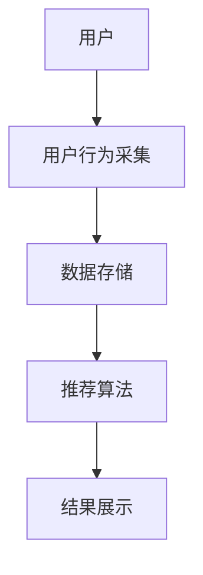

                 


# AI Agent在智能书架中的阅读习惯培养

> 关键词：AI Agent、智能书架、阅读习惯、推荐算法、用户行为分析

> 摘要：本文探讨了AI Agent在智能书架中的应用，重点分析了其在阅读习惯培养中的作用。通过介绍AI Agent的基本概念、智能书架的核心功能，详细讲解了AI Agent如何通过智能推荐算法和用户行为分析来优化阅读习惯的培养过程。本文还讨论了系统架构设计、项目实战案例以及未来的发展方向。

---

## 第一部分: AI Agent与智能书架的背景介绍

### 第1章: AI Agent的基本概念

#### 1.1 什么是AI Agent
AI Agent（人工智能代理）是指能够感知环境、自主决策并执行任务的智能实体。它可以理解用户需求，主动提供解决方案，广泛应用于推荐系统、自动化控制等领域。

#### 1.2 AI Agent的核心特点
- **自主性**：能够自主决策，无需人工干预。
- **反应性**：能实时感知环境变化并做出反应。
- **学习能力**：通过数据学习，不断优化自身行为。

#### 1.3 AI Agent与传统软件的区别
| 特性 | AI Agent | 传统软件 |
|------|----------|----------|
| 智能性 | 高       | 低       |
| 自主性 | 高       | 低       |
| 学习能力 | 高       | 无       |

### 第2章: 智能书架的定义与特点

#### 2.1 智能书架的定义
智能书架是一种结合了AI技术的电子书管理工具，能够根据用户的阅读习惯和偏好，提供智能化的推荐和管理功能。

#### 2.2 智能书架的核心功能
- **智能推荐**：基于用户阅读历史和偏好，推荐相关内容。
- **阅读习惯分析**：分析用户的阅读行为，提供个性化建议。
- **阅读计划生成**：根据用户的兴趣和时间安排，生成阅读计划。

#### 2.3 智能书架与传统书架的对比
| 功能 | 智能书架 | 传统书架 |
|------|----------|----------|
| 推荐功能 | 有       | 无       |
| 个性化服务 | 有       | 无       |
| 自动化管理 | 有       | 无       |

---

## 第二部分: AI Agent的核心概念与原理

### 第3章: AI Agent的核心概念

#### 3.1 智能推荐算法
智能推荐算法是AI Agent的核心技术之一，用于根据用户行为和数据，推荐相关内容。

##### 3.1.1 协同过滤推荐算法
协同过滤是一种基于用户行为的推荐算法，通过分析用户的历史行为，找到相似的用户或物品，进行推荐。

##### 3.1.2 基于内容的推荐算法
基于内容的推荐算法通过分析物品的属性（如书籍内容、标签等），找到与用户兴趣相似的物品进行推荐。

##### 3.1.3 混合推荐算法
混合推荐算法结合协同过滤和基于内容的推荐算法，利用两者的优势，提高推荐的准确性和多样性。

#### 3.2 用户行为分析
用户行为分析是通过收集和分析用户的阅读数据，了解用户的兴趣和习惯，从而优化推荐策略。

##### 3.2.1 数据采集
数据采集包括用户点击、浏览、收藏等行为数据的收集。

##### 3.2.2 数据分析
数据分析通过对采集到的数据进行统计和挖掘，找到用户的阅读偏好和习惯。

##### 3.2.3 数据可视化
数据可视化通过图表等形式，直观展示用户行为分析的结果。

#### 3.3 阅读习惯模型
阅读习惯模型是通过分析用户的阅读数据，构建用户的阅读偏好和习惯的数学模型。

##### 3.3.1 模型构建
模型构建包括数据预处理、特征提取和模型训练等步骤。

##### 3.3.2 模型优化
模型优化通过对模型参数的调整，提高模型的准确性和鲁棒性。

##### 3.3.3 模型应用
模型应用包括基于模型的推荐和阅读计划生成等。

---

## 第三部分: AI Agent在智能书架中的技术实现

### 第4章: 数据采集与处理

#### 4.1 用户阅读数据的采集
用户阅读数据的采集包括用户点击、浏览、收藏等行为数据的记录和存储。

#### 4.2 数据清洗与预处理
数据清洗与预处理包括去除噪声数据、填补缺失值和标准化数据等步骤。

#### 4.3 数据存储与管理
数据存储与管理包括将处理后的数据存储在数据库中，并建立高效的查询机制。

### 第5章: 推荐算法实现

#### 5.1 协同过滤推荐算法
协同过滤推荐算法通过分析用户的历史行为，找到相似的用户或物品，进行推荐。

##### 5.1.1 用户相似度计算
用户相似度计算通过计算用户之间的相似度，找到相似的用户。

##### 5.1.2 物品相似度计算
物品相似度计算通过计算物品之间的相似度，找到相似的物品。

##### 5.1.3 推荐结果生成
推荐结果生成基于相似度计算的结果，生成推荐列表。

#### 5.2 基于内容的推荐算法
基于内容的推荐算法通过分析物品的属性，找到与用户兴趣相似的物品进行推荐。

##### 5.2.1 特征提取
特征提取包括从物品中提取有用的特征，如关键词、标签等。

##### 5.2.2 相似度计算
相似度计算通过计算用户兴趣与物品特征的相似度，生成推荐列表。

##### 5.2.3 推荐结果生成
推荐结果生成基于相似度计算的结果，生成推荐列表。

#### 5.3 混合推荐算法
混合推荐算法结合协同过滤和基于内容的推荐算法，利用两者的优势，提高推荐的准确性和多样性。

##### 5.3.1 组合策略
组合策略包括将两种算法的结果进行加权组合，生成最终的推荐列表。

##### 5.3.2 融合策略
融合策略包括将两种算法的结果进行融合，生成最终的推荐列表。

### 第6章: 系统架构设计

#### 6.1 系统功能模块划分
系统功能模块划分包括用户界面、数据采集、推荐算法和结果展示等模块。

#### 6.2 系统架构图


#### 6.3 系统接口设计
系统接口设计包括用户与系统交互的接口，如API接口和用户界面。

### 第7章: 项目实战

#### 7.1 环境搭建
环境搭建包括安装必要的软件和工具，如Python、Jupyter Notebook等。

#### 7.2 系统核心实现
系统核心实现包括数据采集、推荐算法实现和结果展示等部分。

##### 7.2.1 数据采集代码
```python
import requests
import json

url = 'https://example.com/api/users'
response = requests.get(url)
data = json.loads(response.text)
```

##### 7.2.2 推荐算法代码
```python
from sklearn.metrics.pairwise import cosine_similarity

def calculate_similarity(matrix):
    return cosine_similarity(matrix)
```

##### 7.2.3 结果展示代码
```python
import matplotlib.pyplot as plt

plt.barh(result, height=0.5)
plt.show()
```

#### 7.3 实际案例分析
实际案例分析包括通过具体案例展示系统的实际应用和效果。

#### 7.4 优化建议
优化建议包括对系统进行优化，如提高推荐算法的准确性和系统性能。

---

## 第四部分: 总结与展望

### 第8章: 总结与展望

#### 8.1 总结
本文详细介绍了AI Agent在智能书架中的应用，重点分析了其在阅读习惯培养中的作用。通过介绍AI Agent的基本概念、智能书架的核心功能，详细讲解了AI Agent如何通过智能推荐算法和用户行为分析来优化阅读习惯的培养过程。

#### 8.2 展望
未来，随着AI技术的不断发展，AI Agent在智能书架中的应用将更加广泛和深入。可以通过引入深度学习算法，进一步提高推荐的准确性和个性化。同时，结合社交阅读等功能，进一步提升用户体验。

---

通过本文的介绍，读者可以全面了解AI Agent在智能书架中的应用及其对阅读习惯培养的重要作用。希望本文能够为相关领域的研究和实践提供有益的参考。

