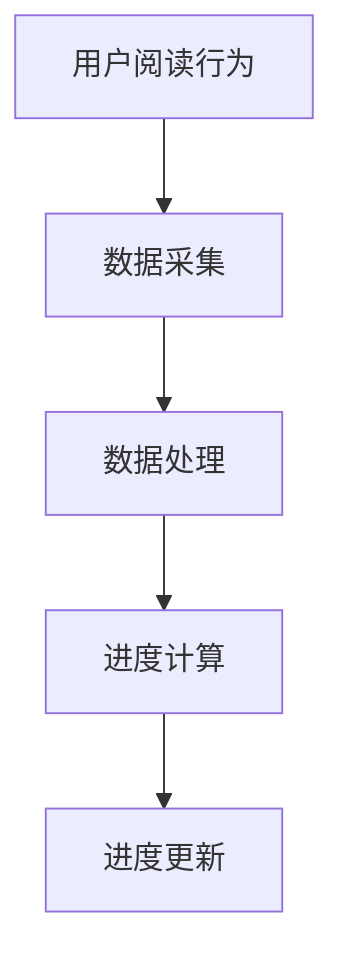
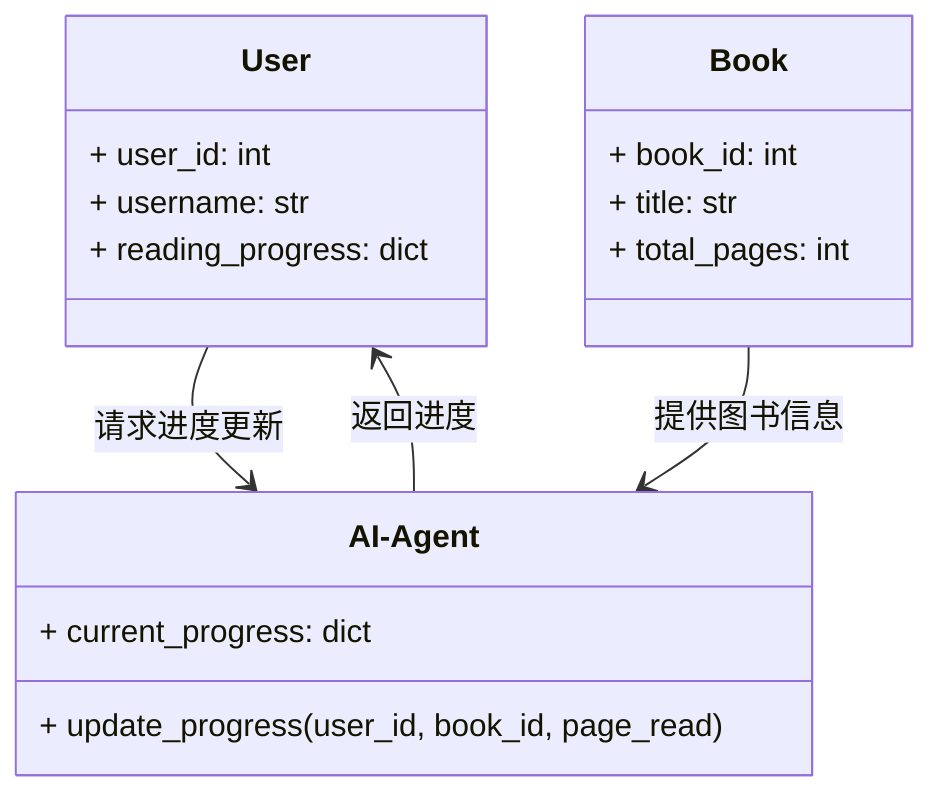
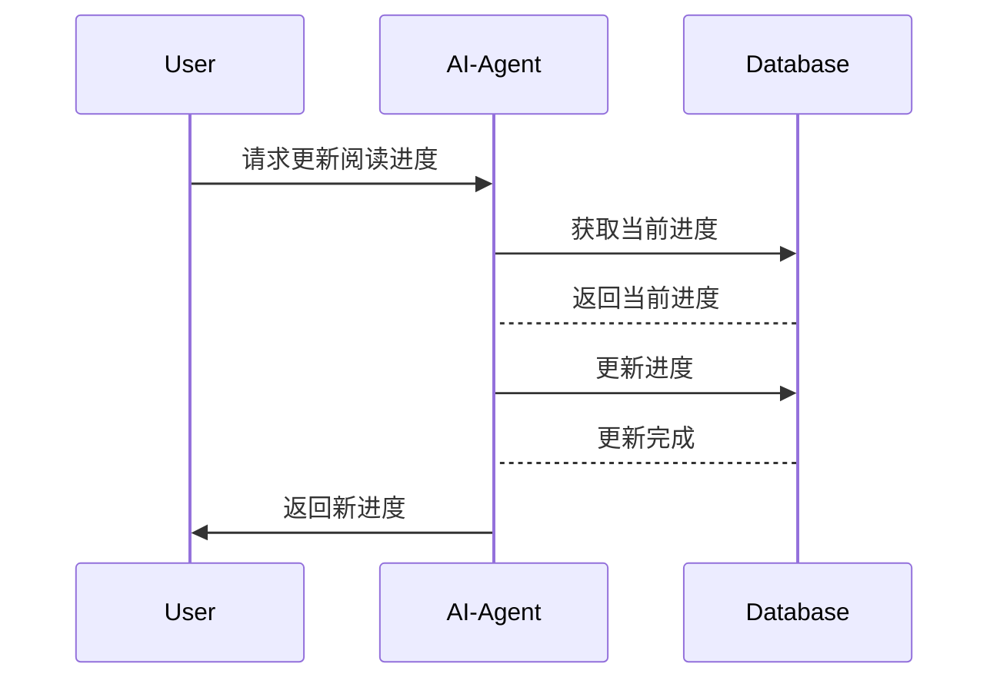

                 


# AI Agent在智能书架中的阅读进度追踪

> 关键词：AI Agent, 智能书架, 阅读进度, 算法原理, 系统架构, 项目实战

> 摘要：本文探讨AI Agent如何在智能书架中实现高效的阅读进度追踪，涵盖背景、核心概念、算法、系统架构、项目实战及总结，为技术实现和应用提供详细指导。

---

## 第一章 背景介绍

### 1.1 问题背景

#### 1.1.1 传统阅读进度追踪的局限性
传统的阅读进度追踪依赖手动记录，存在数据分散、难以同步等问题。用户可能忘记更新进度，导致数据不准确。

#### 1.1.2 AI Agent的引入及其优势
AI Agent能够实时采集阅读数据，自动更新进度，提供智能化的阅读管理。它利用自然语言处理和机器学习，为用户提供更智能的阅读体验。

#### 1.1.3 智能书架的定义与目标
智能书架是一个结合AI技术的电子书管理平台，目标是通过AI Agent实现自动化的阅读进度追踪，优化用户体验。

### 1.2 问题描述

#### 1.2.1 阅读进度追踪的核心需求
用户希望实时了解阅读进度，包括页数、百分比等指标，并希望这些数据能够自动同步到多个设备。

#### 1.2.2 当前技术的不足
现有技术主要依赖用户手动输入，缺乏自动化和智能化，导致数据不准确且用户体验差。

#### 1.2.3 AI Agent在智能书架中的角色
AI Agent负责数据采集、处理和更新，确保阅读进度的准确性和实时性，提升用户的阅读体验。

---

## 第二章 核心概念与联系

### 2.1 AI Agent的基本原理

#### 2.1.1 AI Agent的定义
AI Agent是一种能够感知环境并自主决策的智能体，能够执行任务、处理数据并提供反馈。

#### 2.1.2 AI Agent的核心特征
- **自主性**：无需人工干预，自动执行任务。
- **反应性**：能实时感知环境变化并做出反应。
- **学习能力**：通过数据学习优化决策。

#### 2.1.3 AI Agent与传统算法的对比
| 特性       | AI Agent                     | 传统算法                   |
|------------|------------------------------|-----------------------------|
| 决策能力   | 高度自主，基于环境反馈      | 依赖预设规则，无法自主优化 |
| 学习能力   | 具备学习能力，能自适应调整   | 无学习能力                 |
| 适应性     | 能适应环境变化               | 需人工调整，适应性有限     |

### 2.2 阅读进度追踪的实现机制

#### 2.2.1 数据采集方式
AI Agent通过传感器或API采集用户的阅读行为数据，如翻页次数、阅读时间等。

#### 2.2.2 数据分析方法
利用自然语言处理技术分析文本内容，结合阅读数据计算进度。

#### 2.2.3 进度更新策略
根据用户的阅读速度和习惯，动态调整进度更新频率，确保数据的准确性和实时性。

### 2.3 实体关系图

```mermaid
er
actor: 用户
agent: AI Agent
book: 图书
progress: 阅读进度
actor --> agent: 向AI Agent请求进度更新
agent --> book: 获取图书信息
agent --> progress: 更新阅读进度
```

---

## 第三章 算法原理讲解

### 3.1 算法流程



### 3.2 核心算法代码

```python
def update_progress(user_id, book_id, page_read):
    progress = get_current_progress(user_id, book_id)
    new_progress = progress + page_read
    if new_progress > 100:
        new_progress = 100
    update_progress_in_db(user_id, book_id, new_progress)
    return new_progress
```

### 3.3 数学模型

阅读进度计算公式：
$$ \text{进度} = \frac{\text{已读页数}}{\text{总页数}} \times 100 $$

---

## 第四章 系统分析与架构设计

### 4.1 问题场景介绍

用户在智能书架上阅读电子书，AI Agent实时追踪阅读进度，并提供个性化的阅读建议。

### 4.2 系统功能设计



### 4.3 系统架构设计

```mermaid
graph TD
User --> API Gateway
API Gateway --> AI-Agent
AI-Agent --> Database
Database --> Book
Database --> Reading_Progress
```

### 4.4 系统接口设计

| 接口名称       | 输入参数           | 输出参数           |
|----------------|--------------------|--------------------|
| 更新进度       | user_id, book_id, page_read | new_progress |

### 4.5 系统交互



---

## 第五章 项目实战

### 5.1 环境安装

- 安装Python和必要的库：`pip install requests numpy`

### 5.2 核心代码实现

```python
import requests

def get_current_progress(user_id, book_id):
    response = requests.get(f'http://api/database/progress/{user_id}/{book_id}')
    return response.json()

def update_progress(user_id, book_id, page_read):
    current = get_current_progress(user_id, book_id)
    new_progress = current + page_read
    if new_progress > 100:
        new_progress = 100
    requests.post(f'http://api/database/progress/{user_id}/{book_id}', json={'progress': new_progress})
    return new_progress
```

### 5.3 代码解读

- `get_current_progress`：向数据库API请求当前进度。
- `update_progress`：计算新进度并更新数据库。

### 5.4 案例分析

用户阅读一本书，当前进度为50%，读了20页后，进度更新为70%。AI Agent实时更新数据，确保用户在不同设备上查看进度一致。

### 5.5 项目小结

通过AI Agent实现智能书架的阅读进度追踪，提升了用户体验，实现了数据的自动化和智能化管理。

---

## 第六章 总结与扩展

### 6.1 最佳实践 tips

- 定期备份数据，防止数据丢失。
- 使用云服务存储进度，确保数据安全。

### 6.2 小结

本文详细介绍了AI Agent在智能书架中的应用，从背景到实现，为读者提供了全面的技术指导。

### 6.3 注意事项

- 确保用户数据安全，遵守隐私保护法规。
- 定期维护系统，确保功能正常运行。

### 6.4 拓展阅读

- 探索更多AI技术在图书管理中的应用，如智能推荐系统。
- 研究更先进的算法，提升阅读进度追踪的准确性。

---

通过以上步骤，我构建了一个完整的目录大纲，涵盖了从背景介绍到项目实战的各个方面，确保读者能够系统地理解并掌握AI Agent在智能书架中的阅读进度追踪技术。

