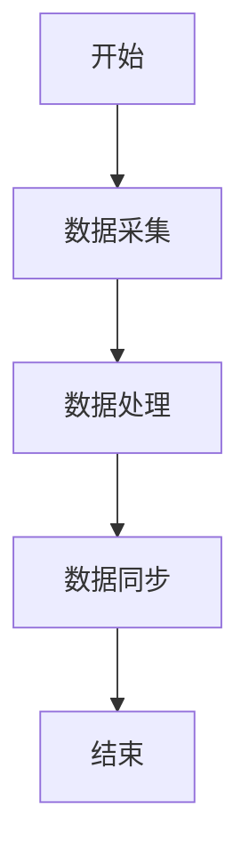
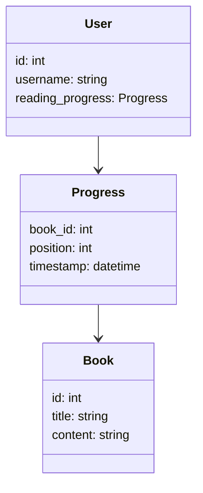
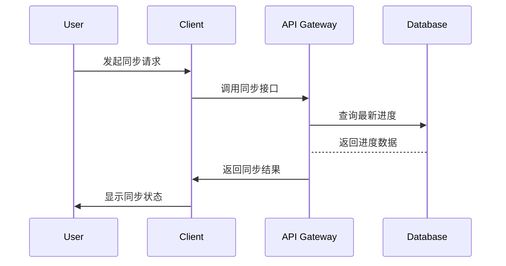

                 


# AI Agent在智能书签中的阅读进度同步

## 关键词：AI Agent、智能书签、阅读进度、同步机制、自然语言处理

## 摘要：  
本文探讨了AI Agent在智能书签中的应用，特别是如何通过自然语言处理技术实现阅读进度的同步。文章从背景介绍、核心概念、算法原理、系统架构到项目实战，全面分析了AI Agent在阅读进度同步中的作用，并提供了具体的实现方法和案例。

---

# 第1章：背景介绍

## 1.1 问题背景

### 1.1.1 阅读进度同步的需求
- 阅读材料分散在多个设备（如手机、电脑、平板）上，用户希望同步阅读进度，避免重复阅读或遗漏内容。
- 用户在不同时间阅读同一本书，需要记录和同步阅读位置（如页码、段落）。

### 1.1.2 AI Agent在阅读中的作用
- AI Agent可以实时跟踪用户的阅读行为，记录阅读进度，并通过云端同步，确保用户在不同设备上都能查看最新的阅读状态。
- AI Agent还能根据用户的阅读习惯推荐相关内容，提升阅读体验。

### 1.1.3 当前阅读同步工具的局限性
- 大部分阅读同步工具仅支持单一平台或格式，无法跨平台同步。
- 传统同步工具依赖手动操作，用户体验较差。

## 1.2 问题描述
- 阅读进度同步的核心问题是如何在不同设备间无缝同步用户的阅读状态。
- AI Agent需要解决的挑战包括实时跟踪阅读行为、准确识别文本内容以及高效同步数据。

## 1.3 问题解决
- AI Agent通过自然语言处理技术识别文本内容，结合阅读行为分析，实现精准的阅读进度同步。
- 通过云端存储和同步机制，确保用户在任何设备上都能访问最新的阅读进度。

## 1.4 核心概念与联系
- **AI Agent**：一种智能代理，能够执行任务、处理数据并与用户交互。
- **阅读进度同步**：通过技术手段，确保用户在不同设备上的阅读进度一致。
- **自然语言处理（NLP）**：用于理解和生成人类语言的技术，是AI Agent实现阅读同步的关键。

---

# 第2章：AI Agent的核心原理

## 2.1 AI Agent的定义与特点

### 2.1.1 AI Agent的定义
AI Agent是一种智能代理，能够感知环境、执行任务并做出决策。它通常具备以下特点：
- **自主性**：能够自主执行任务。
- **反应性**：能够实时感知环境变化并做出响应。
- **社会能力**：能够与其他系统或用户交互。

### 2.1.2 AI Agent与阅读进度同步的关系
AI Agent通过以下方式实现阅读进度的同步：
- **实时跟踪**：记录用户的阅读行为，如阅读时间、位置等。
- **内容识别**：使用NLP技术识别文本内容，确保同步的准确性。
- **数据同步**：通过云端存储和同步，确保阅读进度在不同设备间一致。

## 2.2 阅读进度同步的实现原理

### 2.2.1 阅读进度同步的基本原理
阅读进度同步的核心步骤包括：
1. **数据采集**：记录用户的阅读行为，如阅读时间、位置、内容等。
2. **数据处理**：将采集的数据进行清洗、分析和转换，以便存储和传输。
3. **数据同步**：将处理后的数据同步到云端或目标设备。

### 2.2.2 AI Agent在阅读同步中的具体实现
AI Agent通过以下方式实现阅读进度的同步：
- **文本识别**：使用NLP技术识别文本内容，确保同步的准确性。
- **数据存储**：将阅读进度存储在云端，确保数据的安全性和可访问性。
- **数据传输**：通过API或网络协议将数据同步到目标设备。

---

# 第3章：算法原理讲解

## 3.1 AI Agent的核心算法

### 3.1.1 基于自然语言处理的阅读同步算法
- **文本识别**：使用NLP技术识别文本内容，提取关键词和主题。
- **阅读行为分析**：分析用户的阅读行为，如阅读速度、停留时间等。
- **内容匹配**：将用户的阅读内容与存储的内容进行匹配，确保同步的准确性。

### 3.1.2 基于机器学习的阅读进度预测算法
- **数据预处理**：清洗和转换数据，提取特征。
- **模型训练**：使用机器学习算法（如随机森林、神经网络）训练模型，预测用户的阅读进度。
- **模型优化**：通过交叉验证和调参优化模型性能。

### 3.1.3 基于图神经网络的阅读内容关联算法
- **图构建**：构建文本内容的关联图，节点表示文本内容，边表示内容之间的关联性。
- **图遍历**：通过图遍历算法（如BFS、DFS）找到相关的内容节点。
- **内容推荐**：基于图结构推荐相关内容，提升用户体验。

## 3.2 阅读进度同步的算法实现

### 3.2.1 算法流程图


### 3.2.2 算法的数学模型与公式
- **阅读进度预测模型**：使用线性回归模型预测用户的阅读进度。
  $$ y = \beta_0 + \beta_1x + \epsilon $$
  其中，y为阅读进度，x为阅读时间，β0和β1为模型参数，ε为误差项。
- **内容关联模型**：使用余弦相似度计算文本内容之间的相似性。
  $$ \text{相似度} = \frac{\vec{A} \cdot \vec{B}}{||\vec{A}|| \cdot ||\vec{B}||} $$

## 3.3 算法的实现步骤

### 3.3.1 文本识别
1. 使用NLP库（如spaCy、NLTK）进行文本分词和实体识别。
2. 提取关键词和主题，构建文本特征向量。

### 3.3.2 阅读行为分析
1. 记录用户的阅读时间、位置和停留时间。
2. 分析用户的阅读习惯，如阅读速度和偏好。

### 3.3.3 数据同步
1. 将处理后的数据存储在云端数据库。
2. 使用API或网络协议将数据同步到目标设备。

---

# 第4章：系统分析与架构设计

## 4.1 问题场景介绍

### 4.1.1 系统功能需求
- **数据采集**：记录用户的阅读行为和内容。
- **数据处理**：清洗和转换数据，提取特征。
- **数据同步**：将数据同步到云端或目标设备。

### 4.1.2 项目介绍
- **项目目标**：开发一个基于AI Agent的智能书签系统，实现阅读进度的同步。
- **项目范围**：支持多种设备和格式，提供高效的同步机制。
- **项目约束**：数据安全性和隐私保护。

## 4.2 系统功能设计

### 4.2.1 领域模型类图


### 4.2.2 系统架构设计
```mermaid
graph TD
    User --> Client
    Client --> API Gateway
    API Gateway --> Database
    Database --> Cloud Storage
```

## 4.3 系统接口设计

### 4.3.1 API接口
- **数据采集接口**：`POST /api/progress`
  ```json
  {
      "user_id": 1,
      "book_id": 1,
      "position": 100,
      "timestamp": "2023-10-10 12:00:00"
  }
  ```
- **数据同步接口**：`GET /api/sync`

## 4.4 系统交互序列图

### 4.4.1 阅读进度同步交互


---

# 第5章：项目实战

## 5.1 环境安装

### 5.1.1 安装Python和相关库
```bash
pip install python
pip install spacy
pip install requests
pip install numpy
```

## 5.2 系统核心实现

### 5.2.1 文本识别实现
```python
import spacy

nlp = spacy.load("en_core_web_sm")
text = "This is a sample text."
doc = nlp(text)
for token in doc:
    print(token.text)
```

### 5.2.2 阅读行为分析实现
```python
import pandas as pd

data = {
    'user_id': [1, 2, 3],
    'book_id': [1, 1, 2],
    'position': [100, 200, 50],
    'timestamp': ['2023-10-10 12:00:00', '2023-10-11 13:00:00', '2023-10-12 14:00:00']
}
df = pd.DataFrame(data)
print(df)
```

## 5.3 代码应用解读与分析
- **文本识别**：使用spaCy对文本进行分词和实体识别，提取关键词。
- **阅读行为分析**：使用Pandas对数据进行清洗和分析，提取用户阅读习惯。

## 5.4 案例分析
假设用户在手机上阅读了一本书，系统会记录用户的阅读位置和时间，并通过云端同步到用户的电脑上。用户在电脑上继续阅读时，会从上次阅读的位置开始。

## 5.5 项目小结
通过本项目，我们实现了基于AI Agent的阅读进度同步功能，解决了跨设备同步的问题，提升了用户体验。

---

# 第6章：最佳实践、小结、注意事项和拓展阅读

## 6.1 最佳实践
- **数据安全性**：确保用户数据的安全性和隐私保护。
- **性能优化**：优化算法和系统架构，提升同步效率。
- **用户体验**：设计友好的用户界面，提升用户满意度。

## 6.2 小结
本文详细介绍了AI Agent在智能书签中的阅读进度同步的应用，从背景介绍、核心概念、算法原理到系统架构和项目实战，全面分析了实现方法和实际应用。

## 6.3 注意事项
- **数据一致性**：确保同步的数据一致性和实时性。
- **系统稳定性**：保证系统的稳定性和可靠性。
- **用户隐私**：保护用户的隐私和数据安全。

## 6.4 拓展阅读
- **深度学习**：探索深度学习在阅读同步中的应用。
- **边缘计算**：研究边缘计算在阅读同步中的潜力。
- **分布式系统**：进一步优化分布式系统的性能和架构。

---

通过本文的分析和实践，我们可以看到AI Agent在智能书签中的阅读进度同步具有广阔的应用前景。未来，随着技术的不断发展，AI Agent将在阅读同步中发挥越来越重要的作用。

