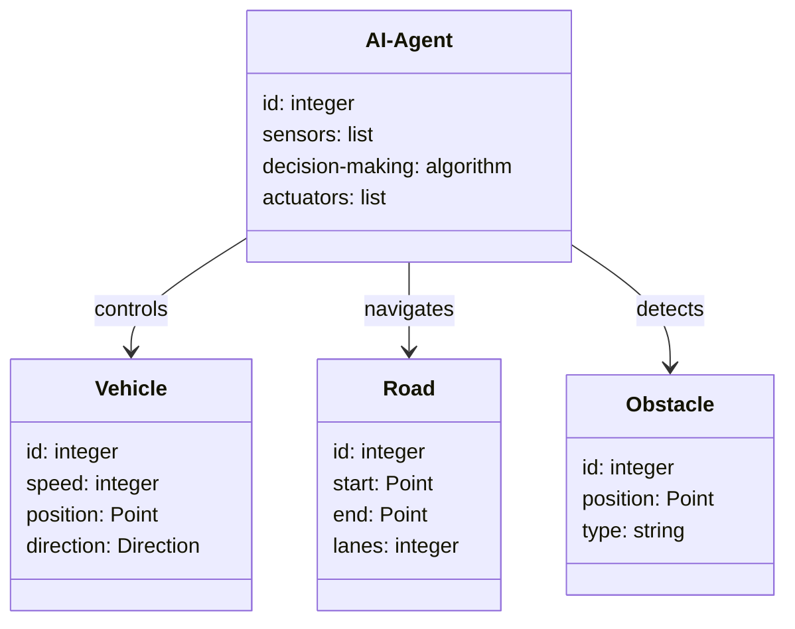
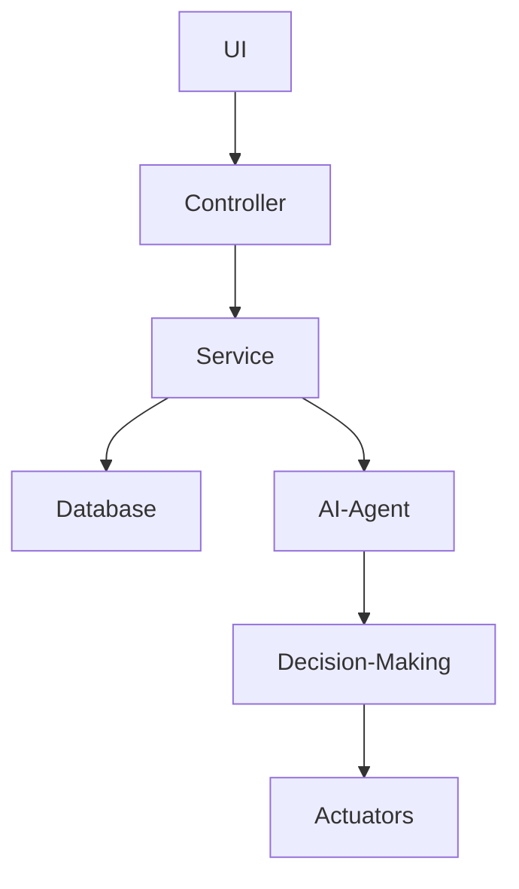
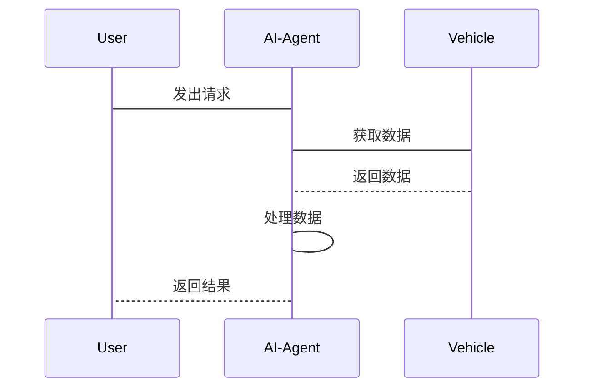

                 


# 第4章 系统分析与架构设计

## 4.1 问题场景介绍
### 4.1.1 交通事故预防的复杂性
### 4.1.2 AI Agent在系统中的角色
### 4.1.3 系统的目标与范围

## 4.2 项目介绍
### 4.2.1 项目背景
### 4.2.2 项目目标
### 4.2.3 项目范围

## 4.3 系统功能设计
### 4.3.1 领域模型类图


## 4.4 系统架构设计
### 4.4.1 分层架构
### 4.4.2 模块划分
### 4.4.3 模块交互


## 4.5 系统接口设计
### 4.5.1 API接口定义
### 4.5.2 接口交互流程
### 4.5.3 接口实现示例

## 4.6 系统交互序列图


# 第5章 项目实战

## 5.1 环境安装
### 5.1.1 安装Python
### 5.1.2 安装TensorFlow
### 5.1.3 安装ROS

## 5.2 系统核心实现
### 5.2.1 数据预处理
### 5.2.2 模型训练
### 5.2.3 模型部署

## 5.3 代码实现
### 5.3.1 数据处理代码
```python
import pandas as pd

data = pd.read_csv('traffic.csv')
print(data.head())
```

### 5.3.2 模型训练代码
```python
model = tf.keras.Sequential([
    tf.keras.layers.Dense(64, activation='relu'),
    tf.keras.layers.Dense(10, activation='softmax')
])
model.compile(optimizer='adam', loss='sparse_categorical_crossentropy', metrics=['accuracy'])
model.fit(data, labels, epochs=10)
```

## 5.4 案例分析
### 5.4.1 案例背景
### 5.4.2 实施过程
### 5.4.3 结果分析

## 5.5 项目小结
### 5.5.1 成果总结
### 5.5.2 经验教训
### 5.5.3 改进建议

# 第6章 总结与展望

## 6.1 技术总结
### 6.1.1 核心技术回顾
### 6.1.2 技术创新点
### 6.1.3 未来技术趋势

## 6.2 项目总结
### 6.2.1 项目成果
### 6.2.2 项目经验
### 6.2.3 项目启示

## 6.3 未来展望
### 6.3.1 技术融合
### 6.3.2 应用场景拓展
### 6.3.3 挑战与机遇

# 第7章 附录

## 7.1 工具使用说明
### 7.1.1 TensorFlow安装与使用
### 7.1.2 ROS安装与配置
### 7.1.3 Mermaid图表绘制

## 7.2 参考文献
### 7.2.1 学术文献
### 7.2.2 技术文档
### 7.2.3 在线资源

---

### 总结
《AI Agent在智能交通事故预防中的实践》一书详细探讨了AI Agent在交通事故预防中的应用，从理论到实践，系统地介绍了相关技术与实现方案。通过本指南，读者可以全面了解如何利用AI Agent技术来提升交通事故预防的效果，为未来的智能交通安全系统提供了重要参考。

