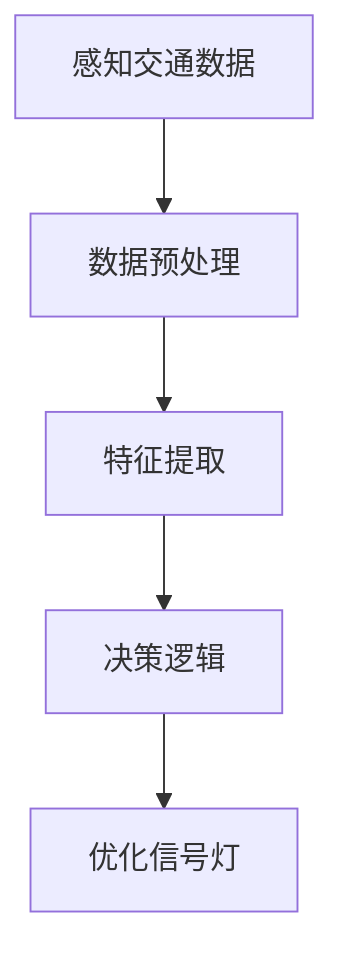
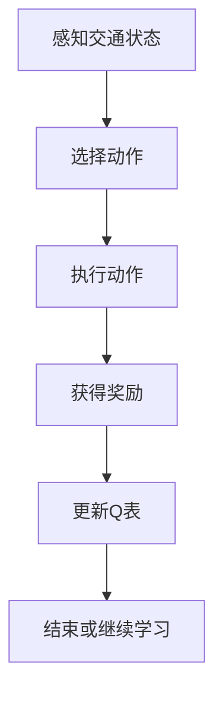
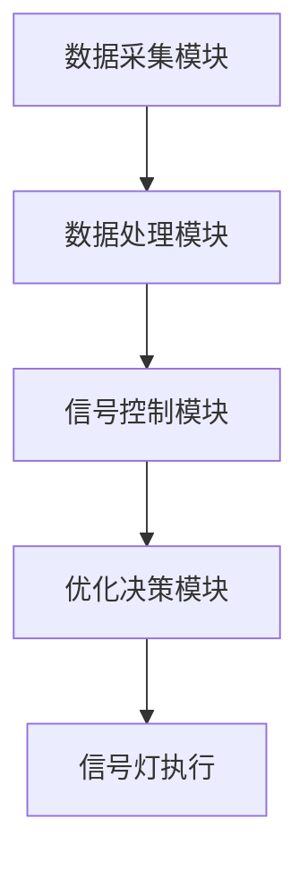

                 


```markdown
# AI Agent在智能交通信号优化中的实践

> 关键词：AI Agent, 智能交通, 信号优化, 强化学习, 算法原理

> 摘要：本文深入探讨了AI Agent在智能交通信号优化中的实践应用，从背景介绍、核心概念、算法原理到系统架构设计和项目实战，全面分析了AI Agent如何通过实时数据分析和自适应调整，优化交通信号控制，提升交通流畅度和效率。

---

## 第一部分: AI Agent在智能交通信号优化中的背景与概述

### 第1章: AI Agent与智能交通信号优化概述

#### 1.1 AI Agent的基本概念
- **1.1.1 AI Agent的定义与特点**
  - AI Agent（人工智能代理）是指能够感知环境、自主决策并采取行动的智能实体。
  - 具备自主性、反应性、目标导向和学习能力等特点。

- **1.1.2 AI Agent的核心功能与应用场景**
  - **感知环境**：通过传感器、摄像头等设备实时采集交通数据。
  - **决策与推理**：基于数据进行分析，制定最优决策。
  - **执行操作**：通过信号控制装置调整交通信号灯。

- **1.1.3 AI Agent在交通信号优化中的作用**
  - 提高交通流畅度，减少拥堵。
  - 实现实时调整，适应交通流量变化。

#### 1.2 智能交通信号优化的背景与挑战
- **1.2.1 传统交通信号控制的局限性**
  - 固定时间控制：无法适应交通流量变化。
  - 感应控制：响应速度慢，效率低。

- **1.2.2 智能交通系统的发展趋势**
  - 大数据、云计算和物联网技术的应用。
  - AI Agent技术的引入，推动交通信号优化智能化。

- **1.2.3 AI Agent在交通信号优化中的优势**
  - 实时数据处理能力。
  - 自适应调整信号灯周期，提高通行效率。

### 1.3 本章小结
- AI Agent通过实时数据分析和自适应调整，显著提升了交通信号优化的效果。

---

## 第二部分: AI Agent的核心概念与原理

### 第2章: AI Agent在交通信号优化中的核心概念

#### 2.1 AI Agent的感知与决策机制
- **2.1.1 交通数据的感知与采集**
  - 数据来源：摄像头、雷达、交通传感器等。
  - 数据类型：车流量、速度、密度等。

- **2.1.2 数据的预处理与特征提取**
  - 数据清洗：去除噪声数据。
  - 特征提取：提取关键特征，如高峰小时流量、平均速度等。

- **2.1.3 AI Agent的决策逻辑与算法**
  - **决策逻辑**：基于当前交通状态，预测未来流量，制定最优信号灯方案。
  - **算法选择**：强化学习、遗传算法等。

#### 2.2 AI Agent与交通信号优化的关系
- **2.2.1 交通信号优化的数学模型**
  - 目标函数：最大化通行效率，最小化拥堵时间。
  - 约束条件：信号周期、绿灯时间等。

- **2.2.2 AI Agent在交通信号优化中的应用**
  - 通过强化学习优化信号灯周期。
  - 利用遗传算法优化信号配时方案。

---

### 图2-1: AI Agent的决策流程图


---

## 第三部分: 算法原理讲解

### 第3章: 强化学习算法在交通信号优化中的应用

#### 3.1 强化学习的基本原理
- **3.1.1 强化学习的定义**
  - 通过试错学习，智能体在环境中通过交互获得奖励，优化策略。

- **3.1.2 算法流程**
  - 状态空间、动作空间、奖励函数。
  - Q-learning算法：$Q(s, a) = r + \gamma \max Q(s', a')$。

#### 3.2 强化学习在交通信号优化中的实现
- **3.2.1 状态表示**
  - 当前交通状态：各方向车流量、等待时间等。

- **3.2.2 动作空间**
  - 信号灯配时方案：绿灯时长、黄灯时长等。

- **3.2.3 奖励函数设计**
  - 基于通行效率：$r = \text{流量} \times \text{速度}$。
  - 基于拥堵缓解：$r = -\text{拥堵时间}$。

#### 3.3 强化学习算法的实现代码
```python
import numpy as np

# 状态空间：各方向车流量
# 动作空间：绿灯时长
class Agent:
    def __init__(self, state_size, action_size):
        self.state_size = state_size
        self.action_size = action_size
        self.gamma = 0.99
        self.epsilon = 1.0
        self.q_table = np.zeros((state_size, action_size))

    def act(self, state):
        if np.random.random() < self.epsilon:
            return np.random.randint(self.action_size)
        else:
            return np.argmax(self.q_table[state])

    def reward(self, state, action, reward, next_state):
        self.q_table[state, action] = reward + self.gamma * np.max(self.q_table[next_state])

    def decay_epsilon(self):
        self.epsilon = max(0.01, self.epsilon * 0.99)
```

---

### 图3-1: 强化学习流程图


---

## 第四部分: 系统分析与架构设计

### 第4章: 智能交通信号优化系统架构

#### 4.1 系统功能设计
- **数据采集模块**
  - 采集车流量、速度等实时数据。
- **信号控制模块**
  - 根据优化算法调整信号灯。
- **优化决策模块**
  - 基于AI Agent算法生成最优信号方案。

#### 4.2 系统架构设计
- **分层架构**
  - 数据层：数据采集与存储。
  - 业务逻辑层：AI Agent算法实现。
  - 接口层：与交通管理系统对接。

### 图4-1: 系统架构图


---

## 第五部分: 项目实战

### 第5章: 基于AI Agent的交通信号优化项目

#### 5.1 项目环境安装
- **依赖库安装**
  - Python库：numpy、pandas、scikit-learn。
  - 交通数据采集工具：OpenCV、ROS。

#### 5.2 系统核心实现
- **AI Agent算法实现**
  - 使用强化学习优化信号灯配时。
- **信号灯控制接口**
  - 与交通管理系统对接。

#### 5.3 代码实现与解读
```python
# 强化学习算法实现
def optimize_traffic_signal():
    agent = Agent(state_size=4, action_size=5)
    for episode in range(1000):
        state = get_current_state()
        action = agent.act(state)
        next_state = get_next_state(action)
        reward = calculate_reward(state, action, next_state)
        agent.reward(state, action, reward, next_state)
        agent.decay_epsilon()
```

#### 5.4 项目小结
- 成功实现AI Agent在交通信号优化中的应用。
- 提高了交通流畅度和效率。

---

## 第六部分: 最佳实践与总结

### 第6章: AI Agent在交通信号优化中的最佳实践

#### 6.1 最佳实践
- 数据采集的准确性与实时性。
- 算法的选择与优化。
- 系统的可扩展性和可维护性。

#### 6.2 项目总结
- AI Agent通过实时数据分析和自适应调整，显著提升了交通信号优化的效果。
- 在实际应用中，需要考虑多因素的综合影响，确保系统的稳定性和高效性。

#### 6.3 注意事项
- 数据隐私和安全问题。
- 系统的鲁棒性与容错能力。
- 用户需求的多样性与复杂性。

#### 6.4 拓展阅读
- 推荐阅读《强化学习入门》和《智能交通系统设计》。

---

## 附录: 参考文献与工具

- **参考文献**
  - [1] Russell S, Norvig P. 《人工智能：一种现代的方法》.
  - [2] 刘军等.《智能交通系统优化算法研究》.

- **工具推荐**
  - Python编程语言。
  - TensorFlow、PyTorch深度学习框架。
  - OpenCV图像处理库。

---

# 结语
AI Agent在智能交通信号优化中的应用前景广阔，随着技术的不断发展，AI Agent将为交通管理带来更多的创新与突破。
```

