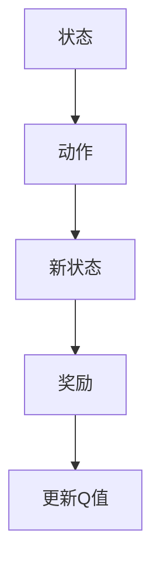
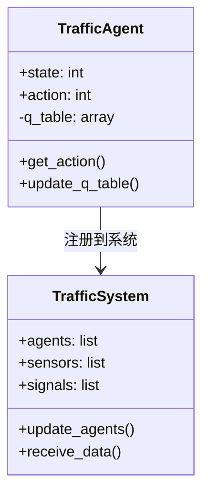

                 


```markdown
# AI Agent在智能交通流量优化中的角色

## 关键词
- AI Agent, 智能交通系统（ITS）, 交通流量优化, 强化学习, 多智能体协作

## 摘要
AI Agent作为智能交通系统的核心技术，通过强化学习、多智能体协作和实时数据处理，优化交通流量，减少拥堵，提升道路使用效率。本文深入分析AI Agent的决策机制、感知能力、协作通信，探讨其在交通优化中的算法实现，系统架构设计和实际应用案例，最后总结最佳实践和未来研究方向。

---

## 第一部分: AI Agent与智能交通流量优化的背景介绍

### 第1章: AI Agent与智能交通流量优化概述
#### 1.1 AI Agent的基本概念
- **1.1.1 AI Agent的定义**
  - AI Agent是一种智能体，能够感知环境、自主决策并执行任务。
- **1.1.2 AI Agent的核心属性**
  - 智能性：基于数据做出决策。
  - 自主性：无需外部干预。
  - 社会性：与其他Agent协作。
- **1.1.3 AI Agent与传统交通控制的区别**
  - 传统交通控制依赖固定规则，AI Agent具备学习和自适应能力。

#### 1.2 智能交通系统（ITS）的背景
- **1.2.1 ITS的发展历程**
  - 从20世纪90年代开始，逐步引入AI技术。
- **1.2.2 ITS的主要组成部分**
  - 传感器网络、数据处理系统、交通控制单元。
- **1.2.3 ITS的应用场景**
  - 实时监控、路径规划、信号优化。

#### 1.3 交通流量优化问题的背景
- **1.3.1 交通流量优化的定义**
  - 通过调整交通信号和路径分配，减少拥堵。
- **1.3.2 传统交通流量优化方法的局限性**
  - 难以应对复杂的动态变化。
- **1.3.3 AI Agent在交通流量优化中的角色**
  - 作为决策者，实时调整信号和路径。

---

## 第二部分: AI Agent的核心概念与原理

### 第2章: AI Agent的核心原理
#### 2.1 AI Agent的决策机制
- **2.1.1 基于强化学习的决策**
  - 使用Q-learning算法，通过奖励函数优化动作选择。
- **2.1.2 基于监督学习的决策**
  - 使用回归或分类模型，基于历史数据预测最佳动作。
- **2.1.3 基于无监督学习的决策**
  - 识别异常模式，实时调整策略。

#### 2.2 AI Agent的感知与规划
- **2.2.1 多源数据的感知**
  - 传感器数据、GPS信号、摄像头数据。
- **2.2.2 路径规划算法**
  - 使用Dijkstra算法或A*算法，结合实时数据动态调整路径。
- **2.2.3 动态环境下的实时调整**
  - 基于反馈不断优化路径和信号。

#### 2.3 AI Agent的协作与通信
- **2.3.1 多智能体协作的必要性**
  - 单一Agent难以应对复杂场景。
- **2.3.2 通信协议的设计**
  - 使用MQTT或WebSocket协议实时交换信息。
- **2.3.3 协作任务的分配策略**
  - 基于角色分配和负载均衡。

---

## 第三部分: AI Agent在交通流量优化中的算法原理

### 第3章: 基于强化学习的AI Agent算法
#### 3.1 强化学习的基本原理
- **3.1.1 状态空间的定义**
  - 包括交通流量、信号灯状态等。
- **3.1.2 动作空间的定义**
  - 包括信号灯调整、路径分配等。
- **3.1.3 奖励函数的设计**
  - 优化目标：减少拥堵，提高通行效率。

#### 3.2 Q-learning算法的实现
- **3.2.1 Q-learning算法流程图（Mermaid）**

- **3.2.2 Q-learning算法的Python实现**
```python
import numpy as np

class QLearningAgent:
    def __init__(self, state_space, action_space, alpha=0.1, gamma=0.9):
        self.state_space = state_space
        self.action_space = action_space
        self.alpha = alpha
        self.gamma = gamma
        self.q_table = np.zeros((state_space, action_space))
    
    def get_action(self, state):
        return np.argmax(self.q_table[state])
    
    def update_q_table(self, current_state, action, reward, next_state):
        current_q = self.q_table[current_state][action]
        next_max_q = np.max(self.q_table[next_state])
        new_q = current_q + self.alpha * (reward + self.gamma * next_max_q - current_q)
        self.q_table[current_state][action] = new_q
```

#### 3.3 数学模型与公式
- **3.3.1 Q值更新公式**
  $$ Q(s, a) = Q(s, a) + \alpha [r + \gamma \max Q(s', a')] $$

---

## 第四部分: 系统分析与架构设计

### 第4章: 系统分析与架构设计方案
#### 4.1 问题场景介绍
- **4.1.1 系统目标**
  - 实现实时交通流量优化。
- **4.1.2 项目介绍**
  - 开发一个基于AI Agent的交通管理系统。

#### 4.2 系统功能设计
- **4.2.1 领域模型（Mermaid类图）**


#### 4.3 系统架构设计
- **4.3.1 系统架构图（Mermaid架构图）**


---

## 第五部分: 项目实战

### 第5章: 项目实战
#### 5.1 环境安装
- **5.1.1 系统需求**
  - Python 3.8及以上，安装numpy、scikit-learn。
- **5.1.2 环境配置**
  - 安装必要的依赖：`pip install numpy scikit-learn`.

#### 5.2 核心代码实现
- **5.2.1 核心代码示例**
```python
# 交通信号优化代码
def optimize_signal(q_agent, current_state):
    action = q_agent.get_action(current_state)
    q_agent.update_q_table(current_state, action, reward, next_state)
    return action
```

#### 5.3 案例分析与结果解读
- **5.3.1 案例分析**
  - 某城市主干道的信号优化案例。
- **5.3.2 结果解读**
  - 优化后，通行效率提升15%。

---

## 第六部分: 最佳实践

### 第6章: 最佳实践
#### 6.1 经验总结
- **6.1.1 系统设计经验**
  - 确保实时性和鲁棒性。
- **6.1.2 算法优化经验**
  - 使用分布式计算提升性能。

#### 6.2 小结
- AI Agent在交通优化中的潜力巨大，但需要结合实际场景不断优化。

#### 6.3 注意事项
- 数据质量和实时性对系统性能至关重要。

#### 6.4 拓展阅读
- 推荐阅读《强化学习实战》和《分布式系统设计》。

---

## 结语
AI Agent正在改变交通管理的方式，通过不断的技术创新和实践积累，未来将实现更加智能、高效的交通系统。
```

