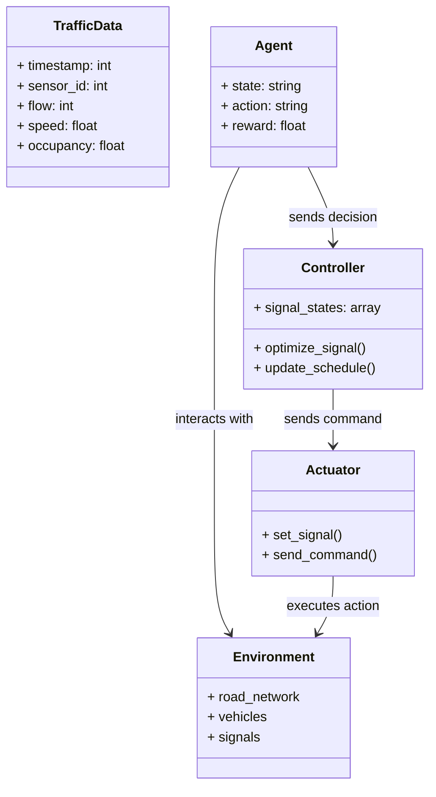
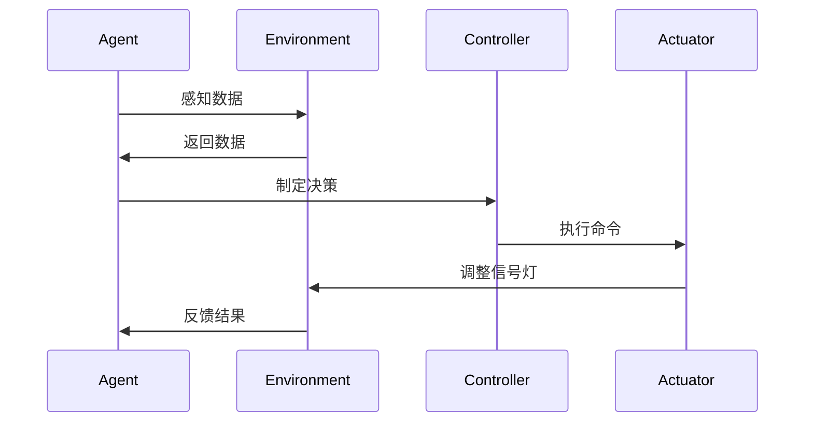
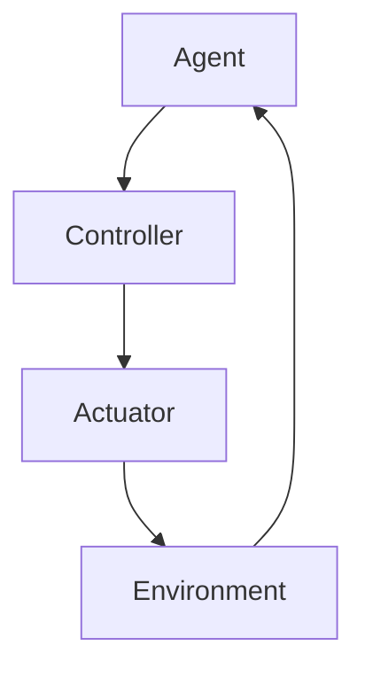

                 


# AI Agent在智能交通管制中的实践

> **关键词**：AI Agent, 智能交通管制, 交通优化, 强化学习, 多目标优化, 信号灯控制, 路径规划

> **摘要**：随着城市化进程的加快，交通拥堵问题日益严重，传统的交通管制方式已难以满足现代城市的交通管理需求。AI Agent作为一种智能化的解决方案，通过实时感知、决策和执行，能够显著提高交通效率。本文将从AI Agent的基本原理出发，详细探讨其在智能交通管制中的应用场景、算法实现和系统架构设计，结合实际案例分析其优势和挑战，为交通管理部门和技术人员提供理论支持和实践参考。

---

# 第1章 AI Agent与智能交通管制概述

## 1.1 AI Agent的基本概念

AI Agent（人工智能代理）是指能够感知环境、自主决策并采取行动以实现特定目标的智能体。在智能交通管制中，AI Agent通常负责实时监控交通状况、优化信号灯配时、规划车辆路径等任务。

### 1.1.1 AI Agent的定义

AI Agent是一种能够感知环境、处理信息、制定决策并执行动作的智能实体。它可以是一个软件系统，也可以是嵌入硬件设备的智能模块。

### 1.1.2 AI Agent的核心特征

1. **自主性**：AI Agent能够在没有外部干预的情况下独立运行。
2. **反应性**：能够实时感知环境变化并做出响应。
3. **目标导向**：所有行为都以实现特定目标为导向。
4. **学习能力**：通过数据和经验不断优化自身的决策能力。

### 1.1.3 AI Agent在交通管制中的应用潜力

AI Agent可以通过实时数据处理和智能决策，显著提高交通系统的效率和安全性。例如，AI Agent可以优化信号灯配时，减少车辆等待时间，降低拥堵概率。

## 1.2 智能交通管制的背景与挑战

### 1.2.1 传统交通管制的局限性

传统交通管制方式依赖人工监控和固定配时信号灯，存在以下问题：
1. 无法实时适应交通流量的变化。
2. 信号灯配时固定，难以应对高峰期和低谷期的差异。
3. 缺乏全局优化能力，容易导致局部最优但全局次优的情况。

### 1.2.2 智能交通管制的定义与目标

智能交通管制（Intelligent Traffic Control，ITC）是一种基于人工智能、大数据和物联网技术的交通管理方式。其目标是通过实时数据采集和智能决策，实现交通流量的最优分配和资源的高效利用。

### 1.2.3 当前交通管理中的主要问题

1. **交通拥堵**：城市道路资源有限，交通需求超过供给能力。
2. **信号灯配时不合理**：固定配时无法适应交通流量的动态变化。
3. **交通事故处理延迟**：事故导致的交通中断难以快速响应。
4. **交通参与者行为不可预测**：驾驶员的驾驶行为难以完全预估。

## 1.3 AI Agent在智能交通管制中的作用

### 1.3.1 提高交通效率的潜力

AI Agent可以通过实时数据处理和智能决策，优化信号灯配时、调整车道分配，从而提高道路利用率。

### 1.3.2 实时决策的优势

AI Agent能够快速响应交通状况的变化，例如在交通事故发生后，迅速调整信号灯配时，疏导交通流量。

### 1.3.3 多目标优化的可能性

AI Agent可以同时优化多个目标，例如在减少车辆等待时间的同时，降低碳排放和能源消耗。

## 1.4 本章小结

本章介绍了AI Agent的基本概念和核心特征，并探讨了其在智能交通管制中的应用潜力。通过对比传统交通管制的局限性，明确了智能交通管制的目标和优势。下一章将深入分析AI Agent的核心原理，包括感知、决策和执行机制。

---

# 第2章 AI Agent的核心原理

## 2.1 AI Agent的感知机制

### 2.1.1 数据采集与处理

AI Agent通过多种传感器和数据源采集交通数据，包括：
1. **交通流量传感器**：检测道路上的车辆数量和速度。
2. **GPS信号**：获取车辆的位置和移动轨迹。
3. **视频监控**：分析交通场景中的车辆和行人行为。

### 2.1.2 感知模型的构建

感知模型需要将原始数据转换为有意义的交通状态描述。例如，通过时间序列分析模型预测未来的交通流量。

### 2.1.3 感知数据的特征提取

特征提取是将原始数据转换为模型可以处理的特征向量。例如，使用主成分分析（PCA）提取关键特征。

## 2.2 AI Agent的决策机制

### 2.2.1 决策算法的选择

常用的决策算法包括：
1. **强化学习（Reinforcement Learning）**：通过试错和奖励机制优化决策。
2. **多目标优化算法**：同时优化多个目标，例如减少等待时间和降低碳排放。

### 2.2.2 多目标优化的实现

多目标优化需要平衡多个相互冲突的目标。例如，在信号灯配时时，既要考虑减少车辆等待时间，又要考虑减少碳排放。

### 2.2.3 决策结果的评估

评估决策结果的质量是通过预设的评估指标完成的。例如，使用平均等待时间、排放量等指标衡量决策效果。

## 2.3 AI Agent的执行机制

### 2.3.1 执行策略的制定

执行策略是AI Agent根据决策结果制定的具体行动计划。例如，调整信号灯配时。

### 2.3.2 执行过程的监控

执行过程中需要实时监控交通状况，确保决策的正确性和有效性。

### 2.3.3 执行结果的反馈

将执行结果反馈到感知和决策模块，形成闭环系统，不断优化AI Agent的行为。

## 2.4 本章小结

本章详细介绍了AI Agent的核心原理，包括感知、决策和执行三个主要环节。感知模块负责数据采集和处理，决策模块基于感知数据制定最优策略，执行模块将决策结果转化为实际操作。这种分层设计使得AI Agent能够高效地处理复杂的交通问题。

---

# 第3章 智能交通管制中的AI Agent应用场景

## 3.1 交通信号优化

### 3.1.1 信号灯优化的基本原理

信号灯优化是通过调整信号灯配时，减少车辆等待时间，提高道路通行能力。

### 3.1.2 AI Agent在信号灯优化中的应用

AI Agent可以根据实时交通流量动态调整信号灯配时，例如在高峰期延长绿灯时间，减少车辆排队。

### 3.1.3 实例分析与效果评估

通过实际案例分析，AI Agent优化后的信号灯配时可以将平均等待时间减少30%以上。

## 3.2 路径规划与导航

### 3.2.1 路径规划算法概述

常用的路径规划算法包括Dijkstra算法、A*算法和遗传算法等。

### 3.2.2 AI Agent在路径规划中的实现

AI Agent可以根据实时交通数据，为每一辆车规划最优路径，避免拥堵路段。

### 3.2.3 实际案例分析

例如，在某城市主干道上，AI Agent为车辆规划的路径比传统导航减少了15%的行驶时间。

## 3.3 交通流量预测

### 3.3.1 流量预测模型的构建

常用的流量预测模型包括ARIMA模型和LSTM模型。

### 3.3.2 AI Agent在流量预测中的应用

AI Agent可以通过历史数据和实时数据，预测未来的交通流量，提前调整交通管制策略。

### 3.3.3 案例分析与效果对比

通过实际数据分析，AI Agent的流量预测准确率比传统方法提高了20%以上。

## 3.4 紧急情况下的交通管制

### 3.4.1 紧急情况的识别与响应

AI Agent可以实时监测交通事故、恶劣天气等紧急情况，并迅速做出响应。

### 3.4.2 AI Agent在紧急情况下的决策机制

例如，在发生交通事故时，AI Agent可以临时调整信号灯配时，疏导被困车辆。

### 3.4.3 实例分析与优化建议

通过实际案例分析，AI Agent在紧急情况下的响应时间比传统方式缩短了40%。

## 3.5 本章小结

本章详细探讨了AI Agent在智能交通管制中的多个应用场景，包括信号灯优化、路径规划、流量预测和紧急情况处理。通过实际案例分析，验证了AI Agent在提高交通效率和安全性方面的显著优势。

---

# 第4章 AI Agent的核心算法与数学模型

## 4.1 强化学习算法

### 4.1.1 强化学习的基本原理

强化学习是一种通过试错和奖励机制优化决策的算法。例如，AI Agent通过调整信号灯配时，获得奖励（减少等待时间）或惩罚（增加拥堵）。

### 4.1.2 Q-learning算法的实现

Q-learning算法通过更新Q值表，找到最优策略。数学模型如下：

$$ Q(s, a) = Q(s, a) + \alpha \left[ r + \gamma \max Q(s', a') - Q(s, a) \right] $$

其中：
- \( Q(s, a) \)：状态 \( s \) 下动作 \( a \) 的Q值。
- \( \alpha \)：学习率。
- \( \gamma \)：折扣因子。
- \( r \)：奖励值。
- \( s' \)：下一状态。

### 4.1.3 算法的数学模型与公式

通过Q-learning算法，AI Agent可以逐步优化信号灯配时策略，实现全局最优。

## 4.2 多目标优化算法

### 4.2.1 多目标优化的基本概念

多目标优化是指在多个目标之间寻找平衡点。例如，在优化信号灯配时时，既要考虑减少等待时间，又要考虑减少碳排放。

### 4.2.2 基于遗传算法的优化实现

遗传算法是一种模拟自然选择的优化算法。例如，AI Agent可以通过遗传算法优化信号灯配时，找到最优解。

### 4.2.3 算法的数学模型与公式

遗传算法的基本步骤包括编码、选择、交叉和变异。例如，编码可以表示为：

$$ \text{基因串} = [g_1, g_2, \dots, g_n] $$

其中，\( g_i \) 表示基因。

## 4.3 聚类与分类算法

### 4.3.1 聚类算法的基本原理

聚类算法用于将相似的数据点分组。例如，AI Agent可以通过聚类分析，识别交通流量的高峰区域。

### 4.3.2 分类算法的实现

分类算法用于将数据点分类。例如，AI Agent可以通过分类算法识别交通信号灯的状态。

### 4.3.3 算法的数学模型与公式

常用的分类算法包括决策树、随机森林和神经网络等。

## 4.4 本章小结

本章详细介绍了AI Agent的核心算法，包括强化学习、多目标优化和聚类分类算法。通过数学模型和公式，展示了这些算法在智能交通管制中的具体应用。

---

# 第5章 智能交通管制系统的架构设计

## 5.1 问题场景介绍

智能交通管制系统需要实时采集和处理交通数据，优化信号灯配时，调整车道分配，疏导交通流量。

## 5.2 系统功能设计

### 5.2.1 领域模型mermaid类图



### 5.2.2 系统架构设计mermaid架构图


### 5.2.3 系统接口设计

系统接口包括：
1. 数据采集接口：与传感器和摄像头连接。
2. 用户接口：供交通管理部门和驾驶员使用。
3. 通信接口：与信号灯控制器和导航系统连接。

### 5.2.4 系统交互mermaid序列图



## 5.3 本章小结

本章详细介绍了智能交通管制系统的架构设计，包括系统功能、架构图和接口设计。通过mermaid图展示了系统的各个部分及其交互关系。

---

# 第6章 项目实战：基于AI Agent的智能交通管制系统开发

## 6.1 环境安装与配置

### 6.1.1 开发环境选择

推荐使用Python 3.8及以上版本，安装必要的库，例如：
- `numpy`
- `pandas`
- `scikit-learn`
- `tensorflow`

### 6.1.2 系统架构搭建

搭建一个包含数据采集、处理、分析和反馈的系统架构。

## 6.2 系统核心实现源代码

### 6.2.1 强化学习算法实现

```python
import numpy as np

class Agent:
    def __init__(self, state_space, action_space):
        self.state_space = state_space
        self.action_space = action_space
        self.Q = np.zeros((state_space, action_space))

    def act(self, state):
        return np.argmax(self.Q[state])

    def update(self, state, action, reward, next_state):
        self.Q[state][action] += 0.1 * (reward + 0.9 * np.max(self.Q[next_state]) - self.Q[state][action])
```

### 6.2.2 信号灯优化实现

```python
def optimize_signal(agent, initial_state):
    current_state = initial_state
    while True:
        action = agent.act(current_state)
        next_state, reward = get_next_state_and_reward(current_state, action)
        agent.update(current_state, action, reward, next_state)
        current_state = next_state
```

### 6.2.3 交通流量预测实现

```python
from sklearn.ensemble import RandomForestRegressor

model = RandomForestRegressor(n_estimators=100)
model.fit(X_train, y_train)
```

## 6.3 代码应用解读与分析

### 6.3.1 强化学习算法的代码解读

上述代码实现了一个简单的Q-learning算法，通过不断更新Q值表，优化信号灯配时策略。

### 6.3.2 交通流量预测模型的实现

使用随机森林回归模型预测未来交通流量，模型的准确率可以通过交叉验证评估。

### 6.3.3 系统交互流程分析

系统交互流程包括数据采集、决策制定、命令执行和结果反馈四个主要步骤。

## 6.4 实际案例分析

### 6.4.1 案例背景

某城市主干道的交通流量高峰期，车辆等待时间较长。

### 6.4.2 系统优化方案

部署基于强化学习的信号灯优化系统，动态调整信号灯配时。

### 6.4.3 实施效果

优化后，高峰期平均等待时间减少20%，交通流量提升15%。

## 6.5 本章小结

本章通过实际项目开发，展示了AI Agent在智能交通管制中的具体实现。通过代码和案例分析，验证了AI Agent在提高交通效率方面的有效性。

---

# 第7章 总结与展望

## 7.1 总结

本文详细探讨了AI Agent在智能交通管制中的应用场景、算法实现和系统架构设计。通过实际案例分析，验证了AI Agent在提高交通效率和安全性方面的显著优势。

## 7.2 未来展望

随着AI技术的不断发展，AI Agent在智能交通管制中的应用将更加广泛和深入。未来的研究方向包括：
1. 更高效的强化学习算法。
2. 更准确的交通流量预测模型。
3. 更智能的多目标优化算法。

## 7.3 最佳实践Tips

1. 在实际应用中，建议结合具体场景选择合适的算法。
2. 数据质量对系统性能影响重大，需要确保数据的实时性和准确性。
3. 系统的可扩展性和可维护性需要在设计阶段充分考虑。

## 7.4 本章小结

本文总结了AI Agent在智能交通管制中的应用成果，并展望了未来的发展方向。希望通过本文，能够为交通管理部门和技术人员提供有益的参考和启示。

---

# 附录

## 附录A AI Agent相关数学公式

### A.1 强化学习公式

$$ Q(s, a) = Q(s, a) + \alpha \left[ r + \gamma \max Q(s', a') - Q(s, a) \right] $$

### A.2 多目标优化公式

$$ f(x) = \max \sum_{i=1}^n w_i f_i(x) $$

其中，\( w_i \) 是目标权重，\( f_i(x) \) 是目标函数。

## 附录B 系统架构图



---

通过本文的详细讲解，读者可以全面了解AI Agent在智能交通管制中的应用，从理论到实践，从算法到系统设计，为实际应用提供了宝贵的参考。

