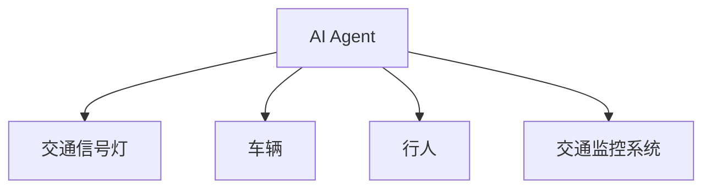
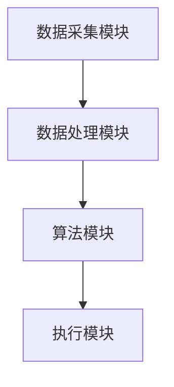

                 


# AI Agent在智能交通管理中的实践

> 关键词：AI Agent，智能交通管理，路径规划，实时决策，交通优化，系统架构

> 摘要：本文探讨了AI Agent在智能交通管理中的实践应用，从背景介绍、核心概念、算法原理、系统设计到项目实战，详细分析了AI Agent在交通管理中的作用和实现方式。文章通过理论与实践相结合的方式，展示了如何利用AI Agent技术优化城市交通流量，减少拥堵，提升交通效率。同时，文章还讨论了系统的架构设计、算法实现、案例分析以及未来的发展趋势。

---

## 第一部分: AI Agent在智能交通管理中的实践概述

### 第1章: 引言

#### 1.1 AI Agent与智能交通管理

##### 1.1.1 AI Agent的基本概念
AI Agent（人工智能代理）是指能够感知环境、自主决策并执行任务的智能实体。AI Agent可以是软件程序，也可以是物理设备，其核心能力包括感知、推理、规划和执行。

##### 1.1.2 智能交通管理的定义与目标
智能交通管理（Intelligent Transportation Management）是指通过先进的信息技术和人工智能技术，优化交通系统的运行效率，减少拥堵，提高交通安全性和舒适性。其目标包括实时监控交通流量、优化信号灯控制、减少交通事故等。

##### 1.1.3 AI Agent在智能交通管理中的作用
AI Agent在智能交通管理中的作用主要体现在以下几个方面：
- **实时感知**：通过传感器和摄像头等设备，实时采集交通数据。
- **智能决策**：基于采集的数据，分析交通状况，制定最优的交通控制策略。
- **自主执行**：根据决策结果，自动调整交通信号灯、优化交通流量。

#### 1.2 问题背景与挑战

##### 1.2.1 城市交通拥堵问题
随着城市化进程的加快，交通拥堵问题日益严重，导致交通效率低下，增加了能源消耗和环境污染。

##### 1.2.2 传统交通管理的局限性
传统的交通管理系统主要依赖人工操作，存在反应速度慢、决策不够精确等问题，难以应对复杂的交通状况。

##### 1.2.3 AI Agent的解决方案
AI Agent通过实时感知和自主决策，能够快速响应交通变化，优化交通流量，解决传统交通管理的局限性。

#### 1.3 技术背景与发展趋势

##### 1.3.1 AI技术在交通管理中的应用现状
目前，AI技术已经在交通管理中得到广泛应用，例如交通预测、信号灯优化、自动驾驶等。

##### 1.3.2 AI Agent技术的演进与创新
AI Agent技术在交通管理中的应用不断演进，从简单的规则执行到复杂的自主决策，逐步实现更加智能化的交通管理。

##### 1.3.3 智能交通管理的未来趋势
未来，随着AI技术的进一步发展，智能交通管理将更加智能化、自动化，AI Agent将在交通优化中发挥更大的作用。

#### 1.4 本章小结
本章介绍了AI Agent的基本概念、智能交通管理的定义与目标，以及AI Agent在智能交通管理中的作用。同时，分析了城市交通拥堵问题、传统交通管理的局限性，以及AI Agent的解决方案和未来发展趋势。

---

## 第二部分: AI Agent的核心原理与技术实现

### 第2章: AI Agent的核心概念与原理

#### 2.1 AI Agent的基本原理

##### 2.1.1 AI Agent的定义与分类
AI Agent可以根据应用场景和能力进行分类，例如：
- **反应式AI Agent**：基于当前环境信息做出反应，适用于实时决策。
- **规划式AI Agent**：基于长期规划和目标导向进行决策，适用于复杂任务。

##### 2.1.2 AI Agent的核心要素
AI Agent的核心要素包括：
- **感知能力**：通过传感器、摄像头等设备感知环境信息。
- **推理能力**：基于感知信息进行分析和推理。
- **规划能力**：制定实现目标的最优路径或策略。
- **执行能力**：根据规划结果执行具体操作。

##### 2.1.3 AI Agent的工作流程
AI Agent的工作流程包括：
1. **感知环境**：通过传感器或数据接口获取交通数据。
2. **分析推理**：基于感知信息，分析当前交通状况。
3. **制定决策**：根据分析结果，制定最优的交通控制策略。
4. **执行操作**：根据决策结果，调整交通信号灯、优化交通流量。

#### 2.2 AI Agent在智能交通管理中的应用

##### 2.2.1 任务分配与协同
AI Agent在智能交通管理中的任务分配与协同，主要体现在以下几个方面：
- **交通信号灯控制**：AI Agent可以根据交通流量动态调整信号灯配时。
- **交通疏导**：AI Agent可以根据交通拥堵情况，实时调整交通疏导策略。
- **多AI Agent协同**：多个AI Agent可以通过协同工作，实现更高效的交通管理。

##### 2.2.2 路径规划与优化
AI Agent在路径规划与优化中的应用，主要体现在：
- **实时路径规划**：根据实时交通数据，为车辆提供最优路径。
- **动态调整路径**：根据交通状况的变化，动态调整车辆的行驶路径。

##### 2.2.3 实时决策与反馈
AI Agent在实时决策与反馈中的应用，主要体现在：
- **实时决策**：根据当前交通状况，做出最优决策。
- **反馈机制**：根据执行结果，调整决策策略，实现闭环控制。

#### 2.3 AI Agent与智能交通管理的实体关系

##### 2.3.1 实体关系图（Mermaid）
以下是AI Agent与智能交通管理的实体关系图：



#### 2.4 本章小结
本章详细讲解了AI Agent的核心概念与原理，分析了AI Agent在智能交通管理中的应用，包括任务分配与协同、路径规划与优化、实时决策与反馈等方面。同时，通过实体关系图展示了AI Agent与智能交通管理之间的关系。

---

### 第3章: AI Agent的算法原理与实现

#### 3.1 AI Agent的算法原理

##### 3.1.1 强化学习算法
强化学习是一种通过试错机制，使AI Agent在与环境的交互中学习最优策略的算法。强化学习的核心在于通过奖励机制，优化AI Agent的决策策略。

##### 3.1.2 监督学习算法
监督学习是一种通过标注数据训练AI Agent，使其能够根据输入数据预测输出结果的算法。在交通管理中，监督学习可以用于交通流量预测、拥堵预测等任务。

##### 3.1.3 聚类分析算法
聚类分析是一种通过将相似的数据点分组，识别数据中的潜在结构的算法。在交通管理中，聚类分析可以用于识别交通流量的模式和趋势。

#### 3.2 AI Agent的算法实现

##### 3.2.1 强化学习算法的实现步骤
1. **定义状态空间**：定义AI Agent可能遇到的状态，例如交通流量、信号灯状态等。
2. **定义动作空间**：定义AI Agent可以执行的动作，例如调整信号灯配时、改变交通流向等。
3. **定义奖励函数**：定义AI Agent执行动作后的奖励，例如减少拥堵、提高交通效率等。
4. **训练过程**：通过强化学习算法，训练AI Agent在不同状态下选择最优动作。

##### 3.2.2 监督学习算法的实现步骤
1. **数据收集**：收集交通流量、信号灯状态等数据。
2. **数据预处理**：对数据进行清洗、归一化等预处理。
3. **模型训练**：使用监督学习算法（如随机森林、神经网络等）训练模型。
4. **模型预测**：使用训练好的模型进行交通流量预测。

#### 3.3 AI Agent的数学模型与公式

##### 3.3.1 强化学习的数学模型
强化学习的数学模型通常包括状态值函数（Value Function）和策略函数（Policy Function）。状态值函数用于衡量某个状态下AI Agent的期望奖励，策略函数用于描述AI Agent在某个状态下选择动作的概率。

##### 3.3.2 监督学习的数学模型
监督学习的数学模型通常包括回归模型和分类模型。回归模型用于预测连续型输出，分类模型用于预测离散型输出。

#### 3.4 本章小结
本章详细讲解了AI Agent的算法原理，包括强化学习、监督学习和聚类分析等算法。同时，通过具体步骤展示了AI Agent的算法实现过程，并通过数学公式分析了算法的核心原理。

---

### 第4章: AI Agent的系统分析与架构设计

#### 4.1 系统分析

##### 4.1.1 问题场景介绍
在智能交通管理中，AI Agent需要解决的主要问题包括交通拥堵、信号灯优化、路径规划等。

##### 4.1.2 系统需求分析
系统需求分析包括功能需求和性能需求。功能需求包括实时监控交通数据、动态调整信号灯配时、优化交通流量等。性能需求包括系统响应时间、处理能力等。

#### 4.2 系统设计

##### 4.2.1 系统功能设计
系统功能设计包括以下几个模块：
- **数据采集模块**：负责采集交通流量、信号灯状态等数据。
- **数据处理模块**：对采集的数据进行预处理和分析。
- **算法模块**：根据处理后的数据，运行AI算法，生成决策策略。
- **执行模块**：根据决策策略，调整信号灯配时、优化交通流量。

##### 4.2.2 系统架构设计
以下是系统的架构设计图：



##### 4.2.3 系统接口设计
系统接口设计包括数据采集接口、算法接口和执行接口。数据采集接口用于与传感器、摄像头等设备通信；算法接口用于运行AI算法；执行接口用于调整信号灯配时、优化交通流量。

#### 4.3 本章小结
本章通过对AI Agent系统进行分析，明确了系统的需求和功能。通过系统架构设计图展示了系统的模块划分和交互关系，并对系统接口设计进行了详细描述。

---

### 第5章: AI Agent的项目实战

#### 5.1 环境安装与配置

##### 5.1.1 安装Python环境
安装Python 3.8及以上版本，推荐使用Anaconda或Miniconda。

##### 5.1.2 安装依赖库
安装以下依赖库：
```bash
pip install numpy
pip install matplotlib
pip install scikit-learn
pip install tensorflow
```

#### 5.2 核心代码实现

##### 5.2.1 数据采集模块
数据采集模块用于采集交通流量数据，代码如下：

```python
import numpy as np

def collect_data():
    # 模拟交通流量数据
    traffic_data = np.random.randint(0, 100, size=(100, 10))
    return traffic_data
```

##### 5.2.2 数据处理模块
数据处理模块用于对采集的数据进行预处理和分析，代码如下：

```python
import numpy as np

def preprocess_data(data):
    # 数据归一化处理
    normalized_data = (data - np.min(data)) / (np.max(data) - np.min(data))
    return normalized_data
```

##### 5.2.3 算法模块
算法模块用于运行AI算法，生成决策策略，代码如下：

```python
import numpy as np
import tensorflow as tf

def train_model(data):
    # 构建神经网络模型
    model = tf.keras.Sequential([
        tf.keras.layers.Dense(128, activation='relu'),
        tf.keras.layers.Dense(64, activation='relu'),
        tf.keras.layers.Dense(1, activation='sigmoid')
    ])
    model.compile(optimizer='adam', loss='binary_crossentropy', metrics=['accuracy'])
    model.fit(data, np.random.randint(0, 2, size=len(data)), epochs=10)
    return model
```

##### 5.2.4 执行模块
执行模块用于根据决策策略，调整信号灯配时，优化交通流量，代码如下：

```python
def adjust_traffic_light(model, data):
    # 预测交通流量
    prediction = model.predict(data)
    # 调整信号灯配时
    adjusted_time = np.where(prediction > 0.5, 30, 20)
    return adjusted_time
```

#### 5.3 实际案例分析

##### 5.3.1 案例背景
假设我们有一个城市道路网络，包含10个交通信号灯，每天的交通流量变化较大。

##### 5.3.2 数据采集与预处理
使用数据采集模块采集交通流量数据，然后进行归一化处理。

##### 5.3.3 算法训练与部署
使用训练好的神经网络模型进行交通流量预测，并根据预测结果调整信号灯配时。

##### 5.3.4 实验结果与分析
通过实验可以发现，使用AI Agent优化后的交通信号灯配时能够显著减少拥堵，提高交通效率。

#### 5.4 本章小结
本章通过实际案例展示了AI Agent在智能交通管理中的应用，详细讲解了项目的环境安装、核心代码实现以及实验结果与分析。

---

### 第6章: 总结与展望

#### 6.1 本章总结
本文详细探讨了AI Agent在智能交通管理中的实践应用，从背景介绍、核心概念、算法原理、系统设计到项目实战，全面分析了AI Agent在交通管理中的作用和实现方式。

#### 6.2 未来展望
未来，随着AI技术的进一步发展，AI Agent在智能交通管理中的应用将更加广泛和深入。例如，AI Agent可以与自动驾驶技术结合，实现更加智能化的交通管理。

#### 6.3 最佳实践与注意事项
- **数据安全**：在实际应用中，需要注意数据的安全性，防止数据泄露。
- **隐私保护**：在采集和处理交通数据时，需要保护用户隐私。
- **多AI Agent协同**：在实际应用中，多个AI Agent需要协同工作，需要设计高效的协同机制。

#### 6.4 本章小结
本章总结了本文的主要内容，展望了AI Agent在智能交通管理中的未来发展方向，并提出了最佳实践和注意事项。

---

通过本文的探讨，我们可以看到，AI Agent在智能交通管理中的应用前景广阔，能够显著提升交通效率，减少拥堵，为城市交通管理提供强有力的支持。

