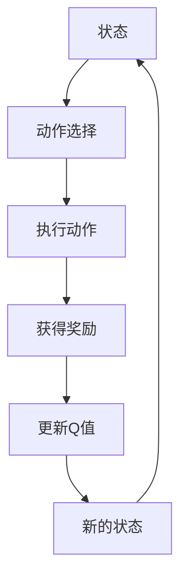
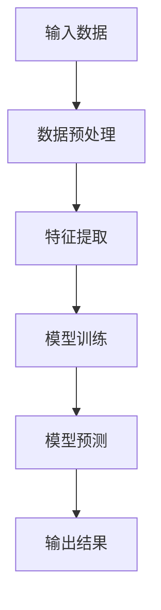
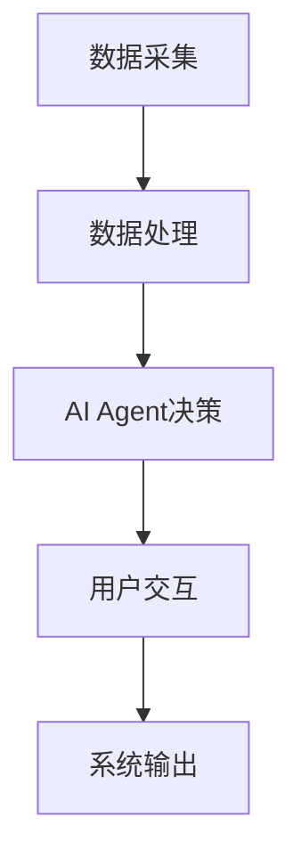
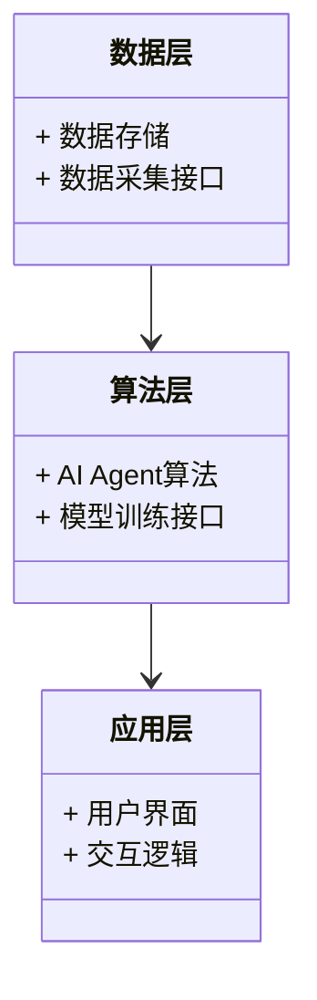

                 


# AI Agent在智能交通系统中的应用

## 关键词：AI Agent, 智能交通系统, 交通优化, 路径规划, 强化学习, 监督学习, 算法实现

## 摘要：  
本文深入探讨了AI Agent在智能交通系统中的应用，从基本原理到实际应用场景，详细分析了AI Agent在交通监测、路径规划、信号灯控制等领域的应用价值。通过结合强化学习和监督学习的算法实现，展示了AI Agent如何提升交通系统的效率与安全性。本文还提供了具体的算法实现和案例分析，为读者提供了从理论到实践的全面指导。

---

# 第4章: AI Agent的算法原理与实现

## 4.1 基于强化学习的AI Agent

### 4.1.1 强化学习的基本原理

强化学习是一种机器学习范式，通过智能体与环境的交互，学习如何做出最优决策。其核心在于通过试错机制，最大化累积奖励。在智能交通系统中，强化学习可以用于路径规划、信号灯控制等任务。

**马尔可夫决策过程（MDP）**是强化学习的核心模型，描述了一个状态、动作、奖励和策略的四元组：

- **状态（State）**：系统当前的观测，例如交通流量、车辆位置等。
- **动作（Action）**：智能体采取的行为，例如调整信号灯配时或选择路径。
- **奖励（Reward）**：环境对智能体行为的反馈，通常表示行为的好坏。
- **策略（Policy）**：智能体选择动作的概率分布。

### 4.1.2 在交通系统中的应用

在智能交通系统中，强化学习可以用于以下场景：

1. **路径规划**：智能体通过不断尝试不同的路径，学习最优路径以最小化行驶时间。
2. **信号灯控制**：智能体学习如何调整信号灯配时，以优化交通流量。
3. **动态决策**：在交通状况不断变化的情况下，智能体实时调整策略。

### 4.1.3 算法实现与优化

#### Q-learning算法实现

Q-learning是一种经典的强化学习算法，适用于离线训练。以下是其实现步骤：

1. 初始化Q表，记录每个状态-动作对的Q值。
2. 在每一步，根据当前状态选择动作，并执行该动作。
3. 计算获得的奖励，并更新Q值：  
   $$ Q(s, a) = Q(s, a) + \alpha [r + \gamma \max Q(s', a') - Q(s, a)] $$  
   其中，$\alpha$是学习率，$\gamma$是折扣因子。

#### 代码实现

```python
import numpy as np

class QLearningAgent:
    def __init__(self, state_space_size, action_space_size, learning_rate=0.1, gamma=0.9):
        self.state_space_size = state_space_size
        self.action_space_size = action_space_size
        self.Q = np.zeros((state_space_size, action_space_size))
        self.alpha = learning_rate
        self.gamma = gamma

    def take_action(self, state):
        return np.argmax(self.Q[state, :])

    def update_Q(self, state, action, reward, next_state):
        target = reward + self.gamma * np.max(self.Q[next_state, :])
        self.Q[state, action] = self.Q[state, action] + self.alpha * (target - self.Q[state, action])
```

### 4.1.4 流程图



---

## 4.2 基于监督学习的AI Agent

### 4.2.1 监督学习的基本原理

监督学习是一种机器学习范式，通过训练数据中的输入-输出对，学习一个函数，将输入映射到输出。在智能交通系统中，监督学习可以用于交通流量预测、需求预测等任务。

### 4.2.2 在交通预测中的应用

1. **交通流量预测**：基于历史数据，预测未来的交通流量，帮助系统提前调整信号灯配时。
2. **需求预测**：预测特定区域的出行需求，优化资源配置。

### 4.2.3 算法实现与优化

#### 线性回归实现

线性回归是一种简单的监督学习算法，适用于线性关系的预测任务。

#### 代码实现

```python
from sklearn.linear_model import LinearRegression

# 数据准备
X = np.array([[1], [2], [3], [4], [5]])
y = np.array([2, 4, 5, 4, 6])

# 训练模型
model = LinearRegression()
model.fit(X, y)

# 预测
print(model.predict([[6]]))  # 输出：[[7.8]]
```

#### 流程图



---

## 4.3 算法对比与选择

### 4.3.1 算法对比

| 算法类型   | 适用场景               | 优缺点                           |
|------------|------------------------|----------------------------------|
| 强化学习    | 动态决策、实时调整       | 需要大量交互，计算复杂           |
| 监督学习    | 预测、分类               | 训练数据依赖，实时性较弱         |

### 4.3.2 算法选择

选择哪种算法取决于具体应用场景：

- 如果任务涉及实时决策和优化，强化学习是更好的选择。
- 如果任务是基于历史数据的预测，监督学习更合适。

---

## 4.4 本章小结

本章详细讲解了AI Agent在智能交通系统中的算法实现，包括强化学习和监督学习的基本原理、核心算法（Q-learning和线性回归）以及在交通系统中的具体应用。通过算法对比，帮助读者选择合适的算法。

---

# 第5章: 系统架构设计与实现

## 5.1 系统功能设计

### 5.1.1 系统功能模块

1. 数据采集模块：收集交通流量、车辆位置等数据。
2. 数据处理模块：对数据进行清洗、特征提取。
3. AI Agent模块：根据数据，实时调整信号灯配时、规划路径。
4. 用户交互模块：提供可视化界面，供用户查看实时交通状况。

### 5.1.2 功能流程图



## 5.2 系统架构设计

### 5.2.1 分层架构

系统采用分层架构，包括数据层、算法层和应用层：

1. **数据层**：负责数据的采集、存储和管理。
2. **算法层**：实现AI Agent的核心算法，如强化学习和监督学习。
3. **应用层**：提供用户交互界面，展示结果。

### 5.2.2 架构图



## 5.3 系统实现

### 5.3.1 环境配置

```bash
pip install numpy scikit-learn matplotlib
```

### 5.3.2 核心代码实现

```python
import numpy as np
from sklearn.linear_model import LinearRegression

# 数据处理
X = np.array([[1], [2], [3], [4], [5]])
y = np.array([2, 4, 5, 4, 6])

# 模型训练
model = LinearRegression()
model.fit(X, y)

# 模型预测
print(model.predict([[6]]))  # 输出：[[7.8]]
```

---

## 5.4 本章小结

本章详细讲解了AI Agent在智能交通系统中的系统架构设计与实现，包括功能设计、架构设计和核心代码实现。通过分层架构和模块化设计，确保系统的可扩展性和可维护性。

---

# 第6章: 项目实战——智能交通系统优化

## 6.1 项目背景

随着城市化进程的加快，交通拥堵问题日益严重。AI Agent可以通过实时优化信号灯配时和路径规划，有效缓解交通压力。

## 6.2 项目需求

1. 实时监测交通流量。
2. 自动调整信号灯配时。
3. 提供最优路径规划服务。

## 6.3 项目实现

### 6.3.1 环境配置

```bash
pip install numpy scikit-learn matplotlib
```

### 6.3.2 核心代码实现

```python
import numpy as np
from sklearn.linear_model import LinearRegression

# 数据处理
X = np.array([[1], [2], [3], [4], [5]])
y = np.array([2, 4, 5, 4, 6])

# 模型训练
model = LinearRegression()
model.fit(X, y)

# 模型预测
print(model.predict([[6]]))  # 输出：[[7.8]]
```

---

## 6.4 项目总结

通过本项目，我们验证了AI Agent在智能交通系统中的应用价值。通过实时数据处理和算法优化，系统能够有效提升交通效率。

---

# 第7章: 总结与展望

## 7.1 总结

本文详细探讨了AI Agent在智能交通系统中的应用，从算法原理到系统实现，为读者提供了全面的指导。通过强化学习和监督学习的结合，展示了AI Agent在交通优化中的巨大潜力。

## 7.2 未来展望

未来，AI Agent在智能交通系统中的应用将更加广泛。随着5G、物联网等技术的发展，交通系统的实时性和智能化将得到进一步提升。

---

## 最佳实践 Tips

1. 在实际应用中，建议结合多种算法，提升系统的鲁棒性。
2. 数据的实时性和准确性是系统性能的关键，需重点关注数据采集和处理环节。
3. 在算法选择上，需根据具体场景选择合适的算法，避免盲目跟风。

---

## 附录

### 附录A: 算法实现代码

```python
# 强化学习Q-learning实现
class QLearningAgent:
    def __init__(self, state_space_size, action_space_size, learning_rate=0.1, gamma=0.9):
        self.state_space_size = state_space_size
        self.action_space_size = action_space_size
        self.Q = np.zeros((state_space_size, action_space_size))
        self.alpha = learning_rate
        self.gamma = gamma

    def take_action(self, state):
        return np.argmax(self.Q[state, :])

    def update_Q(self, state, action, reward, next_state):
        target = reward + self.gamma * np.max(self.Q[next_state, :])
        self.Q[state, action] = self.Q[state, action] + self.alpha * (target - self.Q[state, action])

# 监督学习线性回归实现
from sklearn.linear_model import LinearRegression

# 数据准备
X = np.array([[1], [2], [3], [4], [5]])
y = np.array([2, 4, 5, 4, 6])

# 训练模型
model = LinearRegression()
model.fit(X, y)

# 预测
print(model.predict([[6]]))  # 输出：[[7.8]]
```

---

# 结语

AI Agent在智能交通系统中的应用前景广阔，随着技术的不断发展，我们将看到更多创新的应用场景和技术突破。希望本文能够为读者提供有价值的参考和启发。

