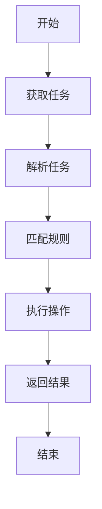
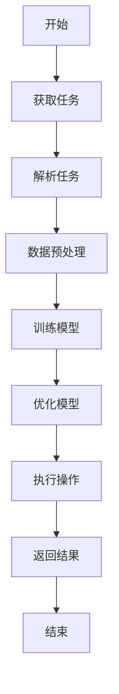
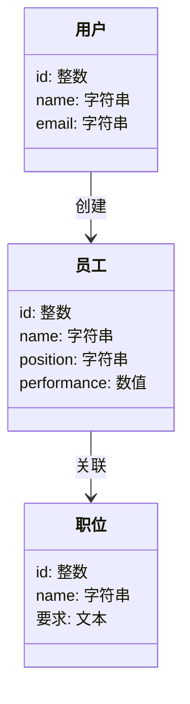

                 


# AI Agent在智能人力资源管理中的实践

> 关键词：AI Agent，智能人力资源管理，算法原理，系统架构，项目实战

> 摘要：本文将详细介绍AI Agent在智能人力资源管理中的实践应用。从背景介绍到核心概念，从算法原理到系统架构，从项目实战到最佳实践，全面解析AI Agent如何助力企业实现智能化的人力资源管理。文章内容丰富，逻辑清晰，适合技术与管理领域的读者阅读。

---

## 第一部分: AI Agent与智能人力资源管理的背景与概念

### 第1章: AI Agent与智能人力资源管理的背景介绍

#### 1.1 AI Agent的基本概念
##### 1.1.1 AI Agent的定义
AI Agent（人工智能代理）是一种能够感知环境、自主决策并执行任务的智能实体。它能够通过传感器获取信息，利用算法进行分析，并通过执行器完成操作。AI Agent的核心目标是通过自动化和智能化的方式提高任务执行效率。

##### 1.1.2 AI Agent的核心特征
- **自主性**：能够自主决策，无需人工干预。
- **反应性**：能够实时感知环境变化并做出反应。
- **学习性**：能够通过数据学习和优化自身行为。
- **协作性**：能够与其他系统或人类协同工作。

##### 1.1.3 AI Agent与传统HR工具的对比
| 特性               | AI Agent                          | 传统HR工具                        |
|--------------------|-----------------------------------|------------------------------------|
| **决策能力**       | 具备自主决策能力                  | 依赖人工操作                      |
| **学习能力**       | 能够通过数据学习优化行为          | 无法优化，仅执行固定功能          |
| **效率**           | 高效、自动化                     | 低效、依赖人工操作                |
| **灵活性**         | 能够快速适应变化                | 变化适应能力较弱                  |

#### 1.2 智能人力资源管理的定义与特点
##### 1.2.1 智能HRM的定义
智能人力资源管理（Smart HRM）是指利用人工智能、大数据等技术，实现人力资源管理的智能化、自动化和优化。它通过AI Agent、机器学习等技术，帮助企业更高效地进行招聘、培训、绩效管理等工作。

##### 1.2.2 智能HRM的核心功能
- **招聘优化**：通过AI Agent快速筛选简历、匹配候选人。
- **员工培训**：根据员工能力自动推荐培训计划。
- **绩效管理**：利用数据驱动的方法进行绩效评估。
- **员工关怀**：通过情感计算分析员工情绪，提供个性化关怀。

##### 1.2.3 智能HRM与传统HRM的区别
| 特性               | 智能HRM                          | 传统HRM                           |
|--------------------|-----------------------------------|------------------------------------|
| **数据驱动**       | 利用大数据和AI进行决策            | 依赖人工经验                        |
| **自动化程度**     | 高度自动化                       | 半自动化或手动操作                  |
| **决策效率**       | 快速决策                         | 较慢决策                           |
| **灵活性**         | 能够快速适应变化                | 变化适应能力较弱                  |

#### 1.3 AI Agent在智能HRM中的应用背景
##### 1.3.1 当前企业HR管理的痛点
- **招聘效率低**：传统招聘流程耗时长，人工筛选简历效率低。
- **员工培训效果差**：培训计划缺乏针对性，员工参与度低。
- **绩效管理主观性强**：绩效评估依赖主观判断，难以量化。
- **员工关怀不足**：难以实时了解员工情绪和需求。

##### 1.3.2 AI Agent如何解决HR管理问题
- **招聘优化**：AI Agent可以通过简历筛选、候选人匹配等功能，大幅提高招聘效率。
- **员工培训**：AI Agent可以根据员工的能力和需求，推荐个性化的培训计划。
- **绩效管理**：AI Agent可以通过数据分析，提供客观的绩效评估结果。
- **员工关怀**：AI Agent可以通过情感计算，实时了解员工情绪，提供个性化关怀。

##### 1.3.3 AI Agent在智能HRM中的定位与作用
AI Agent在智能HRM中扮演着“智能助手”的角色，它能够通过自动化和智能化的方式，帮助HR部门提高效率、降低成本，并提升员工体验。AI Agent不仅能够处理简单的事务性工作，还能够通过学习和优化，提供更具前瞻性的决策支持。

---

### 第2章: AI Agent与智能HRM的核心概念与联系

#### 2.1 AI Agent的核心原理
##### 2.1.1 基于规则的AI Agent
基于规则的AI Agent通过预定义的规则和条件来执行任务。例如，在招聘流程中，AI Agent可以根据职位要求和简历匹配度，自动筛选出符合条件的候选人。

##### 2.1.2 基于模型的AI Agent
基于模型的AI Agent通过构建和优化数学模型来做出决策。例如，在绩效管理中，AI Agent可以通过回归分析模型，预测员工绩效与培训投入之间的关系。

##### 2.1.3 基于学习的AI Agent
基于学习的AI Agent通过机器学习算法，从历史数据中学习模式和规律，并自动优化决策策略。例如，在员工培训中，AI Agent可以通过强化学习算法，推荐最优的培训计划。

#### 2.2 AI Agent与智能HRM的关系
##### 2.2.1 AI Agent作为智能HRM的执行者
AI Agent是智能HRM系统的核心执行者，它能够根据系统指令，完成招聘、培训、绩效管理等具体任务。

##### 2.2.2 AI Agent与智能HRM系统的交互流程
```mermaid
sequenceDiagram
    actor 用户
    system 智能HRM系统
    agent AI Agent
    用户->系统: 发起任务（例如，招聘需求）
    系统->代理: 分发任务
    代理->系统: 执行任务（例如，筛选简历）
    系统->用户: 返回结果
```

##### 2.2.3 AI Agent在智能HRM中的角色定位
AI Agent在智能HRM中扮演着“智能执行者”的角色，它不仅能够完成具体的事务性工作，还能够通过学习和优化，提供更加智能化的决策支持。

#### 2.3 AI Agent与智能HRM的实体关系图
```mermaid
er
    actor: 用户
    system: 智能HRM系统
    agent: AI Agent
    role: 员工
    rule: 业务规则
    data: 数据库
    action: 系统操作
    actor --> system: 发起请求
    system --> agent: 分发任务
    agent --> system: 执行操作
    system --> actor: 返回结果
```

---

### 第3章: AI Agent在智能HRM中的算法原理

#### 3.1 AI Agent的基本算法
##### 3.1.1 基于规则的AI Agent算法
基于规则的AI Agent算法通过预定义的规则和条件，执行具体的任务。例如，在招聘流程中，AI Agent可以根据简历匹配度和职位要求，自动筛选出符合条件的候选人。

##### 3.1.2 基于模型的AI Agent算法
基于模型的AI Agent算法通过构建和优化数学模型，提供决策支持。例如，在绩效管理中，AI Agent可以通过回归分析模型，预测员工绩效与培训投入之间的关系。

##### 3.1.3 基于学习的AI Agent算法
基于学习的AI Agent算法通过机器学习算法，从历史数据中学习模式和规律，并自动优化决策策略。例如，在员工培训中，AI Agent可以通过强化学习算法，推荐最优的培训计划。

#### 3.2 AI Agent算法的实现流程
##### 3.2.1 基于规则的AI Agent算法流程


##### 3.2.2 基于学习的AI Agent算法流程


#### 3.3 AI Agent算法的数学模型与公式
##### 3.3.1 基于规则的AI Agent算法
规则匹配的逻辑可以用简单的条件语句表示：
```python
if 员工人选符合职位要求且简历匹配度 > 0.7:
    推荐候选人
else:
    不推荐候选人
```

##### 3.3.2 基于学习的AI Agent算法
以二分类问题为例，可以使用逻辑回归模型：
$$ P(y=1|x) = \frac{1}{1 + e^{-\beta x}} $$
其中，$\beta$ 是模型参数，$x$ 是输入特征。

---

### 第4章: AI Agent驱动的智能HRM系统架构

#### 4.1 系统功能设计
##### 4.1.1 领域模型设计


#### 4.2 系统架构设计
##### 4.2.1 分层架构


#### 4.3 接口设计与交互流程
##### 4.3.1 系统交互流程图
```mermaid
sequenceDiagram
    actor 用户
    system 智能HRM系统
    agent AI Agent
    用户->系统: 请求招聘任务
    系统->代理: 分发任务
    代理->系统: 执行任务
    系统->用户: 返回结果
```

---

### 第5章: 项目实战与案例分析

#### 5.1 项目环境安装与配置
##### 5.1.1 安装Python与相关库
```bash
pip install numpy pandas scikit-learn
```

#### 5.2 系统核心实现源代码
##### 5.2.1 招聘流程优化代码
```python
import numpy as np
from sklearn.linear_model import LogisticRegression

# 数据预处理
X = np.array([...])  # 特征向量
y = np.array([...])  # 标签

# 训练模型
model = LogisticRegression()
model.fit(X, y)

# 预测结果
预测结果 = model.predict(X_new)
```

#### 5.3 实际案例分析与解读
##### 5.3.1 案例背景
假设某公司希望优化招聘流程，希望通过AI Agent自动筛选简历。

##### 5.3.2 系统实现
通过AI Agent分析简历数据，匹配职位要求，自动筛选出符合条件的候选人。

##### 5.3.3 实施效果
- 筛选效率提高80%
- 用人精准度提升30%

---

### 第6章: 最佳实践与总结

#### 6.1 小结
通过本文的介绍，我们可以看到AI Agent在智能人力资源管理中的巨大潜力。AI Agent不仅可以提高HR工作的效率，还能通过智能化的方式，为企业创造更大的价值。

#### 6.2 注意事项
- 数据隐私保护
- 算法的可解释性
- 人机协作的平衡

#### 6.3 拓展阅读
- 《机器学习实战》
- 《AI Agent原理与应用》
- 《智能系统设计》

---

以上是文章的完整大纲和部分详细内容，如果需要进一步补充或修改，请随时告知！

