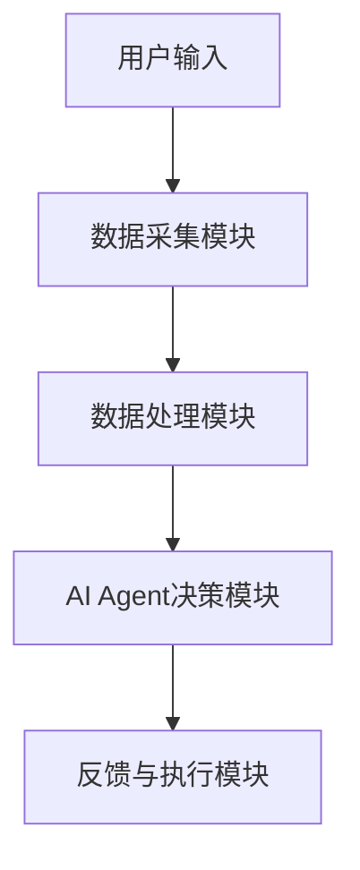
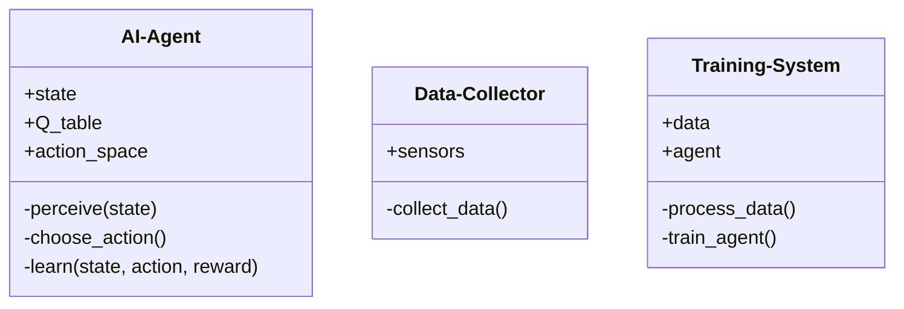
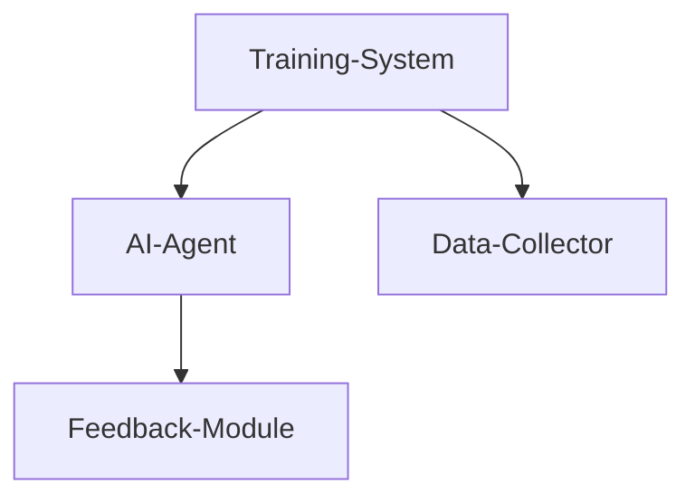

                 


# AI Agent在智能体育训练系统中的应用

> 关键词：AI Agent，智能体育训练，强化学习，深度学习，体育数据分析

> 摘要：本文探讨了AI Agent在智能体育训练系统中的应用，分析了其核心概念、算法原理、系统架构，并通过实际案例展示了AI Agent在体育训练中的巨大潜力。

---

## 第1章: AI Agent的基本概念与应用背景

### 1.1 AI Agent的定义与核心特点

AI Agent（人工智能代理）是指能够感知环境、做出决策并采取行动以实现目标的智能实体。AI Agent的核心特点包括：

1. **自主性**：能够在没有外部干预的情况下自主运行。
2. **反应性**：能够根据环境变化实时调整行为。
3. **学习能力**：通过数据和经验不断优化自身的决策能力。
4. **社交能力**：能够与其他AI Agent或人类进行有效交互。

### 1.2 智能体育训练系统的背景与需求

#### 1.2.1 传统体育训练的局限性

传统体育训练主要依赖教练的经验和运动员的自我调整，存在以下问题：

- **个性化不足**：每个运动员的身体条件和能力不同，统一的训练计划难以满足个体需求。
- **实时反馈缺失**：教练无法实时分析运动员的每一个动作细节，导致反馈滞后。
- **数据利用率低**：传统训练中，数据采集和分析效率较低，难以形成有效的数据闭环。

#### 1.2.2 智能化体育训练的需求

随着科技的发展，智能化体育训练的需求日益迫切：

- **个性化训练计划**：通过AI技术，为每个运动员制定个性化的训练方案。
- **实时数据分析**：利用传感器和AI算法，实时捕捉并分析运动员的动作和生理数据。
- **动态优化**：根据实时数据和训练效果，动态调整训练计划，最大化训练效率。

#### 1.2.3 AI Agent在体育训练中的应用场景

AI Agent在体育训练中的应用场景包括：

1. **动作分析与优化**：通过AI Agent分析运动员的动作，发现潜在问题并提出优化建议。
2. **实时反馈与指导**：在训练过程中，AI Agent实时提供反馈，帮助运动员纠正动作。
3. **训练计划制定与调整**：根据运动员的状态和目标，动态调整训练计划。

---

## 第2章: AI Agent在体育训练中的核心概念

### 2.1 AI Agent的核心原理

AI Agent在体育训练中的核心原理包括感知、决策和执行三个环节：

#### 2.1.1 感知层：数据采集与处理

AI Agent通过传感器、摄像头等设备采集运动员的动作、心率、体感等数据，并对这些数据进行预处理和特征提取。

#### 2.1.2 决策层：智能算法与策略生成

AI Agent利用强化学习、深度学习等算法，根据感知层提供的数据，生成最优的训练策略。

#### 2.1.3 执行层：反馈与优化

AI Agent根据决策层生成的策略，输出具体的训练指令，并根据执行结果进行反馈优化。

### 2.2 AI Agent与体育训练的结合

AI Agent与体育训练的结合主要体现在以下几个方面：

#### 2.2.1 个性化训练计划的生成

AI Agent根据运动员的个人数据（如身体状况、技术特点）制定个性化的训练计划。

#### 2.2.2 实时运动数据分析与反馈

AI Agent实时分析运动员的动作和生理数据，提供实时反馈，帮助运动员及时调整动作。

#### 2.2.3 智能化训练目标优化

AI Agent根据训练目标和运动员的实时表现，动态优化训练目标，确保训练效果最大化。

### 2.3 AI Agent在体育训练中的优势

AI Agent在体育训练中的优势包括：

- **提高训练效率**：通过实时数据分析和动态调整，AI Agent能够显著提高训练效率。
- **个性化与精准化训练**：AI Agent能够为每个运动员提供个性化的训练方案，精准解决训练中的问题。
- **实时反馈与动态调整**：AI Agent能够实时提供反馈，并根据反馈结果动态调整训练计划。

---

## 第3章: AI Agent的核心算法与数学模型

### 3.1 基于强化学习的AI Agent算法

#### 3.1.1 强化学习的基本原理

强化学习是一种通过试错机制来学习最优策略的算法。AI Agent通过与环境的交互，不断尝试不同的动作，最终找到最优策略。

#### 3.1.2 AI Agent在体育训练中的强化学习应用

在体育训练中，强化学习可以用于动作优化、训练策略生成等场景。

#### 3.1.3 算法实现与优化

以下是一个简单的强化学习算法实现示例：

```python
import numpy as np

class AI-Agent:
    def __init__(self, action_space):
        self.action_space = action_space
        self.Q = np.zeros((1, len(action_space)))

    def perceive(self, state):
        # 状态感知
        return state

    def choose_action(self, state):
        # 动作选择
        q_values = self.Q[state]
        max_value = np.max(q_values)
        action_indices = np.where(q_values == max_value)[0]
        action = action_indices[0]
        return action

    def learn(self, state, action, reward):
        # 状态值更新
        self.Q[state, action] += reward

# 示例应用
action_space = ['动作1', '动作2', '动作3']
agent = AI-Agent(action_space)
state = agent.perceive('当前状态')
action = agent.choose_action(state)
agent.learn(state, action, reward=1)
```

#### 3.1.4 算法数学模型

强化学习的数学模型如下：

$$ V(s) = \max_{a} [ r(s,a) + \gamma V(s') ] $$

其中：
- \( V(s) \) 是状态 \( s \) 的价值函数
- \( r(s,a) \) 是状态 \( s \) 下采取动作 \( a \) 的奖励
- \( \gamma \) 是折扣因子
- \( s' \) 是下一个状态

### 3.2 基于深度学习的AI Agent算法

#### 3.2.1 深度学习的基本原理

深度学习通过多层神经网络模拟人脑的神经网络，能够从大量数据中学习特征。

#### 3.2.2 图像识别与动作分析

在体育训练中，深度学习可以用于图像识别，分析运动员的动作是否标准。

#### 3.2.3 模型训练与优化

以下是一个简单的深度学习模型训练示例：

```python
import torch
import torch.nn as nn

class DNN(nn.Module):
    def __init__(self, input_dim, output_dim):
        super(DNN, self).__init__()
        self.fc1 = nn.Linear(input_dim, 64)
        self.fc2 = nn.Linear(64, output_dim)
        self.relu = nn.ReLU()
        self.softmax = nn.Softmax(dim=1)

    def forward(self, x):
        x = self.fc1(x)
        x = self.relu(x)
        x = self.fc2(x)
        x = self.softmax(x)
        return x

# 示例应用
input_dim = 64
output_dim = 3
model = DNN(input_dim, output_dim)
criterion = nn.CrossEntropyLoss()
optimizer = torch.optim.Adam(model.parameters(), lr=0.001)
```

#### 3.2.4 数学模型与公式

深度学习的损失函数如下：

$$ \text{Loss} = \frac{1}{N}\sum_{i=1}^{N} (y_i - \hat{y}_i)^2 $$

---

## 第4章: AI Agent在体育训练中的系统架构

### 4.1 系统整体架构设计

#### 4.1.1 系统功能模块划分

智能体育训练系统的功能模块包括：
1. 数据采集模块
2. 数据处理模块
3. AI Agent决策模块
4. 反馈与执行模块

#### 4.1.2 系统架构图（Mermaid）



#### 4.1.3 系统功能设计

AI Agent决策模块是系统的核心，负责根据数据生成决策。

### 4.2 系统架构设计

#### 4.2.1 领域模型（Mermaid类图）



#### 4.2.2 系统架构图（Mermaid架构图）



---

## 第5章: 项目实战

### 5.1 项目环境搭建

#### 5.1.1 安装必要的库

```bash
pip install numpy torch matplotlib
```

### 5.2 核心代码实现

#### 5.2.1 数据采集与处理

```python
import numpy as np

def collect_data():
    # 示例数据采集
    data = np.random.randn(100, 64)
    return data

def process_data(data):
    # 数据预处理
    normalized_data = data / np.max(data)
    return normalized_data
```

#### 5.2.2 AI Agent实现

```python
class AI-Agent:
    def __init__(self, input_dim, output_dim):
        self.model = DNN(input_dim, output_dim)
        self.criterion = nn.CrossEntropyLoss()
        self.optimizer = torch.optim.Adam(self.model.parameters(), lr=0.001)

    def train(self, data, labels):
        # 训练模型
        inputs = torch.from_numpy(data).float()
        labels = torch.from_numpy(labels).long()
        outputs = self.model(inputs)
        loss = self.criterion(outputs, labels)
        loss.backward()
        self.optimizer.step()
```

#### 5.2.3 实际案例分析

以篮球投篮优化为例，AI Agent可以根据运动员的动作数据，优化其投篮姿势和力量分配。

---

## 第6章: 总结与展望

### 6.1 最佳实践 tips

- 在实际应用中，建议结合具体场景选择合适的算法。
- 数据质量对AI Agent的性能影响巨大，需确保数据的准确性和完整性。
- 定期更新模型，以应对环境的变化和运动员状态的波动。

### 6.2 小结

本文详细探讨了AI Agent在智能体育训练系统中的应用，从核心概念到算法实现，再到系统设计，为读者提供了全面的视角。

### 6.3 注意事项

- 数据隐私问题需引起重视。
- 系统的实时性和稳定性需在实际应用中进行优化。

### 6.4 拓展阅读

推荐阅读相关领域的书籍和论文，深入理解AI Agent和体育训练的结合。

---

通过本文的分析，可以清晰地看到AI Agent在智能体育训练系统中的巨大潜力。随着技术的不断进步，AI Agent将在体育训练中发挥越来越重要的作用。

