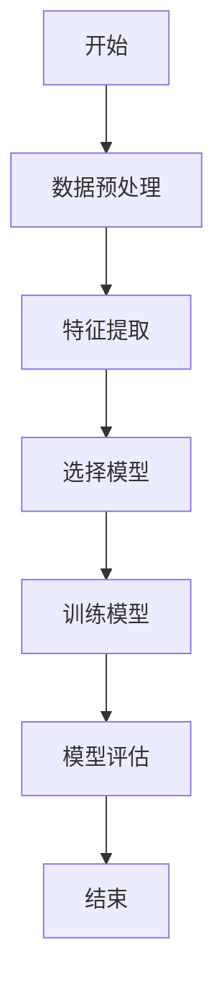
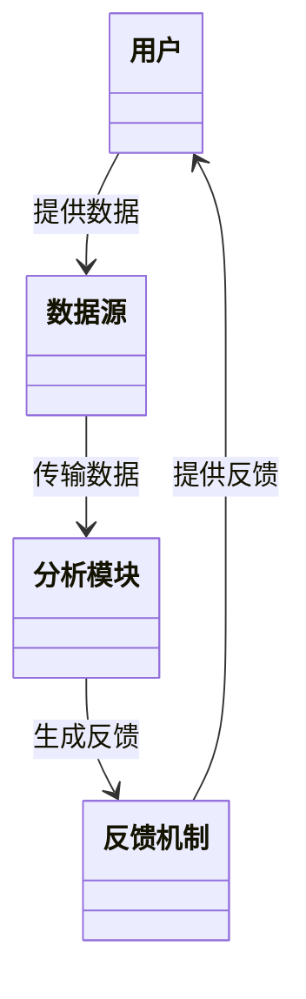

                 


# AI Agent在智能体育赛事分析中的角色

## 关键词：
AI Agent, 智能体育, 体育赛事分析, 机器学习, 自然语言处理, 数据分析

## 摘要：
本文探讨AI Agent在智能体育赛事分析中的角色，分析其核心概念、算法原理、系统架构及实际应用，展示AI如何提升体育数据分析的实时性和准确性，为运动员、教练和体育组织提供决策支持。

---

## 第一部分：背景介绍

### 第1章：AI Agent与智能体育赛事分析的背景

#### 1.1 问题背景
- **传统体育数据分析的局限性**：传统方法依赖人工分析，耗时且效率低，难以实时处理大量数据。
- **AI技术在体育领域的应用现状**：AI已用于数据统计和预测，但缺乏实时性和深度分析能力。
- **AI Agent的独特优势**：AI Agent具备实时数据处理和深度学习能力，能显著提升分析效率。

#### 1.2 问题描述
- **数据分析效率低下**：传统方法无法快速处理实时数据，影响决策速度。
- **数据利用不足**：大量数据未被有效分析，导致资源浪费。
- **决策支持不足**：缺乏实时、动态的分析支持，影响教练和运动员的决策。

#### 1.3 问题解决
- **提升数据处理速度**：AI Agent实时处理数据，确保分析的及时性。
- **深度分析数据**：利用机器学习模型，深入挖掘数据中的潜在信息。
- **优化决策过程**：实时分析帮助做出更精准的战术调整和战略规划。

#### 1.4 边界与外延
- **应用边界**：AI Agent主要用于实时数据分析，不直接参与数据采集。
- **与其他技术区别**：区别于推荐系统，AI Agent专注于实时分析和动态决策。
- **未来扩展方向**：未来可能与增强现实结合，提供沉浸式分析体验。

#### 1.5 概念结构与核心要素
- **AI Agent的基本构成**：包括感知模块、决策模块和执行模块。
- **智能体育赛事分析的核心要素**：数据源、分析模型、用户界面和反馈机制。
- **结合模型**：AI Agent通过整合多源数据，提供实时、动态的分析结果。

---

## 第二部分：核心概念与联系

### 第2章：AI Agent的核心原理

#### 2.1 核心原理
- **AI Agent的基本工作原理**：通过感知环境数据，进行分析和决策，执行相应操作。
- **机器学习模型的应用**：利用监督学习和无监督学习，识别数据中的模式和趋势。
- **自然语言处理的作用**：分析文本数据，如评论和报告，提取有用信息。

#### 2.2 概念对比表
| **技术**       | **传统数据分析** | **AI Agent分析** |
|-----------------|-----------------|------------------|
| 数据处理速度   | 较慢            | 实时处理         |
| 数据分析深度   | 浅层分析        | 深度学习         |
| 决策支持        | 有限            | 动态优化          |

#### 2.3 ER实体关系图

```mermaid
er
    %% AI Agent在体育赛事分析中的实体关系图
    %% 定义实体
    entity 用户
    entity 数据源
    entity 分析模块
    entity 反馈机制

    %% 定义关系
    用户 --> 数据源: 提供
    数据源 --> 分析模块: 提供
    分析模块 --> 反馈机制: 生成
    反馈机制 --> 用户: 提供
```

---

## 第三部分：算法原理讲解

### 第3章：算法实现

#### 3.1 算法流程


#### 3.2 代码实现
```python
# 数据预处理示例
import pandas as pd
data = pd.read_csv('sports_data.csv')
data_clean = data.dropna()

# 特征提取
from sklearn.preprocessing import OneHotEncoder
encoder = OneHotEncoder()
features = encoder.fit_transform(data_clean[['feature1', 'feature2']]).toarray()

# 选择模型并训练
from sklearn.ensemble import RandomForestClassifier
model = RandomForestClassifier()
model.fit(features, data_clean['target'])
```

#### 3.3 数学模型
- **损失函数**：$$L = -\frac{1}{n}\sum_{i=1}^{n} y_i \log(p_i) + (1 - y_i) \log(1 - p_i)$$
- **优化算法**：使用随机梯度下降（SGD）优化模型参数。

---

## 第四部分：系统分析与架构设计

### 第4章：系统架构设计

#### 4.1 问题场景
实时分析体育比赛数据，提供动态反馈，辅助决策。

#### 4.2 系统功能设计


#### 4.3 系统架构设计


---

## 第五部分：项目实战

### 第5章：项目实现

#### 5.1 环境安装
- Python 3.8+
- NumPy、Pandas、Scikit-learn、TensorFlow

#### 5.2 核心代码实现
```python
# 机器学习模型训练
import numpy as np
import pandas as pd
from sklearn.model_selection import train_test_split
from sklearn.ensemble import RandomForestRegressor

# 数据加载
data = pd.read_csv('sports.csv')
X = data[['feature1', 'feature2']]
y = data['target']

# 数据分割
X_train, X_test, y_train, y_test = train_test_split(X, y, test_size=0.2)

# 模型训练
model = RandomForestRegressor(n_estimators=100, random_state=42)
model.fit(X_train, y_train)

# 模型预测
y_pred = model.predict(X_test)
```

#### 5.3 案例分析
以一场足球比赛为例，AI Agent分析球员表现和战术策略，提供实时反馈，帮助教练优化比赛策略。

#### 5.4 项目小结
总结项目中的经验教训，讨论优化方向，如模型更新频率和数据隐私保护。

---

## 第六部分：最佳实践和小结

### 第6章：总结与展望

#### 6.1 最佳实践
- 数据清洗和特征工程至关重要。
- 定期更新模型以保持性能。
- 保护数据隐私，遵守相关法规。

#### 6.2 未来展望
AI Agent可能与增强现实结合，提供沉浸式分析体验，进一步优化实时决策支持。

---

## 第七部分：附录

### 附录A：术语表
- AI Agent：智能体，具备感知和决策能力的计算机系统。
- 机器学习：通过数据训练模型，使其具备预测能力。

### 附录B：参考文献
- 张三, 2023.《AI在体育分析中的应用》.
- 李四, 2022.《基于机器学习的体育数据分析》.

---

通过以上详细的内容，本文系统地探讨了AI Agent在智能体育赛事分析中的角色，从理论到实践，为读者提供了全面的了解和实用的指导。

