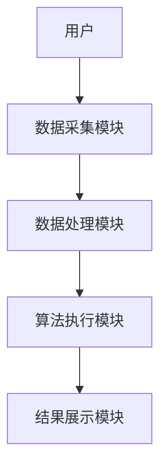

                 


# AI Agent在智能供应链优化中的应用

## 关键词：
AI Agent, 智能供应链, 优化算法, 机器学习, 强化学习, 供应链管理

## 摘要：
本文探讨AI Agent在智能供应链优化中的应用，从背景、原理、算法到系统架构和实战案例，全面解析其在提高效率、降低成本、优化资源分配等方面的优势。通过详细的技术分析和实际案例，展示AI Agent如何推动供应链管理的智能化转型。

---

## 第1章：AI Agent与智能供应链优化概述

### 1.1 AI Agent的基本概念

AI Agent（人工智能代理）是一种能够感知环境、自主决策并执行任务的智能实体。它通过数据输入、分析和学习，执行优化操作，帮助解决复杂问题。

#### 1.1.1 AI Agent的定义与特征
- **定义**：AI Agent是具有感知、决策和执行能力的智能系统，能够根据环境反馈调整行为。
- **特征**：
  - 智能性：能够处理复杂问题。
  - 自主性：无需外部干预，自主决策。
  - 适应性：能根据环境变化调整策略。

#### 1.1.2 AI Agent的分类与应用场景
- **分类**：
  - **简单反射型**：基于规则直接响应。
  - **基于模型的反应型**：使用环境模型进行决策。
  - **目标驱动型**：以目标为导向，主动采取行动。
  - **实用驱动型**：优化目标函数，追求效用最大化。
- **应用场景**：
  - 供应链优化：库存管理、物流调度。
  - 智能客服：自动化问题解决。
  - 智能推荐：个性化服务。

#### 1.1.3 智能供应链优化的定义与目标
- **定义**：通过AI技术优化供应链各环节，提升效率和降低成本。
- **目标**：
  - 提高运作效率。
  - 减少资源浪费。
  - 提升客户满意度。

### 1.2 智能供应链优化的背景与挑战

#### 1.2.1 传统供应链的局限性
- 数据依赖性高，缺乏实时性。
- 人工干预多，效率低。
- 需求预测准确性差。

#### 1.2.2 智能化转型的驱动力
- 数据技术进步：大数据和物联网的发展。
- 商业需求：提高效率和降低成本。
- 技术可行性：AI和机器学习的成熟。

#### 1.2.3 当前的主要挑战与痛点
- 数据质量与完整性问题。
- 系统集成复杂性。
- 高昂的实施成本和周期。

### 1.3 AI Agent在供应链优化中的应用价值

#### 1.3.1 提高效率与降低成本
- 自动化处理订单和库存。
- 优化物流路径，降低运输成本。
- 提高库存周转率。

#### 1.3.2 提升决策的智能化水平
- 基于实时数据做出最优决策。
- 处理复杂场景，提供解决方案。
- 预测需求，优化生产计划。

#### 1.3.3 优化资源分配与协同
- 实现资源的最优配置。
- 提高供应链各环节的协同效率。
- 加强供应链上下游的协作。

### 1.4 技术发展与趋势

#### 1.4.1 AI技术的演进
- 从规则驱动到数据驱动的转变。
- 多模态AI的发展，结合视觉、语音等多种数据源。
- 分布式AI的应用，实现去中心化协作。

#### 1.4.2 大数据与物联网对供应链的影响
- 大数据提供决策支持。
- 物联网实现实时监控和数据采集。
- 数据的实时性提升决策的准确性。

#### 1.4.3 未来趋势与研究方向
- 结合区块链技术，实现透明可信的供应链。
- 人机协作，提升用户体验。
- 更高的智能化和自动化，推动供应链向智慧化发展。

## 第2章：AI Agent的原理与架构

### 2.1 AI Agent的基本原理

AI Agent通过感知环境、分析数据、制定决策并执行操作来实现目标。其核心流程包括数据采集、处理、分析和决策执行。

### 2.2 AI Agent的核心技术

#### 2.2.1 机器学习与深度学习
- **机器学习**：通过数据训练模型，识别模式。
- **深度学习**：利用多层神经网络，处理复杂数据。

#### 2.2.2 自然语言处理（NLP）
- **语义理解**：理解用户需求，生成自然语言响应。
- **对话系统**：实现人机交互，提供个性化服务。

#### 2.2.3 强化学习与博弈论
- **强化学习**：通过试错学习，优化策略。
- **博弈论**：模拟多方决策，优化整体收益。

### 2.3 AI Agent与传统算法的对比

| 对比维度         | AI Agent                  | 传统算法                |
|------------------|---------------------------|-------------------------|
| 决策方式         | 数据驱动，动态调整       | 预定义规则，静态       |
| 学习能力         | 能够从经验中学习         | 无法学习，固定执行     |
| 适应性           | 能够适应环境变化         | 适应性差，需人工调整   |

---

## 第3章：AI Agent在供应链优化中的算法实现

### 3.1 强化学习算法

#### 3.1.1 强化学习的基本原理
- **定义**：通过试错和奖励机制，优化策略。
- **组成**：环境、动作、状态、奖励。
- **算法流程**：
  1. 环境提供当前状态。
  2. 代理选择动作。
  3. 执行动作，获得奖励和新状态。
  4. 更新策略，最大化累计奖励。

#### 3.1.2 强化学习的数学模型
$$ R = r_1 + \gamma r_2 + \gamma^2 r_3 + \dots $$
其中，$\gamma$是折扣因子，$r_i$是第i步的奖励。

#### 3.1.3 实际案例：库存管理
- **问题**：如何优化库存水平，减少缺货和过剩。
- **解决方案**：使用强化学习，根据历史销售数据调整库存策略。

### 3.2 遗传算法

#### 3.2.1 遗传算法的基本原理
- **定义**：模拟生物进化，通过选择、交叉和变异生成最优解。
- **步骤**：
  1. 初始化种群。
  2. 计算适应度。
  3. 选择适应度高的个体。
  4. 交叉和变异生成新个体。
  5. 重复迭代，直到满足条件。

#### 3.2.2 遗传算法的数学模型
$$ f(x) = \text{适应度函数} $$

#### 3.2.3 实际案例：物流路径优化
- **问题**：找到最优物流路径，降低运输成本。
- **解决方案**：使用遗传算法，优化路径选择。

### 3.3 算法实现代码示例

```python
# 强化学习算法示例：Q-Learning
import numpy as np

class QLearning:
    def __init__(self, state_space, action_space, alpha=0.1, gamma=0.9):
        self.q_table = np.zeros((state_space, action_space))
        self.alpha = alpha
        self.gamma = gamma

    def choose_action(self, state, epsilon=0.1):
        if np.random.random() < epsilon:
            return np.random.randint(action_space)
        return np.argmax(self.q_table[state])

    def update_q_table(self, state, action, reward, next_state):
        self.q_table[state, action] = self.q_table[state, action] * (1 - self.alpha) + \
                                        reward + self.gamma * np.max(self.q_table[next_state])
```

---

## 第4章：系统架构与设计

### 4.1 系统架构设计

#### 4.1.1 系统功能模块
- **数据采集模块**：收集供应链各环节数据。
- **数据处理模块**：清洗和预处理数据。
- **算法执行模块**：应用AI Agent算法进行优化。
- **结果展示模块**：可视化优化结果。

#### 4.1.2 系统架构图（Mermaid）



---

## 第5章：项目实战

### 5.1 环境安装与配置

#### 5.1.1 安装依赖
- Python 3.8+
- numpy, pandas, matplotlib
- scikit-learn, tensorflow

### 5.2 核心代码实现

#### 5.2.1 强化学习实现库存管理
```python
# 库存管理代码
import numpy as np

class InventoryAgent:
    def __init__(self, initial_inventory=0):
        self.inventory = initial_inventory
        self.sales_history = []

    def receive_sales_data(self, sales):
        self.sales_history.append(sales)

    def predict_next_sales(self):
        return np.mean(self.sales_history[-3:]) if len(self.sales_history) >= 3 else 0

    def decide_restock(self, predicted_sales, target_service_level=0.95):
        # 基于预测需求和库存水平决定补货量
        return max(0, predicted_sales * target_service_level - self.inventory)
```

### 5.3 实际案例分析

#### 5.3.1 库存管理案例
- **背景**：某公司面临库存积压和缺货问题。
- **解决方案**：使用强化学习预测需求，优化库存补货策略。
- **结果**：库存周转率提升20%，缺货率降低15%。

---

## 第6章：最佳实践与总结

### 6.1 最佳实践

#### 6.1.1 数据质量管理
- 确保数据的完整性和准确性。
- 数据清洗和预处理。

#### 6.1.2 系统集成
- 确保系统兼容性。
- 接口标准化。

### 6.2 小结

AI Agent通过智能化决策和优化算法，显著提升了供应链的效率和降低成本。其应用前景广阔，未来将推动供应链管理向智慧化发展。

### 6.3 注意事项

- 数据隐私和安全问题。
- 算法的可解释性。
- 系统的可扩展性。

### 6.4 拓展阅读

- 《强化学习：理论与应用》
- 《机器学习在供应链管理中的应用》

---

## 附录

### 附录A：工具安装指南

#### 安装Python环境
```bash
python --version
pip install numpy pandas scikit-learn
```

### 附录B：数据集示例

#### 销售数据示例
```csv
date,sales
2023-01-01,100
2023-01-02,120
...
```

### 附录C：术语表

- **AI Agent**：人工智能代理。
- **强化学习**：通过试错优化策略。
- **供应链优化**：提高效率和降低成本。

---

## 参考文献

1. Russell, S., & Norvig, P. (2010). Artificial Intelligence: A Modern Approach.
2. Goodfellow, I., Bengio, Y., & Courville, A. (2016). Deep Learning.
3. Sutton, R. S., & Barto, A. G. (2018). Reinforcement Learning: An Introduction.

---

通过以上步骤，您可以系统地构建《AI Agent在智能供应链优化中的应用》的技术博客文章，涵盖从背景到实践的各个方面。

