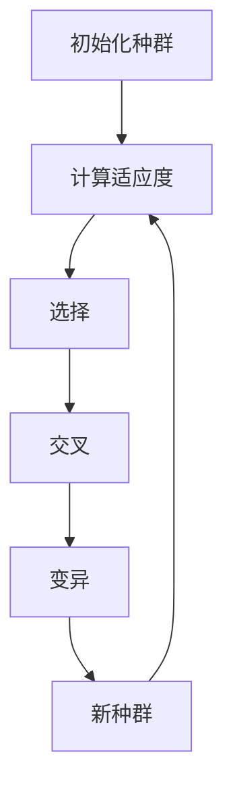
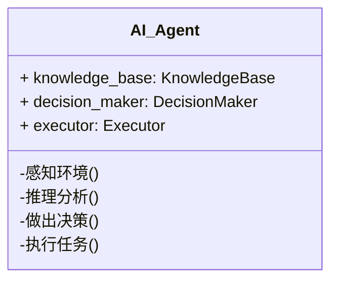
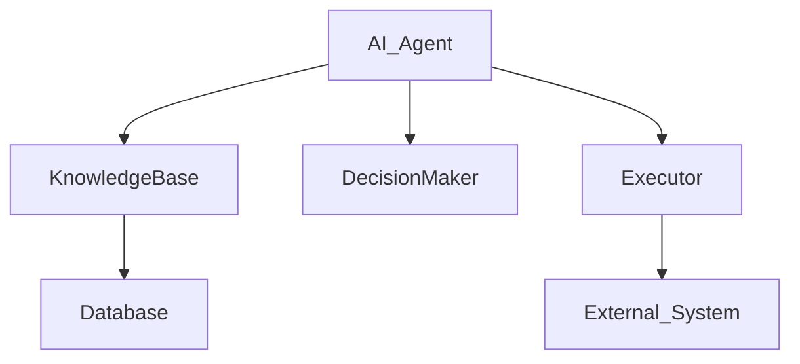

                 


# AI Agent在智能供应链优化决策中的应用

## 关键词：AI Agent, 智能供应链, 优化决策, 算法原理, 系统架构, 项目实战

## 摘要：本文深入探讨AI Agent在智能供应链优化决策中的应用，分析其在供应链管理中的核心作用，结合实际案例，详细讲解AI Agent的算法原理和系统架构设计，最后通过项目实战展示AI Agent在供应链优化中的具体应用。

---

# 第一部分: AI Agent与智能供应链优化决策的背景介绍

## 第1章: AI Agent的基本概念与原理

### 1.1 AI Agent的定义与核心要素

#### 1.1.1 什么是AI Agent
AI Agent（人工智能代理）是指能够感知环境、自主决策并执行任务的智能实体。它通过传感器获取信息，利用推理能力分析问题，并通过执行器采取行动。AI Agent可以是软件程序，也可以是物理机器人。

**核心要素：**
1. **感知能力**：通过传感器或数据接口获取外部信息。
2. **推理能力**：利用知识库和推理算法分析问题。
3. **决策能力**：基于推理结果制定行动计划。
4. **执行能力**：通过执行器或API接口实现决策。

#### 1.1.2 AI Agent的核心要素
| 核心要素 | 描述 |
|----------|------|
| 知识库   | 包含问题领域相关的知识和数据。 |
| 推理引擎 | 负责根据知识库和输入信息进行推理。 |
| 决策模块 | 基于推理结果生成最优决策。 |
| 执行模块 | 执行决策并返回结果。 |

#### 1.1.3 AI Agent的分类与特点
AI Agent可以根据智能水平、应用场景和决策方式分类。常见的分类包括：
1. **反应式AI Agent**：基于当前感知做出反应，适用于实时任务。
2. **认知式AI Agent**：具备高级推理能力，适用于复杂决策。
3. **协作式AI Agent**：能够与其他Agent或人类协作完成任务。

---

### 1.2 AI Agent的工作原理

#### 1.2.1 知识表示与推理
知识表示是AI Agent的核心，常用的表示方法包括：
1. **谓词逻辑**：用谓词和事实表示知识。
2. **语义网络**：用节点和边表示概念及其关系。
3. **规则库**：用if-then规则表示知识。

**推理过程**：
1. **演绎推理**：从一般到特定的推理。
2. **归纳推理**：从特定到一般的推理。
3. **溯因推理**：从结果推导原因。

#### 1.2.2 感知与决策
感知模块通过传感器或API获取信息，决策模块基于感知信息和知识库生成行动计划。

**决策算法**：
1. **基于规则的决策**：根据预定义规则做出决策。
2. **基于模型的决策**：利用数学模型优化决策。
3. **基于机器学习的决策**：通过训练模型进行预测和决策。

#### 1.2.3 执行与反馈
执行模块通过执行器或API接口执行决策，并将反馈信息传递给感知模块，形成闭环。

---

### 1.3 AI Agent在供应链中的应用前景

#### 1.3.1 供应链优化的挑战
1. **复杂性**：涉及多个环节和参与者。
2. **不确定性**：市场需求波动、物流延迟等问题。
3. **高效性**：需要实时优化决策。

#### 1.3.2 AI Agent在供应链中的潜在价值
1. **实时优化**：快速响应市场变化。
2. **数据驱动决策**：利用大数据分析优化供应链。
3. **提高效率**：通过智能决策减少成本。

#### 1.3.3 企业采用AI Agent的优势与挑战
**优势**：
1. 提高供应链透明度。
2. 优化库存管理。
3. 提升客户满意度。

**挑战**：
1. 数据隐私问题。
2. 技术实施成本高。
3. 人才短缺。

---

## 第2章: 智能供应链管理的理论基础

### 2.1 供应链管理的基本概念

#### 2.1.1 供应链的定义与组成
供应链包括供应商、制造商、分销商、零售商和消费者。

#### 2.1.2 供应链管理的目标与流程
目标：降低成本、提高效率、增强客户满意度。
流程：计划、采购、生产、物流、库存管理。

#### 2.1.3 供应链优化的常见问题
1. 库存优化。
2. 生产计划。
3. 物流路径优化。

---

### 2.2 供应链优化的数学模型

#### 2.2.1 线性规划模型
线性规划模型用于优化问题，目标函数和约束条件均为线性。

**目标函数**：最小化或最大化目标。
**约束条件**：资源限制、需求约束等。

**公式示例**：
$$
\text{目标函数：} \quad \text{Minimize } \sum c_i x_i
$$
$$
\text{约束条件：} \quad \sum a_i x_i \geq b, \quad x_i \geq 0
$$

#### 2.2.2 动态规划模型
适用于分阶段决策问题，将问题分解为子问题，逐步求解。

---

## 第二部分: AI Agent在供应链优化中的应用

## 第3章: AI Agent在供应链优化中的应用

### 3.1 AI Agent优化问题建模

#### 3.1.1 常见优化问题
1. **库存优化**：确定最优库存量。
2. **生产计划**：优化生产排程。
3. **物流路径优化**：寻找最优配送路径。

#### 3.1.2 数学模型
**库存优化模型**：
$$
\text{Minimize } \sum (C_i x_i + H_i x_i)
$$
$$
\text{Subject to } \sum x_i \geq D, \quad x_i \geq 0
$$

**物流路径优化模型**：
$$
\text{Minimize } \sum c_{ij} x_{ij}
$$
$$
\text{Subject to } \sum_{j} x_{ij} = 1, \quad \sum_{i} x_{ij} = 1
$$

### 3.2 AI Agent的算法实现

#### 3.2.1 基于遗传算法的优化
遗传算法模拟生物进化过程，包括选择、交叉和变异操作。

**流程图**：


#### 3.2.2 Python代码实现
```python
def genetic_algorithm(population_size, fitness_func):
    population = initialize_population(population_size)
    while not stopping_criteria():
        fitness = evaluate_fitness(population, fitness_func)
        population = select_parents(population, fitness)
        population = perform_crossover(population)
        population = mutate(population)
    return best_candidate(population)
```

---

## 第三部分: 系统架构与项目实战

## 第4章: 系统架构设计

### 4.1 系统功能设计

#### 4.1.1 领域模型设计
**类图**：


#### 4.1.2 系统架构设计
**架构图**：


### 4.2 项目实战

#### 4.2.1 环境安装
安装Python、NumPy、Pulp等库：
```bash
pip install numpy pulp
```

#### 4.2.2 核心代码实现
```python
from pulp import *

def optimize_inventory(Demand, Cost, HoldingCost):
    prob = LpProblem("Inventory_Optimization", LpMinimize)
    x = LpVariable('x', 0, None)
    prob += lpSum(Cost * x) + lpSum(HoldingCost * x)
    prob += lpSum(x) >= Demand
    prob.solve()
    return value(x)
```

---

## 第四部分: 最佳实践与总结

## 第5章: 最佳实践与总结

### 5.1 实践小结
AI Agent在供应链优化中的应用需要结合具体问题，选择合适的算法和工具。

### 5.2 注意事项
1. 数据质量至关重要。
2. 模型需要持续优化。
3. 注意数据隐私和安全。

### 5.3 拓展阅读
推荐书籍和论文，深入学习AI Agent和供应链优化。

---

# 总结

本文详细介绍了AI Agent在智能供应链优化中的应用，从基本概念到算法实现，再到系统架构设计，最后通过项目实战展示AI Agent的实际应用。希望读者能够通过本文，深入了解AI Agent在供应链优化中的潜力和价值。

