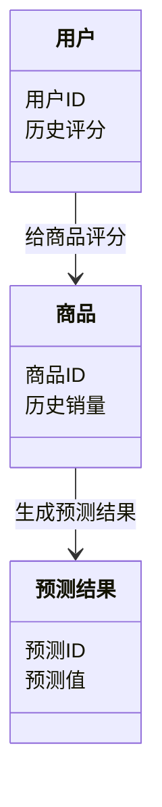
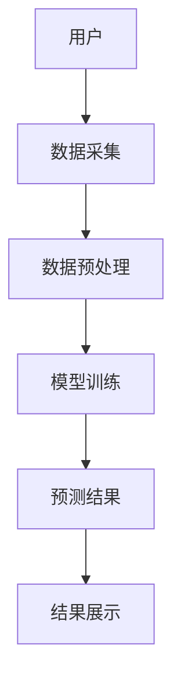
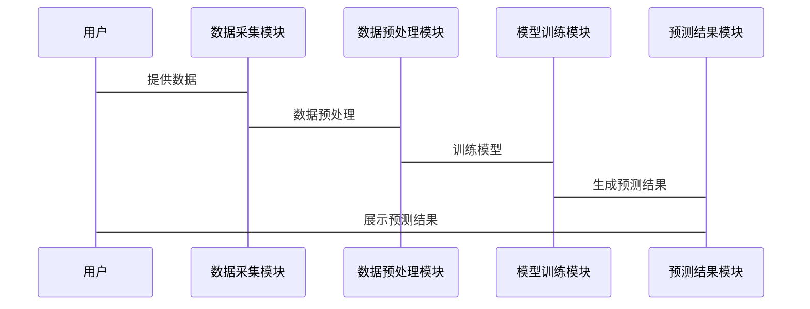

                 


# AI Agent在智能供应链需求预测中的应用

> 关键词：AI Agent, 供应链管理, 需求预测, 时间序列分析, 机器学习, 深度学习

> 摘要：本文详细探讨了AI Agent在智能供应链需求预测中的应用，从基础概念到核心算法，再到系统架构和项目实战，全面解析了AI Agent如何助力供应链实现高效、精准的需求预测。文章通过具体案例分析和代码实现，展示了AI Agent在供应链管理中的实际价值和未来发展趋势。

---

## 第一部分: AI Agent与智能供应链概述

### 第1章: AI Agent与智能供应链的基本概念

#### 1.1 AI Agent的基本概念

##### 1.1.1 什么是AI Agent
AI Agent（人工智能代理）是指能够感知环境、自主决策并执行任务的智能实体。它能够通过传感器获取数据，利用算法进行分析，并通过执行器完成操作。AI Agent的核心目标是通过智能化手段解决复杂问题。

**AI Agent的特点：**
- **自主性**：能够独立运作，无需人工干预。
- **反应性**：能够实时感知环境并做出反应。
- **目标导向**：具备明确的目标，所有行为都围绕目标展开。

##### 1.1.2 AI Agent的核心特征
AI Agent的核心特征包括：
1. **感知能力**：通过传感器或数据接口获取外部信息。
2. **决策能力**：基于获取的信息进行分析和决策。
3. **执行能力**：根据决策结果执行操作。
4. **学习能力**：通过经验优化自身的算法和模型。

##### 1.1.3 AI Agent与传统算法的区别
AI Agent与传统算法的区别在于其具备自主性和目标导向性。传统算法通常需要人工编程和干预，而AI Agent能够自主运行，并根据环境变化调整策略。

#### 1.2 智能供应链的基本概念

##### 1.2.1 供应链的定义与组成
供应链是指从原材料采购到产品交付给最终用户的整个过程中的所有参与方和流程。它包括供应商、制造商、分销商、零售商和消费者等多个环节。

**供应链的组成：**
- **供应商**：提供原材料或零部件。
- **制造商**：进行产品的生产加工。
- **分销商**：负责产品的物流和配送。
- **零售商**：直接面向消费者销售产品。
- **消费者**：最终产品的需求方。

##### 1.2.2 智能供应链的特点
智能供应链的特点包括：
1. **数据驱动**：利用大数据技术进行决策。
2. **自动化**：通过自动化技术减少人工干预。
3. **实时性**：能够实时感知和响应环境变化。
4. **智能化**：利用AI技术优化供应链的各个环节。

##### 1.2.3 智能供应链的应用场景
智能供应链的应用场景包括：
- **需求预测**：通过AI技术预测市场需求。
- **库存管理**：优化库存水平，减少浪费。
- **物流优化**：通过智能算法优化物流路径。
- **供应商管理**：评估和选择最优供应商。

#### 1.3 AI Agent在供应链中的应用背景

##### 1.3.1 供应链需求预测的挑战
供应链需求预测的挑战包括：
- **数据复杂性**：市场需求受多种因素影响，如季节性变化、经济波动等。
- **数据缺失**：某些情况下，数据可能不完整或不可用。
- **预测精度**：传统方法的预测精度有限，难以满足精准需求预测的要求。

##### 1.3.2 AI Agent在需求预测中的优势
AI Agent在需求预测中的优势包括：
1. **自主学习**：能够通过历史数据自主学习，优化预测模型。
2. **实时响应**：能够实时感知市场变化，快速调整预测策略。
3. **高精度**：通过深度学习和大数据分析，提高预测精度。

##### 1.3.3 当前行业的发展现状
当前，AI Agent在供应链中的应用还处于发展阶段，但已经在一些领域取得了显著成果。例如，在零售业，AI Agent已经被用于库存管理和需求预测，取得了良好的效果。

---

### 第2章: AI Agent与供应链需求预测的核心概念

#### 2.1 AI Agent在需求预测中的核心作用

##### 2.1.1 需求预测的流程与关键环节
需求预测的流程包括：
1. **数据收集**：收集历史销售数据、市场趋势等。
2. **数据预处理**：清洗数据，处理缺失值和异常值。
3. **模型训练**：利用算法训练预测模型。
4. **预测结果**：根据模型输出预测结果。
5. **结果优化**：根据实际情况调整模型参数，优化预测结果。

##### 2.1.2 AI Agent在需求预测中的角色
AI Agent在需求预测中的角色包括：
- **数据采集**：通过传感器或API获取实时数据。
- **模型训练**：利用机器学习算法训练预测模型。
- **预测执行**：根据模型结果生成预测报告。
- **动态调整**：根据市场变化动态调整预测策略。

##### 2.1.3 AI Agent与供应链其他环节的关联
AI Agent不仅在需求预测中发挥作用，还与供应链的其他环节密切相关。例如，在库存管理中，AI Agent可以通过预测结果优化库存水平；在物流管理中，AI Agent可以通过预测需求优化物流路径。

#### 2.2 需求预测的核心模型与方法

##### 2.2.1 时间序列分析模型
时间序列分析模型用于分析随时间变化的数据，常见的模型包括ARIMA、LSTM等。

##### 2.2.2 机器学习模型
机器学习模型包括线性回归、随机森林等，适用于特征工程较为复杂的场景。

##### 2.2.3 深度学习模型
深度学习模型如卷积神经网络（CNN）、循环神经网络（RNN）等，适用于处理复杂的时间序列数据。

#### 2.3 AI Agent与需求预测的结合方式

##### 2.3.1 数据驱动的预测
数据驱动的预测是指通过大量数据训练模型，生成预测结果。AI Agent可以通过数据采集、清洗、建模等步骤，实现数据驱动的预测。

##### 2.3.2 知识图谱与推理
知识图谱与推理是指通过构建领域知识图谱，利用推理算法生成预测结果。AI Agent可以通过知识图谱推理，优化预测结果。

##### 2.3.3 动态调整与优化
动态调整与优化是指根据市场变化实时调整预测策略。AI Agent可以通过实时数据反馈，动态优化预测模型。

---

### 第3章: AI Agent在供应链需求预测中的算法原理

#### 3.1 基于协同过滤的需求预测算法

##### 3.1.1 协同过滤的基本原理
协同过滤是一种推荐系统中常用的技术，通过分析用户行为或商品属性，找到相似的用户或商品，进行推荐。

**协同过滤的步骤：**
1. **构建用户-商品矩阵**：记录用户对商品的评分。
2. **计算相似度**：通过余弦相似度或其他相似度计算方法，找到相似的用户或商品。
3. **生成推荐**：根据相似用户的评分，预测目标用户的评分。

##### 3.1.2 基于用户的协同过滤
基于用户的协同过滤是指通过用户的行为数据，找到相似的用户，进行推荐。

**基于用户的协同过滤公式：**
$$ sim(u_i, u_j) = \frac{\sum_{k} (r_{i,k} - \bar{r_i})(r_{j,k} - \bar{r_j})}{\sqrt{\sum_{k} (r_{i,k} - \bar{r_i})^2} \cdot \sqrt{\sum_{k} (r_{j,k} - \bar{r_j})^2}}} $$

##### 3.1.3 基于物品的协同过滤
基于物品的协同过滤是指通过商品的属性数据，找到相似的商品，进行推荐。

**基于物品的协同过滤公式：**
$$ sim(i_j, i_k) = \frac{\sum_{u} (r_{u,j} - \bar{r_j})(r_{u,k} - \bar{r_k})}{\sqrt{\sum_{u} (r_{u,j} - \bar{r_j})^2} \cdot \sqrt{\sum_{u} (r_{u,k} - \bar{r_k})^2}}} $$

#### 3.2 基于时间序列的预测算法

##### 3.2.1 ARIMA模型
ARIMA（自回归积分滑动平均模型）是一种常用的时间序列分析模型，适用于线性时间序列数据。

**ARIMA模型公式：**
$$ ARIMA(p, d, q) $$

##### 3.2.2 LSTM网络
LSTM（长短期记忆网络）是一种特殊的RNN，能够有效处理长序列数据。

**LSTM单元结构：**
$$
i_t = \sigma(W_i x_t + U_i h_{t-1} + b_i)
$$
$$
f_t = \sigma(W_f x_t + U_f h_{t-1} + b_f)
$$
$$
o_t = \sigma(W_o x_t + U_o h_{t-1} + b_o)
$$
$$
g_t = \tanh(W_g x_t + U_g h_{t-1} + b_g)
$$
$$
h_t = i_t \cdot g_t + f_t \cdot h_{t-1}
$$
$$
s_t = h_t
$$

##### 3.2.3 Prophet模型
Prophet模型是由Facebook开源的时间序列预测模型，适用于非线性时间序列数据。

**Prophet模型公式：**
$$
y_t = g(t) + s_t + \epsilon_t
$$
其中，\( g(t) \) 是趋势函数，\( s_t \) 是季节性成分，\( \epsilon_t \) 是噪声。

#### 3.3 基于深度学习的需求预测算法

##### 3.3.1 CNN在时间序列中的应用
卷积神经网络（CNN）在时间序列中的应用包括：
1. **提取局部特征**：通过卷积操作提取时间序列中的局部特征。
2. **池化操作**：通过池化操作降低计算复杂度。
3. **全连接层**：通过全连接层生成最终的预测结果。

##### 3.3.2 RNN与LSTM的结合
循环神经网络（RNN）与LSTM的结合可以有效处理长序列数据，适用于时间序列预测。

##### 3.3.3 Transformer模型的应用
Transformer模型通过自注意力机制，能够捕捉时间序列中的全局依赖关系，适用于复杂的预测任务。

---

### 第4章: 数学模型与公式解析

#### 4.1 协同过滤算法的数学模型

##### 4.1.1 用户-物品矩阵的构建
用户-物品矩阵的构建步骤：
1. **数据收集**：收集用户对商品的评分数据。
2. **矩阵构建**：将用户对商品的评分填入矩阵中。

##### 4.1.2 相似度计算公式
相似度计算公式：
$$ sim(i, j) = \frac{\sum_{k} (r_{i,k} - \bar{r_i})(r_{j,k} - \bar{r_j})}{\sqrt{\sum_{k} (r_{i,k} - \bar{r_i})^2} \cdot \sqrt{\sum_{k} (r_{j,k} - \bar{r_j})^2}} $$

##### 4.1.3 预测值计算公式
预测值计算公式：
$$ \hat{r}_{i,j} = \bar{r_i} + \sum_{k} w_{i,j,k} (r_{j,k} - \bar{r_j}) $$

#### 4.2 时间序列分析的数学模型

##### 4.2.1 ARIMA模型
ARIMA模型公式：
$$ ARIMA(p, d, q) $$

##### 4.2.2 LSTM网络
LSTM网络公式：
$$ i_t = \sigma(W_i x_t + U_i h_{t-1} + b_i) $$
$$ f_t = \sigma(W_f x_t + U_f h_{t-1} + b_f) $$
$$ o_t = \sigma(W_o x_t + U_o h_{t-1} + b_o) $$
$$ g_t = \tanh(W_g x_t + U_g h_{t-1} + b_g) $$
$$ h_t = i_t \cdot g_t + f_t \cdot h_{t-1} $$
$$ s_t = h_t $$

##### 4.2.3 Prophet模型
Prophet模型公式：
$$ y_t = g(t) + s_t + \epsilon_t $$

---

### 第5章: 系统分析与架构设计方案

#### 5.1 项目介绍

##### 5.1.1 项目背景
本项目旨在通过AI Agent技术，优化供应链的需求预测流程，提高预测精度，降低库存成本。

##### 5.1.2 项目目标
项目目标包括：
1. **提高预测精度**：通过AI Agent技术，提高需求预测的准确性。
2. **降低库存成本**：通过精准预测，优化库存管理。
3. **提高响应速度**：通过实时预测，快速响应市场变化。

#### 5.2 系统功能设计

##### 5.2.1 领域模型设计
领域模型设计包括用户、商品、预测结果等实体。

**领域模型类图：**


##### 5.2.2 系统架构设计

**系统架构图：**


##### 5.2.3 系统接口设计
系统接口设计包括：
1. **数据接口**：与数据库或API接口交互。
2. **用户接口**：与用户的交互界面。
3. **预测接口**：与预测模型的接口。

##### 5.2.4 系统交互流程设计

**系统交互流程图：**


---

### 第6章: 项目实战

#### 6.1 环境安装

##### 6.1.1 安装Python
安装Python 3.x版本。

##### 6.1.2 安装相关库
安装所需的库，例如：
- numpy
- pandas
- scikit-learn
- tensorflow
- prophet

#### 6.2 核心代码实现

##### 6.2.1 数据预处理代码
```python
import pandas as pd
import numpy as np

# 读取数据
data = pd.read_csv('sales_data.csv')

# 处理缺失值
data = data.dropna()

# 标准化处理
from sklearn.preprocessing import StandardScaler
scaler = StandardScaler()
scaled_data = scaler.fit_transform(data)
```

##### 6.2.2 协同过滤算法实现
```python
from sklearn.metrics.pairwise import cosine_similarity

# 计算相似度矩阵
similarity_matrix = cosine_similarity(scaled_data)

# 找出最相似的用户
def find_similar_users(similarity_matrix, user_id, top_n=5):
    similar_users = []
    for i in range(len(similarity_matrix[user_id])):
        if i != user_id:
            similar_users.append((i, similarity_matrix[user_id][i]))
    similar_users.sort(key=lambda x: x[1], reverse=True)
    return similar_users[:top_n]

# 生成推荐
def generate_recommendations(similar_users, user_data):
    recommendations = {}
    for user in similar_users:
        recommendations[user[0]] = user_data[user[0]]
    return recommendations
```

##### 6.2.3 时间序列预测代码
```python
from prophet import Prophet

# 准备数据
data = {'ds': dates, 'y': values}
model = Prophet()
model.fit(data)

# 生成预测
future = model.make_future_dataframe(periods=30, freq='D')
 forecast = model.predict(future)
```

#### 6.3 案例分析与详细解读

##### 6.3.1 案例分析
以某零售企业的销售数据为例，利用AI Agent进行需求预测。

##### 6.3.2 详细解读
1. **数据预处理**：清洗数据，处理缺失值。
2. **模型训练**：利用协同过滤和时间序列模型进行训练。
3. **预测结果**：生成预测报告，优化库存管理。

#### 6.4 项目小结

##### 6.4.1 项目总结
本项目通过AI Agent技术，成功实现了供应链需求预测的优化，提高了预测精度，降低了库存成本。

##### 6.4.2 经验总结
1. **数据质量**：数据的质量直接影响预测结果。
2. **模型选择**：选择合适的模型对预测结果至关重要。
3. **实时调整**：根据实际情况动态调整模型参数，优化预测结果。

---

### 第7章: 总结与展望

#### 7.1 最佳实践 tips
1. **数据驱动**：充分利用数据，提高预测精度。
2. **模型优化**：选择合适的模型，并不断优化。
3. **动态调整**：根据实际情况动态调整预测策略。

#### 7.2 小结
本文详细探讨了AI Agent在智能供应链需求预测中的应用，从基础概念到核心算法，再到系统架构和项目实战，全面解析了AI Agent如何助力供应链实现高效、精准的需求预测。

#### 7.3 注意事项
1. **数据隐私**：注意数据的隐私保护。
2. **模型解释性**：确保模型的解释性，便于调整和优化。
3. **实时性要求**：根据实际需求，选择合适的实时性方案。

#### 7.4 拓展阅读
1. **《机器学习实战》**：深入理解机器学习算法。
2. **《时间序列分析与应用》**：学习时间序列分析的方法。
3. **《深度学习》**：掌握深度学习的核心概念和技术。

---

通过本文的详细讲解，读者可以全面了解AI Agent在智能供应链需求预测中的应用，掌握相关的核心算法和系统设计方法，并能够在实际项目中灵活应用这些技术。

