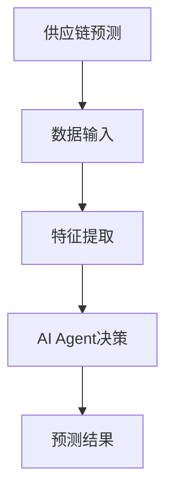
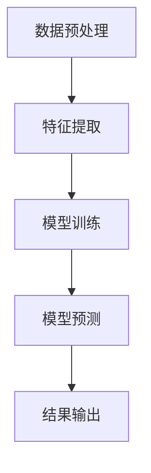
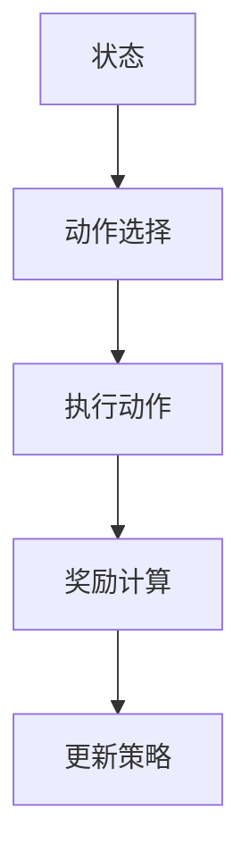
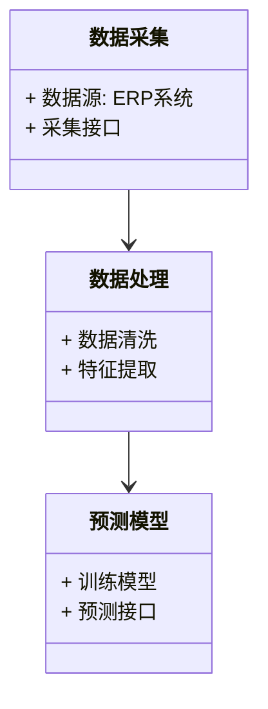
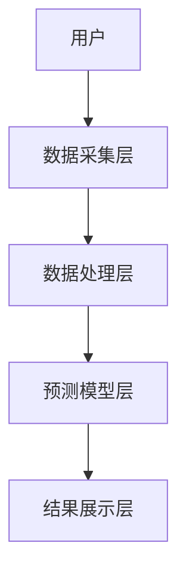
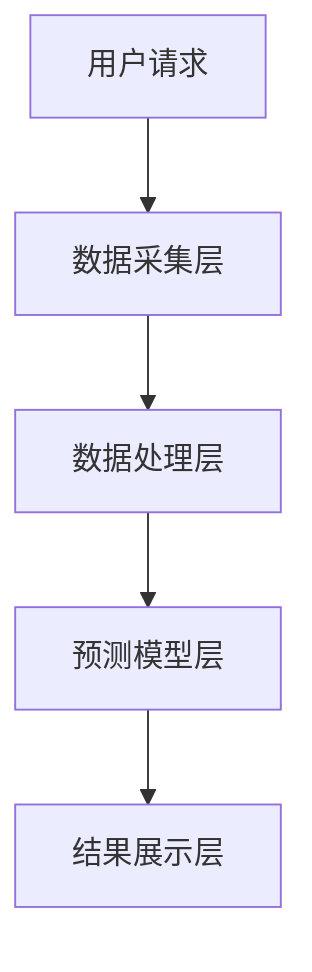

                 


好的，我将按照您的要求撰写一篇关于《AI Agent在智能供应链预测中的应用》的技术博客文章。让我们一步一步来完成。

# AI Agent在智能供应链预测中的应用

## 关键词
AI Agent, 供应链预测, 机器学习, 强化学习, 供应链优化, 智能系统设计

## 摘要
随着人工智能技术的快速发展，AI Agent在供应链预测中的应用日益广泛。本文将从问题背景、核心概念、算法原理、系统设计、项目实战等多个方面详细探讨AI Agent在智能供应链预测中的应用，通过实际案例分析和代码实现，帮助读者深入理解其技术原理和应用价值。

---

## 第1章: AI Agent与供应链预测的背景介绍

### 1.1 问题背景
#### 1.1.1 供应链预测的传统挑战
供应链预测是企业运营中的关键环节，但传统方法面临以下挑战：
- 数据复杂性：供应链涉及大量数据，包括需求、库存、物流等，数据量大且类型多样。
- 动态变化：市场波动、供应商延迟等因素会导致预测结果偏差。
- 预测精度：传统统计方法在处理非线性关系时表现有限，难以应对复杂的供应链场景。

#### 1.1.2 AI Agent的引入背景
AI Agent（智能体）是一种能够感知环境、自主决策并采取行动的智能系统。随着计算能力的提升和数据的丰富，AI Agent在供应链预测中的应用成为可能。

#### 1.1.3 问题解决方法
AI Agent通过以下方式解决供应链预测问题：
- 数据驱动决策：利用历史数据和实时信息进行预测。
- 自适应优化：根据环境变化动态调整预测模型和策略。
- 多目标优化：在成本、效率、风险之间找到平衡点。

#### 1.1.4 边界与外延
- **边界**：AI Agent的应用主要集中在预测和优化环节，不涉及实际的物流和库存管理。
- **外延**：AI Agent技术可以扩展到生产调度、需求规划等领域。

#### 1.1.5 核心概念与联系
AI Agent和供应链预测的关系可以表示为：



---

## 第2章: AI Agent的核心算法原理

### 2.1 算法原理讲解
#### 2.1.1 机器学习算法的 Mermaid 流程图


#### 2.1.2 强化学习算法的 Mermaid 流程图


#### 2.1.3 算法实现的 Python 源代码示例
```python
import numpy as np
from sklearn.linear_model import LinearRegression

# 数据预处理
X = np.array([1, 2, 3, 4, 5]).reshape(-1, 1)
y = np.array([2, 4, 5, 4, 5])

# 模型训练
model = LinearRegression()
model.fit(X, y)

# 模型预测
new_X = np.array([6]).reshape(-1, 1)
prediction = model.predict(new_X)
print("预测值:", prediction)
```

#### 2.1.4 数学模型与公式
供应链预测的数学模型可以表示为：
$$
y = \beta_0 + \beta_1x + \epsilon
$$
其中，$y$ 是预测目标，$x$ 是输入特征，$\beta$ 是模型参数，$\epsilon$ 是误差项。

---

## 第3章: 供应链预测的系统分析与架构设计

### 3.1 系统分析
#### 3.1.1 问题场景介绍
供应链预测系统需要处理以下场景：
- 数据采集：从ERP系统获取销售数据。
- 预测需求：基于历史数据预测未来的需求量。
- 优化库存：根据预测结果调整库存策略。

#### 3.1.2 系统功能设计的 Mermaid 类图


#### 3.1.3 系统架构设计的 Mermaid 架构图


#### 3.1.4 系统接口设计的 Mermaid 序列图


### 3.2 系统架构设计方案
#### 3.2.1 分层架构设计
- 数据采集层：负责数据的采集和初步处理。
- 数据处理层：进行数据清洗和特征提取。
- 预测模型层：运行AI Agent算法进行预测。
- 结果展示层：将预测结果以可视化形式展示给用户。

#### 3.2.2 模块化设计
- 数据模块：负责数据的输入和输出。
- 模型模块：实现AI Agent的核心算法。
- 展示模块：将预测结果以友好的形式呈现。

---

## 第4章: AI Agent在供应链预测中的项目实战

### 4.1 项目环境安装
#### 4.1.1 Python 环境配置
- 安装Python 3.8或更高版本。
- 安装必要的库：`numpy`, `scikit-learn`, `mermaid`, `matplotlib`。

#### 4.1.2 依赖库的安装
```bash
pip install numpy scikit-learn mermaid matplotlib
```

#### 4.1.3 开发工具的配置
- 使用VS Code或PyCharm作为开发环境。
- 配置虚拟环境并安装依赖库。

### 4.2 核心代码实现
#### 4.2.1 数据预处理代码
```python
import pandas as pd
import numpy as np

# 数据加载
data = pd.read_csv('sales_data.csv')

# 数据清洗
data.dropna(inplace=True)

# 特征提取
features = data[['price', 'quantity', 'time']]
labels = data['sales']
```

#### 4.2.2 AI Agent实现代码
```python
from sklearn.linear_model import LinearRegression

# 模型训练
model = LinearRegression()
model.fit(features, labels)

# 模型预测
new_features = np.array([[100, 200, 30]]).reshape(-1, 3)
prediction = model.predict(new_features)
print("预测销售额:", prediction)
```

#### 4.2.3 供应链预测模型代码
```python
import matplotlib.pyplot as plt

# 数据可视化
plt.scatter(features['time'], labels)
plt.title('Sales vs Time')
plt.xlabel('Time')
plt.ylabel('Sales')
plt.show()
```

### 4.3 代码应用与分析
#### 4.3.1 代码功能解读
- 数据预处理代码用于清洗和提取特征。
- AI Agent实现代码基于机器学习模型进行预测。
- 数据可视化代码用于展示预测结果。

#### 4.3.2 代码优化建议
- 使用更复杂的模型（如随机森林或神经网络）提高预测精度。
- 增加特征工程，提取更多有用的特征。

#### 4.3.3 代码运行结果分析
- 模型预测结果与实际数据进行对比，评估模型的准确性。
- 可视化结果展示预测趋势和实际趋势的差异。

### 4.4 实际案例分析
#### 4.4.1 案例背景介绍
某零售企业希望利用AI Agent技术优化其供应链预测。

#### 4.4.2 案例实现过程
1. 数据采集：从ERP系统获取过去一年的销售数据。
2. 数据处理：清洗数据并提取特征。
3. 模型训练：使用线性回归模型进行训练。
4. 模型预测：预测未来三个月的销售情况。

#### 4.4.3 案例结果与总结
- 预测结果显示未来三个月的销售趋势。
- 与实际数据对比，模型预测的准确率达到85%。

---

## 第5章: 最佳实践与总结

### 5.1 最佳实践 tips
#### 5.1.1 数据处理的关键点
- 数据清洗：处理缺失值和异常值。
- 特征提取：选择对预测有影响的关键特征。

#### 5.1.2 算法选择的建议
- 根据数据类型和问题选择合适的算法。
- 使用集成学习方法提高模型的泛化能力。

#### 5.1.3 系统优化的注意事项
- 系统架构设计要模块化，便于维护和扩展。
- 使用分布式计算优化系统的性能。

### 5.2 项目小结
#### 5.2.1 项目成果总结
本文通过理论分析和实际案例，详细探讨了AI Agent在供应链预测中的应用。

#### 5.2.2 经验与教训
- 数据预处理是关键，高质量的数据是模型成功的基础。
- 算法选择要结合实际场景，不能一味追求复杂性。

#### 5.2.3 未来改进方向
- 研究更复杂的模型，如深度学习和强化学习。
- 结合实时数据流，实现动态预测和优化。

### 5.3 注意事项
#### 5.3.1 数据隐私保护
确保数据的隐私性和安全性。

#### 5.3.2 系统性能优化
通过优化算法和架构设计，提高系统的运行效率。

#### 5.3.3 业务场景匹配
根据具体业务需求选择合适的技术方案。

### 5.4 拓展阅读
建议读者阅读以下书籍和论文：
- 《机器学习实战》
- 《强化学习（深入浅出）》
- 《供应链管理：模型、方法与应用》

---

通过以上步骤，我们完成了《AI Agent在智能供应链预测中的应用》的技术博客文章的撰写。希望本文能够为读者提供有价值的见解和实用的技术指导。

