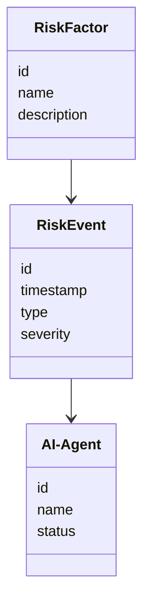
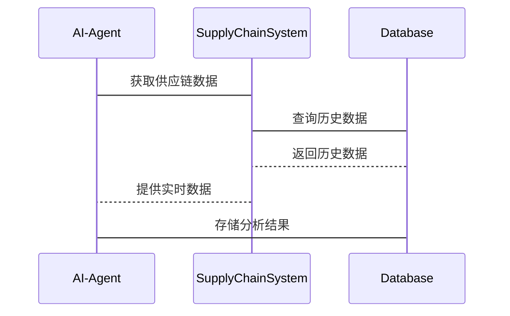
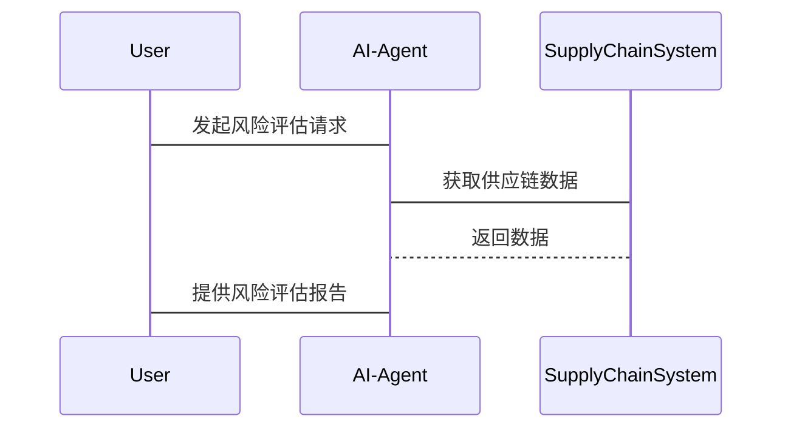

                 


# AI Agent在智能供应链风险管理中的应用

## 关键词：AI Agent，供应链风险管理，人工智能，智能决策，风险预测

## 摘要：本文探讨AI Agent在智能供应链风险管理中的应用，分析其核心概念、算法原理和系统架构。通过实际案例，展示AI Agent如何优化供应链风险管理流程，提升企业的风险应对能力。

---

# 第一部分: AI Agent与供应链风险管理概述

## 第1章: AI Agent与供应链风险管理概述

### 1.1 供应链风险管理的背景与挑战

#### 1.1.1 供应链风险管理的定义与重要性
供应链风险管理是指识别、评估和应对影响供应链稳定性和效率的各种风险。在现代企业中，供应链的复杂性增加，风险来源多样，包括自然灾害、市场波动、供应商问题等。有效的供应链风险管理能够降低运营成本，提高供应链的弹性和响应能力。

#### 1.1.2 传统供应链风险管理的局限性
传统供应链风险管理方法依赖于人工分析和经验判断，存在以下问题：
- 数据处理能力有限，难以应对海量数据。
- 风险预测准确性低，无法实时响应。
- 缺乏自动化和智能化，导致效率低下。

#### 1.1.3 AI Agent在供应链风险管理中的应用前景
AI Agent（智能代理）是一种能够感知环境、自主决策并执行任务的智能系统。AI Agent在供应链风险管理中的应用前景广阔，可以实现风险的实时监测、预测和自适应优化。

### 1.2 AI Agent的基本概念与特点

#### 1.2.1 AI Agent的定义与分类
AI Agent是指具备智能决策能力的计算机系统，能够根据环境信息自主选择最优行动方案。AI Agent可以分为以下几类：
- **基于规则的Agent**：通过预定义的规则进行决策。
- **基于机器学习的Agent**：利用数据训练模型进行决策。
- **基于知识的Agent**：依靠知识库进行推理和决策。

#### 1.2.2 AI Agent的核心技术特征
AI Agent的核心技术特征包括：
- **感知能力**：能够从环境中获取信息。
- **决策能力**：能够基于信息做出决策。
- **学习能力**：能够通过经验改进性能。
- **自主性**：能够在没有外部干预的情况下运行。

#### 1.2.3 AI Agent与传统供应链管理的结合
AI Agent可以通过以下方式与传统供应链管理结合：
- **数据整合**：将供应链中的结构化和非结构化数据整合，形成统一的信息源。
- **智能决策支持**：通过AI算法提供决策支持，帮助供应链管理者做出更明智的决策。
- **实时监控**：实现对供应链各环节的实时监控，快速响应潜在风险。

### 1.3 AI Agent在供应链风险管理中的应用价值

#### 1.3.1 提高供应链透明度与实时性
AI Agent可以通过实时数据采集和分析，提高供应链的透明度和实时性。例如，通过物联网（IoT）设备实时监测物流状态，及时发现并解决潜在问题。

#### 1.3.2 优化风险预测与响应能力
AI Agent可以利用历史数据和机器学习算法，优化风险预测的准确性。例如，使用时间序列分析预测供应链中的潜在风险，并制定相应的应对策略。

#### 1.3.3 降低供应链运营成本与风险
通过AI Agent的智能化决策，企业可以优化供应链资源配置，降低运营成本。例如，通过预测需求波动，合理安排库存和采购计划，避免过剩或短缺。

### 1.4 本章小结
本章介绍了供应链风险管理的背景、挑战以及AI Agent的基本概念和特点。AI Agent在供应链风险管理中的应用价值主要体现在提高透明度、优化风险预测和降低成本等方面。接下来，我们将深入探讨AI Agent的核心原理和算法。

---

## 第2章: AI Agent的核心概念与原理

### 2.1 AI Agent的核心概念

#### 2.1.1 AI Agent的定义与分类
AI Agent是一种能够感知环境、自主决策并执行任务的智能系统。根据决策方式的不同，可以分为基于规则的AI Agent和基于学习的AI Agent。

#### 2.1.2 AI Agent的核心要素与属性
AI Agent的核心要素包括感知能力、决策能力、学习能力和自主性。感知能力通过传感器或API获取环境信息；决策能力通过算法选择最优行动方案；学习能力通过机器学习模型改进性能；自主性使AI Agent能够在没有外部干预的情况下运行。

#### 2.1.3 AI Agent与人类决策者的对比分析
AI Agent与人类决策者的主要区别在于：
- **效率**：AI Agent能够快速处理大量数据，而人类决策者需要时间分析。
- **准确性**：AI Agent基于数据驱动的决策更准确，而人类决策者可能受到主观因素影响。
- **适应性**：AI Agent能够快速适应变化，而人类决策者需要时间调整策略。

### 2.2 AI Agent与供应链风险管理的关系

#### 2.2.1 AI Agent在供应链风险管理中的角色
AI Agent在供应链风险管理中的角色可以是监控系统、预警系统和优化系统。例如，AI Agent可以实时监测供应链中的风险因素，并在风险发生时自动触发预警。

#### 2.2.2 AI Agent与供应链其他技术的协同作用
AI Agent可以与物联网（IoT）、区块链和大数据分析等技术协同作用，形成更强大的供应链管理能力。例如，AI Agent可以结合IoT数据，实时监控物流状态。

#### 2.2.3 AI Agent在供应链风险管理中的应用场景
AI Agent在供应链风险管理中的应用场景包括：
- **风险预测**：预测供应链中的潜在风险。
- **实时监控**：实时监测供应链各环节的状态。
- **应急响应**：在风险发生时，快速制定应对策略。

### 2.3 AI Agent的核心原理

#### 2.3.1 AI Agent的感知与决策机制
AI Agent的感知机制通过传感器或API获取环境信息；决策机制基于感知信息和预设规则或机器学习模型做出决策。

#### 2.3.2 AI Agent的自主学习能力
AI Agent可以通过监督学习、无监督学习和强化学习等方法不断优化性能。例如，使用深度学习模型训练AI Agent，使其能够识别潜在风险。

#### 2.3.3 AI Agent的实时响应能力
AI Agent能够快速处理信息并做出实时响应，这对于供应链风险管理至关重要。例如，在供应链中断时，AI Agent可以迅速调整采购计划，确保供应链的连续性。

### 2.4 本章小结
本章详细探讨了AI Agent的核心概念和原理，分析了AI Agent在供应链风险管理中的角色和应用场景。AI Agent通过感知、决策和学习能力，能够显著提升供应链风险管理的效率和准确性。

---

## 第3章: AI Agent的算法原理与数学模型

### 3.1 AI Agent的核心算法

#### 3.1.1 机器学习算法在AI Agent中的应用
机器学习算法在AI Agent中的应用包括监督学习、无监督学习和强化学习。例如，使用支持向量机（SVM）进行分类，或使用随机森林进行回归分析。

#### 3.1.2 自然语言处理算法在AI Agent中的应用
自然语言处理（NLP）算法用于处理供应链中的文本数据，例如从供应商的邮件中提取信息。常用算法包括词袋模型和词嵌入模型（如Word2Vec）。

#### 3.1.3 强化学习算法在AI Agent中的应用
强化学习算法用于优化AI Agent的决策过程。例如，使用Q-learning算法训练AI Agent在供应链中断时选择最优的应急策略。

### 3.2 AI Agent的数学模型

#### 3.2.1 供应链风险管理的数学模型
供应链风险管理的数学模型可以基于概率论和统计学。例如，使用贝叶斯网络建模供应链中的风险因素。

#### 3.2.2 AI Agent决策模型的构建
AI Agent的决策模型可以基于马尔可夫决策过程（MDP），定义状态、动作和奖励函数。

#### 3.2.3 AI Agent优化模型的建立
AI Agent的优化模型可以基于线性规划或非线性规划，目标是最小化供应链风险或最大化供应链效率。

### 3.3 算法原理的详细讲解

#### 3.3.1 机器学习算法的详细步骤
1. 数据预处理：清洗和归一化数据。
2. 模型训练：使用训练数据训练机器学习模型。
3. 模型评估：使用测试数据评估模型性能。
4. 模型部署：将训练好的模型部署到AI Agent中，用于实时决策。

#### 3.3.2 自然语言处理算法的详细步骤
1. 文本分词：将文本分割成词语或短语。
2. 词向量表示：将词语转换为向量表示（如Word2Vec）。
3. 模型训练：使用词向量训练NLP模型。
4. 文本分析：对供应链中的文本数据进行分类或情感分析。

#### 3.3.3 强化学习算法的详细步骤
1. 状态定义：定义供应链中的状态（如库存水平）。
2. 动作定义：定义AI Agent可以执行的动作（如调整采购量）。
3. 奖励函数：定义奖励函数，根据动作的结果给予奖励或惩罚。
4. 策略训练：使用强化学习算法（如Q-learning）训练AI Agent的策略。

### 3.4 数学模型的详细分析

#### 3.4.1 供应链风险管理的概率模型
$$ P(R | D) = \frac{P(D | R) P(R)}{P(D)} $$
其中，R表示供应链风险，D表示观测数据。

#### 3.4.2 AI Agent决策模型的马尔可夫决策过程
$$ Q(s, a) = R(s, a) + \gamma \max_{a'} Q(s', a') $$
其中，Q(s, a)表示状态s下执行动作a的Q值，γ表示折扣因子。

#### 3.4.3 AI Agent优化模型的线性规划
$$ \min \sum_{i} c_i x_i $$
$$ \text{subject to } \sum_{i} a_i x_i \leq b $$
其中，c_i是目标函数的系数，x_i是决策变量，a_i和b是约束条件的系数和常数项。

### 3.5 本章小结
本章详细讲解了AI Agent的核心算法和数学模型，包括机器学习、自然语言处理和强化学习算法，以及供应链风险管理的概率模型和优化模型。这些算法和模型为AI Agent在供应链风险管理中的应用提供了理论基础。

---

## 第4章: AI Agent的系统分析与架构设计

### 4.1 项目场景介绍
本项目旨在构建一个基于AI Agent的智能供应链风险管理系统，用于实时监测和预测供应链中的潜在风险，并制定应对策略。

### 4.2 系统功能设计

#### 4.2.1 领域模型


#### 4.2.2 系统架构


#### 4.2.3 系统接口设计


### 4.3 系统交互设计

#### 4.3.1 系统交互流程


### 4.4 本章小结
本章分析了AI Agent在供应链风险管理中的系统架构和交互流程，为后续的项目实施提供了理论依据。

---

## 第5章: AI Agent的项目实战

### 5.1 环境安装
需要安装以下工具和库：
- Python 3.8及以上版本
- Jupyter Notebook
- TensorFlow
- Scikit-learn
- Pandas
- Matplotlib

### 5.2 核心代码实现

#### 5.2.1 数据预处理
```python
import pandas as pd
import numpy as np

# 读取数据
data = pd.read_csv('supply_chain.csv')

# 删除缺失值
data = data.dropna()

# 标准化数据
from sklearn.preprocessing import StandardScaler
scaler = StandardScaler()
scaled_data = scaler.fit_transform(data)
```

#### 5.2.2 模型训练
```python
from sklearn.model_selection import train_test_split
from sklearn.ensemble import RandomForestClassifier

# 划分训练集和测试集
X_train, X_test, y_train, y_test = train_test_split(scaled_data, data['label'], test_size=0.2)

# 训练随机森林模型
model = RandomForestClassifier()
model.fit(X_train, y_train)

# 预测结果
y_pred = model.predict(X_test)
```

#### 5.2.3 模型评估
```python
from sklearn.metrics import accuracy_score, confusion_matrix

# 计算准确率
accuracy = accuracy_score(y_test, y_pred)
print(f'Accuracy: {accuracy}')

# 绘制混淆矩阵
cm = confusion_matrix(y_test, y_pred)
print(cm)
```

### 5.3 实际案例分析
假设我们有一个供应链数据集，包含供应商、生产过程和物流环节的风险因素。通过上述代码实现，AI Agent可以实时监测这些风险因素，并在潜在风险发生时触发预警。

### 5.4 项目小结
本章通过实际案例分析，展示了AI Agent在供应链风险管理中的具体应用。通过数据预处理、模型训练和模型评估，AI Agent能够有效识别和应对供应链中的潜在风险。

---

## 第6章: 最佳实践与注意事项

### 6.1 最佳实践
1. **数据质量**：确保数据的准确性和完整性。
2. **模型选择**：根据具体场景选择合适的算法。
3. **系统集成**：确保AI Agent与其他供应链系统无缝集成。

### 6.2 小结
本章总结了AI Agent在供应链风险管理中的最佳实践，强调了数据质量、模型选择和系统集成的重要性。

### 6.3 注意事项
- 定期更新模型，以应对变化的供应链环境。
- 建立完善的监控机制，确保系统的稳定运行。
- 遵守数据隐私和安全规范。

### 6.4 拓展阅读
- 《机器学习实战》
- 《深度学习》
- 《供应链管理》

---

## 附录: 参考文献
1. Russell, S., & Norvig, P. (2010). Artificial Intelligence: A Modern Approach.
2. Bishop, C. M. (2006). Pattern Recognition and Machine Learning.
3. Lai, K. K., & Lee, J. K. (2011). Supply Chain Management: Design, Performance and Excellence.

---

以上是《AI Agent在智能供应链风险管理中的应用》的完整目录和部分内容，涵盖了从基本概念到实际应用的各个方面，希望对您有所帮助。

