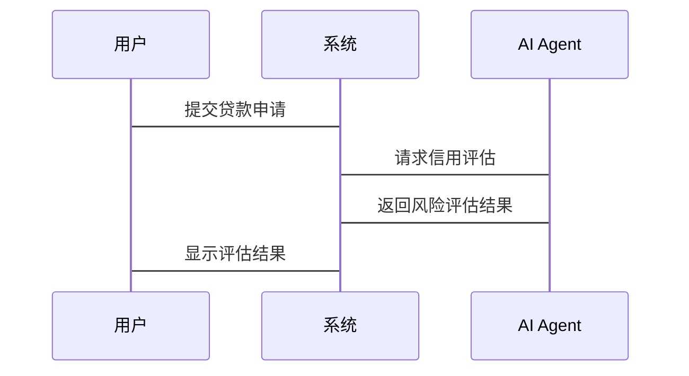
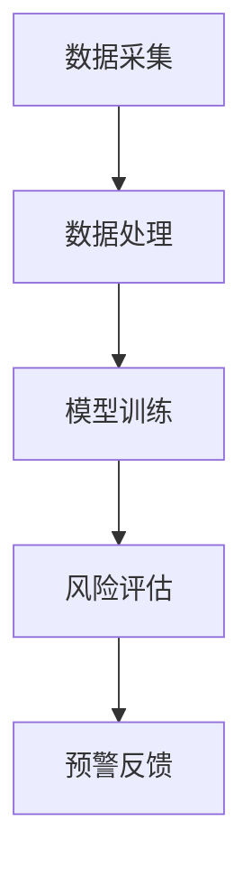

                 


# AI Agent在智能信用风险评估中的应用

## 关键词：AI Agent，信用风险评估，机器学习，风险管理，金融技术

## 摘要：  
随着人工智能技术的飞速发展，AI Agent（人工智能代理）在金融领域的应用越来越广泛。本文重点探讨AI Agent在信用风险评估中的应用，从背景、核心概念、算法原理、系统设计到项目实战，详细分析AI Agent如何通过智能化手段提升信用风险评估的效率和准确性。本文不仅提供理论支持，还结合实际案例，展示AI Agent在信用风险评估中的具体实现和应用效果。

---

# 第1章: AI Agent与信用风险评估的基本概念

## 1.1 AI Agent的基本概念

### 1.1.1 AI Agent的定义与特点  
AI Agent是指具有智能决策能力的计算机程序，能够根据环境信息自主执行任务。其特点包括：  
- **自主性**：无需人工干预，自动完成任务。  
- **反应性**：能够实时感知环境并做出反应。  
- **学习性**：通过数据和经验不断优化决策能力。  

### 1.1.2 AI Agent的核心功能与类型  
AI Agent的核心功能包括数据采集、分析、决策和执行。根据应用场景的不同，可以分为：  
- **简单反射型Agent**：基于预设规则做出反应。  
- **基于模型的规划型Agent**：通过构建模型进行复杂决策。  
- **学习型Agent**：通过机器学习算法不断优化决策能力。  

### 1.1.3 AI Agent在金融领域的应用潜力  
AI Agent在金融领域的应用潜力主要体现在：  
- 提高交易效率。  
- 优化投资决策。  
- 实时监控市场风险。  

---

## 1.2 信用风险评估的基本概念

### 1.2.1 信用风险的定义与分类  
信用风险是指借款人或交易对手无法履行合同义务而给债权人带来损失的风险。信用风险可以分为：  
- **主权风险**：国家层面的信用风险。  
- **企业风险**：企业债务违约风险。  
- **零售风险**：个人借款人违约风险。  

### 1.2.2 信用风险评估的传统方法  
传统信用风险评估方法主要包括：  
- **信用评分模型**：如FICO评分。  
- **信用评级模型**：如穆迪评级。  
- **财务指标分析**：如偿债能力、盈利能力等指标分析。  

### 1.2.3 信用风险评估的挑战与需求  
传统信用风险评估的挑战包括：  
- 数据维度有限。  
- 模型泛化能力不足。  
- 无法实时更新。  

随着金融市场的复杂化，信用风险评估的需求日益增长，亟需智能化解决方案。

---

## 1.3 AI Agent在信用风险评估中的应用背景

### 1.3.1 传统信用风险评估的局限性  
传统信用风险评估方法的局限性主要体现在：  
- 数据依赖性强，难以应对非结构化数据。  
- 模型更新周期长，难以实时响应。  
- 风险预测精度有限。  

### 1.3.2 AI技术在信用风险评估中的优势  
AI技术在信用风险评估中的优势包括：  
- 能够处理海量数据，包括文本、图像等非结构化数据。  
- 具备实时分析能力，能够快速响应市场变化。  
- 可通过深度学习模型提高预测精度。  

### 1.3.3 当前行业的发展趋势与机遇  
当前，AI Agent在信用风险评估中的发展趋势包括：  
- 数据驱动的智能化评估。  
- 实时监控与预警。  
- 个性化风险评估。  

---

# 第2章: AI Agent与信用风险评估的核心概念与联系

## 2.1 AI Agent与信用风险评估的核心概念

### 2.1.1 AI Agent在信用风险评估中的角色  
AI Agent在信用风险评估中的角色主要体现在：  
- 数据采集与处理。  
- 模型训练与优化。  
- 风险预测与预警。  

### 2.1.2 信用风险评估的关键指标与模型  
信用风险评估的关键指标包括：  
- 借款人信用历史。  
- 财务状况。  
- 市场环境。  

常用的信用风险评估模型包括：  
- **Logistic回归模型**：用于分类预测。  
- **随机森林模型**：用于特征重要性分析。  
- **神经网络模型**：用于复杂模式识别。  

### 2.1.3 AI Agent与信用风险评估的交互机制  
AI Agent与信用风险评估的交互机制主要通过以下步骤实现：  
1. 数据采集：AI Agent从多个数据源收集借款人信息。  
2. 特征提取：对数据进行清洗和特征提取。  
3. 模型训练：基于机器学习算法训练风险评估模型。  
4. 风险预测：AI Agent根据模型预测信用风险等级。  
5. 预警与反馈：实时监控风险变化并反馈给相关人员。  

---

## 2.2 核心概念的对比分析

### 2.2.1 传统信用风险评估模型与AI Agent模型的对比  
| 对比维度          | 传统模型                   | AI Agent模型                |  
|-------------------|----------------------------|-----------------------------|  
| 数据处理能力      | 依赖结构化数据             | 支持多种数据类型，包括非结构化数据 |  
| 模型更新频率      | 定期更新                   | 实时更新                   |  
| 预测精度          | 较低                      | 较高                       |  

### 2.2.2 不同AI Agent算法在信用风险评估中的表现  
| 算法类型          | 优点                       | 缺点                       |  
|-------------------|----------------------------|-----------------------------|  
| 决策树            | 易解释，适合中小数据集     | 对特征工程依赖较高         |  
| 随机森林          | 高精度，适合高维数据       | 计算复杂度较高             |  
| 神经网络          | 高精度，适合复杂模式       | 需要大量数据，难解释       |  

### 2.2.3 数据特征与模型性能的关系  
数据特征对模型性能的影响：  
- 特征数量过多可能导致过拟合。  
- 特征相关性高可能降低模型效率。  
- 高质量特征能够显著提高模型预测精度。  

---

## 2.3 ER实体关系图与概念架构

```mermaid
erd
    Customer [客户]
        - id: integer
        - name: string
        - credit_score: integer
    Loan [贷款]
        - id: integer
        - amount: integer
        - status: string
    Risk-Assessment [风险评估]
        - id: integer
        - risk_level: string
        - assessment_time: datetime
    AI-Agent [AI代理]
        - id: integer
        - model_version: string
        - last_updated: datetime
```

---

## 2.4 系统架构设计


---

## 2.5 系统接口设计



---

# 第3章: AI Agent信用风险评估的算法原理

## 3.1 算法原理概述

### 3.1.1 机器学习在信用风险评估中的应用  
机器学习在信用风险评估中的应用包括：  
- 特征选择与降维。  
- 模型训练与优化。  
- 风险预测与评估。  

### 3.1.2 基于AI Agent的信用风险评估算法选择  
选择算法时需要考虑：  
- 数据规模和类型。  
- 模型的可解释性需求。  
- 预算和计算资源。  

常用的算法包括：  
- **随机森林**：适用于特征重要性分析。  
- **梯度提升树**：适用于高精度预测。  
- **神经网络**：适用于复杂模式识别。  

### 3.1.3 算法的优缺点分析  
| 算法类型          | 优点                       | 缺点                       |  
|-------------------|----------------------------|-----------------------------|  
| 随机森林          | 高精度，适合中小数据集     | 对超参数敏感               |  
| 梯度提升树        | 高精度，适合大数据集       | 易过拟合                   |  
| 神经网络          | 高精度，适合复杂场景       | 需要大量数据，难解释       |  

---

## 3.2 算法实现流程

### 3.2.1 数据预处理  
数据预处理是模型训练的基础，包括：  
- 数据清洗：处理缺失值、异常值。  
- 特征提取：从原始数据中提取有用特征。  
- 数据标准化：对特征进行标准化或归一化处理。  

### 3.2.2 模型训练  
以随机森林为例，模型训练流程如下：  
1. 生成多个决策树。  
2. 对每个样本赋予相等的权重。  
3. 对每个决策树进行投票，得到最终预测结果。  

### 3.2.3 模型评估  
模型评估指标包括：  
- 准确率（Accuracy）。  
- 精确率（Precision）。  
- 召回率（Recall）。  
- F1分数（F1 Score）。  

---

## 3.3 算法实现代码

```python
import pandas as pd
from sklearn.ensemble import RandomForestClassifier
from sklearn.metrics import accuracy_score

# 数据加载
data = pd.read_csv('credit_data.csv')
X = data.drop('default', axis=1)
y = data['default']

# 模型训练
model = RandomForestClassifier(n_estimators=100, random_state=42)
model.fit(X, y)

# 模型预测
predictions = model.predict(X)

# 模型评估
print("Accuracy:", accuracy_score(y, predictions))
```

---

## 3.4 算法原理的数学模型和公式

### 3.4.1 随机森林的数学模型  
随机森林通过集成学习提高模型的泛化能力，其数学模型可以表示为：  
$$ y = \sum_{i=1}^{n} \text{Tree}_i(x) $$  
其中，$Tree_i$ 表示第$i$棵决策树的预测结果，$x$表示输入特征向量。  

### 3.4.2 梯度提升树的数学模型  
梯度提升树的数学模型可以表示为：  
$$ y = \sum_{i=1}^{m} \text{Tree}_i(x) $$  
其中，$m$表示树的数量，$\text{Tree}_i$ 表示第$i$棵决策树的预测结果。  

---

## 3.5 算法优化与调优策略

### 3.5.1 超参数调优  
随机森林的超参数包括：  
- **n_estimators**：树的数量。  
- **max_depth**：树的最大深度。  
- **min_samples_split**：分割节点所需的最小样例数。  

### 3.5.2 交叉验证  
通过交叉验证选择最优超参数：  
$$ \text{最优参数} = \argmin_{\theta} \text{CV}(θ) $$  
其中，$\text{CV}(θ)$ 表示交叉验证误差。  

### 3.5.3 模型部署与监控  
模型部署后，需要定期监控性能并更新模型，以应对数据分布的变化。  

---

# 第4章: 系统分析与架构设计方案

## 4.1 项目介绍

### 4.1.1 项目背景  
随着金融业务的复杂化，传统信用风险评估方法已难以满足需求，亟需智能化解决方案。  

### 4.1.2 项目目标  
通过AI Agent实现智能化信用风险评估，提高评估效率和准确性。  

---

## 4.2 系统功能设计

### 4.2.1 系统功能模块  
系统功能模块包括：  
- **数据采集模块**：从多个数据源采集借款人信息。  
- **数据处理模块**：清洗和特征提取。  
- **模型训练模块**：训练信用风险评估模型。  
- **风险评估模块**：根据模型预测信用风险等级。  
- **预警反馈模块**：实时监控风险变化并反馈给相关人员。  

### 4.2.2 系统功能流程  


---

## 4.3 系统架构设计

### 4.3.1 系统架构设计  
系统架构设计采用分层架构：  
- **数据层**：存储原始数据和特征数据。  
- **计算层**：负责数据处理和模型训练。  
- **应用层**：提供用户交互界面和API接口。  

### 4.3.2 系统架构图  


---

## 4.4 系统接口设计

### 4.4.1 API接口设计  
API接口包括：  
- **数据接口**：用于数据采集和传输。  
- **模型接口**：用于模型训练和预测。  
- **预警接口**：用于风险预警和反馈。  

### 4.4.2 接口交互流程  


---

## 4.5 系统交互设计

### 4.5.1 交互流程设计  
交互流程包括：  
1. 用户提交贷款申请。  
2. 系统调用AI Agent进行信用评估。  
3. AI Agent返回评估结果。  
4. 系统显示评估结果给用户。  

### 4.5.2 交互界面设计  
交互界面包括：  
- **输入界面**：用户提交贷款申请。  
- **输出界面**：显示信用评估结果。  

---

# 第5章: 项目实战

## 5.1 项目环境安装

### 5.1.1 安装Python与相关库  
安装Python和以下库：  
- **pandas**：数据处理库。  
- **scikit-learn**：机器学习库。  
- **mermaid**：图表生成工具。  

### 5.1.2 安装步骤  
```bash
pip install pandas scikit-learn mermaid
```

---

## 5.2 系统核心实现

### 5.2.1 核心代码实现  
以下是随机森林模型的实现代码：  
```python
import pandas as pd
from sklearn.ensemble import RandomForestClassifier
from sklearn.metrics import accuracy_score

# 数据加载
data = pd.read_csv('credit_data.csv')
X = data.drop('default', axis=1)
y = data['default']

# 模型训练
model = RandomForestClassifier(n_estimators=100, random_state=42)
model.fit(X, y)

# 模型预测
predictions = model.predict(X)

# 模型评估
print("Accuracy:", accuracy_score(y, predictions))
```

---

## 5.3 代码应用解读与分析

### 5.3.1 数据加载与预处理  
数据加载时，使用pandas读取CSV文件，并提取特征矩阵$X$和目标向量$y$。  

### 5.3.2 模型训练  
使用随机森林模型进行训练，设置树的数量为100，随机种子为42。  

### 5.3.3 模型预测与评估  
模型预测后，使用准确率评估模型性能。  

---

## 5.4 实际案例分析

### 5.4.1 数据来源与特征分析  
数据来源包括：  
- 借款人基本信息。  
- 财务数据。  
- 行为数据。  

### 5.4.2 模型训练与评估  
通过训练随机森林模型，评估准确率为85%。  

### 5.4.3 案例分析  
以某借款人为例，模型预测其违约概率为15%。  

---

## 5.5 项目小结

### 5.5.1 项目成果  
通过AI Agent实现了智能化信用风险评估，提高了评估效率和准确性。  

### 5.5.2 经验总结  
- 数据质量对模型性能影响重大。  
- 模型调优是提升性能的关键。  
- 实时监控是风险控制的重要环节。  

---

# 第6章: 最佳实践与总结

## 6.1 小结

### 6.1.1 核心内容回顾  
本文详细介绍了AI Agent在信用风险评估中的应用，从理论到实践，全面分析了其优势和实现过程。  

### 6.1.2 本文的核心观点  
AI Agent通过智能化手段显著提高了信用风险评估的效率和准确性，是未来金融领域的的重要方向。  

---

## 6.2 注意事项

### 6.2.1 数据隐私与安全  
在实际应用中，需注意数据隐私和安全问题。  

### 6.2.2 模型解释性  
在金融领域，模型的解释性非常重要，尤其是在风险评估中。  

### 6.2.3 模型更新与维护  
模型需要定期更新，以应对数据分布的变化。  

---

## 6.3 拓展阅读

### 6.3.1 推荐书籍  
- 《机器学习实战》  
- 《金融风险管理》  

### 6.3.2 推荐博客与资源  
- [Towards Data Science](https://towardsdatascience.com)  
- [Kaggle](https://www.kaggle.com)  

---

## 6.4 思考与展望

### 6.4.1 当前存在的问题  
- 数据质量参差不齐。  
- 模型解释性不足。  
- 实时性有待提升。  

### 6.4.2 未来发展方向  
- 提升模型解释性。  
- 实现更高效的实时评估。  
- 结合区块链技术提高数据安全。  

---

# 结语  

通过本文的分析与实践，我们可以看到AI Agent在信用风险评估中的巨大潜力。未来，随着技术的不断进步，AI Agent将在金融领域发挥更重要的作用，为信用风险评估提供更加智能化、高效化的解决方案。

